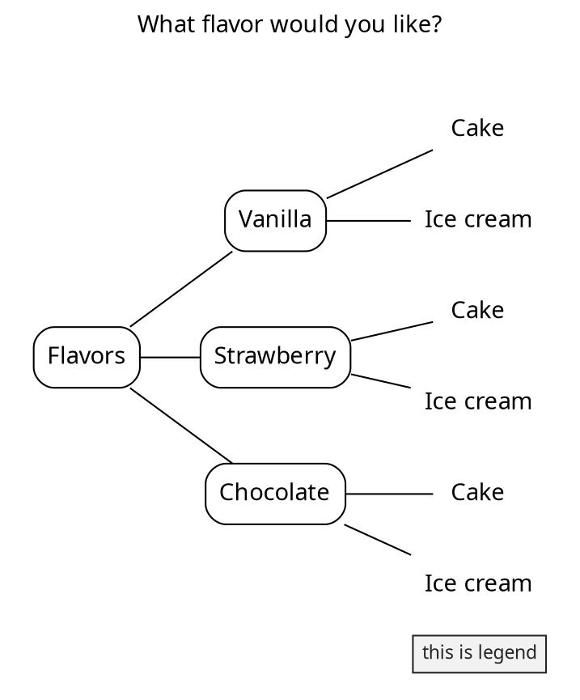
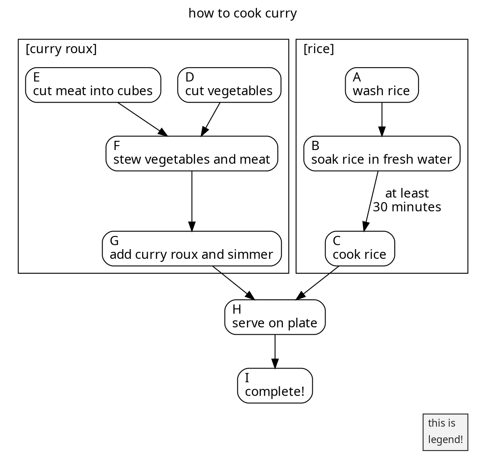
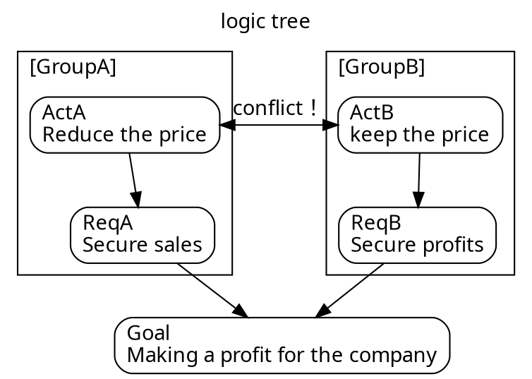
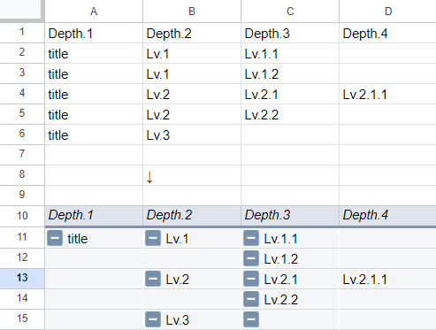
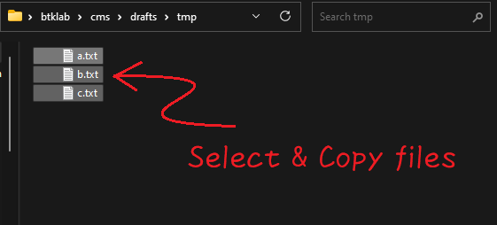

# pwsh-sketches

```markdown
>  ____  __    __  ____  _   _        ____  _  _  ____  _____   ___  _   _  ____  ____ 
> |  _ \\  \/\/  //  __)| |_| | ____ /  __)| |/ )| ___)|_   _| / __)| |_| || ___)/  __)
> |  __/ \      / \__  \|  _  |(____)\__  \|   ( | __)   | |  ( (__ |  _  || __) \__  \
> |_|     \_/\_/  (____/|_| |_|      (____/|_|\_)|____)  |_|   \___)|_| |_||____)(____/
```

A collection of [PowerShell](https://github.com/PowerShell/PowerShell) 7 text-processing functions, designed for pipeline input and output (closer to Bash than typical PowerShell). Inspired by [Parsing Text with PowerShell (3/3), Steve Lee, January 28th, 2019](https://devblogs.microsoft.com/powershell/parsing-text-with-powershell-3-3/).

**Note:** These are experimental scripts for prototyping and exploration. Use with caution; they are not production-ready and may be unstable.

- Interactive text processing via pipelines.
- Designed for Personal work and hobby use.
- Optimized for UTF-8 Japanese on Windows environments.
- Requires `PowerShell 7+` on `Windows`.
    - Some scripts may work with `PowerShell 5`.
    - Some scripts may work with `PowerShell 7+` on `Linux`.
- Caveats:
    - Code is experimental and may be poorly structured.
    - Limited testing and error handling.
    - Performance is **not optimized**.
    - Primarily English documentation, but some code may contain Japanese.

Function list:

```powershell
# one-liner to create function list
# (add internal link to each function's section)
cat README.md `
    | grep '^#### ' `
    | grep -o '\[[^[]+\]' `
    | sed 's;\[([^\]]+)\];[$1][];g' `
    | sort {
        -join ( [int[]] ("$_".ToCharArray()) | ForEach-Object { [System.Convert]::ToString($_, 16)})
    } -Unique `
    | flat -ofs ", " `
    | Set-Clipboard
```

- [Add-ID][], [Add-LineBreakEndOfFile][], [Add-LineBreak][], [Add-Quartile][], [Add-Stats][], [Apply-Function][], [Auto-Clip][], [Cast-Date][], [Cast-Decimal][], [Cast-Double][], [Cast-Integer][], [ClipImageFrom-File][], [ConvImage][], [Convert-DictionaryToPSCustomObject][], [Decode-Uri][], [Decrease-Indent][], [Delete-Field][], [Detect-XrsAnomaly][], [Drop-NA][], [Edit-Function][], [Edit-Property][], [Encode-Uri][], [Execute-Lang][], [Execute-RMarkdown][], [Execute-TinyTeX][], [Get-AppShortcut][], [Get-ClipboardAlternative][], [Get-DateAlternative][], [Get-Histogram][], [Get-OGP][], [Get-Ticket][], [GetValueFrom-Key][], [Grep-Block][], [GroupBy-Object][], [Inkscape-Converter][], [Invoke-Link][], [Join-Until][], [Join-While][], [Join2-Object][], [Measure-Quartile][], [Measure-Stats][], [Measure-Summary][], [Override-Yaml][], [Plot-BarChart][], [PullOut-String][], [Rename-Normalize][], [Replace-ForEach][], [Replace-NA][], [Select-Field][], [Set-DotEnv][], [Set-Lang][], [Set-NowTime2Clipboard][], [Shorten-PropertyName][], [Shutdown-ComputerAFM][], [Sleep-ComputerAFM][], [Sort-Block][], [Split-HereString][], [Sponge-Property][], [Sponge-Script][], [Tee-Clip][], [Test-isAsciiLine][], [Transpose-Property][], [Trim-EmptyLine][], [Unique-Object][], [Unzip-Archive][], [addb][], [addl][], [addr][], [addt][], [cat2][], [catcsv][], [chead][], [clip2file][], [clip2hyperlink][], [clip2img][], [clip2normalize][], [clip2push][], [clip2shortcut][], [conv][], [count][], [csv2sqlite][], [csv2txt][], [ctail][], [decil][], [delf][], [dot2gviz][], [filehame][], [fillretu][], [flat][], [flow2pu][], [fpath][], [fval][], [fwatch][], [gantt2pu][], [getfirst][], [getlast][], [grep][], [gyo][], [han][], [head][], [image2md][], [json2txt][], [juni][], [keta][], [kinsoku][], [lastyear][], [lcalc2][], [lcalc][], [linkcheck][], [linkextract][], [list2table][], [logi2dot][], [logi2pu][], [man2][], [map2][], [math2tex][], [mdfocus][], [mdgrep][], [mind2dot][], [mind2pu][], [movw][], [nextyear][], [pawk][], [percentile][], [pu2java][], [push2loc][], [pwmake][], [pwsync][], [retu][], [rev2][], [rev][], [say][], [sed-i][], [sed][], [self][], [seq2pu][], [sleepy][], [sm2][], [summary][], [table2md][], [tac][], [tail-f][], [tail][], [tarr][], [tateyoko][], [teatimer][], [tenki][], [tex2pdf][], [thisyear][], [toml2psobject][], [uniq][], [vbStrConv][], [watercss][], [wrap][], [yarr][], [ycalc][], [ysort][], [zen][]

**General:** This repository provides filter commands for pattern matching on unstructured strings. Input and output are `UTF-8`, space-delimited, line-oriented strings (text objects) via the pipeline, similar to Unix/Linux shell tools. Some functions also accept or output PowerShell objects.

**File Structure:** Each function resides in its own `_function.ps1` file, named after the function (excluding the suffix). Most filters are independent and can be used anywhere by dot-sourcing their file. Note that some filters require `PowerShell 7+` on `Windows`.


## Install functions

1. Comment out unnecessary lines (functions) in `operator.ps1`
2. Dot sourcing `operator.ps1` (and optional `operator-extra.ps1`)
    - (However, this only works for the current process. When you close the window (end the process), the dot-sourced functions are forgotten)

```powershell
# install all functions
. path/to/pwsh-sketches/operator.ps1
# optional
. path/to/pwsh-sketches/operator-extra.ps1
```

The functions are designed to be as independent from other functions as possible. You can also load single function using dot-source. In that case, it is recommended to first set the encoding of the current process to `UTF-8` as shown below, because this functions basically assumes `UTF-8` for input and output through the pipeline.


```powershell
# install favorite functions for japanese environment
# set encode
. path/to/pwsh-sketches/operator-minimum.ps1
# sourcing dot files
. path/to/pwsh-sketches/src/hoge_function.ps1
. path/to/pwsh-sketches/src/piyo_function.ps1
```


## Description of each function

The motivation for creating each function and usage.

### Show functions


#### [man2] - Formats filelist as a wide table and gets manual.<a id="man2"></a>

[man2]: src/man2_function.ps1

List the function names (file names) under `src` directory. With this function, I don't have to remember the name of the function I created.

- Usage
    - `man2 man2`
    - `man2 <function-name> [-p|-Paging]`
- Params
    - `man2`
        - `[[-f|-FunctionName] <String>]`
        - `[-c|-Column <Int32>]`
        - `[-e|-Exclude <String>]`
        - `[-p|-Paging]`
        - `[-i|-Include <String>]`
        - `[-Examples]`
        - `[-Independent]`
        - `[-l|-Line]`
- Behavior
    1. Remove `_function.ps1` strings from the file names of the `src/*_function.ps1` files in the same hierarchy as this function file
    2. Enumerate function name
- Dependencies
    - [flat], [tateyoko], [keta]
        - Use the `-Independent` switch to create a table without depending on other functions in this repository (use only built-in `Format-Wide` function to formar the output).
- Examples
    - Get command list as table
        - `man2`
        - `man2 -c 5`
    - Get help `man2 <command>`
        - `man2 man2`
        - `man2 man2 -p`
- Inspired by [Open-usp-Tukubai - GitHub](https://github.com/usp-engineers-community/Open-usp-Tukubai)
    - License: The MIT License (MIT): Copyright (C) 2011-2022 Universal Shell Programming Laboratory
    - Command: `man2`
- Inspired by
    - [Format-Wide (Microsoft.PowerShell.Utility) - PowerShell][Format-Wide]
    - [Select-Object (Microsoft.PowerShell.Utility) - PowerShell][Select-Object]

[Select-Object]: https://learn.microsoft.com/en-us/powershell/module/microsoft.powershell.utility/select-object
[Format-Wide]: https://learn.microsoft.com/en-us/powershell/module/microsoft.powershell.utility/format-wide

Examples:

Function names are sorted lexicographically from **top to bottom**.
This behavior is similar to linux `ls` command.
The reason for depending on [flat], [tateyoko] and [keta] is to obtain this output.

```powershell
man2
```

```
Add-LineBreakEndOfFile clip2file      head        say
Add-LineBreak          clip2hyperlink image2md    sed-i
Add-Stats              clip2img       jl          sed
Apply-Function         clip2normalize json2txt    self
ConvImage              clip2push      juni        seq2pu
Delete-Field           clip2shortcut  keta        sleepy
Detect-XrsAnomaly      conv           kinsoku     sm2
Drop-NA                count          lcalc       summary
Get-AppShortcut        csv2sqlite     linkcheck   table2md
Get-First              csv2txt        linkextract tac
Get-Histogram          ctail2         list2table  tail-f
Get-Last               ctail          logi2dot    tail
Get-OGP                decil          logi2pu     tarr
GroupBy-Object         delf           man2        tateyoko
Invoke-Link            dot2gviz       map2        teatimer
Measure-Stats          filehame       mdfocus     tenki
Override-Yaml          fillretu       mdgrep      tex2pdf
Plot-BarChart          flat           mind2dot    toml2psobject
Rename-Normalize       flow2pu        mind2pu     uniq
Replace-NA             fpath          movw        vbStrConv
Select-Field           fval           pawk        watercss
Shorten-PropertyName   fwatch         percentile  wrap
addb                   gantt2pu       pu2java     yarr
addl                   gdate          push2loc    ycalc
addr                   getfirst       pwmake      ysort
addt                   getlast        pwsync      zen
cat2                   grep           retu
catcsv                 gyo            rev2
chead                  han            rev
```

#### [Edit-Function] (Alias: e) - Edit my function with editor.<a id="Edit-Function"></a>

[Edit-Function]: src/Edit-Function_function.ps1

`Edit-Function [func|alias] [editor]`

- Usage
    - `man Edit-Function`
    - `man e`
- Params
    - `Edit-Function`
        - `[[-f|-Function] <String>]` ...function name or alias
        - `[[-e|-Editor] <String>]` ...specify editor
        - `[-o|-AsObject]` ...output only object
        - `[-q|-DryRun]` ...what-if

exapmles

Edit `man2` function with default text editor

```powerhsell
Edit-Function -Function man2
```

```powerhsell
# or
Edit-Function -f man2
```

```powerhsell
# or
Edit-Function man2
```

```powerhsell
# or
e man2
```

output:

```markdown
Directory: path/to/the/pwsh-sketches/src

Mode   LastWriteTime    Length Name
----   -------------    ------ ----
-a---  2023/11/25 8:44  12133 man2_function.ps1
```

Edit `man2` function with specified text editor

```powerhsell
Edit-Function -Function man2 -Editor notepad
```

```powerhsell
# or
Edit-Function -f man2 -e notepad
```

```powerhsell
# or
Edit-Function man2 notepad
```

```powerhsell
# or
e man2 notepad
```

Output only Object (do not run editor)

```powerhsell
e i -o
```

```markdown
Directory: path/to/the/pwsh-sketches/src

Mode  LastWriteTime 　 Length Name
----  ------------- 　 ------ ----
-a--- 2023/10/27 12:00 13459  Invoke-Link_function.ps1
```

If there are no arguments, return the function directory

```powerhsell
e
```

```markdown
Directory: path/to/the/pwsh-sketches

Mode  LastWriteTime   Length Name
----  -------------   ------ ----
d-r-- 2023/11/25 8:17        src
```

If there are no arguments, return the function list

```powershell
e
```

Open text with editor if an existing file is specified

```powershell
e ../bin/pwsh-sketches/operator.ps1
```


### Unix-like text filters

#### [sed] - Stream EDitor.<a id="sed"></a>

[sed]: src/sed_function.ps1

Replace input line by line. A degraded copy of the `sed` command used in Unix/Linux environments. Roughly equivalent to `"string" | ForEach-Object{ $_ -replace 'reg','str' }`.

`sed` is a command that I use every day, so I made it available with similar syntax on Bash and PowerShell.

- Usage
    - `man2 sed`
    - `sed 's;<regex-pattern>;<replace-strings>;g'`
        - The second characters from the left is recognized as a delimiter. This behavior is used when replacing delimiter `;`. For example, you can write `sed 's@;;;@aaa@g'` to replace `;`.
    - `sed 's;<regex-pattern>;<replace-strings>;'`
        - If there is no `g` at the end, only the first match pattern from the left of the line is replaced.
        - Note that this use case is case-sensitive
    - ```sed "s;`t;<replace-strings>;g"```
        - Control characters such as ``` `t ``` and ``` `r`n `` can be replaced by surrounding them with double quotes.
        - Note that it is not `\t` or `\n` line `sed` on Bash.
- Inspired by Unix/Linux Commands
    - Command: `sed`

Examples:

```powershell
# g flag - replace all strings matching a pattern
'a1b1c1' | sed 's;1;2;g'
```

```
a2b2c2
```

```powershell
# replace only first match 
# (Note that this mode is case sensitive)
'a1b1c1' | sed 's;1;2;'
```

```
a2b1c1
```

```powershell
# delete tab (use double quote)
cat a.txt | sed "s;`t;;g"

# replace CrLf to space
(cat a.txt) -join " "
```

```powershell
# print mode.

# input data
$dat = "aaa", "bbb", "ccc", "ddd", "eee"
$dat
```

```
aaa
bbb
ccc
ddd
eee
```

```powershell
# Output between "bbb" and "ddd"
$dat | sed 'p;^bbb;^ddd;'
```

```
bbb
ccc
ddd
```

```powershell
# delete mode.

# input data
$dat = "aaa", "bbb", "ccc", "ddd", "eee"
$dat
```

```
aaa
bbb
ccc
ddd
eee
```

```powershell
# Delete between "bbb" and "ddd"
$dat | sed 'd;^bbb;^ddd;'
```

```
aaa
eee
```

#### [sed-i] - Edit a file in place.<a id="sed-i"></a>

[sed-i]: src/sed-i_function.ps1

Edit files in-place. A degraded copy of `sed -i` on Unix/Linux. To prevent files from being accidentally overwritten due to incorrect substitution, this command does not actually overwrite files until you specify the `-Execute` swicth.

- Usage
    - `man2 sed-i`
    - `sed-i 's;pattern;replace;g' file [-Execute] [-DoNotCreateBackup|-OverwriteBackup]`
    - The default behavior is dry run and creates a backup file (`.bak`) in the current directory
    - Overwrite files by specifying `-Execute` switch
- Examples
    - `sed-i 's;abc;def;g' file -Execute`
        - Equivalent to `sed -i.bak 's;abc;def;g' file` on Unix/Linux (backup original file to `.bak` file.)
    - `sed-i 's;abc;def;g' file -Execute -DoNotCreateBackup`
        - Equivalent to `sed -i 's;abc;def;g' file` on Unix/Linux (do not create backup file.)
    - `sed-i 's;pattern1;replace1;g','s;pattern2;replace2;g',... file`
        - Multiple replacement strings can be specified by separating them with commas
- Inspired by Unix/Linux Commands
    - Command: `sed`

Examples:

```powershell
"abcde" > a.txt; sed-i 's;abc;def;g' a.txt
```

```
ifile: ./a.txt
ofile: ./a.txt.bak
defde
```

```powershell
ls *.txt
```

```markdown
Mode                 LastWriteTime         Length Name
----                 -------------         ------ ----
-a---          2022/09/29    21:41              7 a.txt
-a---          2022/09/29    21:41              7 b.txt
```

```powershell
ls *.txt | %{ sed-i 's;abc;def;g' $_.FullName }
```

```
ifile: a.txt
ofile: a.txt.bak
defde
```

```powershell
# Replace and overwrite original file and create backup
ls *.txt | %{ sed-i 's;abc;hoge;g' $_.FullName -Execute }
```

```
./a.txt > ./a.txt.bak
./b.txt > ./b.txt.bak
```

```powershell
# Replace and overwrite original file and *do not* create backup
ls *.txt | %{ sed-i 's;abc;hoge;g' $_.FullName -Execute -DoNotCreateBackup }
```

```
./a.txt > ./a.txt
./b.txt > ./b.txt
```


#### [grep] - Single-line oriented searcher for regex patterns.<a id="grep"></a>

[grep]: src/grep_function.ps1

Single-line oriented pattern matching using regular expressions for windows. A degraded copy of the `grep` command on Linux environment. Roughly equivalent to `Select-String -Pattern <reg>`.  Since `grep` is one of the commands that I often use in my daily tasks, I aimed for an equivalent usability on both Bash and PowerShell environments.

By default, it is case insensitive, but `-CaseSensitive` switch makes case sensitive.

By default, the specified pattern is interpreted as a regular expression, but the `[-s|SimpleMatch]` option allows it to be treated as literal strings.

- Usage
    - `man2 grep`
    - `grep '<regex>' -H file1,file2,...`
    - `cat file1,file2,... | grep '<regex>' [-v][-f][-s][-C <int>[,<int>]][-l]`
    - `cat file1,file2,... | grep '<regex>' [-o][-l]`
- Inspired by Unix/Linux Commands
    - Command: `grep`
- Learn
    - [about Splatting - PowerShell][about_splatting] ([ja-jp][about_splatting_jp])

[about_splatting]: https://learn.microsoft.com/en-us/powershell/module/microsoft.powershell.core/about/about_splatting
[about_splatting_jp]: https://learn.microsoft.com/ja-jp/powershell/module/microsoft.powershell.core/about/about_splatting

The search speed of this command is not fast. (In my environment, it is faster to simply use `Select-String` cmdlet.) Therefore, if you are searching with simple conditions, it is faster to use `Set-Alias -Name grep -Value Select-String`. 


```powershell
# Select-String (fast)
1..10 | %{ Measure-Command{ 1..100000 | sls 99999 }} | ft
```

```markdown
Days Hours Minutes Seconds Milliseconds
---- ----- ------- ------- ------------
0    0     0       0       437
0    0     0       0       386
0    0     0       0       394
0    0     0       0       385
0    0     0       0       407
0    0     0       0       715
0    0     0       0       424
0    0     0       0       424
0    0     0       0       443
0    0     0       0       423
```

```powershell
# grep (slow)
1..10 | %{ Measure-Command{ 1..100000 | grep 99999 }} | ft
```

```markdown
Days Hours Minutes Seconds Milliseconds
---- ----- ------- ------- ------------
0    0     0       1       84
0    0     0       1       74
0    0     0       1       287
0    0     0       1       81
0    0     0       1       186
0    0     0       1       186
0    0     0       1       79
0    0     0       1       382
0    0     0       1       178
0    0     0       1       183
```

Both `grep` and `Select-String` are faster to search by specifying a file as an argument than reading input via the pipeline. Therefore, when processing big size data, it is a good practice to use `grep` instead of `cat` at the beginning of the pipeline and specify a file as an argument to reduce the amount of data.

```powershell
# slow
cat big.data | grep "hoge" | grep "piyo"
cat big.data | sls  "hoge" | sls  "piyo"

# fast!
grep "hoge" big.data | grep "piyo"
sls  "hoge" big.data | sls  "piyo"
```

Examples

- ref: [Select-String (Microsoft.PowerShell.Utility) - PowerShell](https://learn.microsoft.com/en-us/powershell/module/microsoft.powershell.utility/select-string)

```powershell
# Find a case-sensitive match (grep 'regex' -CaseSensitive)
'Hello', 'HELLO' | grep 'HELLO' -CaseSensitive -SimpleMatch
```

```
HELLO
```

```powershell
# Find a pattern match (grep 'regex')
grep '\?' -H "$PSHOME\en-US\*.txt"
```

```
https://go.microsoft.com/fwlink/?LinkID=108518.
or go to: https://go.microsoft.com/fwlink/?LinkID=210614
or go to: https://go.microsoft.com/fwlink/?LinkID=113316
    Get-Process -?         : Displays help about the Get-Process cmdlet.
```

```powershell
# Find matches in text files (grep 'regex' -H file,file,...)
Get-Alias   | Out-File -FilePath .\Alias.txt   -Encoding UTF8
Get-Command | Out-File -FilePath .\Command.txt -Encoding UTF8
grep 'Get\-' -H .\*.txt | Select-Object -First 5
```

```
Alias.txt:7:Alias       cal2 -> Get-OLCalendar
Alias.txt:8:Alias       cat  -> Get-Content
Alias.txt:28:Alias      dir  -> Get-ChildItem
Alias.txt:44:Alias      gal  -> Get-Alias
Alias.txt:46:Alias      gbp  -> Get-PSBreakpoint
```

```powershell
# Skip blank lines (grep ".")
"aaa","","bbb","ccc"
```

```
aaa

bbb
ccc
```

```powershell
"aaa","","bbb","ccc" | grep .
```

```
aaa
bbb
ccc
```

```powershell
# Find a string in subdirectories (grep 'regex' -H file,file,... [-r|Recurse])
grep 'tab' -H '*.md' -r [-FileNameOnly|-FileNameAndLineNumber]
```

```markdown
Table: caption
{.table2col}
| table |
```

```powershell
# The following commands are also approximately equivalent
ls *.md -Recurse | grep "table"
```

```
table2col.md:10:Table: caption
table2col.md:12:{.table2col}
table2col.md:66:| table |
```

```powershell
# Find strings that do not match a pattern (grep 'regex' [-v|-NotMatch])
Get-Command | Out-File -FilePath .\Command.txt -Encoding utf8
cat .\Command.txt | grep "Get\-", "Set\-" -NotMatch | Select-Object -Last 5
```

```
Cmdlet Write-Output   7.0.0.0  Microsoft.PowerShell.Utility
Cmdlet Write-Progress 7.0.0.0  Microsoft.PowerShell.Utility
Cmdlet Write-Verbose  7.0.0.0  Microsoft.PowerShell.Utility
Cmdlet Write-Warning  7.0.0.0  Microsoft.PowerShell.Utility
```

```powershell
# Use double quotes when searching for tab characters (grep "`t")
"1,2,3", "4,5,6", "7,8,9", "" | %{ $_ -replace ',', "`t" } | grep "`t[28]"
```
 
```
1       2       3
7       8       9
```

```powershell
# Find lines before and after a match (grep "regex" -C <int>,<int> )
Get-Command | Out-File -FilePath .\Command.txt -Encoding utf8
cat .\Command.txt | grep 'Get\-Computer' -C 2, 3
```

```
  Cmdlet   Get-Command        7.3.1.500  Microsoft.PowerShell.Core
  Cmdlet   Get-ComputeProcess 1.0.0.0    HostComputeService
> Cmdlet   Get-ComputerInfo   7.0.0.0    Microsoft.PowerShell.Management
  Cmdlet   Get-Content        7.0.0.0    Microsoft.PowerShell.Management
  Cmdlet   Get-Counter        7.0.0.0    Microsoft.PowerShell.Diagnostics
  Cmdlet   Get-Credential     7.0.0.0    Microsoft.PowerShell.Security
```

```powershell
# Tips: use Out-String -Stream (alias:oss) to greppable
cat .\Command.txt | grep 'Get\-Computer' -C 2, 3 | oss | grep '>'
```

```
> Cmdlet   Get-ComputerInfo   7.0.0.0    Microsoft.PowerShell.Management
```

```powershell
# Find all pattern matches (grep 'regex' -o)
cat "$PSHOME\en-US\*.txt" | grep "PowerShell"
```

```
PowerShell Help System
Displays help about PowerShell cmdlets and concepts.
PowerShell Help describes PowerShell cmdlets, functions, scripts, and
modules, and explains concepts, including the elements of the PowerShell
PowerShell does not include help files, but you can read the help topics
You can find help for PowerShell online at
    1. Start PowerShell with the "Run as administrator" option.
    Get-Help About_Modules : Displays help about PowerShell modules.
```

```powershell
cat "$PSHOME\en-US\*.txt" | grep "PowerShell" -o
```

```
PowerShell
PowerShell
PowerShell
PowerShell
PowerShell
PowerShell
PowerShell
PowerShell
PowerShell
```

The above example can also be written as follows using `Select-String (alias:sls)`


```powershell
# Adding parentheses "( )" when connecting pipelines requires rework and is troublesome
(cat "$PSHOME\en-US\*.txt" | sls "PowerShell" -AllMatches).Matches.Value
```

```
PowerShell
PowerShell
...
```

If you simply want to `grep 'regex'`, it is faster to use `sls 'regex'`. However, slightly complicated (but frequently used in my tasks) options, such as `grep 'regex' -o` and `grep 'regex' -H <files>`, it can be written shorter than using `sls`.


```powershell
# An example of using "sls" without parentheses.
# In this case as well, compared to using "grep -o",
# you will have to connect two more pipes, which is cumbersome.
cat "$PSHOME\en-US\*.txt" `
    | sls "PowerShell" -AllMatches `
    | select -ExpandProperty Matches `
    | select -ExpandProperty Value
```

```
PowerShell
PowerShell
...
```

```powershell
# Convert pipeline objects to strings using Out-String -Stream
$hash = @{
    Name     = 'foo'
    Category = 'bar'
}
```

```powershell
# !! NO output, due to .ToString() conversion
$hash | grep 'foo'
```

```powershell
# Out-String converts the output to a single multi-line string object
$hash | Out-String | grep 'foo'
```

```markdown
Name           Value
----           -----
Name           foo
Category       bar
```

```powershell
# Out-String -Stream converts the output to a multiple single-line string objects
$hash | Out-String -Stream | grep 'foo'
```

```markdown
Name           foo
```

```powershell
# Leave header line
grep 'virginica' iris.csv -LeaveHeader `
    | head -n 5
```

```
sepal_length,sepal_width,petal_length,petal_width,species
6.3,3.3,6.0,2.5,virginica
5.8,2.7,5.1,1.9,virginica
7.1,3.0,5.9,2.1,virginica
6.3,2.9,5.6,1.8,virginica
```

```powershell
cat iris.csv `
    | grep 'virginica' -LeaveHeader `
    | head -n 5
```

```
sepal_length,sepal_width,petal_length,petal_width,species
6.3,3.3,6.0,2.5,virginica
5.8,2.7,5.1,1.9,virginica
7.1,3.0,5.9,2.1,virginica
6.3,2.9,5.6,1.8,virginica
```

#### [head], [tail] - Output the first/last part of files.<a id="head"></a>.<a id="tail"></a>

[head]: src/head_function.ps1
[tail]: src/tail_function.ps1

Outputs the first or last few lines of the input string. Roughly equivalent to `head` and `tail` command used in Linux environment. Also roughly equivalent to `"string" | Select-Object -First <int> / -Last <int>` in PowerShell.

- Usage
    - `man2 head`
    - `man2 tail`
- Examples
    - `1..20 | head [-n <int>]`
    - `1..20 | tail [-n <int>]`
    - `head *.*`
    - `tail *.*`
- Inspired by Unix/Linux Commands
    - Command: `head`, `tail`

#### [tail-f] - Output appended data as the file grows.<a id="tail-f"></a>

[tail-f]: src/tail-f_function.ps1

A PowerShell implementation of the `tail -f` command
using `Get-Content a.txt -Wait -Tail 1 -Encoding utf8`.

- Usage
    - `man2 tail-f`
- Examples
    - `tail-f a.txt`
    - `1..100 | %{ (Get-Date).ToString('yyyy-MM-dd HH:mm:ss') >> a.txt; sleep 1 }`
- Inspired by Unix/Linux Commands
    - Command: `tail`

Example:

```powershell
1..100 | %{ (Get-Date).ToString('yyyy-MM-dd HH:mm:ss') >> a.txt; sleep 1 }
("another process")
tail-f a.txt
```

```
2023-04-07 05:33:29
2023-04-07 05:33:30
2023-04-07 05:33:31
...
```


#### [chead], [ctail] - Cut the first/last part of files.<a id="chead"></a>.<a id="ctail"></a>

[chead]: src/chead_function.ps1
[ctail]: src/ctail_function.ps1

Deletes (cuts) the first or last few lines of the input string and outputs it. Roughly equivalent to `"string" | Select-Object -Skip <int> / -SkipLast <int>` in PowerShell.

- Usage
    - `man2 chead`
        - `chead [-Num <Int32>] [[-Files] <String[]>]`
    - `man2 ctail`
        - `ctail [-Num <Int32>] [[-Files] <String[]>] [-InputText <String[]>]`
- Examples
    - `1..20 | chead [-n <int>]`
    - `1..20 | ctail [-n <int>]`
- Inspired by Unix/Linux Commands
    - Command: `chead`


Examples:

[chead] - Cut the first part of files

```powershell
# read from stdin
1..5 | chead
```

```
2
3
4
5
```

```powershell
1..5 | chead -n 2
```

```
3
4
5
```

```powershell
# read from file
1..5 > a.txt; chead a.txt
```

```
2
3
4
5
```

```powershell
1..5 > a.txt; chead -n 2 a.txt
```

```
3
4
5
```

[ctail] - Cut the last part of files

```powershell
# read from stdin
1..5 | ctail
```

```
1
2
3
4
```

```powershell
1..5 | ctail -n 2
```

```
1
2
3
```

```powershell
# read from file
1..5 > a.txt; ctail a.txt
```

```
1
2
3
4
```

```powershell
1..5 > a.txt; ctail -n 2 a.txt
```

```

1
2
3
```

#### [uniq] - Report or omit repeated lines.<a id="uniq"></a>

[uniq]: src/uniq_function.ps1

Removes adjacent (consecutive) duplicate lines from the input and makes them unique. Requires pre-sorting. Similar to `Group-Object -NoElement` and `Get-Unique` in PowerShell. Case insensitive.

- Usage
    - `man2 uniq`
    - `uniq [-c|-d]`
- Examples
    - `1,2,3,4,5,3 | sort | uniq`
    - `1,2,3,4,5,3 | sort | uniq -c`
- Inspired by Unix/Linux Commands
    - Command: `uniq`

#### [cat2] - Concatenate files and print on the standard output.<a id="cat2"></a>

[cat2]: src/cat2_function.ps1

Gets the contents of a text file. To specify multiple files, separate them with a space instead of a comma like in `Get-Content`. Specify a hyphen (`-`) as an argument to read from standard input.

- Usage
    - `man2 cat2`
    - `cat2 file1 file2 file3...`
- Inspired by Unix/Linux Commands
    - Command: `cat`

#### [tac] - Output strings in reverse.<a id="tac"></a>

[tac]: src/tac_function.ps1

Read input from end to beginning.

- Usage
    - `man2 tac`
- Examples
    - `1..5 | tac`
    - `tac a.txt,b.txt`
- Inspired by Unix/Linux Commands
    - Command: `tac`

Examples:

```powoershell
1..5 | tac
```

```
5
4
3
2
1
```

#### [rev] - Reverse strings.<a id="rev"></a>

[rev]: src/rev_function.ps1

Reverse text within a line.

- Usage
    - `man2 rev`
- Examples
    - `"aiueo" | rev`
- Inspired by Unix/Linux Commands
    - Command: `rev`

Examples:

```powershell
"aiueo" | rev
```

```
oeuia
```

#### [rev2] - Reverse columns.<a id="rev2"></a>

[rev2]: src/rev2_function.ps1

Reverses columns separated by spaces. Does not reverse strings within columns. Input is only accepted via pipeline.

- Usage
    - `man2 rev2`
- Inspired by Unix/Linux Commands
    - Command: `rev`
- Inspired by [greymd/egzact: Generate flexible patterns on the shell - GitHub](https://github.com/greymd/egzact)
    - License: The MIT License (MIT): Copyright (c) 2016 Yasuhiro, Yamada
    - Command: `mirror`

Examples:

```powershell
Write-Output "01 02 03" | rev2
```

```
03 02 01
```

```powershell
Write-Output "01 02 03" | rev2 -e
```

```
01 02 03
03 02 01
```


### Text filters for space-separated input

#### [tateyoko] - Transpose columns and rows.<a id="tateyoko"></a>

[tateyoko]: src/tateyoko_function.ps1

Transpose of a space-separated matrix (vertical/horizontal conversion of a space-separated string). The number of columns can be uneven.

- Usage
    - `man2 tateyoko`
- Examples
    - `"1 2 3","4 5 6","7 8 9" | tateyoko`
- Inspired by [Open-usp-Tukubai - GitHub](https://github.com/usp-engineers-community/Open-usp-Tukubai)
    - License: The MIT License (MIT): Copyright (C) 2011-2022 Universal Shell Programming Laboratory
    - Command: `tateyoko`

Examples:

```powershell
"1 2 3","4 5 6","7 8 9"
```

```
1 2 3
4 5 6
7 8 9
```

```powershell
"1 2 3","4 5 6","7 8 9" | tateyoko
```

```
1 4 7
2 5 8
3 6 9
```

#### [fillretu] - Align records to the maximum number of columns.<a id="fillretu"></a>

[fillretu]: src/fillretu_function.ps1

Align the number of columns in space-delimited records to the maximum number of columns. The command name is derived from a compound word of English and Japanese, meaning to fill and "retsu" (to fill in column in Japanese).

- Usage
    - `man2 fillretu`
    - `cat dat.txt | fillretu`

Input:

```powershell
cat dat.txt
```

```
2018 3
2018 3
2018 3
2017 1
2017 1
2017 1
2017 1
2017 1
2022 5
2022 5
```

```powershell
cat dat.txt | grep . | yarr
```

```
2018 3 3 3
2017 1 1 1 1 1
2022 5 5
```

```powershell
cat dat.txt | grep . | yarr | fillretu
```

```
2018 3 3 3 _ _
2017 1 1 1 1 1
2022 5 5 _ _ _
```

```powershell
cat dat.txt | grep . | yarr | fillretu -NaN 0
```

```
2018 3 3 3 0 0
2017 1 1 1 1 1
2022 5 5 0 0 0
```

Combination with `tateyoko`

```powershell
cat dat.txt | yarr | fillretu | tateyoko | keta
```

```
2018 2017 2022
   3    1    5
   3    1    5
   3    1    _
   _    1    _
   _    1    _
```

#### [juni] - Enumerate the number of rows in each line.<a id="juni"></a>

[juni]: src/juni_function.ps1

Enumerate the number of lines for each record.

- Usage
    - `man2 juni`
    - `juni [-z]`
- Examples
    - `cat a.txt | juni`
- Inspired by [Open-usp-Tukubai - GitHub](https://github.com/usp-engineers-community/Open-usp-Tukubai)
    - License: The MIT License (MIT): Copyright (C) 2011-2022 Universal Shell Programming Laboratory
    - Command: `juni`

Output:

```powershell
"a".."d" | juni
```

```
1 a
2 b
3 c
4 d
```

#### [self] - Select fields.<a id="self"></a>

[self]: src/self_function.ps1

Extracts only specific columns from standard input separated by spaces. All columns can be specified with `0` and the last column with `NF`.

If you specify `1.2.3`, the second to third characters of the first column will be extracted. If the number of characters to be extracted is greater than the number of characters to be targeted, only the range that can be extracted will be extracted.

- Usage
    - `man2 self`
    - `self <num> <num>...`
- Examples
    - `"1 2 3","4 5 6","7 8 9" | self 1 3`
        - **How to read** : Select fields 1st and 3rd columns.
- Inspired by [Open-usp-Tukubai - GitHub](https://github.com/usp-engineers-community/Open-usp-Tukubai)
    - License: The MIT License (MIT): Copyright (C) 2011-2022 Universal Shell Programming Laboratory
    - Command: `self`

Examples:

```powershell
# select field 1 and 3
"1 2 3","4 5 6","7 8 9"
```

```
1 2 3
4 5 6
7 8 9
```

```powershell
"1 2 3","4 5 6","7 8 9" | self 1 3
```

```
1 3
4 6
7 9
```

```powershell
# select 2nd field and and
# cut out 2 characters from the 2nd character
"123 456 789","223 523 823"
```

```
123 456 789
223 523 823
```

```powershell
"123 456 789","223 523 823" | self 2.2.2
```

```
56
23
```

```powershell
# select entire line and add 2nd field,
# and cut out 2 characters from the 2nd character in the 2nd field
"123 456 789","223 523 823" | self 0 2.2.2
```

```
123 456 789 56
223 523 823 23
```

```powershell
# select the 1st field from the leftmost field and
# select the 2nd field from the rightmost field(=NF)
"1 2 3 4 5","6 7 8 9 10"
```

```
1 2 3 4 5
6 7 8 9 10
```

```powershell
"1 2 3 4 5","6 7 8 9 10" | self 1 NF-1
```

```
1 4
6 9
```


#### [delf] - Delete fields.<a id="delf"></a>

[delf]: src/delf_function.ps1

Deletes only the specified columns from the standard input, which is separated by spaces. You can also specify the last column with `NF`.

- Usage
    - `man2 delf`
    - `delf <num> <num>...`
- Examples
    - `"1 2 3","4 5 6","7 8 9" | delf 1 3`
        - **How to read** : Delete fields 1st and 3rd column.
- Inspired by [Open-usp-Tukubai - GitHub](https://github.com/usp-engineers-community/Open-usp-Tukubai)
    - License: The MIT License (MIT): Copyright (C) 2011-2022 Universal Shell Programming Laboratory
    - Command: `delf`

Examples:

```powershell
# delete field 1 and 2
"1 2 3", "4 5 6", "7 8 9"
```

```
1 2 3
4 5 6
7 8 9
```

```powershell
"1 2 3", "4 5 6", "7 8 9" | delf 1 2
```

```
3
6
9
```

```powershell
# delete field 1 and 2nd field from right
"1 2 3 4 5", "6 7 8 9 10"
```

```
1 2 3 4 5
6 7 8 9 10
```

```powershell
"1 2 3 4 5", "6 7 8 9 10" | delf 1 NF-1
```

```
2 3 5
7 8 10
```

#### [sm2] - Sum up.<a id="sm2"></a>

[sm2]: src/sm2_function.ps1

Calculates the sum of specified columns from space-separated standard input.

By specifying `sm2 <k1> <k2> <s1> <s2>`, columns `<s1>` to `<s2>` are summed using columns `<k1>` to `<k2>` as keys.

By specifying `sm2 0 0 <s1> <s2>`, all rows are summed. The file keys must be pre-sorted. Case insensitive.

- Usage
    - `man2 sm2`
- Params
    - `sm2 [+count] <k1> <k2> <s1> <s2>`
- Options
    - `+count`: Output the total number of rows in the leftmost column.
- Examples
    - `"A 1 10","B 1 10","A 1 10","C 1 10" | sort | sm2 1 2 3 3`
        - **How to read** : Using the value obtained by concatenating from 1st to 2nd columns as a key, sum-up for each column values from 3rd to 3rd columns.
- Inspired by [Open-usp-Tukubai - GitHub](https://github.com/usp-engineers-community/Open-usp-Tukubai)
    - License: The MIT License (MIT): Copyright (C) 2011-2022 Universal Shell Programming Laboratory
    - Command: `sm2`

Examples:

```powershell
# input
"A 1 10","B 1 10","A 1 10","C 1 10"
```

```
A 1 10
B 1 10
A 1 10
C 1 10
```

```powershell
# Sort by key column before connecting pipeline to sm2 command
"A 1 10","B 1 10","A 1 10","C 1 10" | sort | sm2 1 2 3 3
```

```
A 1 20
B 1 10
C 1 10
```

```powershell
# Result if you forget to sort
"A 1 10","B 1 10","A 1 10","C 1 10" | sm2 1 2 3 3
```

```
A 1 10
B 1 10
A 1 10
C 1 10
```

```powershell
# input
"A 1 10","B 1 10","A 1 10","C 1 10"
```

```
A 1 10
B 1 10
A 1 10
C 1 10
```

```powershell
# +count option
"A 1 10","B 1 10","A 1 10","C 1 10" | sort | sm2 +count 1 2 3 3
```

```
2 A 1 20
1 B 1 10
1 C 1 10
```

```powershell
# input
"A 1 10","B 1 10","A 1 10","C 1 10"
```

```
A 1 10
B 1 10
A 1 10
C 1 10
```

```powershell
# calculator mode
"A 1 10","B 1 10","A 1 10","C 1 10" | sm2 0 0 2 2
```

```
4
```

```powershell
# calc average with sm2 and lcalc command
## input
"A 1 10","B 1 10","A 1 10","C 1 10"
```

```
A 1 10
B 1 10
A 1 10
C 1 10
```

```powershell
## sum up
"A 1 10","B 1 10","A 1 10","C 1 10" | sort | sm2 +count 1 2 3 3
```

```
2 A 1 20
1 B 1 10
1 C 1 10
```

```powershell
## calc average
"A 1 10","B 1 10","A 1 10","C 1 10" | sort | sm2 +count 1 2 3 3 | lcalc '$0;$NF/$1'
```

```
2 A 1 20 10
1 B 1 10 10
1 C 1 10 10
```

#### [map2] - Cross tabulation of long-type data.<a id="map2"></a>

[map2]: src/map2_function.ps1

Cross-tabulate long data separated by spaces. The input data has no header and the keys have been uniquely calculated in advance. Input data must be preprocessed to ensure unique keys and no header line.

- Usage
    - `man2 map2`
    - `map2 -n <n>[,<m>]`
        - e.g. `map2 -n 2,1` means: Cross tablate the `2` columns from the left as vertical-key, `1` column as horizontal-key, and the `rest` as value fields
- Inspired by [Open-usp-Tukubai - GitHub](https://github.com/usp-engineers-community/Open-usp-Tukubai)
    - License: The MIT License (MIT): Copyright (C) 2011-2022 Universal Shell Programming Laboratory
    - Command: `map`

Examples:

Case where there is only one value column:

```powershell
# Input data example1:
# (Case: vkey1, vkey2, hkey, value)
cat data.txt
```

```
location-A store-A target-A 1
location-A store-B target-B 2
location-A store-C target-C 3
location-B store-A target-A 4
location-B store-B target-B 5
location-B store-C target-C 6
location-C store-A target-A 7
location-C store-B target-B 8
location-C store-C target-C 9
```

```powershell
cat data.txt | map2 -n 2,1 | keta
```

```
         *       * target-A target-B target-C
location-A store-A        1        0        0
location-A store-B        0        2        0
location-A store-C        0        0        3
location-B store-A        4        0        0
location-B store-B        0        5        0
location-B store-C        0        0        6
location-C store-A        7        0        0
location-C store-B        0        8        0
location-C store-C        0        0        9
```

```powershell
cat data.txt | map2 -n 1,2 | keta
```

```
         *  store-A  store-B  store-C
         * target-A target-B target-C
location-A        1        2        3
location-B        4        5        6
location-C        7        8        9
```

Case where there are multiple value columns

```powershell
# Input data example2:
# (Case: vkey, hkey, value1, value2)
cat data.txt
```

```
loc-1 tar-1 1 10
loc-1 tar-2 2 20
loc-1 tar-3 3 30
loc-2 tar-1 4 40
loc-2 tar-2 5 50
loc-2 tar-3 6 60
loc-3 tar-1 7 70
loc-3 tar-2 8 80
loc-3 tar-3 9 90
```

```powershell
# ("A".."Z" is given according to the number of value-columns)
cat data.txt | map2 -n 1,1 -ifs " " -ofs "`t"
```

```
*       *       tar-1   tar-2   tar-3
loc-1   A       1       2       3
loc-1   B       10      20      30
loc-2   A       4       5       6
loc-2   B       40      50      60
loc-3   A       7       8       9
loc-3   B       70      80      90
```

```powershell
# -yarr switch
cat data.txt | map2 -n 1,1 -ifs " " -ofs "`t" -yarr
```

```
*       tar-1   tar-1   tar-2   tar-2   tar-3   tar-3
*       a       b       a       b       a       b
loc-1   1       10      2       20      3       30
loc-2   4       40      5       50      6       60
loc-3   7       70      8       80      9       90
```


#### [lcalc] - Column-to-column calculator.<a id="lcalc"></a>

[lcalc]: src/lcalc_function.ps1

Column-by-column calculations on space-separated standard input.

- Usage
    - `man2 lcalc`
    - `lcalc [-d] 'expr; expr;...'`
- Options
    - `expr` can specify multiple expressions separated by `;` within quotes.
    - `-d`: calculator mode. (The origin of the name of the `-d` option: In Japanese, "dentaku" means "calculator")
- Note
    - Specifying calculated columns
        - `$1,$2,...`: Specify columns with the `$` symbol + number of columns
        - `$0`: Specify all columns
        - `$NF`: Only the last column can be written like this. Note that you cannot write `$NF-1`.
    - Functions that can be used in abbreviated form
        - Rounding: `round($1,num)`
        - Square root: `sqrt($1)`
        - Power: `pow($1,2)`
        - Absolute value: `abs($1)`
        - Logarithm: `log($1)`
        - Logarithm base=2: `log2($1)`
        - Common logarithm: `log10($1)`
        - Pi: `PI`
- Examples
    - `"8.3 70","8.6 65","8.8 63" | lcalc '$1+1;$2/10'`
    - `lcalc -d '1+1'`
- Inspired by [Open-usp-Tukubai - GitHub](https://github.com/usp-engineers-community/Open-usp-Tukubai)
    - License: The MIT License (MIT): Copyright (C) 2011-2022 Universal Shell Programming Laboratory
    - Command: `lcalc`

Examples:

```powershell
# input
"8.3 70","8.6 65","8.8 63"
```

```
8.3 70
8.6 65
8.8 63
```

```powershell
# lcalc
"8.3 70","8.6 65","8.8 63" | lcalc '$1+1;$2/10'
```

```
9.3 7
9.6 6.5
9.8 6.3
```

```powershell
# calculator mode does not require
# standard input (from pipline)
lcalc -d '1+1'
```

```
2
```

```powershell
lcalc -d '1+sqrt(4)'
```

```
3
```

```powershell
lcalc -d 'pi'
```

```
3.14159265358979
```

```powershell
# Functions other than those available in the shorthand form can also be used
lcalc -d '[math]::Ceiling(1.1)'
```

```
2
```

```powershell
# calc average with sm2 and lcalc command
## input
"A 1 10","B 1 10","A 1 10","C 1 10"
```

```
A 1 10
B 1 10
A 1 10
C 1 10
```

```powershell
## sum up
"A 1 10","B 1 10","A 1 10","C 1 10" | sort | sm2 +count 1 2 3 3
```

```
2 A 1 20
1 B 1 10
1 C 1 10
```

```powershell
## calc average
"A 1 10","B 1 10","A 1 10","C 1 10" | sort | sm2 +count 1 2 3 3 | lcalc '$0;$NF/$1'
```

```
2 A 1 20 10
1 B 1 10 10
1 C 1 10 10
```

#### [lcalc2] - Column-to-column calculator.<a id="lcalc2"></a>

[lcalc2]: src/lcalc2_function.ps1

Column-to-column calcurations with **script block** on space delimited stdin.

Auto-Skip empty row.
Multiple expr with ";" in scriptblock.
Built-in variables:

    $1,$2,... : Column indexes starting with 1
    $NF       : Rightmost column
    $NR       : Row number of each records

- Usage
    - `man2 lcalc2`
    - `lcalc2 {expr; expr;...} [-d "delim"] [-c|-Calculator]`
- Options
    - `-c|-Calculator`: calculator mode
- Inspired by [Open-usp-Tukubai - GitHub](https://github.com/usp-engineers-community/Open-usp-Tukubai)
    - License: The MIT License (MIT): Copyright (C) 2011-2022 Universal Shell Programming Laboratory
    - Command: `lcalc`

Examples:

```powershell
# Multiple expr using ";" in scriptblock
# data
"8.3 70","8.6 65","8.8 63"
```

```
8.3 70
8.6 65
8.8 63
```

```powershell
# calc
"8.3 70","8.6 65","8.8 63" `
    | lcalc2 {$1+1;$2+10}
```

```
8.3 70 9.3 80
8.6 65 9.6 75
8.8 63 9.8 73
```

```powershell
# Output only result
# input
"8.3 70","8.6 65","8.8 63"
```

```
8.3 70
8.6 65
8.8 63
```

```powershell
# output 1
"8.3 70","8.6 65","8.8 63" `
    | lcalc2 {$1+1; $2+10} -OnlyOutputResult
```

```
9.3 80
9.6 75
9.8 73
```

```powershell
# output 2
#   Put result on the left,
#   put original field on the right,
#   with -OnlyOutputResult and $0
"8.3 70","8.6 65","8.8 63" `
    | lcalc2 {$1+1; $2+10; $0} -OnlyOutputResult
```

```
9.3 80 8.3 70
9.6 75 8.6 65
9.8 73 8.8 63
```

```powershell
# Get row number of record
1..5 | lcalc2 {$NR}
```

```
1 1
2 2
3 3
4 4
5 5
```

```powershell
# Calculator mode
lcalc2 -Calculator {1+1}
```

```
2
```

```powershell
# calculator mode does not require
# standard input (from pipline)
lcalc2 -c {1+[math]::sqrt(4)}
```

```
3
```

```powershell
lcalc2 -c {[math]::pi}
```

```
3.14159265358979
```

```powershell
lcalc2 -c {[math]::Ceiling(1.1)}
```

```
2
```

```powershell
# Calculate average with sm2 and lcalc2 command
## input
"A 1 10","B 1 10","A 1 10","C 1 10"
```

```
A 1 10
B 1 10
A 1 10
C 1 10
```

```powershell
## sum up
"A 1 10","B 1 10","A 1 10","C 1 10" `
    | sort `
    | sm2 +count 1 2 3 3
```

```
2 A 1 20
1 B 1 10
1 C 1 10
```

```powershell
## calc average
"A 1 10","B 1 10","A 1 10","C 1 10" `
    | sort `
    | sm2 +count 1 2 3 3 `
    | lcalc2 {$NF/$1}
```

```
2 A 1 20 10
1 B 1 10 10
1 C 1 10 10
```

#### [pawk] - Pattern-Action processor like GNU AWK.<a id="pawk"></a>

[pawk]: src/pawk_function.ps1

A line-oriented pattern-matching processor for space-separated standard input.

```powershell
pawk [-fs "delim"] [-Pattern { condition }] -Action { action }
```

pawk reads the input a line at a time, scans for pattern,
and executes the associated action if pattern matched.

As a feature, pipeline processing can be applied only to
specific columns for multiple column inputs.

```powershell
# input line (csv: comma separated values)
$dat = "abc,def,ghi","jkl,mno,pqr","stu,vwz,012"
```

```
abc,def,ghi
jkl,mno,pqr
stu,vwz,012
```

```powershell
# apply rev commnand only 2nd columns
PS> $dat | pawk -fs "," -Pattern {$1 -match "^j"} -Action { $2=$2|rev;$0 }
```

```
jkl,onm,pqr
```

```powershell
# -Begin, -Process and -End block like AWK
PS> 1..10 | pawk -Begin { $sum=0 } -Action { $sum+=$1 } -End { $sum }
```

```
55
```

- Usage
    - `man2 pawk`
    - `pawk [-fs "delim"] [-Pattern { condition }] -Action { action }`
- Params
    - `[[-a|-Action] <ScriptBlock>]` ...action script
    - `[-p|-Pattern <ScriptBlock>]` ...pattern criteria
    - `[-b|-Begin <ScriptBlock>]` ...run before reading input
    - `[-e|-End] <ScriptBlock`> ...run after reading input
    - `[-fs|-Delimiter <String>]` ...input/output field separator
    - `[-ifs|-InputDelimiter <String>]` ...input field separator
    - `[-ofs|-OutputDelimiter <String>]` ...output field separator
        - If `-ifs` or `-ofs` are not specified,`-fs` delimiter will be used as both the input and output delimiter.
        - If `-ifs` and/or `-ofs` are specified together, `-fs` value will be overridden.
    - `[-AllLine]` ...output all input even if not match pattern (but action is only apply to matching rows)
    - `[-SkipBlank]` ...continue processing when empty row is detected
- Note
    - `-Action { action }`, `-Pattern { criteria }`, `-Begin { action }`, `-End { action }` options should be specified in the script block.
    - The column specification symbols are `$1,$2,...,$NF`. (The left most column number is 1 and counts up to the right.)
        - Specifying `$0` means the entire row.
        - Note that it is not allowed to assign value to `$0` (`$0=$val` is not allowed in script block).
    - Each column value is interpreted as System.Double if it looks like a number, and otherwise, as System.String.
        - Note that zero starting numbers are treated as system.string exceptionally.
        - Underscore `_` can also be used as a numeric delimiter. (e.g. `123_456`)
    - Built-in variables and options:
        - `$NF` : the last element of the current line. (This is one of the behaviors that is different from awk)
        - `$NR` : current row number
- Inspired by Unix/Linux Commands
    - Command: `awk`, `gawk`

Examples:

```powershell
# sum from 1 to 10 and output the result
1..10 | pawk -Begin {$sum=0} -Action {$sum+=$1} -End {$sum}
```

```
55
```

```powershell
# output all line using $0 in -Action script block
1..10 | pawk -Begin {$sum=0} -Action {$sum+=$1;$0} -End {"=====","sum: $sum"}
```

```
1
2
3
4
5
6
7
8
9
10
=====
sum: 55
```

```powershell
# If both -Action {$0} and -AllLine switch are
# used at the same time, the outputs are duplicated.
1..3 | pawk -Begin {$sum=0} -Action {$sum+=$1;$0} -End {"=====","sum: $sum"} -AllLine
```

```
1
1
2
2
3
3
=====
sum: 6
```

```powershell
# All of the following get all line output
1..3 | pawk -Begin {$sum=0} -Action {$sum+=$1} -End {"=====","sum: $sum"} -AllLine
1..3 | pawk -Begin {$sum=0} -Action {$sum+=$1;$0} -End {"=====","sum: $sum"}
```

```
1
2
3
=====
sum: 6
```

```powershell
# Although -Action {$0} and -AllLine switch have different outputs, 
# there is no difference in that the action
# is executed only pattern-mathed rows.

## Case1: -Action {$0} 
1..3 | pawk -Begin {$sum=0} -Action {$sum+=$1 ; $0} -End {"=====","sum: $sum"} -Pattern {$1 % 2 -eq 1}
```

```
1
3
=====
sum: 4
```

```powershell
## Case2: -AllLine switch. Total value is the same as above. (sum=4)
## (Action skipped not mathed rows)
1..3 | pawk -Begin {$sum=0} -Action {$sum+=$1} -End {"=====","sum: $sum"} -Pattern {$1 % 2 -eq 1} -AllLine
```

```
1
2
3
=====
sum: 4
```

```powershell
# Note that if -AllLine switch is used,
# it duplicates the output if there is
# an output with -Action {action}
```

```powershell
# notes on interpreting numbers and strings

# input data (zero padding numbers)
$dat = 1..5 | %{ "{0:d3}" -f $_ }
$dat
```

```
001
002
003
004
005
```

```powershell
$dat | pawk -Pattern {$1 -eq 1}
```

```
match nothing.
because numbers starting with zero are considered strings.
```

```powershell
# Cast [string]"001" to [int]"001"
$dat | pawk -Pattern {[int]$1 -eq 1}
$dat
```

```
001   # matched!
```

```powershell
# Match if you compare a zero-filled number as a string
$dat | pawk -Pattern {$1 -eq "001"}
```

```
001
```

```powershell
# Inversion of the above criteria ( -eq to -ne )
$dat | pawk -Pattern {$1 -ne "001"}
```

```
002
003
004
005
```

```powershell
# Zero-filled numbers are strings,
# so their sum with a number is a
# concatenation of strings.
$dat | pawk -Pattern {$1 -eq "001"} -Action {$1+1}
```

```
0011
```

```powershell
# -AllLine switch outputs all lines that
#  do not match the pattern. However, 
# the action is executed only on lines that
# match the pattern
$dat | pawk -Pattern {$1 -eq "001"} -Action {$1=$1+1} -AllLine
```

```
0011
002
003
004
005
```

```powershell
# Cast 1st column of zero-filled numbers to an integer
# and then takeing the numeric sum gives the expected behaviour.
$dat | pawk -Pattern {$1 -eq "001"} -Action {[int]$1+1}
```

```
2
```

```powershell
# -AllLine switch
$dat | pawk -Pattern {$1 -eq "001"} -Action {$1=[int]$1+1} -AllLine
```

```
2
002
003
004
005
```

```powershell
# Column specification using $0

$dat = "a b c 1","d e f 2","g h i 3"
$dat
```

```
a b c 1
d e f 2
g h i 3
```

```powershell
$dat | pawk -Action {$0 + " zzz"}
```

```
a b c 1 zzz
d e f 2 zzz
g h i 3 zzz
```

```powershell
# Replace 2nd column
$dat | pawk -Action {$2="zzz" ; $0}
$dat | pawk -Action {$2="zzz"} -AllLine
$dat
```

```
a zzz c 1
d zzz f 2
g zzz i 3
```

```powershell
# Read csv data

$dat = "a b c 1","d e f 2","g h i 3" | %{ $_ -replace " ",","}
$dat
```

```
a,b,c,1
d,e,f,2
g,h,i,3
```

```powershell
$dat | pawk -fs "," -Action {$2=$2*3 ; $0}
```

```
a,bbb,c,1
d,eee,f,2
g,hhh,i,3
```

```powershell
# Convert csv to tsv
$dat | pawk -fs "," -Action {$0} -ofs "`t"
```

```
a       b       c       1
d       e       f       2
g       h       i       3
```

```powershell
# Pattern match and execute Action

$dat = "a b c 1","d e f 2","g h i 3" | %{ $_ -replace " ",","}
$dat
```

```
a,b,c,1
d,e,f,2
g,h,i,3
```

```powershell
# Pattern match
$dat | pawk -fs "," -Pattern {$NF -gt 1}
$dat
```

```
d,e,f,2
g,h,i,3
```

```powershell
$dat | pawk -fs "," -Pattern {$NF -gt 1 -and $2 -match 'e'}
```

```
d,e,f,2
```

```powershell
$dat | pawk -fs "," -Pattern {$NF -le 1}
```

```
a,b,c,1
```

```powershell
# Pattern match and replace 1st field
$dat | pawk -fs "," -Pattern {$NF -gt 1} -Action {$1="aaa";$0}
```

```
aaa,e,f,2
aaa,h,i,3
```

```powershell
# Pattern match and replace 1st field and output all rows,
# but -Action script is applied only pattern matched rows.
$dat | pawk -fs "," -Pattern {$NF -gt 1} -Action {$1="aaa"} -AllLine
```

```
a,b,c,1
aaa,e,f,2
aaa,h,i,3
```

```powershell
# Handling zero padding numbers

$dat = "001,aaa,1","002,bbb,2","003,ccc,4","005,ddd,5"
$dat
```

```
001,aaa,1
002,bbb,2
003,ccc,4
005,ddd,5
```

```powershell
# Zero padding numbers are not double but string
$dat | pawk -fs "," -Pattern {$1 -eq 2}
```

```
# not match
```

```powershell
$dat | pawk -fs "," -Pattern {$1 -eq "002"}
```

```
002,bbb,2
```

```powershell
# Cast as double
$dat | pawk -fs "," -Pattern {[int]$1 -eq 2}
```

```
002,bbb,2
```

```powershell
# Use -begin -end example

$dat = "001,aaa,1","002,bbb,2","003,ccc,4","005,ddd,5"
$dat
```

```
001,aaa,1
002,bbb,2
003,ccc,4
005,ddd,5
```

```powershell
# Add 3rd field values and output result
$dat | pawk -fs "," -Begin {$sum=0} -Action {$sum+=$3} -End {$sum}
```

```
12
```

```powershell
$dat `
    | pawk `
        -fs "," `
        -Begin {$sum=0} `
        -Action {$sum+=[math]::Pow($3,2);$0+","+[math]::Pow($3,2)} `
        -End {$sum}
```

```
001,aaa,1,1
002,bbb,2,4
003,ccc,4,16
005,ddd,5,25
46
```

```powershell
# As a feature, pipeline processing can be applied only to
# specific columns for multiple column inputs, like below.

# Input
$dat = "abc,def,ghi","jkl,mno,pqr","stu,vwz,012"
$dat
```

```
abc,def,ghi
jkl,mno,pqr
stu,vwz,012
```

```powershell
# Apply rev commnand only 2nd columns
$dat | pawk -fs "," -Action {$2=$2|rev;$0}
$dat | pawk -fs "," -Action {$2=$2|rev} -AllLine
```

```
abc,fed,ghi # reverse 2nd column
jkl,onm,pqr # reverse 2nd column
stu,zwv,012 # reverse 2nd column
```

```powershell
# Apply rev commnand only 2nd columns and only pattern matched rows
$dat | pawk -fs "," -Action {$2=$2|rev} -Pattern {$1 -match '^j'} -AllLine
```

```
abc,def,ghi  # not match
jkl,onm,pqr  # reverse 2nd column
stu,vwz,012  # not match
```

```powershell
# Select column

# Input data
$dat = "abc,def,ghi","jkl,mno,pqr","stu,vwz,012"
$dat
```

```
abc,def,ghi
jkl,mno,pqr
stu,vwz,012
```

```powershell
# The following is probably not expected behavior
$dat | pawk -fs "," -Action {$1,$2}
```

```
abc
def
jkl
mno
stu
vwz
```

```powershell
# Use -join operator
$dat | pawk -fs "," -Action {$1,$2 -join ","}
```

```
abc,def
jkl,mno
stu,vwz
```

```powershell
# Use @() to specify an array
$dat | pawk -fs "," -Action {@($1,$2) -join ","}
```

```
abc,def
jkl,mno
stu,vwz
```

```powershell
# Equivalent alternate solution.Using the fact that input rows　are
# separated by delimiters and stored in a variable of array named "$self".
# note that the index is zero start in this case.
$dat | pawk -fs "," -Action {$self[0..1] -join ","}
```

```
abc,def
jkl,mno
stu,vwz
```

```powershell
# Various column selections

# Input data
$dat = "abc,def,ghi","jkl,mno,pqr","stu,vwz,012"
$dat
```

```
abc,def,ghi
jkl,mno,pqr
stu,vwz,012
```

```powershell
# Duplicate columns
$dat | pawk -fs "," -Action {$1,$1,$1,$1 -join ","}
```

```
abc,abc,abc,abc
jkl,jkl,jkl,jkl
stu,stu,stu,stu
```

```powershell
# Select max Number of field(column)
$dat | pawk -fs "," -Action {$NF}
```

```
ghi
pqr
012
```

```powershell
# Select max Number -1 of field(column)
$dat | pawk -fs "," -Action {$self[-2]}
```

```
def
mno
vwz
```

```powershell
$dat | pawk -fs "," -Action {$self[$self.count-2]}
```

```
def
mno
vwz
```

```powershell
# Select n to last columns
$dat | pawk -fs "," -Action {$self[1..($self.count-1)] -join ","}
```

```
def,ghi
mno,pqr
vwz,012
```

```powershell
# Manipulation of specific columns

# Input
$dat = "001,aaa,2022-01-01","002,bbb,2022-01-02","003,ccc,2022-01-03","005,ddd,2022-01-04"
$dat
```

```
001,aaa,2022-01-01
002,bbb,2022-01-02
003,ccc,2022-01-03
005,ddd,2022-01-04
```

```powershell
# Add days -10 to 3rd column (cast [datetime])
$dat | pawk -fs "," -Action {$3=(Get-Date $3).AddDays(-10).ToString('yyyy-MM-dd')} -AllLine
```

```
001,aaa,2021-12-22
002,bbb,2021-12-23
003,ccc,2021-12-24
005,ddd,2021-12-25
```

```powershell
# Manipulation of specific columns using pipe

# Input
$dat = "001,aaa,20220101","002,bbb,20220102","003,ccc,20220103","005,ddd,20220104"
$dat
```

```
001,aaa,20220101
002,bbb,20220102
003,ccc,20220103
005,ddd,20220104
```

```powershell
# Format date for 3rd column.
# (Column symbols ($1,$2,...) in single quotes are escaped.
# so that $1,$2,... symbols in the ForEach-Object command has the expected behavior.)
$dat | pawk -fs "," -Action {$3=$3|ForEach-Object{$_ -replace '([0-9]{4})([0-9]{2})([0-9]{2})','$1-$2-$3'}; $0}
```

```
001,aaa,2022-01-01
002,bbb,2022-01-02
003,ccc,2022-01-03
005,ddd,2022-01-04
```

```powershell
# Equivalent alternative solution using [datetime]::ParseExact
$dat | pawk -fs "," -Action {$3=([datetime]::ParseExact($3,"yyyyMMdd",$null)).ToString('yyyy-MM-dd'); $0}
```

```
001,aaa,2022-01-01
002,bbb,2022-01-02
003,ccc,2022-01-03
005,ddd,2022-01-04
```

```powershell
# Usage of build-in variables ($NF, $NR)

# Input
$dat = "1,aaa,111","2,bbb,222","3,ccc,333"
$dat
```

```
1,aaa,111
2,bbb,222
3,ccc,333
```

```powershell
$dat | pawk -fs "," -Pattern {$NF -ge 222}
```

```
2,bbb,222
3,ccc,333
```

```powershell
$dat | pawk -fs "," -Pattern {$NR -ge 1}
```

```
1,aaa,111
2,bbb,222
3,ccc,333
```


```powershell
# when using the column specification operator "$1" in double uotes,
# add the subexpression operator like "$($1)"

"a b c 1","d e f 2","g h i 3" | pwk -Action {"id: $($4), tag: ""$($1)"""}
```

```
id: 1, tag: "a"
id: 2, tag: "d"
id: 3, tag: "g"
```

```powershell
# Re-arrange 2-4 characters of an undelimited strings.

# Input
"aiueo","12345","abcde"
```

```
aiueo
12345
abcde
```

```powershell
# Re-arrange 2-4 chars of each row.
"aiueo","12345","abcde" | pawk -fs '' -Action {$self[0,3,2,1,4] -join ''}
```

```
aeuio
14325
adcbe
```

```powershell
# Equivalent to the above
"aiueo","12345","abcde" | pawk -fs '' -Action {@($1,$4,$3,$2,$5) -join ''}
```

```
aeuio
14325
adcbe
```

```powershell
# If an empty string is specified as the delimiter,
# the first and last elements are dropped from the array.
```

#### [retu] - Output column number.<a id="retu"></a>

[retu]: src/retu_function.ps1

Output the number of columns of space-separated input.

- Outputs the numbers of columns each time the number of columns changes
- Outputs zero for empty rows

Used to verify whether the number of columns of data is the same or not.

- Usage
    - `man2 retu`
    - `retu [-c]`
- Examples
    - `cat a.txt | retu`
- Inspired by [Open-usp-Tukubai - GitHub](https://github.com/usp-engineers-community/Open-usp-Tukubai)
    - License: The MIT License (MIT): Copyright (C) 2011-2022 Universal Shell Programming Laboratory
    - Command: `retu`


Output:

```powershell
# If all column numbers are equal,
# duplicates are removed and
# only one column numbers is output.
"a".."z" | retu
```

```
1
```

```powershell
# Output for each change in the
# number of columns.
"a a","b b b","c c c","d d"
```

```
a a
b b b
c c c
d d
```

```powershell
"a a","b b b","c c c","d d" | retu
```

```
2
3
2
```

```powershell
# With the "-c" switch, all rows
# are output with column numbers.
"a a","b b b","c c c","d d" | retu -c
```

```
2 a a
3 b b b
3 c c c
2 d d
```

#### [count] - Count up keys.<a id="count"></a>

[count]: src/count_function.ps1

Count the number of keys in space-delimited input.
Treat columns `<k1>` through `<k2>` as key fields and
count the number of duplicate key fields.
Output all lines while incrementing the count with the `-c` switch.

- Usage
    - `man2 count`
    - `count [-c] <k1> <k2>`
- Examples
    - `cat a.txt | count [-c] <k1> <k2>`
        - **How to read** : Count the number of duplicate records using the value obtained by concatenating from 1st to 2nd columns as a key.
- Inspired by [Open-usp-Tukubai - GitHub](https://github.com/usp-engineers-community/Open-usp-Tukubai)
    - License: The MIT License (MIT): Copyright (C) 2011-2022 Universal Shell Programming Laboratory
    - Command: `count`

Input:

```powershell
cat a.txt
```

```markdown
01 Oregon 01 Portland 100
01 Oregon 02 Salem 100
01 Oregon 03 Eugene 100
02 Nevada 04 Reno 100
02 Nevada 05 CarsonCity 100
02 Nevada 06 LasVegas 100
02 Nevada 07 Henderson 100
02 Nevada 08 Sparks 100
02 Nevada 09 NorthLasVegas 100
03 Arizona 10 Phoenix 100
03 Arizona 11 Tucson 100
03 Arizona 12 Mesa 100
04 Utah 13 SaltLakeCity 100
04 Utah 14 WestValleyCity 100
04 Utah 15 Provo 100
04 Utah 16 WestJordan 100
```

```powershell
cat a.txt | grep . | sort | count 1 2
```

```
3 01 Oregon
6 02 Nevada
3 03 Arizona
4 04 Utah
```

```powershell
cat a.txt | grep . | sort | count -c 1 2
```

```
1 01 Oregon 01 Portland 100
2 01 Oregon 02 Salem 100
3 01 Oregon 03 Eugene 100
1 02 Nevada 04 Reno 100
2 02 Nevada 05 CarsonCity 100
3 02 Nevada 06 LasVegas 100
4 02 Nevada 07 Henderson 100
5 02 Nevada 08 Sparks 100
6 02 Nevada 09 NorthLasVegas 100
1 03 Arizona 10 Phoenix 100
2 03 Arizona 11 Tucson 100
3 03 Arizona 12 Mesa 100
1 04 Utah 13 SaltLakeCity 100
2 04 Utah 14 WestValleyCity 100
3 04 Utah 15 Provo 100
4 04 Utah 16 WestJordan 100
```


#### [getfirst] - Get the first row of the same key.<a id="getfirst"></a>

[getfirst]: src/getfirst_function.ps1

Output the first line of data for each unique key from space-delimited input.
Case-insensitive.

- Usage
    - `man2 getfirst`
    - `getfirst <k1> <k2>`
        - Treats `<k1>` column and `<k2>` column as keys.
- Examples
    - `cat a.txt | getfirst 1 2`
        - **How to read** : Get only the first row with the same key with the value concatenated from 1st to 2nd column as the key.
- Inspired by [Open-usp-Tukubai - GitHub](https://github.com/usp-engineers-community/Open-usp-Tukubai)
    - License: The MIT License (MIT): Copyright (C) 2011-2022 Universal Shell Programming Laboratory
    - Command: `getfirst`

Output:

```powershell
cat a.txt
```

```markdown
01 Oregon 01 Portland 100
01 Oregon 02 Salem 100
01 Oregon 03 Eugene 100
02 Nevada 04 Reno 100
02 Nevada 05 CarsonCity 100
02 Nevada 06 LasVegas 100
02 Nevada 07 Henderson 100
02 Nevada 08 Sparks 100
02 Nevada 09 NorthLasVegas 100
03 Arizona 10 Phoenix 100
03 Arizona 11 Tucson 100
03 Arizona 12 Mesa 100
04 Utah 13 SaltLakeCity 100
04 Utah 14 WestValleyCity 100
04 Utah 15 Provo 100
04 Utah 16 WestJordan 100
```

```powershell
cat a.txt | getfirst 1 2
```

```
01 Oregon 01 Portland 100
02 Nevada 04 Reno 100
03 Arizona 10 Phoenix 100
04 Utah 13 SaltLakeCity 100
```


#### [getlast] - Get the last row of the same key.<a id="getlast"></a>

[getlast]: src/getlast_function.ps1

Output the last line of data for each unique key from space-delimited input.
Case-insensitive.

- Usage
    - `man2 getlast`
    - `getlast <k1> <k2>`
        - Treats `<k1>` column and `<k2>` column as keys.
- Examples
    - `cat a.txt | getlast 1 2`
        - **How to read** : Get only the last row of the same key with the value concatenated from 1st to 2nd column as the key.
- Inspired by [Open-usp-Tukubai - GitHub](https://github.com/usp-engineers-community/Open-usp-Tukubai)
    - License: The MIT License (MIT): Copyright (C) 2011-2022 Universal Shell Programming Laboratory
    - Command: `getlast`

Output:

```powershell
cat a.txt
```

```markdown
01 Oregon 01 Portland 100
01 Oregon 02 Salem 100
01 Oregon 03 Eugene 100
02 Nevada 04 Reno 100
02 Nevada 05 CarsonCity 100
02 Nevada 06 LasVegas 100
02 Nevada 07 Henderson 100
02 Nevada 08 Sparks 100
02 Nevada 09 NorthLasVegas 100
03 Arizona 10 Phoenix 100
03 Arizona 11 Tucson 100
03 Arizona 12 Mesa 100
04 Utah 13 SaltLakeCity 100
04 Utah 14 WestValleyCity 100
04 Utah 15 Provo 100
04 Utah 16 WestJordan 100
```

```powershell
cat a.txt | getlast 1 2
```

```
01 Oregon 03 Eugene 100
02 Nevada 09 NorthLasVegas 100
03 Arizona 12 Mesa 100
04 Utah 16 WestJordan 100
```


#### [yarr] - Expand long data to wide.<a id="yarr"></a>

[yarr]: src/yarr_function.ps1

Convert vertical (long-format) records separated by single-byte spaces into horizontal (wide-format) records using specified columns as keys.

- Usage
    - `man2 yarr`
    - `cat a.txt | yarr [-n|-num <int>]`
- Inspired by [Open-usp-Tukubai - GitHub](https://github.com/usp-engineers-community/Open-usp-Tukubai)
    - License: The MIT License (MIT): Copyright (C) 2011-2022 Universal Shell Programming Laboratory
    - Command: `yarr`

Input(long type data):

```powershell
cat a.txt
```

```
2018 1
2018 2 9
2018 3
2017 1
2017 2
2017 3
2017 4
2017 5 6
2022 1
2022 2
```

Output(wide type data):

```powershell
# Convert long format to wide format
# using the first column as the key (num=1).

cat a.txt | grep . | yarr -n 1
```

```
2018 1 2 9 3
2017 1 2 3 4 5 6
2022 1 2
```

- **Note**: Skip empty lines with `grep .` (matches only lines with one or more characters)

Equivalent in PowerShell

```powershell
cat a.txt `
    | grep . `
    | ForEach-Object -begin{$h=@{}} -process{$a=$_ -split " ", 2; $h[$($a[0])]+=" $($a[1])"} -end {foreach($k in $h.keys){$k+$h[$k]}}
```

```
2022 1 2
2018 1 2 9 3
2017 1 2 3 4 5 6
```


#### [tarr] - Expand wide data to long.<a id="tarr"></a>

[tarr]: src/tarr_function.ps1

Convert wide-format (space-delimited) records to long format, using specified columns as keys.

- Usage
    - `man2 tarr`
    - `cat a.txt | tarr [-n|-num <int>]`
- Inspired by [Open-usp-Tukubai - GitHub](https://github.com/usp-engineers-community/Open-usp-Tukubai)
    - License: The MIT License (MIT): Copyright (C) 2011-2022 Universal Shell Programming Laboratory
    - Command: `tarr`

Input(wide type data):

```powershell
cat a.txt
```

```
2018 1 2 3
2017 1 2 3 4
2022 1 2
```

Output(long type data):

```powershell
# Convert wide format to long format
# using the first column as the key (num=1).

cat a.txt | grep . | tarr -n 1
```

```
2018 1
2018 2
2018 3
2017 1
2017 2
2017 3
2017 4
2022 1
2022 2
```

- **Note**: Skip empty lines with `grep .` (matches only lines with one or more characters)


#### [flat] - Flat columns.<a id="flat"></a>

[flat]: src/flat_function.ps1

Adjust space-delimited strings to a specified number of columns. `-ifs` specifies the input text delimiter, and `-ofs` specifies the output text delimiter. Empty strings can also be specified for each. (`-ifs ""`, `-ofs ""`)

- Usage
    - `man2 flat`
- Examples
    - `1..9 | flat`
    - `1..9 | flat 4`
    - `"aiueo" | flat 3 -ifs "" -ofs ""`
- Inspired by [greymd/egzact: Generate flexible patterns on the shell - GitHub](https://github.com/greymd/egzact)
    - License: The MIT License (MIT): Copyright (c) 2016 Yasuhiro, Yamada
    - Command: `flat`

Examples

```powershell
1..9 | flat
```

```
1 2 3 4 5 6 7 8 9
```

```powershell
1..9 | flat 4
```

```
1 2 3 4
5 6 7 8
9
```

```powershell
"aiueo" | flat 3 -ifs "" -ofs ""
```

```
aiu
eo
```

#### [wrap] - Wrap each fields in specified format.<a id="wrap"></a>

[wrap]: src/wrap_function.ps1

**Wrap** space-delimited strings with an arbitrary format. `-ifs` specifies the input text delimiter, and `-ofs` specifies the output text delimiter. Empty strings can also be specified for each. (`-ifs ""`, `-ofs ""`)

- Usage
    - `man2 wrap`
    - `wrap [[--f|Format] <String>] [-p|-Placeholder <String>] [-fs|-Delimiter <String>]`
- Examples
    - `"A B C D" | wrap '[*]'`
    - `"A B C D" | wrap '[?]' -Placeholder '?'`
    - `"A B C D" | wrap '[*]' -fs "_"`
    - `"ABCD" | wrap '[*]' -fs ''`
- Inspired by [greymd/egzact: Generate flexible patterns on the shell - GitHub](https://github.com/greymd/egzact)
    - License: The MIT License (MIT): Copyright (c) 2016 Yasuhiro, Yamada
    - Command: `wrap`

Examples

```powershell
"A B C D" | wrap '[*]'
```

```
[A] [B] [C] [D]
```

```powershell
"A B C D" | wrap '[?]' -Placeholder '?'
```

```
[A] [B] [C] [D]
```

```powershell
"A B C D" | wrap '[*]' -fs "_"
```

```
[A B C D]
```

```powershell
"ABCD" | wrap '[*]' -fs ""
```

```
[A][B][C][D]
```

```powershell
"A B C D","E F G H" | wrap '<td>*</td>' | addt '<table>','<tr>' | addb '</tr>','</table>'
```

```html
<table>
<tr>
<td>A</td> <td>B</td> <td>C</td> <td>D</td>
<td>E</td> <td>F</td> <td>G</td> <td>H</td>
</tr>
</table>
```

#### [Add-LineBreak] , [Add-LineBreakEndOfFile] - Add LineFeed.<a id="Add-LineBreak"></a>.<a id="Add-LineBreakEndOfFile"></a>

[Add-LineBreak]: src/Add-LineBreak_function.ps1
[Add-LineBreakEndOfFile]: src/Add-LineBreakEndOfFile_function.ps1

改行を挿入する。
`Add-LineBreak`は、文字列中に``` `r`n ```を見つけるとそこに改行を挿入する。
`Add-LineBreakEndOfFile`は、入力の最後に改行を1行挿入する。
`Get-Content -Delimiter`と似た挙動である。

Insert line breaks. `Add-LineBreak` inserts line breaks wherever it finds ``` `r`n ``` within a string. `Add-LineBreakEndOfFile` inserts a single line break at the end of the input. Behaves similarly to `Get-Content -Delimiter`.

- Usage
    - `man2 Add-LineBreak`
    - `man2 Add-LineBreakEndOfFile`

#### [Trim-EmptyLine] (alias: etrim) - Remove empty lines from the beginning and end of line..<a id="Trim-EmptyLine"></a></a>

[Trim-EmptyLine]: src/Trim-EmptyLine_function.ps1

Remove empty lines from the beginning and end of line.

- Usage
    - `man Trim-EmptyLine`
    - `man etrim`

EXAMPLE

```powershell
# Remove empty lines from the beginning and end of line
## input
[string[]] $dat = @("",""),@("a".."c"),@("",""),@("d".."f"),@("","") | % { $_ }
$dat
```

```
  <- Empty line
  <- Empty line
a
b
c
  <- Empty line
  <- Empty line
d
e
f
  <- Empty line
  <- Empty line
```

```powershell
## output
$dat | Trim-EmptyLine
```

```
a
b
c
  <- Empty line
  <- Empty line
d
e
f
```

`-Uniq` switch

```powershell
# The -Uniq switch merges consecutive blank lines in the body into a single line
## input
[string[]] $dat = @("a".."c"),@("",""),@("d".."f") | % { $_ }
$dat
```

```
a
b
c
  <- Consecutive blank line
  <- Consecutive blank line
d
e
f
```

```powershell
## output
$dat | Trim-EmptyLine -u
```

```
a
b
c
  <- A single blank line
d
e
f
```


#### [addb], [addl], [addr], [addt] - Insert text strings at the top, bottom, left, and right of the input.<a id="addb"></a>.<a id="addl"></a>.<a id="addr"></a>.<a id="addt"></a>

[addb]: src/addb_function.ps1
[addl]: src/addl_function.ps1
[addr]: src/addr_function.ps1
[addt]: src/addt_function.ps1

Insert strings at the top, bottom, left, and right of input.

- `addt`: add-top: Add a string `above` the first line of the input.
- `addb`: add-bottom: Add a string `below` the last line of the input.
- `addr`: add-right: Add a string to the rightmost column of each input line.
- `addl`: add-left: Add a string to the leftmost column of each input line.

Note:

- `addt` and `addb` are used to add headers or footers.
- `addt` and `addb` can also specify multiple lines separated by commas.
- `addr` and `addl` are useful for adding columns to the left or right.

Usage:

- Usage
    - `man2 addb`
    - `man2 addl`
    - `man2 addr`
    - `man2 addt`
- Examples
    - `"A B C D" | addt '<table>','' | addb '','</table>'`
    - `"B C D" | addr " E" | addl "A "`
- Inspired by [greymd/egzact: Generate flexible patterns on the shell - GitHub](https://github.com/greymd/egzact)
    - License: The MIT License (MIT): Copyright (c) 2016 Yasuhiro, Yamada
    - Command: `addt`, `addb`, `addr`, `addl`


#### [conv] - Convolution operation or find N-gram of text.<a id="conv"></a>

[conv]: src/conv_function.ps1

Wrap input lines like a convolution operation with a specified number of columns. Find the N-grams of a sentence.

Convolution operation with the specified number of columns for each input record. Instead of just wrapping lines, each lines shifts the previous line to the left by one element. Default field separator is space.


- Usage
    - `man2 conv`
    - `conv <num> [-fs DELIMITER] [-r] [-f]`
- Option
    - `-r` : output number of records(rows) in the left column
    - `-f` : output number of fields(columns) in the left column
    - `-fs` : input/output field separator
    - `-ifs` : input field separator
    - `-ofs` : output field separator
    - `-nfs` : field separator for only "-r" and "-f" option
- Examples
    - `@(1..10) -join " " | conv 3`
    - `"にわにはにわにわとりがいる" | conv -fs '' 2`
        - N-gram of text
- Inspired by [greymd/egzact: Generate flexible patterns on the shell - GitHub](https://github.com/greymd/egzact)
    - License: The MIT License (MIT): Copyright (c) 2016 Yasuhiro, Yamada
    - Command: `conv`

Examples:

convolution operation

```powershell
@(1..10) -join " " | conv 3
# or 1..10 | flat | conv 3
```

```
1 2 3
2 3 4
3 4 5
4 5 6
5 6 7
6 7 8
7 8 9
8 9 10
```

N-gram of text

```powershell
Write-Output "にわにはにわにわとりがいる" | conv -fs '' 2
```

```
にわ
わに
には
はに
にわ
わに
にわ
わと
とり
りが
がい
いる
```

```powershell
# output -n (NumOfRecord), and -f (NumOfField)
Write-Output "にわにはにわにわとりがいる" | conv -fs '' 2 -r -f
```

```
1 1 にわ
1 2 わに
1 3 には
1 4 はに
1 5 にわ
1 6 わに
1 7 にわ
1 8 わと
1 9 とり
1 10 りが
1 11 がい
1 12 いる
```


#### [keta] - Padding per columns.<a id="keta"></a>

[keta]: src/keta_function.ps1

Align space-delimited input columns. Makes space-delimited input easier to view on the terminal. Supports multi-byte characters. (Non-ASCII characters are considered multibyte characters.)

- Usage
  - `man2 keta`
- Examples
  - `"aaa bbb ccc","dddddd eeee ffff" | keta`
    - Right-aligned by default
  - `"aaa bbb ccc","dddddd eeee ffff" | keta -l`
    - Left-aligned with the `-l` switch
- Inspired by [Open-usp-Tukubai - GitHub](https://github.com/usp-engineers-community/Open-usp-Tukubai)
  - License: The MIT License (MIT): Copyright (C) 2011-2022 Universal Shell Programming Laboratory
  - Command: `keta`

Examples:

```powershell
# input
"aaa bbb ccc","dddddd eeee ffff"
```

```
aaa bbb ccc
dddddd eeee ffff
```

```powershell
# right padding (default)
"aaa bbb ccc","dddddd eeee ffff" | keta
```

```
   aaa  bbb  ccc
dddddd eeee ffff
```

```powershell
# left padding (-l switch)
"aaa bbb ccc","dddddd eeee ffff" | keta -l
```

```
aaa    bbb  ccc 
dddddd eeee ffff
```


#### [gyo] - Row counter.<a id="gyo"></a>

[gyo]: src/gyo_function.ps1

Count the number of lines in the input string.
Equivalent to `(1..20 | Measure-Object).Count`.

- Usage
    - `man2 gyo`
- Examples
    - `1..20 | gyo`
    - `gyo *.*`
- Inspired by [Open-usp-Tukubai - GitHub](https://github.com/usp-engineers-community/Open-usp-Tukubai)
    - License: The MIT License (MIT): Copyright (C) 2011-2022 Universal Shell Programming Laboratory
    - Command: `gyo`

Examples:

```powershell
# simple usage
1..20 | gyo
```

```
20
```

```powershell
# output row numbers for each text files
# in current directory
gyo *.*
```

```
11 .textlintrc
16 a.md
76 b.md
72 c.md
29 a.json
29 t.md
118 table2col.md
2 uri-list.txt
```

#### [han] - Convert full-width kana to half-width kana using Microsoft.VisualBasic.VbStrConv.<a id="han"></a>

[han]: src/han_function.ps1


Convert full-width (zenkaku) characters to half-width (hankaku). For Japanese locale on Windows. The `[-k|-Kana]` switch does not convert full-width katakana. (It does not convert half-width kana to full-width.)

- Usage
  - `man2 han`
- Params
  - `[-k|-Kana]` - Do not convert full-width (zenkaku) KANA
- Examples
  - `"input" | han | zen -k`
    - &rarr: Converts alphanumeric symbols to half-width, and katakana only to full-width.
- Inspired by [Open-usp-Tukubai - GitHub](https://github.com/usp-engineers-community/Open-usp-Tukubai)
    - License: The MIT License (MIT): Copyright (C) 2011-2022 Universal Shell Programming Laboratory
    - Command: `han`
- Thanks
    - [【PowerShell】全角英数字記号を半角に変換する方法 - buralog](https://buralog.jp/powershell-zenkaku-eisuukigou-conver-to-hankaku/)
 - Learn
    - Regex.Replace Method (.NET 7)  - Replace(String, String, MatchEvaluator)
        - [Regex.Replace Method (System.Text.RegularExpressions)](https://learn.microsoft.com/en-us/dotnet/api/system.text.regularexpressions.regex.replace?view=net-7.0)
        - [Regex.Replace メソッド (System.Text.RegularExpressions)](https://learn.microsoft.com/ja-jp/dotnet/api/system.text.regularexpressions.regex.replace)


Examples:

```powershell
"パピプペポ１２３４５６７８９＝Ａ" | han | zen -k
```

```
パピプペポ0123456789=A

説明
==============
入力から英数字記号を半角に、カナのみ全角に変換
```

```powershell
"パピプペポ０１２３４５６７８９＝Ａ" | han
```

```
ﾊﾟﾋﾟﾌﾟﾍﾟﾎﾟ0123456789=A
```

```powershell
"パピプペポ０１２３４５６７８９＝Ａ" | han -k
```

```
パピプペポ0123456789=A
```

```powershell
"パピプペポ０１２３４５６７８９＝Ａ" | han -k | zen
```

```
パピプペポ０１２３４５６７８９＝Ａ
```

```powershell
"パピプペポ０１２３４５６７８９＝Ａ" | han | zen
```

```
パピプペポ０１２３４５６７８９＝Ａ
```

```powershell
"パピプペポ０１２３４５６７８９＝Ａ" | han | zen -k
```

```
パピプペポ0123456789=A
```

#### [zen] - Convert half-width kana to full-width kana using Microsoft.VisualBasic.VbStrConv.<a id="zen"></a>

[zen]: src/zen_function.ps1

Convert half-width (hankaku) characters to full-width (zenkaku). For Japanese locale on Windows.
The `[-k|-Kana]` switch converts only half-width katakana to full-width katakana.

- Usage
  - `man2 zen`
- Options
  - `[-k|-Kana]` - Convert only half-width kana to full-width kana
- Examples
  - `"input" | han | zen -k`
    - &rarr; Converts alphanumeric symbols to half-width, and kana only to full-width.
- Inspired by [Open-usp-Tukubai - GitHub](https://github.com/usp-engineers-community/Open-usp-Tukubai)
    - License: The MIT License (MIT): Copyright (C) 2011-2022 Universal Shell Programming Laboratory
    - Command: `zen`
- Thanks
    - [【PowerShell】全角英数字記号を半角に変換する方法 - buralog](https://buralog.jp/powershell-zenkaku-eisuukigou-conver-to-hankaku/)
 - Learn
    - Regex.Replace Method (.NET 7)  - Replace(String, String, MatchEvaluator)
        - [Regex.Replace Method (System.Text.RegularExpressions)](https://learn.microsoft.com/en-us/dotnet/api/system.text.regularexpressions.regex.replace?view=net-7.0)
        - [Regex.Replace Method (System.Text.RegularExpressions)](https://learn.microsoft.com/ja-jp/dotnet/api/system.text.regularexpressions.regex.replace)

Examples:

```powershell
"パピプペポ０１２３４５６７８９＝Ａ" | han | zen -k
```

```
パピプペポ0123456789=A

説明
==============
入力から英数字記号を半角に、カナのみ全角に変換
```

```powershell
"パピプペポ０１２３４５６７８９＝Ａ" | han
```

```
ﾊﾟﾋﾟﾌﾟﾍﾟﾎﾟ0123456789=A
```

```powershell
"パピプペポ０１２３４５６７８９＝Ａ" | han -k
```

```
パピプペポ0123456789=A
```

```powershell
"パピプペポ０１２３４５６７８９＝Ａ" | han -k | zen
```

```
パピプペポ０１２３４５６７８９＝Ａ
```

```powershell
"パピプペポ０１２３４５６７８９＝Ａ" | han | zen
```

```
パピプペポ０１２３４５６７８９＝Ａ
```

```powershell
"パピプペポ０１２３４５６７８９＝Ａ" | han | zen -k
```

```
パピプペポ0123456789=A
```

#### [vbStrConv] - Convert strings using Microsoft.VisualBasic.VbStrConv.<a id="vbStrConv"></a>

[vbStrConv]: src/vbStrConv_function.ps1

String conversion.

- Usage
    - `man2 vbStrConv`
- Params
    - `vbStrConv`
        - `[-Lowercase]`
        - `[-Uppercase]`
        - `[-ProperCase]`
        - `[-Wide]`
        - `[-Narrow]`
        - `[-Hiragana]`
        - `[-Katakana]`
- Examples
    - `"input" | vbStrConv -ProperCase`

Examples:

```powershell
"input" | vbStrConv -ProperCase
```

```
Input
```

#### [thisyear], [nextyear], [lastyear], [Get-DateAlternative] - Add this/next/last year to month/day input. To prevent mistyping the number of year..<a id="thisyear"></a>.<a id="nextyear"></a>.<a id="lastyear"></a>.<a id="Get-DateAlternative"></a>

[thisyear]: src/Get-DateAlternative_function.ps1
[lastyear]: src/Get-DateAlternative_function.ps1
[nextyear]: src/Get-DateAlternative_function.ps1
[Get-DateAlternative]: src/Get-DateAlternative_function.ps1

Output a year appended to a simple date input (e.g.: `1/23` &rarr; `2025-01-23`). Created as a preventive measure against the author's frequent mistyping of "years."

Add `this`/`next`/`last` year to `<month>/<day>` input.
To prevent mistyping the number of year.

Output to both clipboard and stdout by default.
with `-stdout` switch, output only to stdout.

```powershell
# Result of execution on a certain day in **2023**.

thisyear 2/28
```

```
2023-02-28
```

```powershell
nextyear 2/29
```

```
2024-02-29
```

```powershell
lastyear 2/28
```

```
2022-02-28
```

- Usage
    - `man2 thisyear`
    - `man2 nextyear`
    - `man2 lastyear`
    - `man2 *year`
- Syntax
    - `thisyear / nextyear / lastyear`
        - `[-Date] <String[]>`
        - `[-RedirectTo <String>]`
        - `[-Prefix <String>]`
        - `[-Suffix <String>]`
        - `[-Format <String>]`
        - `[-FormatJP]`
        - `[-FormatJPZeroPadding]`
        - `[-Slash]`
        - `[-GetDateTimeFormat]`
        - `[-Year2]`
        - `[-DayOfWeek]`
        - `[-DayOfWeekWithRound]`
        - `[-AddDays <Int32>]`
        - `[-AddMonths <Int32>]`
        - `[-AddYears <Int32>]`
        - `[-Duplicate <Int32>]`
        - `[-NoSeparator]`
        - `[-EndOfMonth]`
- Examples
    - `thisyear 1/23`
    - `nextyear 1/23`
    - `lastyear 1/23`

Examples:

```powershell
# Result of execution on a certain day in **2023**.

thisyear 2/28 -s "_this_year"
```

```
2023-02-28_this_year
```

```powershell
nextyear 2/29 -s "_next_year"
```

```
2024-02-29_next_year
```

```powershell
lastyear 2/28 -s "_last_year"
```

```
2022-02-28_last_year
```

#### [fval] - Format values of specified column.<a id="fval"></a>

[fval]: src/fval_function.ps1

Format values in specified columns.

```powershell
"1111 2222 3333" | fval '#,0.0' 2, 3
1111 2,222.0 3,333.0
```

- Usage
    - `man2 fval`
- Params
    - `fval`
        - `[-f|-Format] <String>`
        - `[[-n|-Num] <Int32[]>]`
        - `[-SkipHeader]`

Example:

```powershell
"1111 2222 3333" | fval '#,0.0' 2, 3
```

```
1111 2,222.0 3,333.0
```


#### [GetValueFrom-Key] (Alias: getvalkey) - Get the value only from the key-value text data.<a id="GetValueFrom-Key"></a>

[GetValueFrom-Key]: src/GetValueFrom-Key_function.ps1

Extracts values corresponding to specified keys from space or tab-delimited key-value text data.

Leading and trailing whitespaces are removed from keys and values.

- Usage
    - `man2 getvalkey`
        - `cat file | getvalkey [[-k|-Key] <Regex[]>]`
        - `getvalkey [[-k|-Key] <Regex[]>] [[-p|-Path] <String[]>]`
- Params
    - `cat file | getvalkey [[-k|-Key] <Regex[]>]`
        - `[-d|-Delimiter <String>]`
        - `[-f|-File]`
        - `[-v|-NotMatch]`
        - `[-s|-SimpleMatch]`
        - `[-CaseSensitive]`
        - `[-r|-Recurse]`
        - `[-Split <n>]`
        - `[-Get <n>]`

Example:

```powershell
cat keyval-dict.txt
```

```
key value
hog val hoge
fug val fuga
```

output values that match `hog`

```powershell
cat keyval-dict.txt | getvalkey hog
```

```
val hoge
```

output all values

```powershell
cat keyval-dict.txt | getvalkey .
```

```
value
val hoge
val fuga
```

output with key (using -Get option)

```powershell
cat keyval-dict.txt | getvalkey hog -Get 0,1
```

```
hog val hoge
```

#### [PullOut-String] (Alias: pullstr) - - Pull out strings from a line.<a id="PullOut-String"></a>

[PullOut-String]: src/PullOut-String_function.ps1

Returns an array with two elements: the extracted strings as the first element and the remaining line as the second. Performs a left shortest match.


- Usage
    - `man puulstr`
    - `man PullOut-String`
    - `$w, $l = $line | pullstr '<regex>'`

Example

```powershell
# set line
$line = "2024-10-23___cat1_cat2_cat3_hoge_fuga.txt"
```

```powershell
$line
2024-10-23___cat1_cat2_cat3_hoge_fuga.txt
```

```powershell
# extract date
$w, $l = $line | pullstr '[0-9]{4}\-[0-9]{2}\-[0-9]{2}'
```

```powershell
$w, $l
2024-10-23
___cat1_cat2_cat3_hoge_fuga.txt
```

```powershell
# extract category
$w, $l = $l | pullstr '___[^_]+_[^_]+_[^_]+' -d '^___'
```

```powersehll
$w, $l
cat1_cat2_cat3
_hoge_fuga.txt
```

Example

```powershell
# set line
$line = "https://powershell/module/about_split"
```

```powershell
# extract "module" strings
$w, $l = $line | PullOut-String 'module'
```

```powershell
# output
$line, $l, $w
https://powershell/module/about_split
https://powershell//about_split
module
```


### Statistics

#### [percentile] - Ranking with percentile and quartile.<a id="percentile"></a>

[percentile]: src/percentile_function.ps1

Rank space-delimited data using percentiles or quartiles.

Both `percentile` and `summary` calculate summary statistics for a single column of headered space-delimited data.
`percentile` allows for category-specific summary statistics when a category column is provided.

Calculate and rank space-delimited data (with or without headers) using percentiles and quartiles.

- Usage
    - `man2 percentile`
- Params
    - `percentile`
        - `[[-Val|-v] <Int32>]`
        - `[[-Key|-k] <Int32[]>]`
        - `[-Delimiter|-fs <delim>]`
        - `[-Rank|-Level5]`
        - `[-NoHeader]`
        - `[-Cast <String>]`

Examples:

```powershell
cat iris.csv `
    | percentile -v 1 -k 5 -fs "," `
    | Format-Table
```

```markdown
field        key        count    sum mean stdev  min Qt25 Qt50 Qt75
-----        ---        -----    --- ---- -----  --- ---- ---- ----
sepal_length setosa        50 250.30 5.01  0.35 4.30 4.80 5.00 5.20
sepal_length versicolor    50 296.80 5.94  0.52 4.90 5.60 5.90 6.30
sepal_length virginica     50 329.40 6.59  0.64 4.90 6.20 6.50 7.00
```

Input

```powershell
## Input
"a".."d" `
    | %{ $s=$_; 1..5 | %{ "$s $_" } }
```

```
a 1
a 2
a 3
a 4
a 5
b 1
b 2
b 3
b 4
b 5
c 1
c 2
c 3
c 4
c 5
d 1
d 2
d 3
d 4
d 5
```

Output

```powershell
## calc summary of 2nd field
"a".."d" `
    | %{ $s=$_; 1..5 | %{ "$s $_" } } `
    | percentile 2 -NoHeader
```

```
field : F2
count : 20
sum   : 60
mean  : 3
stdev : 1.45095250022002
min   : 1
Qt25  : 2
Qt50  : 3
Qt75  : 4
max   : 5
IQR   : 2
HiIQR : 7
LoIQR : -1
```

```powershell
## same as below (calc rightmost field by default)
"a".."d" `
    | %{ $s=$_; 1..5 | %{ "$s $_" } } `
    | percentile -NoHeader
```

```powershell
## percentile 2 -k 1 :
##  means summary 2nd field using 1st field as key
"a".."d" `
    | %{ $s=$_; 1..5 | %{ "$s $_" } } `
    | percentile 2 -k 1 -NoHeader `
    | Format-Table
```

```markdown
field key count   sum mean stdev  min Qt25 Qt50 Qt75
----- --- -----   --- ---- -----  --- ---- ---- ----
F2    a       5 15.00 3.00  1.58 1.00 1.50 3.00 4.50
F2    b       5 15.00 3.00  1.58 1.00 1.50 3.00 4.50
F2    c       5 15.00 3.00  1.58 1.00 1.50 3.00 4.50
F2    d       5 15.00 3.00  1.58 1.00 1.50 3.00 4.50
```

```powershell
## -k 1,2 means fields from 1st to 2nd are considered keys
"a".."d" `
    | %{ $s=$_; 1..5 | %{ "$s $s $_" } } `
    | percentile 3 -k 1,2 -NoHeader `
    | Format-Table
```

```markdown
field key count   sum mean stdev  min Qt25 Qt50 Qt75
----- --- -----   --- ---- -----  --- ---- ---- ----
F3    a a     5 15.00 3.00  1.58 1.00 1.50 3.00 4.50
F3    b b     5 15.00 3.00  1.58 1.00 1.50 3.00 4.50
F3    c c     5 15.00 3.00  1.58 1.00 1.50 3.00 4.50
F3    d d     5 15.00 3.00  1.58 1.00 1.50 3.00 4.50
```

```powershell
## -Rank means ranking with quartile
##   add cumulative-ratio and quartile-labels
"a".."d" `
    | %{ $s=$_; 1..5 | %{ "$s $_" } } `
    | percentile 2 -Rank -NoHeader `
    | keta
```

```markdown
F1 F2 percentile label
 a  1     0.0167   Qt1
 b  1     0.0333   Qt1
 c  1     0.0500   Qt1
 d  1     0.0667   Qt1
 a  2     0.1000   Qt1
 b  2     0.1333   Qt1
 c  2     0.1667   Qt1
 d  2     0.2000   Qt1
 a  3     0.2500   Qt2
 d  3     0.3000   Qt2
 b  3     0.3500   Qt2
 c  3     0.4000   Qt2
 a  4     0.4667   Qt3
 b  4     0.5333   Qt3
 d  4     0.6000   Qt3
 c  4     0.6667   Qt3
 b  5     0.7500   Qt4
 a  5     0.8333   Qt4
 c  5     0.9167   Qt4
 d  5     1.0000   Qt4
```

```powershell
## -Level5 means ranking by 20% cumurative ratio
"a".."d" `
    | %{ $s=$_; 1..5 | %{ "$s $_" } } `
    | percentile 2 -Level5 -Rank -NoHeader `
    | keta
```

```markdown
F1 F2 percentile label
 a  1     0.0167     E
 b  1     0.0333     E
 c  1     0.0500     E
 d  1     0.0667     E
 a  2     0.1000     E
 b  2     0.1333     E
 c  2     0.1667     E
 d  2     0.2000     D
 a  3     0.2500     D
 d  3     0.3000     D
 b  3     0.3500     D
 c  3     0.4000     C
 a  4     0.4667     C
 b  4     0.5333     C
 d  4     0.6000     B
 c  4     0.6667     B
 b  5     0.7500     B
 a  5     0.8333     A
 c  5     0.9167     A
 d  5     1.0000     A
```

Another example:

```powershell
cat iris.csv `
    | percentile -fs "," 1 `
    | Format-Table
```

```markdown
field        count    sum mean stdev  min Qt25 Qt50 Qt75  max
-----        -----    --- ---- -----  --- ---- ---- ----  ---
sepal_length   150 876.50 5.84  0.83 4.30 5.10 5.80 6.40 7.90
```

```powershell
cat iris.csv `
    | percentile -fs "," 1,2,3,4 `
    | Format-Table
```

```markdown
field        count    sum mean stdev  min Qt25 Qt50 Qt75  max
-----        -----    --- ---- -----  --- ---- ---- ----  ---
sepal_length   150 876.50 5.84  0.83 4.30 5.10 5.80 6.40 7.90
sepal_width    150 458.60 3.06  0.44 2.00 2.80 3.00 3.35 4.40
petal_length   150 563.70 3.76  1.77 1.00 1.55 4.35 5.10 6.90
petal_width    150 179.90 1.20  0.76 0.10 0.30 1.30 1.80 2.50
```

```powershell
cat iris.csv `
    | percentile -fs "," 1,2,3,4 -k 5 `
    | Format-Table
```

```markdown
field        key        count    sum mean stdev  min Qt25 Qt50 Qt75
-----        ---        -----    --- ---- -----  --- ---- ---- ----
sepal_length setosa        50 250.30 5.01  0.35 4.30 4.80 5.00 5.20
sepal_length versicolor    50 296.80 5.94  0.52 4.90 5.60 5.90 6.30
sepal_length virginica     50 329.40 6.59  0.64 4.90 6.20 6.50 7.00
sepal_width  setosa        50 171.40 3.43  0.38 2.30 3.15 3.40 3.70
sepal_width  versicolor    50 138.50 2.77  0.31 2.00 2.50 2.80 3.00
sepal_width  virginica     50 148.70 2.97  0.32 2.20 2.80 3.00 3.20
petal_length setosa        50  73.10 1.46  0.17 1.00 1.40 1.50 1.60
petal_length versicolor    50 213.00 4.26  0.47 3.00 4.00 4.35 4.60
petal_length virginica     50 277.60 5.55  0.55 4.50 5.10 5.55 5.90
petal_width  setosa        50  12.30 0.25  0.11 0.10 0.20 0.20 0.30
petal_width  versicolor    50  66.30 1.33  0.20 1.00 1.20 1.30 1.50
petal_width  virginica     50 101.30 2.03  0.27 1.40 1.80 2.00 2.30
```

Missing/Empty value detection/removal/replacement examples

```powershell
# Empty value control (empty record detection/removal/replacement)

# input (include empty value field)
"a".."d" `
    | %{ $s=$_; 1..5 | %{ "$s,$_" } } `
    | %{ $_ -replace ',5$',',' }
```

```
a,1
a,2
a,3
a,4
a,
b,1
b,2
b,3
b,4
b,
c,1
c,2
c,3
c,4
c,
d,1
d,2
d,3
d,4
d,
```

```powershell
# detect empty line and stop processing (use -isEmpty option)
"a".."d" `
    | %{ $s=$_; 1..5 | %{ "$s,$_" } } `
    | %{ $_ -replace ',5$',',' } `
    | percentile -fs "," -NoHeader -isEmpty
```

```
percentile: Detect "Empty" : a,
```

```powershell
# fill empty values with "NaN" (use -FillNaN option)
"a".."d" `
    | %{ $s=$_; 1..5 | %{ "$s,$_" } } `
    | %{ $_ -replace ',5$',',' } `
    | percentile -fs "," -NoHeader -FillNaN
```

```
field : F2
count : 20
sum   : NaN
mean  : NaN
stdev : NaN
min   : NaN
Qt25  : 1
Qt50  : 2
Qt75  : 3
max   : 4
```

```powershell
# NaN control (Missing value detection/removal/replacement)

"a".."d" `
    | %{ $s=$_; 1..5 | %{ "$s $_" } } `
    | %{ $_ -replace '5$','NaN' }
```

```
a 1
a 2
a 3
a 4
a NaN
b 1
b 2
b 3
b 4
b NaN
c 1
c 2
c 3
c 4
c NaN
d 1
d 2
d 3
d 4
d NaN
```

```powershell
"a".."d" `
    | %{ $s=$_; 1..5 | %{ "$s $_" } } `
    | %{ $_ -replace '5$','NaN' } `
    | percentile 2 -NoHeader
```

```
field : F2
count : 20
sum   : NaN
mean  : NaN
stdev : NaN
min   : NaN
Qt25  : 1
Qt50  : 2
Qt75  : 3
max   : 4
```

```powershell
# Output "NaN" information (use -Detail option)
"a".."d" `
    | %{ $s=$_; 1..5 | %{ "$s $_" } } `
    | %{ $_ -replace '5$','NaN' } `
    | percentile 2 -NoHeader -Detail
```

```
field      : F2
count      : 20
sum        : NaN
mean       : NaN
stdev      : NaN
min        : NaN
Qt25       : 1
Qt50       : 2
Qt75       : 3
max        : 4
IQR        : 2
HiIQR      : 6
LoIQR      : -2
NaN        : 4
DropNaN    : 0
FillNaN    : 0
ReplaceNaN : 0
```

```powershell
# Detect "NaN" and stop processing (use -isNaN option)
"a".."d" `
    | %{ $s=$_; 1..5 | %{ "$s $_" } } `
    | %{ $_ -replace '5$','NaN' } `
    | percentile 2 -NoHeader -isNaN
```

```
percentile: Detect "NaN" : a NaN
```

```powershell
# Drop "NaN" (use -DropNaN option)
"a".."d" `
    | %{ $s=$_; 1..5 | %{ "$s $_" } } `
    | %{ $_ -replace '5$','NaN' } `
    | percentile 2 -NoHeader -DropNaN -Detail
```

```
field      : F2
count      : 16
sum        : 40
mean       : 2.5
stdev      : 1.15470053837925
min        : 1
Qt25       : 1
Qt50       : 2.5
Qt75       : 4
max        : 4
IQR        : 3
HiIQR      : 8.5
LoIQR      : -3.5
NaN        : 4
DropNaN    : 4
FillNaN    : 0
ReplaceNaN : 0
```

```powershell
# Replace "NaN" (use -ReplaceNaN option)
"a".."d" `
    | %{ $s=$_; 1..5 | %{ "$s $_" } } `
    | %{ $_ -replace '5$','NaN' } `
    | percentile 2 -NoHeader -ReplaceNaN 0 -Detail
```

```
field      : F2
count      : 20
sum        : 40
mean       : 2
stdev      : 1.45095250022002
min        : 0
Qt25       : 1
Qt50       : 2
Qt75       : 3
max        : 4
IQR        : 2
HiIQR      : 6
LoIQR      : -2
NaN        : 4
DropNaN    : 0
FillNaN    : 0
ReplaceNaN : 4
```

#### [decil] - Decile analysis (Divide records about 10 equal parts).<a id="decil"></a>

[decil]: src/decil_function.ps1

Generate decile analysis tables. Divides input data into 10 blocks and labels them. Unlike [percentile], this method simply divides the data into 10 equal parts based on the number of rows, without considering the actual values.

While [percentile] calculates percentiles and quartiles, which may exclude outliers and focus on the median, [decil] is often used to identify if a small subset of the top records in a specified column accounts for a large portion of the total (e.g., `80%`).

- Usage
    - `man2 decil`
- Params
    - `decil`
        - `[[-Key] <Int32>]`
        - `[[-Val] <Int32>]`
        - `[-Delimiter <String>]`
        - `[-Rank]`
        - `[-NaN <String>]`
        - `[-NoHeader]`
        - `[-Quartile]`
        - `[-Outlier]`
        - `[-StandardDeviation]`
- thanks:
    - [Decile Analysis with Excel](https://hitorimarketing.net/tools/decile-analysis.html)

Examples:

Input:

```powershell
cat data.txt
```

```
Customers Sales
AC01 6340834
AC02 6340834
AC03 6340834
・・・
U036 6158245
U040 6500047
U041 6751113
```

Output:

```powershell
cat data.txt `
    | decil `
    | Format-Table
```

```markdown
Name  Seg Count          Sum       Mean Ratio Cumulative-Ratio
----  --- -----          ---       ---- ----- ----------------
Sales D01    57 431538439.00 7570849.81  0.14             0.14
Sales D02    57 384099747.00 6738592.05  0.12             0.26
Sales D03    57 382266775.00 6706434.65  0.12             0.38
Sales D04    56 374027341.00 6679059.66  0.12             0.49
Sales D05    56 353450955.00 6311624.20  0.11             0.60
Sales D06    56 309655714.00 5529566.32  0.10             0.70
Sales D07    56 303489528.00 5419455.86  0.10             0.80
Sales D08    56 302052324.00 5393791.50  0.09             0.89
Sales D09    56 266710113.00 4762680.59  0.08             0.98
Sales D10    56  76811269.00 1371629.80  0.02             1.00
```

Another examples:

```powershell
cat data.txt `
    | decil -NoHeader `
    | Format-Table
```

```markdown
Name Seg Count          Sum       Mean Ratio Cumulative-Ratio
---- --- -----          ---       ---- ----- ----------------
H2   D01    57 431538439.00 7570849.81  0.14             0.14
H2   D02    57 384099747.00 6738592.05  0.12             0.26
H2   D03    57 382266775.00 6706434.65  0.12             0.38
H2   D04    56 374027341.00 6679059.66  0.12             0.49
H2   D05    56 353450955.00 6311624.20  0.11             0.60
H2   D06    56 309655714.00 5529566.32  0.10             0.70
H2   D07    56 303489528.00 5419455.86  0.10             0.80
H2   D08    56 302052324.00 5393791.50  0.09             0.89
H2   D09    56 266710113.00 4762680.59  0.08             0.98
H2   D10    56  76811269.00 1371629.80  0.02             1.00

description
=========================
NoHeader input
```

```powershell
cat data.txt
```

```
Customers Salse
AC01 6340834
AC02 6340834
AC03 6340834
・・・
U036 6158245
U040 6500047
U041 6751113
```

```powershell
cat data.txt `
    | decil -Rank `
    | head
```

```markdown
Seg Customers Sales
D01 BZ30 9830001
D01 CZ31 9600101
D01 GZ96 9500965
D01 TZ11 8998608
D01 CZ35 8920822
D01 EZ64 8691211
D01 GZ87 8615511
D01 FZ09 8614123
D01 U022 8594501

description
=========================
-Rank option
```

```powershell
cat data.txt
```

```
AC01 6340834
AC02 6340834
AC03 6340834
・・・
U036 6158245
U040 6500047
U041 6751113
```

```powershell
cat data.txt `
    | decil -Rank `
    | chead `
    | ratio 3 `
    | head
```

```
D01 BZ30 9830001 0.0030872127736867039417159664
D01 CZ31 9600101 0.0030150103174844539891268974
D01 GZ96 9500965 0.0029838756385019996555041486
D01 TZ11 8998608 0.0028261052631631841729778897
D01 CZ35 8920822 0.0028016757709572328253828774
D01 EZ64 8691211 0.0027295640781731753488107647
D01 GZ87 8615511 0.0027057897156916167519817411
D01 FZ09 8614123 0.0027053538000360764173397506
D01 U022 8594501 0.0026991913094071049142092472
D01 CZ84 8470022 0.0026600974009877927269611624
```


#### [summary] - Calculate the basic statistics of a specified field.<a id="summary"></a>

[summary]: src/summary_function.ps1

Calculates basic statistics for a single numerical column in space-delimited data.

Both `percentile` and `summary` calculate summary statistics for a single column of headered space-delimited data.
`percentile` allows calculating basic statistics per category when a Category column is specified.

- Calculates quartiles by default
  - Quartile median is exclusive
  - Outliers for quartiles are defined as values below `(Qt1st - IQR*1.5)` or above `(Qt3rd + IQR*1.5)`
  - Standard deviation is calculated using `n-1` (sample standard deviation)
- Options to calculate quartiles and standard deviation including outliers

```powershell
cat iris.csv | summary 1 -d ","
```

```
Name        : sepal_length
Count       : 150
Mean        : 5.84333333333333
Min         : 4.3
Qt25%       : 5.1
Qt50%       : 5.8
Qt75%       : 6.4
Max         : 7.9
IQR         : 1.3
IQD         : 0.65
Sum         : 876.5
Count-NaN   : 0
Count-Total : 150
```

- Usage
    - `man2 summary`
- Params
    - `summary`
        - `[[-Num] <Int32>]`
        - `[-Delimiter <String>]`
        - `[-NaN <String>]`
        - `[-noHeader]`
        - `[-Quartile]`
        - `[-Outlier]`
        - `[-StandardDeviation]`

Examples:

Performs calculations on a single column only.

```powershell
cat iris.csv | summary 1 -d ","
```

```
Name        : sepal_length
Count       : 150
Mean        : 5.84333333333333
Min         : 4.3
Qt25%       : 5.1
Qt50%       : 5.8
Qt75%       : 6.4
Max         : 7.9
IQR         : 1.3
IQD         : 0.65
Sum         : 876.5
Count-NaN   : 0
Count-Total : 150
```

Basic statistics for multiple columns can be calculated by using the following techniques.


```powershell
1..4 | %{ cat iris.csv | summary $_ -d "," } | ft
```

```markdown
Name         Count Mean  Min Qt25% Qt50% Qt75%  Max  IQR  IQD
----         ----- ----  --- ----- ----- -----  ---  ---  ---
sepal_length   150 5.84 4.30  5.10  5.80  6.40 7.90 1.30 0.65
sepal_width    150 3.06 2.00  2.80  3.00  3.30 4.40 0.50 0.25
petal_length   150 3.76 1.00  1.60  4.35  5.10 6.90 3.50 1.75
petal_width    150 1.20 0.10  0.30  1.30  1.80 2.50 1.50 0.75
```


#### [movw] - Moving window approach.<a id="movw"></a>

[movw]: src/movw_function.ps1

PowerShell implementation of the moving window approach (a type of anomaly detection and trend analysis).

> In a typical sampling plan, a fixed number of samples (n) are taken from the same lot and inspected. If the number of samples exceeding the threshold (m) is within (c), the lot is considered acceptable (two-class attribute sampling). However, the moving window approach involves taking a relatively large number of samples (n) at a fixed frequency over a certain period. As each new result is added, the oldest result is removed from the n-sample window. If the number of samples exceeding the threshold (m) within the window is within (c), the process or food safety management system is deemed to be adequately controlled. When the inspection results are presented in a table by sample date, the n-sample window appears to move with each new result, hence the name "moving window."

reference: [グローバル化と食品微生物規格の考え方 - J-Stage](https://www.jstage.jst.go.jp/article/jsfm/32/2/32_124/_pdf)


- references:
    - [Guidelines&nbsp;&#124; CODEXALIMENTARIUS FAO-WHO](https://www.fao.org/fao-who-codexalimentarius/codex-texts/guidelines/en/)
        - [CXG 21-1997	Principles and Guidelines for the Establishment and Application of Microbiological Criteria Related to Foods](https://www.fao.org/fao-who-codexalimentarius/sh-proxy/en/?lnk=1&url=https%253A%252F%252Fworkspace.fao.org%252Fsites%252Fcodex%252FStandards%252FCXG%2B21-1997%252FCXG_021e.pdf)
    - [Application of the moving window approach in the verification of the performance of food safety management systems - ScienceDirect](https://www.sciencedirect.com/science/article/abs/pii/S0956713515001061)


- Usage
    - `man2 movw`
- Params
    - `movw`
        - `[[-Num] <Int32>]`
        - `[-WindowSize <Int32>]`
        - `[-AcceptableLevel <Double>]`
        - `[-MaxLimit <Double>]`
        - `[-MaxFrequency <Double>]`
        - `[-ReverseLimit]`
        - `[-OnlyResult]`
        - `[-NoHeader]`
        - `[-Delimiter <String>]`
        - `[-NaN <String>]`
- Exmples:
    - `cat iris.txt | movw -Num 1 -WindowSize 5 -AcceptableLevel 4.7 -MaxLimit 5.5 -MaxFrequency 3`
- Notes:
    - Corrective action is triggered by exceeding either `(c)` or `(M)`:
        - Limit that will start corrective measures when this value deviates at least once in the window
            - `(M)` Max limit
		- Levels that will start corrective measures when `-AcceptableLevel` deviations occur more than `-MaxFrequency` times in "-WindowSize" range
            - `(m)` AcceptableLevel: a marginally acceptable level
            - `(n)` WindowSize: moving window size
            - `(c)` Maximum frequency `(c)` of all samples taken during the specified period `(n)`
    - The evaluation result is output in the "Res" field.<br />The meaning of the numerical value is as follows:
        - `0`: Clear (no need to start corrective action)
        - `1`: Over MaxFrequency (need to start corrective action)
        - `2`: Over MaxLimit (need to start corrective action)
        - `3`: Over MaxFrequency and over MaxLimit (same as 1, 2)
    - The moving window approach for implementing microbiological criteria is described.
    - The approach can be a cost-effective means to demonstrate acceptable performance of a food safety management system.
    - The approach is appropriate where the between-lot variability of samples is less than the within-lot variability.


Examples:

```powershell
cat iris.txt `
    | movw `
        -Num 1 `
        -WindowSize 5 `
        -AcceptableLevel 4.7 `
        -MaxLimit 5.5 `
        -MaxFrequency 3
```

```markdown
s_l AcceptableLevel MaxLimit MaxFrequency WindowSize Res
--- --------------- -------- ------------ ---------- ---
5.1 NaN             NaN      NaN          NaN        NaN
4.9 NaN             NaN      NaN          NaN        NaN
4.7 NaN             NaN      NaN          NaN        NaN
4.6 NaN             NaN      NaN          NaN        NaN
5.0 4.7             5.5      3            5          1
5.4 4.7             5.5      3            5          1
4.6 4.7             5.5      3            5          0
5.0 4.7             5.5      3            5          1
4.4 4.7             5.5      3            5          1
4.9 4.7             5.5      3            5          1
5.4 4.7             5.5      3            5          1
4.8 4.7             5.5      3            5          1
```

#### [ysort] - Sort horizontally ignoring key fields.<a id="ysort"></a>

[ysort]: src/ysort_function.ps1

Sort values horizontally. Allows sorting while ignoring specified key fields.

```powerhshell
"key1 key2 2 4 7 1 3" | ysort -n 2
```

```
key1 key2 1 2 3 4 7
```

Apart from the ability to ignore left-side keys, it is roughly equivalent to the script below:

```powershell
"3 1 2 11" | %{ ($_ -split " " | sort) -join " " }
"3 1 2 11" | %{ ($_ -split " " | sort { [double]$_ }) -join " " }
```

- Usage
    - `man2 ysort`
- Params
    - `ysort`
        - `[[-n|-Num] <Int32>]`
        - `[-Cast <String>]`
        - `[-Descending]`
        - `[-CaseSensitive]`
        - `[-Unique]`
        - `[-SkipHeader]`
- Options
    - `-SkipHeader`: skip first record
    - `-Cast <datatype>`: any data type can be specified.
    - `-Ordinal`: ordinal sort
- Notes
    - Auto detect types:
        - double   `[System.Double]`
        - datetime `[System.DateTime]`
        - version  `[System.Version]`
        - string   `[System.String]`
    - Empty records are skipped.

Examples

simple usage

```powershell
"C B A" | ysort
```

```
A B C
```

basic usage (sort value fields as `System.Double`)

```powershell
# input
$dat = @("3 2 2 1 12 22", "123 75 12 12 22 01 87 26", "98 21 21 67 59 1")
$dat
```

```
3 2 2 1 12 22
123 75 12 12 22 01 87 26
98 21 21 67 59 1
```

```powershell
$dat | ysort
```

```
1 2 2 3 12 22
01 12 12 22 26 75 87 123
1 21 21 59 67 98
```

```powershell
$dat | ysort -Unique
```

```
1 2 3 12 22
01 12 22 26 75 87 123
1 21 59 67 98
```

```powershell
$dat | ysort -Descending
```

```
22 12 3 2 2 1
123 87 75 26 22 12 12 01
98 67 59 21 21 1
```

```powershell
$dat | ysort -Cast double
```

```
1 2 2 3 12 22
01 12 12 22 26 75 87 123
1 21 21 59 67 98
```

```powershell
$dat | ysort -Cast string
```

```
1 12 2 2 22 3
01 12 12 123 22 26 75 87
1 21 21 59 67 98
```

sort key-value fields (`-n <n>` option)

```powershell
# input (leftmost value is key string)
$dat = @("ABC 2 2 3 12 22", "DEF 123 75 12 22 01", "XYZ 98 21 67 59 1")
$dat
```

```
ABC 2 2 3 12 22
DEF 123 75 12 22 01
XYZ 98 21 67 59 1
```

```powershell
# "-n 1" means key fields from 1 to 1, others are value fields
# or "-n <n>" means sort by ignoring 1 to <n> fields
$dat | ysort -n 1
```

```
ABC 2 2 3 12 22
DEF 01 12 22 75 123
XYZ 1 21 59 67 98
```

```powershell
# If the key string is in the leftmost column,
# it will be sorted as a string if no key field is specified.
$dat | ysort  ## Oops! forgot to specify a key field (-n 1)!
```

```
12 2 2 22 3 ABC
01 12 123 22 75 DEF
1 21 59 67 98 XYZ
```

If detect different data type, raise error and stop processing

```powershell
# error example

# sort data type detected from first record
# input (second record type (string) is different fron first (double))
$dat = @("3 2 2 1 12 22", "ABC 75 12 12 22 01 87 26", "98 21 21 67 59 1")
$dat
```

```
3 2 2 1 12 22
ABC 75 12 12 22 01 87 26 ## leftmost field is different data type to 1st record
98 21 21 67 59 1
```

```powershell
# so the following raises an error and stop processing
$dat | ysort
```

```
1 2 2 3 12 22
Sort-Object: ysort_function.ps1:152
Line |
    152 |                  | Sort-Object { [double] $_ } `
        |                    ~~~~~~~~~~~~~~~~~~~~~~~~~~~~~
        | Cannot convert value "ABC" to type "System.Double". Error: "The input string 'ABC' was not in a correct format."
ysort: Different record type detected: 2 : ABC 75 12 12 22 01 87 26
```

Version-sort example

```powershell
# version sort example
"192.1.3.2 192.11.3.1 192.2.3.5" | ysort
"192.1.3.2 192.11.3.1 192.2.3.5" | ysort -Cast version
```

```
192.1.3.2 192.2.3.5 192.11.3.1
```
Datetime-sort example

```powershell
# datetime sort example
"2021-4-10 2021-4-1 2021-4-5" | ysort
```

```
2021-4-1 2021-4-5 2021-4-10
```

```powershell
"2021/4/10 2021/4/1 2021/4/5" | ysort -Cast datetime
```

```
2021-4-1 2021-4-5 2021-4-10
```

Miscellaneous

```powershell
# specified delimiter
"ABC321" | ysort -n 3 -fs ""
```

```
ABC123
```

Ordinal sort

```powershell
# ordinal sort

"abc1 Abc2 abc3 Abc4" | ysort
```

```
abc1 Abc2 abc3 Abc4
```

```powershell
"abc1 Abc2 abc3 Abc4" | ysort -Ordinal
```

```
Abc2 Abc4 abc1 abc3
```

#### [ycalc] - Calculates the numeric properties horizontally ignoring key fields.<a id="ycalc"></a>

[ycalc]: src/ycalc_function.ps1

Horizontal aggregation. Allows aggregation while ignoring specified key fields. Expects headered space-delimited data by default.

```powerhshell
# non-key data
"11 12 33" | ycalc -NoHeader -Sum
```

```
F1 F2 F3 sum
11 12 33 56
```

```powershell
# key-value data
"k1 k2 12 24 37 11 23" | ycalc -n 2 -NoHeader -Sum -Average -Minimum -Maximum
```

```
F1 F2 F3 F4 F5 F6 F7 sum ave max min
k1 k2 12 24 37 11 23 107 21.4 37 11

# "ycalc -n 2 -Sum":
#     means ignore fields 1-2 as keys,
#     sum remaining fields horizontally.
```

- Usage
    - `man2 ycalc`
- Params
    - `ycalc`
        - `[[-n|-Num] <Int32>]`
        - `[-Sum]`
        - `[-Average]`
        - `[-Mean]`
        - `[-Maximum]`
        - `[-Minimum]`
        - `[-StandardDeviation]`
        - `[-AllStats]`
        - `[-NoHeader]`
- Example
    - `cat data | ycalc -n 2 -Sum`
        - Means ignore fields 1-2 as keys, sum remaining fields horizontally
- Options
    - `-NoHeader`: No header data

Examples

```powershell
# non-key data
"11 12 33" | ycalc -NoHeader -Sum
```

```
F1 F2 F3 sum
11 12 33 56
```

```powershell
# key-value data
"k1 k2 12 24 37 11 23" `
    | ycalc -n 2 -NoHeader -Sum -Average -Minimum -Maximum
```

```
F1 F2 F3 F4 F5 F6 F7 sum ave max min
k1 k2 12 24 37 11 23 107 21.4 37 11

# "ycalc -n 2 -Sum":
#     means ignore fields 1-2 as keys,
#     sum remaining fields horizontally.
```

### Statistical analysis toolset for categorical time series dataset

This toolset provides categorical analysis and anomaly detection for time series data.

The core concept, performing data analysis directly in the console, was inspired by the following resources:

- thanks to
    - Nicholas Dille, [Data Analysis using #PowerShell](https://dille.name/blog/2017/03/21/data-analysis-using-powershell/), Published on 21 Mar 2017
    - [GitHub - nicholasdille/PowerShell-Statistics: Statistical analysis of data on the command line](https://github.com/nicholasdille/PowerShell-Statistics)
        - License: [Apache License 2.0](http://www.apache.org/licenses/)
        - See CREDIT section

The anomaly detection uses the X-control chart method, which determines process variation from the average of successive observation differences.

- [JISZ9020-2:2016 Control charts - Part 2: Shewhart control charts](https://kikakurui.com/z9/Z9020-2-2016-01.html)

The anomaly detection functions here are equivalent to those of an X-control chart.

Most functions are also compatible with other data exploration types.


> Several precautions are advisable when using X-control charts:
>
> - a) X-control charts are less sensitive to process changes than control charts based on subgroups.
> - b) If the process distribution is not normal, careful interpretation of X-control charts is necessary.
> - c) X-control charts determine process variation from the average of the differences between successive observations. Therefore, the data must be time-sequenced, and there must be no significant changes within the process between the collection of two consecutive individual measurements. For example, it is not advisable to collect data from two discontinuous batches of chemical production activities after stopping the production line midway and calculate the moving range between the final batch of the first activity and the first batch of the next activity.

<cite>from: [JISZ9020-2:2016 Control charts - Part 2: Shewhart control charts](https://kikakurui.com/z9/Z9020-2-2016-01.html)</cite>

Example script to calculate basic statistics by category:

```powershell
# Code example 1
# Categorical analysis with this section's toolset
Import-Csv -Path iris.csv `
    | Sort-Object -Property "species" -Stable `
    | Apply-Function -Key "species" {
        Measure-Stats -Value "sepal_length" -Key "species" -Sum -Average } `
    | Format-Table
```

```markdown
species    Property        Sum Average
-------    --------        --- -------
setosa     sepal_length 250.30    5.01
versicolor sepal_length 296.80    5.94
virginica  sepal_length 329.40    6.59
```

The anomaly detection procedure implemented in this section is as follows:

```powershell
# Code example 2
# Anomaly detection with this section's toolset
Import-Csv -Path penguins.csv `
    | Drop-NA -Property "bill_length_mm" `
    | Shorten-PropertyName `
    | Sort-Object -Property "species" -Stable `
    | Apply-Function -Key "species" {
        Detect-XrsAnomaly -Value "b_l_m" -Detect } `
    | Plot-BarChart -Value "b_l_m" -Key "count", "species", "xrs", "detect" -Width 20 -Mark "|" `
    | Format-Table `
    | Out-String -Stream `
    | Select-String -Pattern "deviated" -Context 3
```

```markdown
count species xrs detect   b_l_m BarChart
----- ------- --- ------   ----- --------
  183 Gentoo    0           47.3 |||||||||||||||
  184 Gentoo    0           42.8 ||||||||||||||
  185 Gentoo    0           45.1 |||||||||||||||
> 186 Gentoo    3 deviated  59.6 ||||||||||||||||||||
  187 Gentoo    0           49.1 ||||||||||||||||
  188 Gentoo    0           48.4 ||||||||||||||||
  189 Gentoo    0           42.6 ||||||||||||||
```

- Dataset `penguins.csv` from:
    - allisonhorst / palmerpenguins
        - [palmerpenguins R data package](https://allisonhorst.github.io/palmerpenguins/)
        - [GitHub - allisonhorst/palmerpenguins: A great intro dataset for data exploration &amp; visualization (alternative to iris).](https://github.com/allisonhorst/palmerpenguins)
        - License: Creative Commons Zero v1.0 Universal


Procedure:

1. **Convert** dataset to PSObject with:
    - `ConvertFrom-Csv` (built-in Cmdlet)
    - `Import-Csv` (built-in Cmdlet)
    - `Import-Excel` (external module)
1. **Shorten** long column names to make data exploration easier (Optional):
    - `Shorten-PropertyName`
1. **Replace** record with (Optional):
    - `Replace-ForEach`
1. **Join** datasets with:
    - `Join-Object` (external module)
    - `Join2-Object`
1. **Select** the required columns with:
    - `Select-Object` (built-in Cmdlet)
    - `Select-Field`
    - `Delete-Field`
1. **Filter** the required records with:
    - `Where-Object` (built-in Cmdlet)
1. **Drop** NA, NaN, Null record from data with:
    - `Drop-NA`
    - `Replace-NA`
1. **Sort** data stably by category with:
    - `Sort-Object <property> -Stable`
1. **Arrange** data
    - `Unique-Object`
    - `Transpose-Property`
1. **GroupBy** category and add to each record with:
    - `Apply-Function`
    - `GroupBy-Object`
1. **Calculate** and add basic statistics and add to each record with:
    - `Measure-Object` (built-in Cmdlet)
    - `Measure-Summary`
    - `Add-Stats`
    - `Add-Quartile`
    - `Measure-Stats`
    - `Measure-Quartile`
1. **Detect** anomaly record (using X-Rs control method) with:
    - `Detect-XrsAnomaly`
1. **Visualize** the results in charts with:
    - `Get-Histogram`
    - `Plot-BarChart`


#### [Shorten-PropertyName] - Shorten long property names.<a id="Shorten-PropertyName"></a>

[Shorten-PropertyName]: src/Shorten-PropertyName_function.ps1

Shorten-PropertyName function.

Shortens property names to their first letter after hyphens, underscores, or dots. Aims to reduce input for long property names during data exploration.

- Usage
    - `man2 Shorten-PropertyName`
- Params
    - `[-d|-Delimiter] <String>]` (default:`_`)
    - `[-v|-VeryShorten]`

**Before**

```powershell
# Long property names
Import-Csv -Path iris.csv `
    | Select-Object -First 1 `
    | Format-List
```

```
sepal_length : 5.1
sepal_width  : 3.5
petal_length : 1.4
petal_width  : 0.2
species      : setosa
```

**After**

```powershell
# Shorten property names
Import-Csv -Path iris.csv `
    | Shorten-PropertyName `
    | Select-Object -First 1 `
    | Format-List
```

```
s_l     : 5.1
s_w     : 3.5
p_l     : 1.4
p_w     : 0.2
species : setosa
```

```powershell
# Very shorten property name
Import-Csv -Path iris.csv `
    | Shorten-PropertyName -VeryShorten `
    | Select-Object -First 1 `
    | Format-List
```

```
sl      : 5.1
sw      : 3.5
pl      : 1.4
pw      : 0.2
species : setosa
```

Rename rules:

- Pattern 1: For Property name without delimiter
    - Display as is
- Pattern 2: For property names containing delimiter
    - Concatenate the following strings with delimiter
        - first character
        - the first character after the delimiter

Delimiters are allowed `_`, `.`, `-`.
Default delimiter is `_`.


#### [Select-Field], [Delete-Field] - Select/Delete properties by number of columns.<a id="Select-Field"></a>.<a id="Delete-Field"></a>

[Delete-Field]: src/Select-Field_function.ps1
[Select-Field]: src/Delete-Field_function.ps1

Specify the field numbers you want to **SELECT**, with the leftmost column as 1st.

**Dataset**

```powershell
Import-Csv penguins.csv `
    | Shorten-PropertyName `
    | head -n 1 `
    | Format-Table
```

```markdown
count species island    b_l_m b_d_m f_l_m b_m_g sex    year
----- ------- ------    ----- ----- ----- ----- ---    ----
1     Adelie  Torgersen 39.1  18.7  181   3750  male   2007
```

**Select Field**

```powershell
Import-Csv penguins.csv `
    | Shorten-PropertyName `
    | head -n 1 `
    | Select-Field 1,3,5,-2 `
    | Format-Table
```

```markdown
count island    b_d_m sex
----- ------    ----- ---
1     Torgersen 18.7  male
```

Specify the field numbers you want to **DELETE**, with the leftmost column as 1st.

**Dataset**

```powershell
Import-Csv penguins.csv `
    | Shorten-PropertyName `
    | head -n 1 `
    | Format-Table
```

```markdown
count species island    b_l_m b_d_m f_l_m b_m_g sex    year
----- ------- ------    ----- ----- ----- ----- ---    ----
1     Adelie  Torgersen 39.1  18.7  181   3750  male   2007
```

**Delete Field**

```powershell
Import-Csv penguins.csv `
    | Shorten-PropertyName `
    | head -n 1 `
    | Delete-Field 2,3,-2 `
    | Format-Table
```

```markdown
count b_l_m b_d_m f_l_m b_m_g year
----- ----- ----- ----- ----- ----
1     39.1  18.7  181   3750  2007
```


#### [Drop-NA], [Replace-NA] - Drop/Replace NA, NaN, Null Value of specified property.<a id="Drop-NA"></a>.<a id="Replace-NA"></a>

[Drop-NA]: src/Drop-NA_function.ps1
[Replace-NA]: src/Replace-NA_function.ps1

- Usage
    - `Drop-NA [-p|-Property] <String[]> [[-n|-NA] <String>]`
    - `Replace-NA [-p|-Property] <String[]> [-f|-From <String>] -To <String>`

Examples:

```powershell
# Drop-NA
Import-Csv -Path penguins.csv `
    | Drop-NA -Property "bill_length_mm", "flipper_length_mm"
```

```powershell
# Replace-NA
Import-Csv -Path penguins.csv `
    | Replace-NA -Property "bill_length_mm" -To "hoge" `
    | Where-Object -Property "bill_length_mm" -eq "hoge" `
    | Format-Table
```

```markdown
count species island    bill_length_mm bill_depth_mm sex year
----- ------- ------    -------------- ------------- --- ----
4     Adelie  Torgersen hoge           NA            NA  2007
272   Gentoo  Biscoe    hoge           NA            NA  2009
```


#### [Apply-Function] (Alias: apply) - Apply function for each category.<a id="Apply-Function"></a>

[Apply-Function]: src/Apply-Function_function.ps1

Apply a script for each category in the specified column.
Pre `Sort-Object -Stable` needed.

- Usage
    - `man2 apply`
    - `man2 Apply-Function`
- Params
    - `Apply-Function key,key,... [{ script | script}]`

Input must be pre stable-sorted by category(key) fields
(`Sort-Object <key>,<key>,... -Stable`)

Example:

Get the minimum Id per processName

```powershell
ps `
    | Sort-Object -Property "ProcessName", "Id" -Stable `
    | Apply-Function "ProcessName" { Select-Object -First 1 } `
    | Format-Table
```

```markdown
NPM(K)    PM(M)      WS(M)     CPU(s)      Id  SI ProcessName
------    -----      -----     ------      --  -- -----------
    10     2.88       8.89       0.00    5816   0 AggregatorHost
    26    16.09      33.21       0.84    7276   1 ApplicationFrameHost
     9     1.61       6.76       0.00    4300   0 armsvc
    17    17.21      17.87       3.47    3624   0 audiodg
   817   382.38     198.16       0.00    4336   0 avp
...
```

Multiple category properties can be specified.

```powershell
# Example of specifying multiple category properties:
Import-Csv -Path penguins.csv `
    | Sort-Object -Property "species", "island" -Stable `
    | Shorten-PropertyName `
    | Apply-Function -key "species","island" {Select-Object -First 1} `
    | Format-Table
```

```markdown
count species   island    b_l_m b_d_m f_l_m b_m_g sex    year key
----- -------   ------    ----- ----- ----- ----- ---    ---- ---
21    Adelie    Biscoe    37.8  18.3  174   3400  female 2007 Adelie, Biscoe
31    Adelie    Dream     39.5  16.7  178   3250  female 2007 Adelie, Dream
1     Adelie    Torgersen 39.1  18.7  181   3750  male   2007 Adelie, Torgersen
277   Chinstrap Dream     46.5  17.9  192   3500  female 2007 Chinstrap, Dream
153   Gentoo    Biscoe    46.1  13.2  211   4500  female 2007 Gentoo, Biscoe
```

#### [GroupBy-Object] (Alias: groupBy) - Apply function to each group.<a id="GroupBy-Object"></a>

[GroupBy-Object]: src/GroupBy-Object_function.ps1

Pre `sort -Stable` is no needed.

- Usage
    - `man2 GroupBy-Object`
    - `man2 groupBy`
- Params
    - `GroupBy-Object [-k] <col>,<col>,... [{script | script}]`
    - `groupBy [-k] <col>,<col>,... [{script | script}]`

Example:

```powershell
# Select first record for each key (key = species and island)
# (pre-sorted key do not required)
Import-Csv -Path penguins.csv `
    | Shorten-PropertyName `
    | GroupBy-Object "species", "island" { Select-Object -First 1 } `
    | Format-Table "species", "island", "b_l_m", "sex", "year", "key"
```

```markdown
species   island    b_l_m sex    year key
-------   ------    ----- ---    ---- ---
Adelie    Biscoe    37.8  female 2007 Adelie, Biscoe
Adelie    Dream     39.5  female 2007 Adelie, Dream
Adelie    Torgersen 39.1  male   2007 Adelie, Torgersen
Chinstrap Dream     46.5  female 2007 Chinstrap, Dream
Gentoo    Biscoe    46.1  female 2007 Gentoo, Biscoe
```

```powershell
# Calculate stats of bill_length_mm for each Group (key = species and island)
# (pre-sorted key do not required)
Import-Csv -Path penguins.csv `
    | GroupBy-Object -Key "species", "island" {
        Drop-NA "bill_length_mm" `
        | Measure-Stats -Value "bill_length_mm" -Key "key" -Average -Sum -Count
    } `
    | Format-Table
```

```markdown
key               Count Average     Sum Property
---               ----- -------     --- --------
Adelie, Biscoe       44   38.98 1714.90 bill_length_mm
Adelie, Dream        56   38.50 2156.10 bill_length_mm
Adelie, Torgersen    51   38.95 1986.50 bill_length_mm
Chinstrap, Dream     68   48.83 3320.70 bill_length_mm
Gentoo, Biscoe      123   47.50 5843.10 bill_length_mm
```


#### [Add-Stats] - Add statistics columns to each record.<a id="Add-Stats"></a>

[Add-Stats]: src/Add-Stats_function.ps1

For categorical time series data analysis. Automatically excludes `NA`, `NaN`, and `Null` from specified columns. Supports multiple columns.

- Usage
    - `man2 Add-Stats`
- Syntax
    - `Add-Stats [-v] <col>,<col>,... <params>`
- Params
    - `[-Cnt|-Count]`
    - `[-Sum]`
    - `[-Mean|-Average]`
    - `[-Max|-Maximum]`
    - `[-Min|-Minimum]`
    - `[-SD|-StandardDeviation]`
    - `[-All|-AllStats]`
    - `[-Rs]` ...Absolute value of deviation from previous record

Example:

```powershell
1..5 `
    | ForEach-Object { "$_,$_" } `
    | addt "v1,v2" `
    | ConvertFrom-Csv `
    | Add-Stats -Value "v1","v2" -Sum -Mean `
    | Format-Table
```

```markdown
v1 v2 Mean_Of_v1 Mean_Of_v2 Sum_Of_v1 Sum_Of_v2
-- -- ---------- ---------- --------- ---------
1  1        3.00       3.00     15.00     15.00
2  2        3.00       3.00     15.00     15.00
3  3        3.00       3.00     15.00     15.00
4  4        3.00       3.00     15.00     15.00
5  5        3.00       3.00     15.00     15.00
```

```powershell
# Adds the sum and average value for each category (species)
# of the values in the specified column (sl = sepal_length)
Import-Csv -Path iris.csv `
    | Shorten-PropertyName -VeryShorten `
    | Drop-NA "sl" `
    | Sort-Object -Property "species" -Stable `
    | Apply-Function -Key "species" {
        Add-Stats -Value "sl" -Sum -Mean `
        | Select-Object -First 3 } `
    | Format-Table
```

```markdown
sl  sw  pl  pw  species    key        Mean_Of_sl Sum_Of_sl
--  --  --  --  -------    ---        ---------- ---------
5.1 3.5 1.4 0.2 setosa     setosa           5.01    250.30
4.9 3.0 1.4 0.2 setosa     setosa           5.01    250.30
4.7 3.2 1.3 0.2 setosa     setosa           5.01    250.30
7.0 3.2 4.7 1.4 versicolor versicolor       5.94    296.80
6.4 3.2 4.5 1.5 versicolor versicolor       5.94    296.80
6.9 3.1 4.9 1.5 versicolor versicolor       5.94    296.80
6.3 3.3 6.0 2.5 virginica  virginica        6.59    329.40
5.8 2.7 5.1 1.9 virginica  virginica        6.59    329.40
7.1 3.0 5.9 2.1 virginica  virginica        6.59    329.40
```

```powershell
# Adds the sum and average value and
# Detext X-Rs control deviation and
# Calculate Deviation from the average value
# For each record

Import-Csv iris.csv `
    | Shorten-PropertyName -VeryShorten `
    | Drop-NA -Property "sl" `
    | Sort-Object -Property "species" -Stable `
    | Add-Stats -Value "sl" -Sum -Mean `
    | Select-Object -Property *, @{N="DevFromMean";E={$_."sl" - $_."Mean_Of_sl"}} `
    | Detect-XrsAnomaly -Value "sl" -OnlyDeviationRecord `
    | Format-Table
```

```markdown
sl  sw  pl  pw  species    Mean_Of_sl Sum_Of_sl DevFromMean xrs
--  --  --  --  -------    ---------- --------- ----------- ---
4.3 3.0 1.1 0.1 setosa           5.84    876.50       -1.54   4
7.0 3.2 4.7 1.4 versicolor       5.84    876.50        1.16   2
7.6 3.0 6.6 2.1 virginica        5.84    876.50        1.76   1
4.9 2.5 4.5 1.7 virginica        5.84    876.50       -0.94   2
7.3 2.9 6.3 1.8 virginica        5.84    876.50        1.46   2
7.7 3.8 6.7 2.2 virginica        5.84    876.50        1.86   1
7.7 2.6 6.9 2.3 virginica        5.84    876.50        1.86   1
7.7 2.8 6.7 2.0 virginica        5.84    876.50        1.86   3
7.4 2.8 6.1 1.9 virginica        5.84    876.50        1.56   1
7.9 3.8 6.4 2.0 virginica        5.84    876.50        2.06   1
7.7 3.0 6.1 2.3 virginica        5.84    876.50        1.86   1
```

#### [Measure-Stats] (Alias: mstats) - Apply first record's key to each output.<a id="Measure-Stats"></a>

[Measure-Stats]: src/Measure-Stats_function.ps1

Pre `Sort-Object -Stable` needed.

- Usage
    - `man2 Measure-Stats`
- Syntax
    - `Measure-Stats [-v|-Value] <String[]> [[-k|-Key] <String[]>]`
- Params
    - `[-SD|-StandardDeviation]`
    - `[-Sum]`
    - `[-All|-AllStats]`
    - `[-Mean|-Average]`
    - `[-Max|-Maximum]`
    - `[-Min|-Minimum]`
    - `[-Cnt|-Count]`

Example:

```powershell
Import-Csv -Path iris.csv `
    | Sort-Object -Property "species" -Stable `
    | Measure-Stats -Value "sepal_length" -Key "species" -Sum -Average `
    | Format-Table
```

```markdown
species    Average    Sum Property
-------    -------    --- --------
setosa        5.01 250.30 sepal_length
versicolor    5.94 296.80 sepal_length
virginica     6.59 329.40 sepal_length
```

```powershell
Import-Csv -Path iris.csv `
    | Sort-Object -Property "species" -Stable `
    | Apply-Function -Key "species" {
        Measure-Stats -Value "sepal_length" -Key "species" -Sum -Average } `
    | Format-Table
```

```markdown
species    Average    Sum Property
-------    -------    --- --------
setosa        5.01 250.30 sepal_length
versicolor    5.94 296.80 sepal_length
virginica     6.59 329.40 sepal_length
```

#### [Add-Quartile] (Alias: aquart) - Add quartile columns to each record.<a id="Add-Quartile"></a>

[Add-Quartile]: src/Add-Quartile_function.ps1

For categorical data analysis of time series data.
Automatically exclude NA, NaN, Null from the specified column. Multiple columns can be specified at once.

- Usage
    - `man2 Add-Quartile`
- Syntax
    - `Add-Quartile [-v] <col> <params>`
- Params
    - `[-v|-Value] <String>`
    - `[-OutlierMultiple <Double>]`
    - `[-All|-AllStats]`
    - `[-AddPropertyName]`
    - `[-Delimiter <String>]`
- Output
    - Default output:
        - `Count`
        - `Sum`
        - `Mean`
        - `Sd`
        - `Min`
        - `Qt25`
        - `Median`
        - `Qt75`
        - `Max`
        - `Outlier`
    - If `-AllStats` specified, the following columns are added:
        - `IQR`
        - `HiIQR`
        - `LoIQR`
        - `Confidence95`

Result of Outlier detection with IQR is expressed as an integer from 0 to 7 in Property="Outlier":

    - `0` ... Not outlier
    - `1` ... Detected as Outlier from the Hi-IQR line
    - `2` ... Detected as Outlier from the Lo-IQR line

Example:

```powershell
Import-Csv -Path iris.csv `
    | Shorten-PropertyName `
    | Add-Quartile -Value "s_l" `
    | Select-Object -First 1
```

```
s_l     : 5.1
s_w     : 3.5
p_l     : 1.4
p_w     : 0.2
species : setosa
Count   : 150
Sum     : 876.5
Mean    : 5.84333333333333
Sd      : 0.828066127977863
Min     : 4.3
Qt25    : 5.1
Median  : 5.8
Qt75    : 6.4
Max     : 7.9
```

```powershell
Import-Csv -Path iris.csv `
    | Shorten-PropertyName `
    | Add-Quartile -Value "s_l" -AllStats `
    | Select-Object -First 1
```

```
s_l          : 5.1
s_w          : 3.5
p_l          : 1.4
p_w          : 0.2
species      : setosa
Count        : 150
Sum          : 876.5
Mean         : 5.84333333333333
Sd           : 0.828066127977863
Min          : 4.3
Qt25         : 5.1
Median       : 5.8
Qt75         : 6.4
Max          : 7.9
IQR          : 1.3
HiIQR        : 8.35
LoIQR        : 3.15
Confidence95 : 0
```

```powershell
Import-Csv -Path iris.csv `
    | Shorten-PropertyName `
    | Add-Quartile -Value "s_l" -AddPropertyName `
    | Select-Object -First 1
```

```
s_l           : 5.1
s_w           : 3.5
p_l           : 1.4
p_w           : 0.2
species       : setosa
Count_Of_s_l  : 150
Sum_Of_s_l    : 876.5
Mean_Of_s_l   : 5.84333333333333
Sd_Of_s_l     : 0.828066127977863
Min_Of_s_l    : 4.3
Qt25_Of_s_l   : 5.1
Median_Of_s_l : 5.8
Qt75_Of_s_l   : 6.4
Max_Of_s_l    : 7.9
```

```powershell
# Detect outlier
Import-Csv -Path iris.csv `
    | Shorten-PropertyName `
    | Add-Quartile -Value "s_w" -AllStats `
    | Where-Object -Property "outlier" -gt 0 `
    | Format-Table -Property "s_w", "LoIQR", "HiIQR", "Outlier"
```

```markdown
s_w LoIQR HiIQR Outlier
--- ----- ----- -------
4.4  1.90  4.30       1
```

#### [Measure-Quartile] (Alias: mquart) - Calc quartile.<a id="Measure-Quartile"></a>

[Measure-Quartile]: src/Measure-Quartile_function.ps1

Pre `Sort-Object -Stable` needed.

- Usage
    - `man2 Measure-Quartile`
- Syntax
    - `Measure-Quartile [-v|-Value] <String[]> [[-k|-Key] <String[]>] [-OutlierMultiple <Double>] [-Detail] [-ExcludeOutlier]`

Example:

```powershell
Import-Csv -Path iris.csv `
    | Shorten-PropertyName `
    | Measure-Quartile -Value "s_w"
```

```
Property : s_w
Count    : 150
Mean     : 3.05733333333333
SD       : 0.435866284936699
Min      : 2
Qt25     : 2.8
Median   : 3
Qt75     : 3.4
Max      : 4.4
Outlier  : 1
```

```powershell
Import-Csv -Path iris.csv `
    | Shorten-PropertyName `
    | Measure-Quartile -Value "s_w" -Detail
```

```
Property     : s_w
Count        : 150
Sum          : 458.6
Mean         : 3.05733333333333
SD           : 0.435866284936699
Min          : 2
Qt25         : 2.8
Median       : 3
Qt75         : 3.4
Max          : 4.4
IQR          : 0.6
HiIQR        : 4.3
LoIQR        : 1.9
TukeysRange  : 0.9
Confidence95 : 0
Outlier      : 1
OutlierHi    : 1
OutlierLo    : 0
```

```powershell
# Detect outliers
Import-Csv -Path iris.csv `
    | Shorten-PropertyName `
    | Measure-Quartile -Value "s_w", "p_l"
```

```
Property : s_w
Count    : 150
Mean     : 3.05733333333333
SD       : 0.435866284936699
Min      : 2
Qt25     : 2.8
Median   : 3
Qt75     : 3.4
Max      : 4.4
Outlier  : 1

Property : p_l
Count    : 150
Mean     : 3.758
SD       : 1.76529823325947
Min      : 1
Qt25     : 1.6
Median   : 4.35
Qt75     : 5.1
Max      : 6.9
Outlier  : 0
```

#### [Measure-Summary] (Alias: msummary) - Generate summary statistics for dataset.<a id="Measure-Summary"></a>

[Measure-Summary]: src/Measure-Summary_function.ps1

Generate summary statistics for dataset.
The numeric columns are automatically detected.
`NaN` values are automatically excluded.

Pre `Sort-Object -Stable` is no needed.

- Usage
    - `man2 Measure-Summary`
- Syntax
    - `Measure-Summary`
        - `[[-Property] <String[]>]`
        - `[[-Key] <String[]>]`
        - `[[-OutlierMultiple] <Double>]`
        - `[-Detail]`
        - `[-ExcludeOutlier]`

Example:

```powershell
Import-Csv -Path iris.csv `
    | Measure-Summary `
    | Format-Table
```

```markdown
Property      Count Mean   SD  Min Qt25 Median Qt75  Max Outlier
--------      ----- ----   --  --- ---- ------ ----  --- -------
sepal_length 150.00 5.84 0.83 4.30 5.10   5.80 6.40 7.90    0.00
sepal_width  150.00 3.06 0.44 2.00 2.80   3.00 3.40 4.40    1.00
petal_length 150.00 3.76 1.77 1.00 1.60   4.35 5.10 6.90    0.00
petal_width  150.00 1.20 0.76 0.10 0.30   1.30 1.80 2.50    0.00
```

```powershell
# with Transpose-Property
Import-Csv -Path iris.csv `
    | Measure-Summary `
    | Transpose-Property -Property "Property" `
    | Format-Table
```

```markdown
Property sepal_length sepal_width petal_length petal_width
-------- ------------ ----------- ------------ -----------
Count          150.00      150.00       150.00      150.00
Mean             5.84        3.06         3.76        1.20
SD               0.83        0.44         1.77        0.76
Min              4.30        2.00         1.00        0.10
Qt25             5.10        2.80         1.60        0.30
Median           5.80        3.00         4.35        1.30
Qt75             6.40        3.40         5.10        1.80
Max              7.90        4.40         6.90        2.50
Outlier          0.00        1.00         0.00        0.00
```


```powershell
# Column name specification
Import-Csv -Path iris.csv `
    | Shorten-PropertyName `
    | Measure-Summary -Property "s_w"
```

```
Property : s_w
Count    : 150
Mean     : 3.05733333333333
SD       : 0.435866284936699
Min      : 2
Qt25     : 2.8
Median   : 3
Qt75     : 3.4
Max      : 4.4
Outlier  : 1
```

```powershell
# with -Detail switch
Import-Csv -Path iris.csv `
    | Shorten-PropertyName `
    | Measure-Summary -Property "s_w" -Detail
```

```
Property     : s_w
Count        : 150
Sum          : 458.6
Mean         : 3.05733333333333
SD           : 0.435866284936699
Min          : 2
Qt25         : 2.8
Median       : 3
Qt75         : 3.4
Max          : 4.4
IQR          : 0.6
HiIQR        : 4.3
LoIQR        : 1.9
TukeysRange  : 0.9
Confidence95 : 0
Outlier      : 1
OutlierHi    : 1
OutlierLo    : 0
```

```powershell
# Specify multiple properties
Import-Csv -Path iris.csv `
    | Shorten-PropertyName `
    | Measure-Summary -Property "s_w", "p_l" `
    | Format-List
```

```
Property : s_w
Count    : 150
Mean     : 3.05733333333333
SD       : 0.435866284936699
Min      : 2
Qt25     : 2.8
Median   : 3
Qt75     : 3.4
Max      : 4.4
Outlier  : 1

Property : p_l
Count    : 150
Mean     : 3.758
SD       : 1.76529823325947
Min      : 1
Qt25     : 1.6
Median   : 4.35
Qt75     : 5.1
Max      : 6.9
Outlier  : 0
```

```powershell
# With Format-Table
Import-Csv -Path iris.csv `
    | Shorten-PropertyName `
    | Measure-Summary -Property "s_w", "p_l" `
    | Format-Table
```

```markdown
Property  Count Mean   SD  Min Qt25 Median Qt75  Max Outlier
--------  ----- ----   --  --- ---- ------ ----  --- -------
s_w      150.00 3.06 0.44 2.00 2.80   3.00 3.40 4.40    1.00
p_l      150.00 3.76 1.77 1.00 1.60   4.35 5.10 6.90    0.00
```

```powershell
# With Transpose-Property function
Import-Csv -Path iris.csv `
    | Shorten-PropertyName `
    | Measure-Summary -Property "s_w", "p_l" `
    | Transpose-Property -Property "Property" `
    | Format-Table
```

```markdown
Property    s_w    p_l
--------    ---    ---
Count    150.00 150.00
Mean       3.06   3.76
SD         0.44   1.77
Min        2.00   1.00
Qt25       2.80   1.60
Median     3.00   4.35
Qt75       3.40   5.10
Max        4.40   6.90
Outlier    1.00   0.00
```

#### [Transpose-Property] - Transpose Property name and value.<a id="Transpose-Property"></a>

[Transpose-Property]: src/Transpose-Property_function.ps1

- Usage
    - `man2 Transpose-Property`
- Syntax
    - `Transpose-Property`
        - `[[-Property] <String>]`

Example:

```powershell
# input
Import-Excel -Path iris.xlsx `
    | Measure-Object "sepal_length", "petal_length" -AllStats `
    | Format-Table -AutoSize
```

```markdown
Count Average    Sum Maximum Minimum StandardDeviation Property
----- -------    --- ------- ------- ----------------- --------
  150    5.84 876.50    7.90    4.30              0.83 sepal_length
  150    3.76 563.70    6.90    1.00              1.77 petal_length
```

```powershell
# Transpose object
Import-Excel -Path iris.xlsx `
    | Measure-Object "sepal_length", "petal_length" -AllStats `
    | Transpose-Property -Property "Property" `
    | Format-Table -AutoSize
```

```markdown
Property          sepal_length petal_length
--------          ------------ ------------
Count                      150          150
Average                   5.84         3.76
Sum                     876.50       563.70
Maximum                   7.90         6.90
Minimum                   4.30         1.00
StandardDeviation         0.83         1.77
```

```powershell
# input
Import-Csv -Path planets.csv `
    | Measure-Summary `
    | Format-Table -AutoSize
```

```markdown
Property         Count    Mean       SD     Min    Qt25  Median    Qt75       Max Outlier
--------         -----    ----       --     ---    ----  ------    ----       --- -------
number         1035.00    1.79     1.24    1.00    1.00    1.00    2.00      7.00   93.00
orbital_period  992.00 2002.92 26014.73    0.09    5.45   39.98  526.62 730000.00  126.00
mass            513.00    2.64     3.82    0.00    0.23    1.26    3.06     25.00   52.00
distance        808.00  264.07   733.12    1.35   32.56   55.25  180.00   8500.00  106.00
year           1035.00 2009.07     3.97 1989.00 2007.00 2010.00 2012.00   2014.00   32.00
```

```powershell
# Transpose object
Import-Csv -Path planets.csv `
    | Measure-Summary `
    | Transpose-Property -Property "Property" `
    | Format-Table -AutoSize
```

```markdown
Property  number orbital_period   mass distance    year
--------  ------ --------------   ---- --------    ----
Count    1035.00         992.00 513.00   808.00 1035.00
Mean        1.79        2002.92   2.64   264.07 2009.07
SD          1.24       26014.73   3.82   733.12    3.97
Min         1.00           0.09   0.00     1.35 1989.00
Qt25        1.00           5.45   0.23    32.56 2007.00
Median      1.00          39.98   1.26    55.25 2010.00
Qt75        2.00         526.62   3.06   180.00 2012.00
Max         7.00      730000.00  25.00  8500.00 2014.00
Outlier    93.00         126.00  52.00   106.00   32.00
```

#### [Detect-XrsAnomaly] - Detect anomaly values with X-Rs control.<a id="Detect-XrsAnomaly"></a>

[Detect-XrsAnomaly]: src/Detect-XrsAnomaly_function.ps1

Anomaly detection on the console without plotting a chart.
Using the X-Rs control chart algorithm.

```markdown
**X-Rs Algorithm:**

    X      = Specified property's value
    Rs     = Absolute value of the difference from the previous X
    X-Bar  = Mean of X (if -Median specified, Median of X)
    Rs-Bar = Mean of Rs

    X-CL   = X-Bar (if -Median specified, Median of X)
    X-UCL  = X-Bar + 2.659 * Rs-Bar
    X-LCL  = X-Bar - 2.659 * Rs-Bar
    Rs-UCL = 3.267 * Rs-Bar

- UCL: Upper Control Limit
- LCL: Lower Control Limit
```

- reference: Z 9020-2：2016 (ISO 7870-2：2013) 
    - <https://kikakurui.com/z9/Z9020-2-2016-01.html>
    - Table 3 - Control limits formula for X control chart (individual measurement value control chart)

Deviation judgment is expressed as an integer
from `0` to `7` in Property="xrs":

- `0` ... No deviation
- `1` ... Anomalies detected as deviation from the X-UCL line
- `2` ... Anomalies detected as deviation from the Rs-UCL line
- `4` ... Anomalies detected as deviation from the X-LCL line

and:

- `3` ... Detected pattern `1 + 2 = 3`
- `5` ... Detected pattern `1 + 4 = 5`
- `6` ... Detected pattern `4 + 2 = 6`
- `7` ... Detected pattern `1 + 2 + 4 = 7`

Synopsis:

- Usage
    - `man2 Detect-XrsAnomaly`
- Syntax
    - `Detect-XrsAnomaly [-v|Value] <String>`
- Params
    - `[-v|-Value] <String>`
        - Specify property for detect anomaly value
    - `[-r|-RowCounter]`
        - Add row index property
    - `[-d|-Detail]`
        - Output all properties
    - `[-Detect]`
        - Add a property that outputs "detect" to records where abnormal values are detected
    - `[-o|-OnlyDeviationRecord]`
        - Output only records with detected abnormal values

Examples:

```powershell
Import-Csv -Path iris.csv `
    | Shorten-PropertyName `
    | Drop-NA "s_l" `
    | Detect-XrsAnomaly -Value "s_l" -OnlyDeviationRecord -RowCounter `
    | Format-Table
```

```markdown
s_l s_w p_l p_w species    xrs row
--- --- --- --- -------    --- ---
4.3 3.0 1.1 0.1 setosa       4  14
7.0 3.2 4.7 1.4 versicolor   2  51
7.6 3.0 6.6 2.1 virginica    1 106
4.9 2.5 4.5 1.7 virginica    2 107
7.3 2.9 6.3 1.8 virginica    2 108
7.7 3.8 6.7 2.2 virginica    1 118
7.7 2.6 6.9 2.3 virginica    1 119
7.7 2.8 6.7 2.0 virginica    3 123
7.4 2.8 6.1 1.9 virginica    1 131
7.9 3.8 6.4 2.0 virginica    1 132
7.7 3.0 6.1 2.3 virginica    1 136
```

```powershell
Import-Csv -Path iris.csv `
    | Shorten-PropertyName `
    | Drop-NA "p_w" `
    | Sort-Object -Property "species" -Stable `
    | Apply-Function -Key "species" {
        Detect-XrsAnomaly -Value "p_w" -Detect -OnlyDeviationRecord } `
    | Format-Table
```

```markdown
s_l s_w p_l p_w species key    xrs detect
--- --- --- --- ------- ---    --- ------
5.1 3.3 1.7 0.5 setosa  setosa   3 deviated
4.8 3.4 1.9 0.2 setosa  setosa   2 deviated
5.2 4.1 1.5 0.1 setosa  setosa   2 deviated
5.0 3.5 1.6 0.6 setosa  setosa   3 deviated
```

```powershell
# Detect anomaly values by category(species)
Import-Csv -Path penguins.csv `
    | Drop-NA -Property "bill_length_mm" `
    | Shorten-PropertyName `
    | Sort-Object -Property "species", "island" -Stable `
    | Apply-Function -Key "species", "island" {
        Detect-XrsAnomaly -Value "b_l_m" -OnlyDeviationRecord } `
    | Format-Table -Property "count", "key", "b_l_m", "sex", "year", "xrs"
```

```markdown
count key            b_l_m sex  year xrs
----- ---            ----- ---  ---- ---
186   Gentoo, Biscoe 59.6  male 2007   3
```

#### [Plot-BarChart] - Plot Barchart on the console.<a id="Plot-BarChart"></a>

[Plot-BarChart]: src/Plot-BarChart_function.ps1

- Usage
    - `man2 Plot-BarChart`
- Syntax
    - `Plot-BarChart [-Value] <String> [[-Key] <String[]>]`
- Params
    - `[-v|-Value] <String>`
        - Specify value property for plot barchart
    - `[[-k|-Key] <String[]>]` (Optional)
        - Specify puroperties to output
    - `[-w|-Width <Int32>]` (Optional)
        - Specify the maximum length of the chart from 1 to 100. (default:100)
    - `[-m|-Mark <String>]` (Optional)
        - Specify the chart string
    - `[-MaxValue <Int32>]` (Optional)
        - Specify the maximum value of the chart manually

Examples:

```powershell
1..10 `
    | addt "val" `
    | ConvertFrom-Csv `
    | Plot-BarChart -Value "val" -Width 10 -Mark "|"
```

```markdown
val  BarChart
-  --------
1  |
2  ||
3  |||
4  ||||
5  |||||
6  ||||||
7  |||||||
8  ||||||||
9  |||||||||
10 ||||||||||
```

```powershell
Import-Csv -Path iris.csv `
    | Drop-NA -Property "sepal_length" `
    | Shorten-PropertyName `
    | Plot-BarChart -Value "s_l" -Mark "|" -Width 20 `
    | Format-Table
```

```markdown
s_w  p_l  p_w species  s_l BarChart
---  ---  --- -------  --- --------
3.50 1.40 0.20 setosa  5.10 ||||||||||||
3.00 1.40 0.20 setosa  4.90 ||||||||||||
3.20 1.30 0.20 setosa  4.70 |||||||||||
3.10 1.50 0.20 setosa  4.60 |||||||||||
3.60 1.40 0.20 setosa  5.00 ||||||||||||
3.90 1.70 0.40 setosa  5.40 |||||||||||||
```

```powershell
Get-ChildItem -Path ./tmp/ -File `
    | Plot-BarChart -Value "Length" -Key "Name", "Length" -Mark "|" -Width 40 `
    | Format-Table
```

```markdown
Name  Length BarChart
----  ------ --------
a.dot   2178 |||||||||
a.md     209 |
a.pu     859 |||
a.svg   8842 ||||||||||||||||||||||||||||||||||||||||
```

```powershell
Import-Csv -Path penguins.csv `
    | Drop-NA -Property "bill_length_mm" `
    | Shorten-PropertyName `
    | Sort-Object -Property "species" -Stable `
    | Apply-Function -Key "species" {
        Detect-XrsAnomaly -Value "b_l_m" -Detect } `
    | Plot-BarChart -Value "b_l_m" -Key "count","species","xrs","detect" -Width 20 -Mark "|" `
    | Format-Table `
    | Out-String -Stream `
    | Select-String -Pattern "deviated" -Context 3
```

```markdown
  count species xrs detect   b_l_m BarChart
  ----- ------- --- ------   ----- --------
    183 Gentoo    0           47.3 |||||||||||||||
    184 Gentoo    0           42.8 ||||||||||||||
    185 Gentoo    0           45.1 |||||||||||||||
  > 186 Gentoo    3 deviated  59.6 ||||||||||||||||||||
    187 Gentoo    0           49.1 ||||||||||||||||
    188 Gentoo    0           48.4 ||||||||||||||||
    189 Gentoo    0           42.6 ||||||||||||||
```

#### [Get-Histogram] - Get histogram data.<a id="Get-Histogram"></a>

[Get-Histogram]: src/Get-Histogram_function.ps1

- Usage
    - `man2 Get-Histogram`
- Syntax
    - `Get-Histogram`
- Params
    - `[-v|-Value] <String>`
    - `[-k|-Key <String>]`
    - `[-min|-Minimum <Single>]`
    - `[-max|-Maximum <Single>]`
    - `[-w|-BucketWidth <Single>]`
    - `[-c|-BucketCount <Single>]`
    - `[-a|-AllProperty]`

Examples:

```powershell
Get-Process `
    | Select-Object -Property "Name","Id","WorkingSet" `
    | Get-Histogram -Value "WorkingSet" -BucketWidth 5mb -Minimum 0 -Maximum 50mb `
    | Plot-BarChart "count" -Width 40 -Mark "|" `
    | Format-Table
```

```markdown
Index  lowerBound  upperBound Count BarChart
-----  ----------  ---------- ----- --------
    1        0.00  5242880.00    13 ||||||||
    2  5242880.00 10485760.00    64 ||||||||||||||||||||||||||||||||||||||||
    3 10485760.00 15728640.00    35 |||||||||||||||||||||
    4 15728640.00 20971520.00    22 |||||||||||||
    5 20971520.00 26214400.00    14 ||||||||
    6 26214400.00 31457280.00     5 |||
    7 31457280.00 36700160.00     5 |||
    8 36700160.00 41943040.00     5 |||
    9 41943040.00 47185920.00     3 |
   10 47185920.00 52428800.00     1 |
```

```powershell
Import-Excel -Path iris.xlsx `
    | Shorten-PropertyName `
    | Get-Histogram -Value "p_l" -BucketWidth 0.3 `
    | Plot-BarChart "count" -Width 40 -Mark "|" `
    | Format-Table
```

```markdown
Index lowerBound upperBound Count BarChart
----- ---------- ---------- ----- --------
    1       1.00       1.30    11 |||||||||||||
    2       1.30       1.60    33 ||||||||||||||||||||||||||||||||||||||||
    3       1.60       1.90     6 |||||||
    4       1.90       2.20     0 |
    5       2.20       2.50     0 |
    6       2.50       2.80     0 |
    7       2.80       3.10     1 |
    8       3.10       3.40     2 ||
    9       3.40       3.70     4 ||||
   10       3.70       4.00     9 ||||||||||
   11       4.00       4.30     9 ||||||||||
   12       4.30       4.60    15 ||||||||||||||||||
   13       4.60       4.90    14 ||||||||||||||||
   14       4.90       5.20    14 ||||||||||||||||
   15       5.20       5.50     7 ||||||||
   16       5.50       5.80    12 ||||||||||||||
   17       5.80       6.10     7 ||||||||
   18       6.10       6.40     2 ||
   19       6.40       6.70     3 |||
   20       6.70       7.00     1 |
```

```powershell
# -Key <key> Get the Key property from the
# first record and display it. Use Apply-Function to
# aggregate by group in advance.

Import-Excel iris.xlsx `
    | Shorten-PropertyName -VeryShorten `
    | sort "species" -Stable `
    | Apply-Function -Key "species" { `
        MovingWindow-Approach -Value "sl" `
        | Get-Histogram -Value "rolling" -BucketWidth .7 -Maximum 8 -Minimum 4 -Key "species" `
        | Plot-BarChart -Value "count" -Mark "|" -Width 20 } `
    | Format-Table
```

```markdown
species    Index lower_bound upper_bound Count BarChart
-------    ----- ----------- ----------- ----- --------
setosa         1        4.00        4.70     1
setosa         2        4.70        5.40    43 ||||||||||||||||||||
setosa         3        5.40        6.10     2
setosa         4        6.10        6.80     0
setosa         5        6.80        7.50     0
setosa         6        7.50        8.20     0
versicolor     1        4.00        4.70     0
versicolor     2        4.70        5.40     0
versicolor     3        5.40        6.10    36 ||||||||||||||||||||
versicolor     4        6.10        6.80    10 |||||
versicolor     5        6.80        7.50     0
versicolor     6        7.50        8.20     0
virginica      1        4.00        4.70     0
virginica      2        4.70        5.40     0
virginica      3        5.40        6.10     0
virginica      4        6.10        6.80    36 ||||||||||||||||||||
virginica      5        6.80        7.50    10 |||||
virginica      6        7.50        8.20     0
```

#### [Unique-Object] - Get unique category.<a id="Unique-Object"></a>

[Unique-Object]: src/Unique-Object_function.ps1

Pre-Sorted property needed.

- Usage
    - `man2 Unique-Object`
- Syntax
    - `Unique-Object [-Property] <String[]> [-Count]`


Example:

```powershell
# input
"str","a","b","c","d","d","e","f","a"  `
    | ConvertFrom-Csv
```

```markdown
str
---
a
b
c
d
d
e
f
a
```

```powershell
# uniq
"str","a","b","c","d","d","e","f","a" `
    | ConvertFrom-Csv `
    | Sort-Object -Property "str" -Stable `
    | Unique-Object -Property "str"
```

```markdown
str
---
a
b
c
d
e
f
```

```powershell
# uniq -Count option
"str","a","b","c","d","d","e","f","a" `
    | ConvertFrom-Csv `
    | Sort-Object -Property "str" -Stable `
    | Unique-Object -Property "str" -Count
```

```markdown
str Count
--- -----
a       2
b       1
c       1
d       2
e       1
f       1
```

```powershell
# Oops! forgot to pre-sort property
"str","a","b","c","d","d","e","f","a" `
    | ConvertFrom-Csv `
    | Unique-Object -Property "str" -Count
```

```markdown
str Count
--- -----
a       1 <--- Undesired result
b       1
c       1
d       2
e       1
f       1
a       1 <--- Undesired result
```

#### [Replace-ForEach] - Replace specified property string.<a id="Replace-ForEach"></a>

[Replace-ForEach]: src/Replace-ForEach_function.ps1

- Usage
    - `man2 Replace-ForEach`
- Params
    - `[-p|-Property] <String[]>`
    - `[-f|-From] <Regex>`
    - `[-t|-To] <Regex>`

Example:

```powershell
# replace method property's space to underscore

# input
Import-Csv -Path planets.csv `
    | Select-Object -First 3 `
    | Format-Table
```

```markdown
method          number orbital_period mass distance year
------          ------ -------------- ---- -------- ----
Radial Velocity 1      269.3          7.1  77.4     2006
Radial Velocity 1      874.774        2.21 56.95    2008
Radial Velocity 1      763.0          2.6  19.84    2011
```

```powershell
# Use Replace-ForEach function
Import-Csv -Path planets.csv `
    | Select-Object -First 3 `
    | Replace-ForEach "method" -From ' ' -To '_' `
    | Format-Table
```

```markdown
method          number orbital_period mass distance year
------          ------ -------------- ---- -------- ----
Radial_Velocity 1      269.3          7.1  77.4     2006
Radial_Velocity 1      874.774        2.21 56.95    2008
Radial_Velocity 1      763.0          2.6  19.84    2011
```

```powershell
# Equivalent to
Import-Csv -Path planets.csv `
    | Select-Object -First 3 `
    | ForEach-Object { $_.method = $_.method -replace ' ', '_'; $_ } `
    | Format-Table
```

#### [Join2-Object] (Alias: join2o) - INNER/OUTER Join records.<a id="Join2-Object"></a>

[Join2-Object]: src/Join2-Object_function.ps1

- Usage
    - `man2 Join2-Object`
- Syntax
    - `$tran | Join2-Object $master -On Id [-Where {<scriptblock>}]`
    - `Import-Csv tran.csv | Join2-Object master.csv -On Id [-Where {<scriptblock>}]`
    - `Import-Csv tran.csv | Join2-Object (Import-Csv master.csv) -On Id [-Where {<scriptblock>}]`
- Params
    - `[-m|-Master] <Object[]>`
    - `[-On|-MasterKey] <String[]>`
    - `[-tkey|-TransKey <String[]>]`
    - `[-Where <ScriptBlock>]`
    - `[-s|-AddSuffixToMasterProperty <String>]`
    - `[-p|-AddPrefixToMasterProperty <String>]`
    - `[-d|-MasterDelimiter <String>]`
    - `[-mh|-MasterHeader <String[]>]`
    - `[-Dummy <String>]`
    - `[-OnlyIfInBoth]`
    - `[-OnlyIfInTransaction]`
    - `[-PreSortedMasterKey]`
    - `[-IncludeMasterKey]`
- Thanks
    - Join-Object - PowerShell Team
        - <https://devblogs.microsoft.com/powershell/join-object/>

Examples:

```powershell
# read from objects

## master
@(
"Id,Name"
"1,John"
"2,Mark"
"3,Hanna"
) | ConvertFrom-Csv `
  | Set-Variable -Name master
```

```powershell
## transaction
@(
"EmployeeId,When"
"1,6/12/2012 08:05:01 AM"
"1,6/13/2012 07:59:12 AM"
"1,6/14/2012 07:49:10 AM"
"2,6/12/2012 10:33:00 AM"
"2,6/13/2012 10:15:00 AM"
"44,2/29/2012 01:00:00 AM"
) | ConvertFrom-Csv `
  | Set-Variable -Name tran
```

```powershell
## main
$tran `
    | Join2-Object `
        -Master $master `
        -On id `
        -TransKey EmployeeId `
        -Dummy "@@@" `
        -IncludeMasterKey `
        -PreSortedMasterKey `
    | Format-Table
```

```markdown
EmployeeId When                  m_Id m_Name
---------- ----                  ---- ------
1          6/12/2012 08:05:01 AM 1    John
1          6/13/2012 07:59:12 AM 1    John
1          6/14/2012 07:49:10 AM 1    John
2          6/12/2012 10:33:00 AM 2    Mark
2          6/13/2012 10:15:00 AM 2    Mark
44         2/29/2012 01:00:00 AM @@@  @@@
```

```powershell
# read from csv files

cat tran.csv
```

```markdown
id,v1,v2,v3,v4,v5
0000005,82,79,16,21,80
0000001,46,39,8,5,21
0000004,58,71,20,10,6
0000009,60,89,33,18,6
0000003,30,50,71,36,30
0000007,50,2,33,15,62
```

```powershell
cat master.csv
```

```
id,name,val,class
0000003,John,26,F
0000005,Mark,50,F
0000007,Bob,42,F
```

```powershell
Import-Csv tran.csv `
    | Join2-Object -Master master.csv -On id `
    | Format-Table
```

```markdown
id      v1 v2 v3 v4 v5 m_name m_val m_class
--      -- -- -- -- -- ------ ----- -------
0000005 82 79 16 21 80 Mark   50    F
0000001 46 39 8  5  21
0000004 58 71 20 10 6
0000009 60 89 33 18 6
0000003 30 50 71 36 30 John   26    F
0000007 50 2  33 15 62 Bob    42    F
```

```powershell
# Filtering record with -OnlyIfInBoth switch

Import-Csv tran.csv `
    | Join2-Object `
        -Master master.csv `
        -On id `
        -OnlyIfInBoth `
    | Format-Table
```

```markdown
id      v1 v2 v3 v4 v5 m_name m_val m_class
--      -- -- -- -- -- ------ ----- -------
0000005 82 79 16 21 80 Mark   50    F
0000003 30 50 71 36 30 John   26    F
0000007 50 2  33 15 62 Bob    42    F
```

```powershell
# Filtering record with -Where statement

Import-Csv tran.csv `
    | Join2-Object `
        -Master master.csv `
        -On id `
        -Where { [double]($_.v2) -gt 39 } `
    | Format-Table
```

```markdown
id      v1 v2 v3 v4 v5 m_name m_val m_class
--      -- -- -- -- -- ------ ----- -------
0000005 82 79 16 21 80 Mark   50    F
0000004 58 71 20 10 6
0000009 60 89 33 18 6
0000003 30 50 71 36 30 John   26    F
```


#### [Cast-Date] - Cast all castable columns to datetime type.<a id="Cast-Date"></a>

[Cast-Date]: src/Cast-Date_function.ps1

- Usage: `man Cast-Date`

Example

```powershell
# cast string to datetime
# input data
cat data.txt
```

```
date version
2020-02-26 v2.2.4
2020-02-26 v3.0.3
2019-11-10 v3.0.2
2019-11-10 v3.0.1
2019-09-18 v3.0.0
2019-08-10 v2.2.3
```

```powershell
cat data.txt `
    | ConvertFrom-Csv -Delimiter " " `
    | Cast-Date
```

```markdown
date               version
----               -------
2020/02/26 0:00:00 v2.2.4
2020/02/26 0:00:00 v3.0.3
2019/11/10 0:00:00 v3.0.2
2019/11/10 0:00:00 v3.0.1
2019/09/18 0:00:00 v3.0.0
2019/08/10 0:00:00 v2.2.3
```

#### [Cast-Decimal] - Cast all castable columns to decimal type.<a id="Cast-Decimal"></a>

[Cast-Decimal]: src/Cast-Decimal_function.ps1

- Usage: `man Cast-Decimal`

Example

```powershell
Import-Csv iris.csv | select -First 3 | Cast-Decimal | ft
```

```markdown
sepal_length sepal_width petal_length petal_width species
------------ ----------- ------------ ----------- -------
        5.10        3.50         1.40        0.20 setosa
        4.90        3.00         1.40        0.20 setosa
        4.70        3.20         1.30        0.20 setosa
```

#### [Cast-Double] - Cast all castable columns to double type.<a id="Cast-Double"></a>

[Cast-Double]: src/Cast-Double_function.ps1

- Usage: `man Cast-Double`

Example

```powershell
Import-Csv iris.csv | select -First 3 | Cast-Double | ft
```

```markdown
sepal_length sepal_width petal_length petal_width species
------------ ----------- ------------ ----------- -------
        5.10        3.50         1.40        0.20 setosa
        4.90        3.00         1.40        0.20 setosa
        4.70        3.20         1.30        0.20 setosa
```

#### [Cast-Integer] - Cast all castable columns to integer type.<a id="Cast-Integer"></a>

[Cast-Integer]: src/Cast-Integer_function.ps1

- Usage: `man Cast-Integer`

Example

```powershell
Import-Csv iris.csv | select -First 3 | Cast-Integer | ft
```

```markdown
sepal_length sepal_width petal_length petal_width species
------------ ----------- ------------ ----------- -------
            5           4            1           0 setosa
            5           3            1           0 setosa
            5           3            1           0 setosa
```


#### [Edit-Property] - Edit values in a specific column.<a id="Edit-Property"></a>

[Edit-Property]: src/Edit-Property_function.ps1

- Usage: `man Edit-Property`

Example1

edit date format

```powershell
# input data
cat data.txt
```

```
date version
2020-02-26 v2.2.4
2020-02-26 v3.0.3
2019-11-10 v3.0.2
2019-11-10 v3.0.1
2019-09-18 v3.0.0
2019-08-10 v2.2.3
```

```powershell
cat data.txt `
    | ConvertFrom-Csv -Delimiter " " `
    | Edit-Property -p date -e {(Get-Date $_.date).ToString('yyyy/MM/dd (ddd)') }
```

```markdown
date             version
----             -------
2020/02/26 (Wed) v2.2.4
2020/02/26 (Wed) v3.0.3
2019/11/10 (Sun) v3.0.2
2019/11/10 (Sun) v3.0.1
2019/09/18 (Wed) v3.0.0
```

EXAMPLE2

Create a new property from an exiting property

```powershell
cat data.txt `
    | ConvertFrom-Csv -Delimiter " " `
    | Edit-Property -p date2 -e {(Get-Date $_.date ).ToString('yy/M/d') }
```

```markdown
date       version date2
----       ------- -----
2020-02-26 v2.2.4  20/2/26
2020-02-26 v3.0.3  20/2/26
2019-11-10 v3.0.2  19/11/10
2019-11-10 v3.0.1  19/11/10
2019-09-18 v3.0.0  19/9/18
```

#### [Add-ID] - Add unique key property.<a id="Add-ID"></a>

[Add-ID]: src/Add-ID_function.ps1

Give each row a formatted id.

By default, sequential integer numbers are assigned.
The default id property name is "id".
If there are duplicates, it will be "id<n>".

- Usage: `man Add-ID`

Examples:

input-data:

```powershell
ls -File | select Name, Length
```

```markdown
Name  Length
----  ------
a.txt      0
b.txt      0
c.txt      0
```

assign an id to each row

```markdown
ls -File | select Name, Length | Add-ID
```

```markdown
id Name  Length
-- ----  ------
 1 a.txt      0
 2 b.txt      0
 3 c.txt      0
```

assign formatted ids to each row

```powershell
ls -File | select Name, Length | Add-ID -Format 'key_000'
```

```markdown
id      Name  Length
--      ----  ------
key_001 a.txt      0
key_002 b.txt      0
key_003 c.txt      0
```

assign formatted ids to each row

```powershell
ls -File | select Name, Length | Add-ID -Prefix "key_"
```

```markdown
id    Name  Length
--    ----  ------
key_1 a.txt      0
key_2 b.txt      0
key_3 c.txt      0
```


### Plot chart and graph

#### [dot2gviz] - Wrapper for Graphviz:dot command.<a id="dot2gviz"></a>

[dot2gviz]: src/dot2gviz_function.ps1
[Graphviz]: https://graphviz.org/

[Graphviz] executes a `dot` file to render a graph (not a bar chart, but a diagram with boxes, arrows, nodes, and edges). Equivalent to: `dot -Tpng -o a.png a.dot`. Designed for use in UTF-8 environments on Japanese Windows systems.

When using Japanese with [Graphviz], you need to specify the font as follows:

- `dot -Nfontname="Meiryo" -Efontname="Meiryo" -Gfontname="Meiryo" -Tsvg -o a.svg a.dot`

Since this is too long and hard to memorize, a wrapper script was created.  The simplest usage: `dot2gviz a.dot`.  By default, it outputs a `png` image with the same name as the input file in the current directory.

- Usage
    - `man2 dot2gviz`
- Params
    - `dot2gviz`
        - `[-InputFile] <String>`
        - `[[-OutputFileType] <String>]`
        - `[-FontName <String>]`
        - `[-LayoutEngine <String>]`
        - `[-NotOverWrite]`
        - `[-ErrorCheck]`
- Examples
    - `dot2gviz a.dot`
        - Equivalent to `dot -Tpng -o a.png a.dot`
    - `dot2gviz a.dot -OutputFileType png`
        - Equivalent to `dot -Tpng -o a.png a.dot`
    - `dot2gviz a.dot -OutputFileType svg`
        - Equivalent to `dot -Tsvg -o a.png a.dot`
- Options
    - The layout engine can be specified using `-LayoutEngine <layout>`
        - `dot2gviz a.dot -LayoutEngine sfdp`
            - Equivalent to `dot -Ksfdp -Tpng -o a.png a.dot`
    - The font can be specified using `-FontName <fontname>`
        - `dot2gviz a.dot -FontName 'BIZ UDPGothic'`
            - Equivalent to `dot -Nfontname="BIZ UDPGothic" -Efontname="BIZ UDPGothic" -Gfontname="BIZ UDPGothic" -Tpng -o a.png a.dot`
    - The `-ErrorCheck` switch outputs the equivalent dot command string
        - `dot2gviz a.dot -OutputFileType svg -FontName Meiryo -ErrorCheck`
            - Output: `dot -Nfontname="Meiryo" -Efontname="Meiryo" -Gfontname="Meiryo" -Tsvg -o "a.svg" "a.dot"`
- Dependencies
    - [Graphviz](https://graphviz.org/)
    - Install Graphviz (for windows)
        - `winget install --id Graphviz.Graphviz --source winget`
        - and execute `dot -c` with administrator privileges

#### [pu2java] - Wrapper for plantuml.jar command.<a id="pu2java"></a>

[pu2java]: src/pu2java_function.ps1

[plantuml](https://plantuml.com/en/) wrapper script for reading and executing `.pu` files. Designed for use in UTF-8 environments on Japanese Windows systems. It renders graphs (not bar charts, but diagrams with boxes, arrows, nodes, and edges). Equivalent to: `java -jar plantuml.jar -charset "UTF-8" -tsvg a.pu`. When using Japanese, specify `-charset "UTF-8"`.

Similar to [dot2gviz], this wrapper script was created to simplify long and hard-to-remember command strings. The simplest usage: `pu2java a.pu`. By default, it outputs a `png` image with the same name as the input file to the current directory.

The `plantuml.jar` file is expected by default at `${HOME}/bin/plantuml/plantuml.jar`. You can specify a custom location for the `jar` file using `-Jar <path/to/the/jar>`.

- Usage
    - `man2 pu2java`
- Params
    - `pu2java`
        - `[-InputFile] <String>`
        - `[[-OutputFileType] <String>]`
        - `[-ConfigFile <String>]`
        - `[-OutputDir <String>]`
        - `[-Charset <String>]`
        - `[-Jar <String>]`
        - `[-TestDot]`
        - `[-CheckOnly]`
        - `[-NoMetadata]`
        - `[-NotOverWrite]`
        - `[-ErrorCheck]`
- Examples
    - `pu2java a.pu`
        - Equivalent to `java -jar plantuml.jar -charset "UTF-8" -tpng a.pu`
    - `pu2java a.pu -OutputFileType png`
        - Equivalent to `java -jar plantuml.jar -charset "UTF-8" -tpng a.pu`
    - `pu2java a.pu -OutputFileType svg`
        - Equivalent to `java -jar plantuml.jar -charset "UTF-8" -tsvg a.pu`
- Options
    - The `-ErrorCheck` switch outputs the equivalent PlantUML command string
        - `pu2java a.pu svg -ErrorCheck`
            - Output: `java -jar plantuml.jar -charset "UTF-8" -tsvg a.pu`
- Dependencies
    - plantuml
        - <https://plantuml.com/en/>
        - plantuml.jar
            - <https://sourceforge.net/projects/plantuml/files/plantuml.jar/download>
    - Graphviz
        - <https://graphviz.org/>
    - Java
        - <https://www.java.com/en/download/>


#### [gantt2pu] - Visualizatoin tool of DANDORI-chart (setup-chart) for PlantUML..<a id="gantt2pu"></a>

[gantt2pu]: src/gantt2pu_function.ps1

Generates Gantt charts, calculating start dates backward from deadlines based on task durations (creates PlantUML scripts).

This approach, calculating start dates from deadlines, prevents task omissions and "delays start dates as much as possible," avoiding the common issue of tasks "starting as early as possible."

Calculates task times backward from the GOAL (deadline) to generate a Gantt chart and determine start dates.

Reasons for calculating backward from the goal:

1. Prevents task omissions.
2. Delays start dates as much as possible, avoiding "start as soon as possible" behavior.

Japanese "DANDORI" means "arrangement," "preparation," or "planning."

- Usage
    - `man2 gantt2pu`
- Params
    - `gantt2pu`
        - `[[-Unit] <String>]`
        - `[-Period <String>]`
        - `[-Title <String>]`
        - `[-StartDate <DateTime>]`
        - `[-EndDate <DateTime>]`
        - `[-MarkdownLevel2AsSeparator]`
        - `[-SectionLv2]`
        - `[-AsMilestone]`
        - `[-TaskbarColor <String>]`
        - `[-ArrowColor <String>]`
        - `[-CloseSatSun]`
        - `[-CloseDates <String[]>]`
        - `[-CloseCalendar <String[]>]`
        - `[-OpenDates <String[]>]`
        - `[-OpenCalendar <String[]>]`
        - `[-ColorDates <String[]>]`
        - `[-NamedDates <String[]>]`
        - `[-TodayColor <String>]`
        - `[-Grep <Regex>]`
        - `[-GrepColor <String>]`
        - `[-GrepRes <Regex>]`
        - `[-Zoom <Int32>]`
        - `[-Scale <Int32>]`
        - `[-ColorResult <String>]`
        - `[-Today]`
        - `[-Monochrome]`
        - `[-HandWritten]`
        - `[-InheritTasks]`
        - `[-DuplicatedTaskMark <String>]`
        - `[-DefaultFontName <String>]`
        - `[-Theme <String>]`
- Examples
    - `cat a.txt | gantt2pu > a.pu`
    - `pu2java`との連携
        - `cat a.txt | gantt2pu > a.pu ; pu2java a.pu | ii`
- Examples
  - `cat a.txt | gantt2pu > a.pu`
  - Combination with `pu2java`
    - `cat a.txt | gantt2pu > a.pu ; pu2java a.pu | ii`
- Formats:
  - `m`, `##` is a milestone. Specify with date as below.
    - `m MileStoneName [yyyy-m-d]` or
    - `## MileStoneName [yyyy-m-d]`
  - `>` indicates a task to be done after the milestone. Specify with task time as below.
    - `> task name [1]`
  - `<` indicates a task to be done before the milestone. Specify with task time as below.
    - `< task name [1]`
  - `>>` is a task to do after the previous task or milestone. Specify with task time as below.
    - `>> task name [1]`
  - `<<` is a task to do before the previous task or milestone. Specify with task time as below.
    - `<< task name [1]`
  - `mm`, `###` places the milestone on the start or finish date of the previous task.
    - Unlike `m` and `##`, no date specification is required.
    - `mm` is cleared every milestone, but it is not cleared with the
      `-InheritTasks` switch, and all loaded tasks are memorized.
    - However, in the `<` direction, regardless of whether the `-InheritTasks` switch is
      ON or OFF, the milestone is always placed at the "start position of the previous task".
- Options
  - `-CloseSatSun` ... Closes Saturdays and Sundays
  - `-Today` ... Colors today's date
  - `-StartDate` `yyyy-m-d` ... Specifies the project start date
  - `-EndDate` `yyyy-m-d` ... Specifies the project end date
- Relation
  - `pu2java` from pwsh-sketches (this repository)
Input:

```powershell
cat input.txt
```

```markdown
# title

## project name [2023-03-01]
< task3-review [4]
<< task3-2 [4]
<< task3-1 [4]
< task2-review [5]
<< task2-2 [5]
<< task2-1 [5]
### sub milestone
< task1-review [5]
### task1 fin
< task1-2 [4]
<< task1-2-1 [4]
< task1-1 [4]
```

Output:

```powershell
cat input.txt `
    | gantt2pu `
        -CloseSatSun `
        -Today `
        -StartDate 2023-1-18 > a.pu;
pu2java a.pu png | ii
```

```markdown
@startgantt

<style>
ganttDiagram {
    arrow {
        LineColor Gray
    }
}
</style>

language ja
printscale daily zoom 1
scale 1

project starts 2023-01-31

title "title"

-- project name [2023-03-01] --
[fin] as [M1] happens 2023-03-01
  [task3-review] as [T1] lasts 4 days and ends at [M1]'s start
  [task3-2] as [T2] lasts 4 days and ends at [T1]'s start
  [task3-1] as [T3] lasts 4 days and ends at [T2]'s start
  [task2-review] as [T4] lasts 5 days and ends at [M1]'s start
  [task2-2] as [T5] lasts 5 days and ends at [T4]'s start
  [task2-1] as [T6] lasts 5 days and ends at [T5]'s start
[sub milestone] as [M2] happens at [T6]'s start
  [task1-review] as [T7] lasts 5 days and ends at [M2]'s start
[task1 fin] as [M3] happens at [T7]'s start
  [task1-2] as [T8] lasts 4 days and ends at [M3]'s start
  [task1-2-1] as [T9] lasts 4 days and ends at [T8]'s start
  [task1-1] as [T10] lasts 4 days and ends at [M3]'s start

@endgantt
```


#### [mind2dot] - Generate graphviz script to draw a mind map from list data in markdown format.<a id="mind2dot"></a>

[mind2dot]: src/mind2dot_function.ps1

Generates a `graphviz` script to draw a mind map from markdown list data.
Input data is expected to have a hierarchical structure with "four spaces" and "hyphens" (e.g., `-Space 2` interprets two spaces before the hyphen).

- An underscore `_` at the end of a line creates a frameless text.
- A title in markdown's first-level heading format (`# title`) on the first line is recognized as a caption.

Converting bullet points to a mind map can make group divisions particularly easy to understand visually.
Combining it with the `dot2gviz` command above allows for one-liner processing from format conversion to drawing.
For example: `cat a.md | mind2dot > a.dot; dot2gviz a.dot | ii`.

- Usage
    - `man2 mind2dot`
- Params
    - `mind2dot`
        - `[[-OutputFile] <String>]`
        - `[[-Space] <Int32>]`
        - `[[-GraphType] <String>]`
        - `[-TopToBottom]`
        - `[-ReverseEdge]`
        - `[[-DotFile] <String>]`
        - `[[-NodeShape] <String>]`
        - `[[-NodeFillColor] <String>]`
        - `[[-FirstNodeShape] <String>]`
        - `[[-FirstNodeFillColor] <String>]`
        - `[-OffRounded]`
        - `[[-Title] <String>]`
        - `[[-TitleLoc] <String>]`
        - `[[-TitleJust] <String>]`
        - `[[-FontName] <String>]`
        - `[[-FontNameWindowsDefault] <String>]`
        - `[[-FontSize]<Double>]`
        - `[[-FontColor] <String>]`
        - `[[-FoldLabel] <Int32>]`
        - `[[-Kinsoku] <Int32>]`
        - `[[-LayoutEngine] <String>]`
        - `[[-Delimiter] <String>]`
        - `[[-LegendFontSize] <Int32>]`
        - `[-SolarizedDark]`
        - `[-SolarizedLight]`
        - `[[-PenWidth] <Int32>]`
        - `[[-SkipTop] <String>]`
- Examples
    - `cat a.md | mind2dot -o a.dot`
    - `cat a.md | mind2dot > a.dot`
    - `cat a.md | mind2dot | Out-File a.dot -Encoding utf8`
    - Combination with [dot2gviz]
        - `cat a.md | mind2dot > a.dot; dot2gviz a.dot | ii`
- Options
  - `-LayoutEngine (circo|dot|fdp|neato|osage|sfdp|twopi|patchwork)`: Specifies the layout engine.
  - `-FontName <fontname>`: Specifies the font.
  - `-SolarizedDark`, `-SolarizedLight`: Sets the "[Solarized](https://github.com/altercation/solarized)" color scheme.
  - `-NodeShape <String>`: Changes the node shape.
    - `-FirstNodeShape <String>`: Changes only the root (first) node's shape.
  - `-Kinsoku <int>`: Applies Japanese kinsoku processing for line wrapping at the specified character width.
    - Specifies the wrapping character width, where full-width characters are 2 and half-width characters are 1.
  - `-TopToBottom`: Changes the layout from left-to-right to top-to-bottom.
- Dependencies
    - [kinsoku] from pwsh-sketches (this repository) if `-Kinsoku <int>` option used
- Relation
    - [dot2gviz] from pwsh-sketches (this repository)
- Credits
    - Solarized color palette from:
        - <https://github.com/altercation/solarized>
        - <http://ethanschoonover.com/solarized>
        - License: MIT License Copyright (c) 2011 Ethan Schoonover

Examples:

```powershell
# input data
# A list in markdown format,
# 4 single-byte spaces plus a hyphen
cat a.md
```

```markdown
# What flavor would you like?

- Flavors
    - Chocolate
        - Ice cream_
        - Cake_
    - Strawberry
        - Ice cream_
        - Cake_
    - Vanilla
        - Ice cream_
        - Cake_

legend right
this is legend
end legend
```

```powershell
# output
# Note that fontname="MS Gothic" is specified by default
cat a.md | mind2dot
```



```powershell
# output png using "dot2gviz"
cat a.md | mind2dot > a.dot; dot2gviz a.dot | ii
# or
cat a.md | mind2dot > a.dot; dot2gviz a.dot -o png | ii
```


```powershell
# change direction
cat a.md | mind2dot -TopToBottom > a.dot; dot2gviz a.dot | ii
```


```powershell
# change color scheme
cat a.md | mind2dot -SolarizedDark > a.dot; dot2gviz a.dot | ii
```


```powershell
# change layout engine
cat a.md | mind2dot -SolarizedDark -LayoutEngine sfdp > a.dot; dot2gviz a.dot | ii
```


```powershell
# change FirstNodeShape and layout engine
cat a.md | mind2dot -FirstNodeShape cylinder -LayoutEngine sfdp > a.dot; dot2gviz a.dot | ii
```


```powershell
# change FirstNodeShapeFillColor
cat a.md | mind2dot -FirstNodeFillColor orange > a.dot; dot2gviz a.dot | ii
```


The `-Kinsoku <int>` option wraps Japanese text at the specified width, applying kinsoku processing. Full-width characters are counted as 2, and half-width characters as 1.

```powershell
# input
cat a.md
```

```markdown
# kinsoku test

- 日本語文字列の、禁則処理テスト
    - 最初の見出し、です
    - 二つ目の見出し、です
    - 三つ目の見出し、です
```

```powershell
# apply kinsoku
# -Kinsoku 14で、全角文字として7文字で折り返し。
# ただし行頭行末に禁則文字が来ないように、
# 折り返し幅が自動調整される
cat a.md | mind2dot -Kinsoku 14 > a.dot; dot2gviz a.dot -o png | ii
```


#### [mind2pu] - Generate plantuml script to draw a mind map from list data in markdown format.<a id="mind2pu"></a>

[mind2pu]: src/mind2pu_function.ps1

Generates a `plantuml` script to draw a mindmap from markdown list data.
Input data is expected to have a hierarchical structure with "four spaces" and "hyphens" (e.g., `-Space 2` interprets two spaces before the hyphen).

- An underscore `_` at the end of a line creates a frameless text.
- A title in markdown's first-level heading format (`# title`) on the first line is recognized as a caption for the entire diagram.

Converting bullet points to a mind map can make group divisions particularly easy to understand visually.
Combining it with the `pu2java` command above allows for one-liner processing from format conversion to drawing.
For example: `cat a.md | mind2pu > a.pu; pu2java a.pu | ii`.


- Usage
    - `man2 mind2pu`
- Params
    - `mind2pu`
        - `[[-OutputFile] <String>]`
        - `[[-Space] <Int32>]`
        - `[[-Title] <String>]`
        - `[[-Scale] <Double>]`
        - `[-Monochrome]`
        - `[-WBS]`
        - `[-HandWritten]`
        - `[[-FontName] <String>]`
        - `[[-FontNameWindowsDefault] <String>]`
        - `[[-Theme] <String>]`
        - `[[-FoldLabel] <Int32>]`
        - `[[-FoldLabelOnlyPlainText] <Int32>]`
        - `[[-Kinsoku] <Int32>]`
        - `[[-KinsokuOnlyPlainText] <Int32>]`
        - `[[-LegendRight] <String[]>]`
        - `[[-LegendLeft] <String[]>]`
        - `[-RightToLeft]`
- Examples
    - `cat a.md | mind2pu -o a.pu`
    - `cat a.md | mind2pu > a.pu`
    - `cat a.md | mind2pu | Out-File a.pu -Encoding utf8`
    - Combination with [pu2java]
        - `cat a.md | mind2pu > a.pu ; pu2java a.pu | ii`
- Params
    - `-Theme <theme>` allows specifying a color scheme.
    - `-FontName <fontname>` allows specifying a font.
    - `-Kinsoku <int>` applies kinsoku (line-breaking rules) to Japanese text and wraps lines at a specified character width.
        - The character width is specified with full-width characters as 2 and half-width characters as 1.
- Dependencies
    - [kinsoku] from pwsh-sketches (this repository) if `-Kinsoku <int>` option used
- Relation
    - [pu2java] from pwsh-sketches (this repository)
- Credit
    - [mindmap-diagram - plantuml](https://plantuml.com/en/mindmap-diagram)

Examples:

```powershell
# input data
# A list in markdown format,
# 4 single-byte spaces plus a hyphen

cat a.md
```

```markdown
# What flavor would you like?

- Flavors
    - Chocolate
        - Ice cream_
        - Cake_
    - Strawberry
        - Ice cream_
        - Cake_
    - Vanilla
        - Ice cream_
        - Cake_

legend right
this is legend
end legend
```

```powershell
# output
# Note that fontname="MS Gothic" is specified by default

cat a.md | mind2pu
```

```
@startmindmap

title "What flavor would you like?"
skinparam DefaultFontName "MS Gothic"

* Flavors
** Chocolate
***_ Ice cream
***_ Cake
** Strawberry
***_ Ice cream
***_ Cake
** Vanilla
***_ Ice cream
***_ Cake

legend right
this is legend
end legend

@endmindmap
```

```powershell
# output png using "pu2java"
cat a.md | mind2pu > a.pu; pu2java a.pu | ii
# or
cat a.md | mind2pu > a.pu; pu2java a.pu -o png | ii
```


```powershell
# change color scheme
cat a.md | mind2pu -Theme blueprint > a.pu; pu2java a.pu | ii
```


The `-Kinsoku <int>` option wraps Japanese text according to kinsoku (line-breaking rules) at a specified width. Full-width characters are treated as width 2, and half-width characters are treated as width 1, allowing you to specify the desired wrapping width.

```powershell
# input
cat a.md
```

```markdown
# kinsoku test

- 日本語文字列の、禁則処理テスト
    - 最初の見出し、です
    - 二つ目の見出し、です
    - 三つ目の見出し、です
```

```powershell
# apply kinsoku
# -Kinsoku 14で、全角文字として7文字で折り返し。
# ただし行頭行末に禁則文字が来ないように、
# 折り返し幅が自動調整される
cat a.md `
    | mind2pu -Scale 1.3 -Kinsoku 14 > a.pu;
pu2java a.pu | ii
```


The `-WBS` switch outputs a diagram in Work Breakdown Structure format. Replace `@startuml` and `@enduml` with `@startwbs` and `@endwbs` at the beginning and end, respectively.

```powershell
# apply WBS (Work Breakdown Structure)
cat wbs.md
# WBS

+ <&flag>社長
    + 業務本部
        + 総務部
            + SO
            + SO
            + SO
        + 営業部
            + EI
        + 物流
            + LOGI
    + 生産本部
        + 1st
            + A
            + P
            + S
        + 2nd
            + T
            + E
    + 研究所
        - ISO
        + LAB
            + LAB
            + QC

# Output
cat wbs.md `
    | mind2pu -WBS `
    | Tee-Object -FilePath a.pu ;
pu2java a.pu -OutputFileType svg | ii
```

```
@startwbs

title "WBS"
skinparam DefaultFontName "Meiryo"

+ <&flag>社長
++ 業務本部
+++ 総務部
++++ SO
++++ SO
++++ SO
+++ 営業部
++++ EI
+++ 物流
++++ LOGI
++ 生産本部
+++ 1st
++++ A
++++ P
++++ S
+++ 2nd
++++ T
++++ E
++ 研究所
--- ISO
+++ LAB
++++ LAB
++++ QC

@endwbs
```


#### [logi2dot] - Generate data for graphviz with simple format.<a id="logi2dot"></a>

[logi2dot]: src/logi2dot_function.ps1

Convert logical tree data written in simple notation to [Graphviz](https://graphviz.org/) format (DOT language).

Convert the input data below into Graphviz format. The rightmost column lists preceding tasks, separated by commas if there are multiple.

```
# Input: id, task, [prectask1, prectask2,...]
A task-A [-]
B task-B [A]
C task-C [A,B]
```

- Usage
    - `man2 logi2dot`
- Params
    - `logi2dot`
        - `[[-Title] <String>]`
        - `[[-LayoutEngine] <String>]`
        - `[-LeftToRightDirection]`
        - `[-RightToLeftDirection]`
        - `[-BottomToTopDirection]`
        - `[-ReverseEdgeDir]`
        - `[[-FontName] <String>]`
        - `[[-NodeShape] <String>]`
        - `[[-NodeShapeFirst] <String>]`
        - `[[-GroupShape] <String>]`
        - `[[-Kinsoku] <Int32>]`
        - `[[-KinsokuDelim] <String>]`
        - `[[-GrepShape] <String>]`
        - `[[-Grep] <Regex>]`
        - `[[-GrepColor] <String>]`
        - `[-AddStartNode]`
        - `[-AddEdgeLabel]`
- Examples
    - `cat input.txt | logi2dot`
    - Combination with `dot2gviz`
        - `cat input.txt | logi2dot > a.dot; dot2gviz a.dot svg | ii`
- Options
    - `-LayoutEngine (circo|dot|fdp|neato|osage|sfdp|twopi|patchwork)` allows specifying the layout engine.
    - `-FontName <fontname>` allows specifying the font.
    - `-NodeShape <String>` allows changing the shape of nodes.
        - `-FirstNodeShape <String>` changes the shape of only the root (first) node.
    - `-Kinsoku <int>` applies kinsoku (line-breaking rules) to Japanese text and wraps lines at a specified character width.
        - Full-width characters are treated as width 2, and half-width characters as width 1, to specify the wrapping width.
    - The `-TopToBottom` switch changes the layout from left-to-right to top-to-bottom.
    - `-Grep pattern` changes the background color or shape of nodes with labels that match the `regex-pattern`.
- Dependencies
    - [kinsoku] from pwsh-sketches (this repository) if `-Kinsoku <int>` option used
- Relation
    - [dot2gviz] from pwsh-sketches (this repository)

Input:

```powershell
cat input.txt
```

```markdown
# how to cook curry

-- rice --
A wash rice [-]
B soak rice in fresh water [A]
C cook rice [B]

-- curry roux --
D cut vegetables [-]
E cut meat into cubes [-]
F stew vegetables and meat [D,E]
G add curry roux and simmer [F]

--

H serve on plate [C,G]
I complete! [H]

B --> C : at least\n30 minutes

//-- dot --
{rank=same; A, E, D};

legend right
this is
legend!
end legend
```

Output:

```powershell
cat input.txt `
    | logi2dot -Kinsoku 10 -BottomToTopDirection > a.dot ;
dot2gviz a.dot png | ii
```




Input2:

```powershell
cat input.txt
```

```markdown
# logic tree

Goal Making a profit for the company  [ReqA, ReqB]

-- GroupA --
ReqA Secure sales [ActA]
ActA Reduce the price [-]

-- GroupB --
ReqB Secure profits [ActB]
ActB keep the price [-]

--

ActA <-> ActB: conflict！

//-- dot --
{rank=same; ActA, ActB};
```

Output2:

```powershell
cat input.txt | logi2dot -BottomToTopDirection -Kinsoku 10 > a.dot; dot2gviz a.dot png | ii
```




#### [logi2pu] - Generate data for PlantUML (usecase diagram) with simple format.<a id="logi2pu"></a>

[logi2pu]: src/logi2pu_function.ps1

Converts logical tree data expressed in a simple notation to PlantUML format.

Convert the following input data to plantuml format.
The rightmost column is preceded tasks.
If there are multiple, separate them with comma.

```
# Input: id, task, [prectask1, prectask2,...]
A task-A [-]
B task-B [A]
C task-C [A,B]
```

- Usage
    - `man2 logi2pu`
- Params
    - `logi2pu`
        - `[[-Title] <String>]`
        - `[-LeftToRightDirection]`
        - `[-BottomToTopDirection]`
        - `[-RightToLeftDirection]`
        - `[-ReverseEdgeDir]`
        - `[-Shadow] [[-Scale] <Double>]`
        - `[[-Grep] <Regex>]`
        - `[[-GrepShape] <String>]`
        - `[[-GrepColor] <String>]`
        - `[-Monochrome]`
        - `[-HandWritten]`
        - `[[-FontName] <String>]`
        - `[[-Theme] <String>]`
        - `[[-NodeShape] <String>]`
        - `[[-NodeShapeFirst] <String>]`
        - `[[-GroupShape] <String>]`
        - `[[-Kinsoku] <Int32>]`
        - `[[-KinsokuDelim] <String>]`
- Examples
    - `cat input.txt | logi2pu`
    - Combination with [pu2java]
        - `cat input.txt | logi2pu > a.pu; pu2java a.pu svg | ii`
- Options
  - `-FontName <fontname>`: Specifies the font.
  - `-NodeShape <String>`: Changes the node shape.
    - `-FirstNodeShape <String>`: Changes only the root (first) node's shape.
  - `-Kinsoku <int>`: Applies Japanese kinsoku processing for line wrapping at the specified character width.
    - Specifies the wrapping character width, where full-width characters are 2 and half-width characters are 1.
  - `-TopToBottom`: Changes the layout from left-to-right to top-to-bottom.
  - `-Grep pattern`: Changes the background color or shape of nodes with labels matching the `regex-pattern`.
- Dependencies
    - [kinsoku] from pwsh-sketches (this repository) if `-Kinsoku <int>` option used
- Relation
    - [pu2java] from pwsh-sketches (this repository)

Input:

```powershell
cat input.txt
```

```markdown
# how to cook curry

-- rice --
A wash rice [-]
note right
  this is note
end note
B soak rice in fresh water [A]
C cook rice [B]

-- curry roux --
D cut vegetables [-]
E cut meat into cubes [-]
F stew vegetables and meat [D,E]
G add curry roux and simmer [F]

--

H serve on plate [C,G]
I complete! [H]

B --> C #line:transparent : at least\n30 minutes

legend right
  this is legend
end legend
```

Output:

```powershell
cat input.txt | logi2dot > a.dot;
dot2gviz a.dot png | ii
```

```
@startuml

title "how to cook curry"
skinparam DefaultFontName "MS Gothic"
skinparam roundCorner 15
skinparam shadowing false


'Node settings

folder "rice" as G1 {
  rectangle "**A**\nwash rice" as A
note right
  this is note
end note
  rectangle "**B**\nsoak rice in fresh water" as B
  rectangle "**C**\ncook rice" as C

}

folder "curry roux" as G2 {
  rectangle "**D**\ncut vegetables" as D
  rectangle "**E**\ncut meat into cubes" as E
  rectangle "**F**\nstew vegetables and meat" as F
  rectangle "**G**\nadd curry roux and simmer" as G

}

  rectangle "**H**\nserve on plate" as H
  rectangle "**I**\ncomplete!" as I


'Edge settings
A --> B
B --> C
D --> F
E --> F
F --> G
C --> H
G --> H
H --> I

'Edge optional settings
B --> C #line:transparent : at least\n30 minutes

legend right
  this is legend
end legend


@enduml
```


Input2:

```powershell
cat input.txt
```

```markdown
# logic tree

Goal Making a profit for the company [ReqA, ReqB]

-- GroupA --
ReqA Secure sales [ActA]
ActA Reduce the price [-]

-- GroupB --
ReqB Secure profits [ActB]
ActB keep the price [-]

--

ActA <-> ActB #line:red : conflict！
```

Output2:

```powershell
cat input.txt `
    | logi2pu -BottomToTopDirection -Kinsoku 10 > a.pu;
pu2java a.pu png | ii
```

```
@startuml

title "logic tree"
skinparam DefaultFontName "MS Gothic"
skinparam roundCorner 15
skinparam shadowing false


'Node settings

  rectangle "**Goal**\nMaking a profit \nfor the company" as Goal

folder "GroupA" as G1 {
  rectangle "**ReqA**\nSecure sales" as ReqA
  rectangle "**ActA**\nReduce the \nprice" as ActA

}

folder "GroupB" as G2 {
  rectangle "**ReqB**\nSecure profits" as ReqB
  rectangle "**ActB**\nkeep the price" as ActB

}


'Edge settings
ReqA -up-> Goal
ReqB -up-> Goal
ActA -up-> ReqA
ActB -up-> ReqB

'Edge optional settings
ActA <-> ActB #line:red : conflict！

@enduml
```


#### [seq2pu] - Generate sequence-diagram from markdown-like list format.<a id="seq2pu"></a>

[seq2pu]: src/seq2pu_function.ps1

Draw a simple sequence diagram from input data in Markdown list format.
Easy and quick sequence-diagram creator from lists written in markdown-like format using [PlantUML](https://plantuml.com/en/).


- Usage
    - `man2 seq2pu`
- Params
    - `seq2pu`
        - `[[-OutputFile] <String>]`
        - `[[-Title] <String>]`
        - `[[-Scale] <Double>]`
        - `[-Monochrome]`
        - `[-HandWritten]`
        - `[-AutoActivate]`
        - `[[-FontName] <String>]`
        - `[[-Theme] <String>]`
        - `[[-SequenceMessageAlign] <String>]`
        - `[-ResponseMessageBelowArrow]`
        - `[[-Kinsoku] <Int32>]`
        - `[[-KinsokuNote] <Int32>]`
- Examples
    - `cat a.md | seq2pu -o a.pu`
    - `cat a.md | seq2pu > a.pu`
    - `cat a.md | seq2pu | Out-File a.pu -Encoding utf8`
    - Combination with [pu2java]
        - `cat a.md | seq2pu > a.pu ; pu2java a.pu | ii`
- Options
    - `-Theme <theme>` allows specifying a color scheme.
    - `-FontName <fontname>` allows specifying a font.
    - `-Kinsoku <int>` applies kinsoku (line-breaking rules) to Japanese text and wraps lines at a specified width.
        - Full-width characters are treated as width 2, and half-width characters as width 1, allowing you to specify the wrapping width.
    - `-KinsokuNote <int>` specifies the wrapping width for note block text.
        - In `seq2pu`, indented lists (except those starting with keywords) are interpreted as note blocks.
- Dependencies
    - [kinsoku] from pwsh-sketches (this repository) if `-Kinsoku <int>` option used
- Relation
    - [pu2java] from pwsh-sketches (this repository)
- Credit
    - [Sequence Diagram syntax and features - plantuml](https://plantuml.com/sequence-diagram)

Examples:

Simple input example. If the marker of an indented list is a hyphen, it is treated as a left note; otherwise, it is treated as a right note. However, if it starts with a specific keyword, it is interpreted directly as a PlantUML command:

```markdown
# How to cook curry

    Actor Alice as Alice
    box "in the kitchen"
    Participant Bob as Bob #white
    end box

## init

0. Alice ->  Bob   : order
1. Alice <-- Bob   : cut vegetables and meats
2. Alice ->  Bob   : fry meats
3. Alice <-  Alice : fry vegetables
    + **Point**
    + Fry the onions until they are translucent
4. Alice ->  Bob : boil meat and vegetables
    + If you have Laurel, put it in, and take the lye
5. Alice <-- Bob : add roux and simmer
6. Alice ->  Bob : serve on a plate
7. Alice <-- Bob : topping
    - add garam masala
```

Sequence Diagram Drawing Command Example:

```powershell
# Create sequence-diagram example
cat a.md `
    | seq2pu -KinsokuNote 24 -ResponseMessageBelowArrow > a.pu;
pu2java a.pu svg | ii
```

Output:


A more complex input example. Combining PlantUML commands. Non-list blocks are directly output as-is:

```markdown
# How to cook curry

    Actor Alice as Alice
    box "in the kitchen"
    Participant Bob as Bob #white
    end box

## init

0. Alice ->o Bob : order
    - Activate Alice #gold
    - ref over Alice, Bob : recipe of curry

1. Bob --> Alice : cut vegetables and meats

2. Alice -> Bob : fry meats

3. Alice <- Alice : fry vegetables
    + **Point**
    + Fry the onions until they are translucent
    - Deactivate Alice

    alt Laurel out of stock

4. Alice -> Bob : boil meat and vegetables

    else Laurel in stock

4. Alice -> Bob : boil meat and vegetables and Laurel
    + If you have Laurel, put it in, and take the lye

    end

5. Bob --> Alice : add roux and simmer

    ...

6. Alice -> Bob : serve on a plate

    ...5 minutes later...


7. Bob --> Alice : topping
    - return bye
    - add garam masala
```

Sequence Diagram Drawing Command Example:

```powershell
# Create sequence-diagram:
cat a.md `
    | seq2pu -KinsokuNote 24 -ResponseMessageBelowArrow > a.pu;
pu2java a.pu svg | ii
```

Output:


#### [flow2pu] - Generate activity-diagram (flowchart) from markdown-like list format.<a id="flow2pu"></a>

[flow2pu]: src/flow2pu_function.ps1

Easy and quick flow chart creator from lists written in markdown format.

- Usage
    - `man2 flow2pu`
- Params
    - `flow2pu`
        - `[[-OutputFile] <String>]`
        - `[[-Title] <String>]`
        - `[[-Scale] <Double>]`
        - `[-Monochrome]`
        - `[-HandWritten]`
        - `[[-Grep] <Regex>]`
        - `[[-FontName] <String>]`
        - `[[-FontNameWindowsDefault] <String>]`
        - `[[-Theme] <String>]`
        - `[[-Kinsoku] <Int32>]`
        - `[[-KinsokuNote] <Int32>]`
        - `[[-LegendRight] <String[]>]`
        - `[[-LegendLeft] <String[]>]`
- Examples
    - `cat a.md | flow2pu -o a.pu`
    - `cat a.md | flow2pu > a.pu`
    - `cat a.md | flow2pu | Out-File a.pu -Encoding utf8`
    - Combination with [pu2java]
        - `cat a.md | flow2pu > a.pu ; pu2java a.pu | ii`
- Options
    - `-Theme <theme>` allows specifying a color scheme.
    - `-FontName <fontname>` allows specifying a font.
    - `-Kinsoku <int>` applies kinsoku (line-breaking rules) to Japanese text and wraps lines at a specified width.
        - Full-width characters are treated as width 2, and half-width characters as width 1, allowing you to specify the wrapping width.
    - `-KinsokuNote <int>` specifies the wrapping width for note block text.
        - In `flow2pu`, all indented lists are interpreted as note blocks.
- Dependencies
    - [kinsoku] from pwsh-sketches (this repository) if `-Kinsoku <int>` option used
- Relation
    - [pu2java] from pwsh-sketches (this repository)
- Credit
    - [activity-diagram-beta - plantuml](https://plantuml.com/en/activity-diagram-beta)

Examples:

A simple input example: If the marker of an indented list is a hyphen, it is treated as a left note; otherwise, it is treated as a right note:

```markdown
# How to cook curry

0. order {Counter}
1. cut vegetables and meats {Kitchen}
2. fry meats
3. fry vegetables
    + **Point**: Fry the onions until they are translucent
4. boil meat and vegetables
    + If you have Laurel, put it in, and take the lye
5. add roux and simmer
6. serve on a plate {Counter}
7. topping
    - add garam masala
```

Flowchart Drawing Command Example:

```powershell
# Create flowchart (activity-diagram)
cat a.md `
    | Format-Listow2pu -Kinsoku 10 -KinsokuNote 20 > a.pu;
pu2java a.pu svg | ii
```

Output image:


A more complex input example. Partition the section starting from a Level 2 header until the next blank line or the next Level 2 header appears:

```markdown
# How to cook curry

|Counter|
start

## Order
0. order

|#LightGray|Kitchen|

## Preparation
1. cut vegetables and meats

## Fry
2. fry meats
if (is there \n cumin seed?) then (yes)
- fry cumin seed
else (no)
endif
3. fry vegetables
    + **Point**
    + Fry the onions until they are translucent

## Boil
4. boil meat and vegetables
    + If you have Laurel, put it in, and take the lye
5. add roux and simmer

|Counter|

## Finish
6. serve on a plate
7. topping
    - add garam masala
end
```

Drawing Command Example:

```powershell
# output activity-diagram
cat a.md `
    | Format-Listow2pu -Kinsoku 16 -KinsokuNote 20 > a.pu;
pu2java a.pu svg | ii
```

Output. Non-list and non-header lines are output as-is:


### Image processing

#### [ConvImage] - Image rotation, flipping, scaling, convert format.<a id="ConvImage"></a>

[ConvImage]: src/ConvImage_function.ps1

Rotation, resizing, scaling, and format conversion of images. Utilizes the assembly: `System.Drawing`. Image format conversion is automatically recognized based on the file extensions specified for input and output.

Note that "resize" and "rotation/flip" cannot be specified simultaneously. Also, be aware that files with the same name as the output file will be overwritten.

- Usage
    - `man2 ConvImage`
- Params
    - `ConvImage`
        - `[-inputFile] <String[]>`
        - `[-outputFile] <String[]>`
        - `[-resize <String>]`
        - `[-rotate <String>]`
        - `[-flip]`
        - `[-flop]`
        - `[-Exif]`
        - `[-ExifOrientationOnly]`
        - `[-notOverWrite]`
- Examples
    - `ConvImage -inputFile <file> -outputFile <file> [-notOverWrite]`
    - `ConvImage -inputFile <file> -outputFile <file> -resize <height>x<width> [-notOverWrite]`
    - `ConvImage -inputFile <file> -outputFile <file> -rotate <degrees> [-flip] [-flop] ] [-notOverWrite]`
- Dependencies
    - PowerShell
        - Assembly: `System.Drawing`
- Inspired by:
    - Get-Draw.ps1 - miyamiya/mypss: My PowerShell scripts - GitHub
        - <https://github.com/miyamiya/mypss>
        - License: The MIT License (MIT): Copyright (c) 2013 miyamiya
   - ImageMagick (command)
       - <https://imagemagick.org/index.php>

Examples:

```powershell
ConvImage before.jpg after.png
```

```markdown
Description
========================
The simplest example.
Converts `before.jpg` to `after.png` format.
```

```powershell
ConvImage before.jpg after.png -resize 500x500
```

```markdown
Description
========================
The second simplest example.
Converts `before.jpg` to `after.png` format and resizes it
to fit within 500px × 500px while maintaining the aspect ratio.
```

```powershell
ConvImage -inputFile before.jpg -outputFile after.png -resize 100x100
```

```markdown
Description
========================
An example with accurate option specifications. Achieves the same result as "The second simplest example" above.
Converts `before.jpg` to `after.png` format and resizes it
to fit within 100px × 100px while maintaining the aspect ratio.
```

```powershell
ConvImage -inputFile before.jpg -outputFile after.png -resize 100x100 -notOverWrite
```

```markdown
Description
========================
Converts `before.jpg` to `after.png` format and resizes it
to fit within 100px × 100px while maintaining the aspect ratio.
With the `-notOverWrite` option,
the output file (`after.png`) will not be overwritten if it already exists.
```

```powershell
ConvImage before.jpg after.png -resize 10%
```

```markdown
Description
========================
Converts `before.jpg` to `after.png` format and scales it down
to 10% (1/10) of the original pixel dimensions.
The aspect ratio is maintained.
```

```powershell
ConvImage before.jpg after.png -resize 100
```

```markdown
Description
========================
Converts `before.jpg` to `after.png` format and resizes the height
to 100px while maintaining the aspect ratio.
```

```powershell
ConvImage before.jpg after.png -rotate 90
```

```markdown
Description
========================
Converts `before.jpg` to `after.png` format and rotates the image
90 degrees.
```

```powershell
ConvImage before.jpg after.png -rotate 90 -flip
```

```markdown
Description
========================
Converts `before.jpg` to `after.png` format, rotates the image 90 degrees,
and flips it vertically.
```

```powershell
ConvImage before.jpg after.png -rotate 90 -flop
```

```markdown
Description
========================
Converts `before.jpg` to `after.png` format, rotates the image 90 degrees,
and flips it horizontally.
```

### Writing

#### [mdgrep] - Multi-line oriented searcher for markdown-heading style.<a id="mdgrep"></a>

[mdgrep]: src/mdgrep_function.ps1

A block-oriented regex pattern matching tool specialized for processing Markdown files, rather than line-oriented processing.
It returns the Markdown-formatted second-level headings and their contents that match the specified regex pattern.

For example, in this [README.md] file, there are numerous functions introduced, but the tool extracts only the section about the [man2] function.

```powershell
# 当README.mdから「man2」ファンクションのセクションのみ抜き出す
cat README.md `
    | mdgrep man2 -Level 4 -MatchOnlyTitle -Expand `
    | head
```

or

```powershell
cat README.md | mdgrep man2 -l 4 -t -e | head
```

```markdown
#### [man2] - Formats filelist as a wide table and gets manual.<a id="man2"></a>

[man2]: src/man2_function.ps1

- Usage
    - `man2 man2`
    - `man2 <function-name> [-p|-Paging]`

...
```


- Usage
    - `man2 mdgrep`
- Params
    - `mdgrep`
        - `[[-Grep] <String>]`
        - `[-l|-Level <Int32>]`
        - `[-t|-MatchOnlyTitle]`
        - `[-e|-Expand]`
        - `[-p|-OutputParentSection]`
        - `[-v|-NotMatch]`
        - `[-List]`
- Example
    - `cat file | mdgrep "<regex>"`
- Note
    - The number signs (`#`) written in the following block is ignored
        - Yaml Block
        - Code Block
        - Fence Block
        - Quote Block
        - CustomCommentBlock:
            - The language-specific comment block symbol can be specified with `-CustomCommentBlock "begin","end"` option.
                - e.g. Ignore PowerShell comment blocks: `-CustomCommentBlock "<#","#>"`
- Inspired by Unix/Linux Commands
    - Command: `grep`


Examples:

mdgrep this [README.md] file.

[README.md]: README.md

```powershell
# grep level 3 header and its contents
cat README.md | mdgrep seq2pu -Level 3
```

```markdown
### Plot chart and graph
#### [dot2gviz] - Wrapper for Graphviz:dot command
#### [pu2java] - Wrapper for plantuml.jar command
#### [gantt2pu] - Visualizatoin tool of DANDORI-chart (setup-chart) for PlantUML.
#### [mind2dot] - Generate graphviz script to draw a mind map from list data in markdown format
#### [mind2pu] - Generate plantuml script to draw a mind map from list data in markdown format
#### [logi2dot] - Generate data for graphviz with simple format
#### [logi2pu] - Generate data for PlantUML (usecase diagram) with simple format
#### [seq2pu] - Generate sequence-diagram from markdown-like list format
#### [flow2pu] - Generate activity-diagram (flowchart) from markdown-like list format
```

```powershell
# grep level 4 header and its contents
cat README.md | mdgrep seq2pu -Level 4
```

```markdown
#### [seq2pu] - Generate sequence-diagram from markdown-like list format.<a id="seq2pu"></a>
```

```powershell
# get(expand) title and contents of "seq2pu function"
cat README.md | mdgrep seq2pu -Level 4 -e
```

```markdown
# output contents in "#### seq2pu section"
```

Another examples:

Input data

```powershell
# input markdown data
$markdown = @(
    "# My favorite links",
    "abstract",
    "## HACCP",
    "hoge1",
    "### Books",
    "fuga1",
    "### Articles",
    "piyo1",
    "## Computer",
    "hoge2",
    "### Books",
    "fuga2",
    "### Articles",
    "piyo2"
)
```

Outputs

```powershell
# Search section title and contents, and output matched section titles.
# Sections below heading level 2 are searched by default

$markdown | mdgrep .
```

```markdown
## HACCP
### Books
### Articles
## Computer
### Books
### Articles
```

```powershell
$markdown | mdgrep . -Expand
$markdown | mdgrep . -e
```

```markdown
## HACCP
hoge1
### Books
fuga1
### Articles
piyo1
## Computer
hoge2
### Books
fuga2
### Articles
piyo2
```

```powershell
# grep section title and paragraph

$markdown | mdgrep hoge1 -e
```

```markdown
## HACCP
hoge1
### Books
fuga1
### Articles
piyo1
```

```powershell
$markdown | mdgrep hoge1 -NotMatch -e
$markdown | mdgrep hoge1 -v -e
```

```markdown
## Computer
hoge2
### Books
fuga2
### Articles
piyo2
```

```powershell
$markdown | mdgrep haccp -MatchOnlyTitle -e
$markdown | mdgrep haccp -t -e
```

```markdown
## HACCP
hoge1
### Books
fuga1
### Articles
piyo1
```

```powershell
# invert match
$markdown | mdgrep haccp -MatchOnlyTitle -NotMatch -e
$markdown | mdgrep haccp -t -v -e
```

```markdown
## Computer
hoge2
### Books
fuga2
### Articles
piyo2
```

```powershell
$markdown | mdgrep Books -MatchOnlyTitle
$markdown | mdgrep Books -t
```

```markdown
# not match because of grep only level2 section
```

```powershell
# change section level to grep

$markdown | mdgrep fuga -Level 3 -e
$markdown | mdgrep fuga -l 3 -e
```

```markdown
### Books
fuga1
### Books
fuga2
```

```powershell
# Output parent sections

$markdown | mdgrep fuga -Level 3 -OutputParentSection -e
$markdown | mdgrep fuga -l 3 -p -e
```

```markdown
# My favorite links
## HACCP
### Books
fuga1
## Computer
### Books
fuga2
```

```powershell
# Note that the "-p|OutputParentSection" option
#   outputs the titles regardless of matches.
$markdown | mdgrep fuga2 -Level 3 -p -e
```

```markdown
# My favorite links
## HACCP
## Computer
### Books
fuga2
```

It can be applied not only to Markdown files but to any text file that includes heading lines (`#`) written in Markdown style.
For example, if the comment symbol in a script is (`#`), you can adjust the number of `#` to match the Markdown heading style:


```powershell
cat a.ps1
```

```markdown
## plus
1+1

## sub
2-3

## mul
4*5

## div
6/7
```

```powershell
cat a.ps1 | mdgrep
```

```markdown
## plus
## sub
## mul
## div
```

```powershell
cat a.ps1 | mdgrep div -MatchOnlyTitle -Expand
cat a.ps1 | mdgrep div -t -e
```

```markdown
## div
6/7
```

Since PowerShell script files use `#` for comments, writing comments in Markdown-like heading notation allows you to extract private functions within the script file using function name grep.

```powershell
cat a.ps1
```

```powershell
    # private functions
    ## isFileExists - is file exists?
    function isFileExists ([string]$f){
        if(-not (Test-Path -LiteralPath "$f")){
           return $True
        } else {
            return $False
        }
    }
    ## isCommandExist - is command exists?
    function isCommandExist ([string]$cmd) {
        ### test command
        try { Get-Command $cmd -ErrorAction Stop > $Null
            return $True
        } catch {
            return $False
        }
    }
    ## Celsius2Fahrenheit - convert Celsius to Fahrenheit
    function Celsius2Fahrenheit ( [float] $C ){
        ### calc
        return $($C * 1.8 + 32)
    }
    ## Fahrenheit2Celsius - convert Fahrenheit to Celsius
    function Fahrenheit2Celsius ( [float] $F ){
        ### calc
        return $(( $F - 32 ) / 1.8)
    }
    ## Get-UIBufferSize - get terminal width
    function Get-UIBufferSize {
        ### calc
        return (Get-Host).UI.RawUI.BufferSize
    }
    # main
    ...
```

Extract the `Celsius2Fahrenheit` function from this `a.ps1` file:

```powershell
cat a.ps1 | mdgrep
```

```markdown
## isFileExists - is file exists?
## isCommandExist - is command exists?
## Celsius2Fahrenheit - convert Celsius to Fahrenheit
## Fahrenheit2Celsius - convert Fahrenheit to Celsius
## Get-UIBufferSize - get terminal width
```

```powershell
cat a.ps1 | mdgrep celsius2 -Expand -MatchOnlyTitle
cat a.ps1 | mdgrep celsius2 -e -t
```

```powershell
    ## Celsius2Fahrenheit - convert Celsius to Fahrenheit
    function Celsius2Fahrenheit ( [float] $C ){
        ### calc
        return $($C * 1.8 + 32)
    }
```

When using comments in script files, they are often indented, so there are spaces at the beginning of comment lines.
For example, in the above example, the comments inside the function are written as `^spaces + ### comment`.
By specifying the `[-i|-IgnoreLeadingSpaces]` switch, the leading spaces are ignored, allowing [mdgrep] to interpret them as Markdown headings.

```powershell
# IgnoreLeadingSpaces option treat '^space' + '## ...' as header
cat a.ps1 | mdgrep -IgnoreLeadingSpaces
cat a.ps1 | mdgrep -i
```

```markdown
    ## isCommandExist - is command exists?
        ### test command
    ## Celsius2Fahrenheit - convert Celsius to Fahrenheit
        ### calc
    ## Fahrenheit2Celsius - convert Fahrenheit to Celsius
        ### calc
    ## Get-UIBufferSize - get terminal width
        ### calc
```

```powershell
cat a.ps1 | mdgrep -Level 3 -IgnoreLeadingSpaces
cat a.ps1 | mdgrep -l 3 -i
```

```markdown
### test command
### calc
### calc
### calc
```

```markdown
cat a.ps1 | mdgrep -Level 3 -IgnoreLeadingSpaces test
cat a.ps1 | mdgrep -l 3 -i test
```

```markdown
### test command
```

```powershell
cat a.ps1 | mdgrep -Level 3 -IgnoreLeadingSpaces test -Expand
cat a.ps1 | mdgrep -l 3 -i test -e
```

```powershell
    ### test command
    try { Get-Command $cmd -ErrorAction Stop > $Null
        return $True
    } catch {
        return $False
    }
}
```

With `-CustomCommentBlock "begin-symbol","end-symbol"`, you can ignore `#` symbols within language-specific multi-line comments.
In the PowerShell script parsing example above, adding `-CustomCommentBlock "<#","#>"` makes it safer, as the `#` symbols in the script's Synopsis will no longer match.

The `-List` switch parses the list structure instead of the header structure. An example, this is used to focus on a specific block in a list-structured outliner.

Input:

```powershell
cat a.md
```

```markdown
- title
    - Lv.1
        - Lv.1.1
        - Lv.1.2
    - Lv.2
        - Lv.2.1
            - Lv.2.1.1
        - Lv.2.2
    - Lv.3
```

Output:

```powershell
cat a.md | mdgrep -List .
```

```markdown
    - Lv.1
        - Lv.1.1
        - Lv.1.2
    - Lv.2
        - Lv.2.1
            - Lv.2.1.1
        - Lv.2.2
    - Lv.3
```


##### grep changelog

An example of searching a changelog written in Markdown heading format.

`changelog.txt`

```markdown
# changelog

## 2023-04-07 hoge

- hoge1
- hoge2
- hoge3


## 2023-04-08 fuga

- fuga1
- fuga2
- fuga3

# changelog2

## 2023-04-09 piyo

- piyo1
- piyo2
- piyo3
```

Extract blocks where the title or body contains `fuga`.


```powershell
cat changelog.txt | mdgrep fuga
```

```markdown
## 2023-04-08 fuga
```

```powershell
cat changelog.txt | mdgrep fuga -Expand
```

```markdown
## 2023-04-08 fuga

- fuga1
- fuga2
- fuga3
```

#### [mdfocus] - Multi-line oriented searcher for markdown-list style.<a id="mdfocus"></a>

[mdfocus]: src/mdfocus_function.ps1

Pattern matching for Markdown list blocks.
Searches for elements at list level 2 or below, and if a match is found, it returns not only the matching line but the entire level 2 block to which the line belongs.
A wrapper for [mdgrep]. The `mdgrep -List` option is set as the default.

- Usage
    - `man2 mdfocus`
- Params
    - `mdfocus`
        - `[[-Grep] <String>]`
        - `[-l|-Level <Int32>]`
        - `[-t|-MatchOnlyTitle]`
        - `[-e|-Expand]`
        - `[-p|-OutputParentSection]`
        - `[-v|-NotMatch]`
- Example
    - `cat file | mdfocus "<regex>"`
- Note
    - The lists written in the following block are ignored
        - Yaml Block
        - Code Block
        - Fence Block
        - Quote Block
        - CustomCommentBlock:
            - The language-specific comment block symbol can be specified with `-CustomCommentBlock "begin","end"` option.
                - e.g. Ignore PowerShell comment blocks: `-CustomCommentBlock "<#","#>"`
- Inspired by Unix/Linux Commands
    - Command: `grep`


Examples:

Input:

```markdown
---
title: title
author: btklab
date: 2023-07-16
link: "https://github.com/btklab"
---

- title
    - Lv.1
        - Lv.1.1
        - Lv.1.2
    - Lv.2
        - Lv.2.1
            - Lv.2.1.1
        - Lv.2.2
    - Lv.3
```

Output:

```powershell
cat a.md | mdfocus 'Lv\.2'
```

```markdown
    - Lv.2
        - Lv.2.1
            - Lv.2.1.1
        - Lv.2.2
```

with [list2table] function


```powershell
cat a.md | mdfocus 'Lv\.2' | list2table
```

```markdown
-       Lv.2    Lv.2.1  Lv.2.1.1
-       Lv.2    Lv.2.2
```

#### [Execute-TinyTeX] (Alias: tinytex) - Execute `Rscript -e "tinytex::lualatex('a.tex')"` on cli.<a id="Execute-TinyTeX"></a>

[Execute-TinyTeX]: src/Execute-TinyTeX_function.ps1

Compiler for `.tex` file using TinyTeX.

- Usage
    - `man tinytex`
    - `man Execute-TinyTeX`
- Examples
    - `tinytex a.tex`
- Dependencies
    - R: The R Project for Statistical Computing
        - <https://www.r-project.org/>
    - TinyTeX - Yihui Xie
        - <https://yihui.org/tinytex/>
    - LaTeX - A document preparation system
        - <https://www.latex-project.org/>
- Links
    - `math2tex`, `pdf2svg`, `tex2pdf`
- Notes
    - GitHub - rstudio/tinytex-releases
        - <https://github.com/rstudio/tinytex-releases>
    - CTAN: Package haranoaji
        - <https://ctan.org/pkg/haranoaji>

Examples:

Compile `a.tex` to `a.pdf`

```powershell
tinytex -f a.tex
```

```markdown
    Rscript --vanilla --slave -e "library(tinytex);" -e "tinytex::lualatex('a.tex');"
```

Search and Install package

```powershell
tinytex -SearchPackage "/times.sty"
```

```markdown
    tlmgr.pl: package repository https://mirror.ctan.org/systems/texlive/tlnet (verified)
    psnfss:
            texmf-dist/tex/latex/psnfss/times.sty
```

```powershell
tinytex -InstallPackage "psnfss"
```

#### [Execute-RMarkdown] (Alias: rmarkdown) - Execute `Rscript -e "rmarkdown::render(input='a.Rmd')"` on cli.<a id="Execute-RMarkdown"></a>

[Execute-RMarkdown]: src/Execute-RMarkdown_function.ps1

Compiler for .Rmd file using RMarkdown.

- Usage
    - `man rmarkdown`
    - `man Execute-RMarkdown`
- Examples
    - `rmarkdown a.Rmd`
    - `rmarkdown a.Rmd -All`
- Dependencies
    - R: The R Project for Statistical Computing
        - <https://www.r-project.org/>
- Links
    - `Execute-TinyTeX` (`tinytex`), `math2tex`, `tex2pdf`, `inkconv`

Examples:

Compile `a.Rmd` to `a.html`:

```powershell
rmarkdown a.Rmd
```

```markdown
    Rscript --vanilla --slave -e "library(rmarkdown);" -e "rmarkdown::render(input='./index.Rmd', encoding='UTF-8');"
```

Compile `a.Rmd` to All output format:

```powershell
rmarkdown .\index.Rmd -All
```

```markdown
    Rscript --vanilla --slave -e "library(rmarkdown);" -e "rmarkdown::render(input='./index.Rmd', encoding='UTF-8', output_format='all');"
```


#### [math2tex] (Alias: chem2tex) - Add LaTeX preables to the mathematical and chemical formula in LaTex format..<a id="math2tex"></a>

[math2tex]: src/math2tex_function.ps1

Add LaTeX preables to the mathematical and chemical formula in LaTex format. By using this function with the "tinytex" (Execute-TinyTeX) command, you can generate a PDF file containing only mathematical or chemical formula.

- Usage
    - `man math2tex`
- Examples
    - `echo '\ce{2H + O2 -> H2O}' | math2tex > a.tex; tinytex a.tex | ii`
- Dependencies
    - LaTeX - A document preparation system
        - <https://www.latex-project.org/>
- Links
    - `Execute-TinyTeX` (Alias: `tinytex`), `inkconv`
- Notes
    - Easy Copy Mathjax
        - <https://easy-copy-mathjax.nakaken88.com/en/>

Examples:

Add a preamble to the chemical formula and compile the output `a.tex` into `a.pdf`.

```powershell
echo '\ce{2H + O2 -> H2O}' | math2tex > a.tex; tinytex a.tex | ii
```

```latex
\documentclass[varwidth,crop,border=1pt]{standalone}
\usepackage{amsmath}
\usepackage{amssymb}
\usepackage{amsfonts}
\usepackage[version=4]{mhchem}
\usepackage{chemfig}
\begin{document}
    $\ce{2H + O2 -> H2O}$
\end{document}
```

#### [Inkscape-Converter] (Alias: inkconv) - Convert pdf, svg, png using inkscape..<a id="Inkscape-Converter"></a>

[Inkscape-Converter]: src/Inkscape-Converter_function.ps1

The file format before and after conversion is automatically determined by the extension.

Usage:

- Usage
    - `man inkconv`
- Examples
    - `inkconv in.pdf out.svg | ii`
    - `inkconv in.pdf out.png -w 400 | ii`
- Dependencies
    - `inkscape.exe`
        - `winget install --id Inkscape.Inkscape --source winget`
- Links
    - `Execute-TinyTeX` (Alias: `tinytex`), `math2tex`, `tex2pdf`, `inkconv`

Examples:

Convert pdf to svg.

```powershell
inkconv in.pdf out.svg | ii
```

Convert pdf to png with size specification

```powershell
inkconv in.pdf out.png -w 400 | ii
```


#### [tex2pdf] - Compile tex to pdf.<a id="tex2pdf"></a>

[tex2pdf]: src/tex2pdf_function.ps1

A wrapper script for compiling `.tex` files into `.pdf` files using `lualatex` and `uplatex`.

When using `lualatex`, execute:

```powershell
lualatex a.tex
```

When using `uplatex`, execute:

```powershell
uplatex a.tex
uplatex a.tex
dvipdfmx -o a.pdf a.dvi
```

- Usage
    - `man2 tex2pdf`
    - `tex2pdf [-file] <String> [-lualatex] [-uplatex]`
- Examples
    - `tex2pdf a.tex`
- Dependencies
    - [LaTeX - A document preparation system](https://www.latex-project.org/)
        - `lualatex`, `uplatex`


#### [kinsoku] - Japanese text wrapper.<a id="kinsoku"></a>

[kinsoku]: src/kinsoku_function.ps1

String wrapping for Japanese text.
Applies kinsoku (line-breaking rules) to each input line and wraps it at a specified width.

- Input is expected via a pipeline.
- The `-Expand` switch enables hanging indentation processing.

In my case, this is often used when passing Japanese text to external tools like [Graphviz](https://graphviz.org/) or [PlantUML](https://plantuml.com/) while also requiring line wrapping.
Simply counting characters to wrap lines can make Japanese text hard to read, as punctuation marks may appear at the beginning of a line.

- Usage
    - `man2 kinsoku`
- Params
    - `kinsoku`
        - `[-w|-Width] <Int32>`
        - `[-e|-Expand]`
        - `[-y|-Yoon]`
        - `[-j|-Join <String>]`
        - `[-OffTrim]`
        - `[-SkipTop <String>]`
        - `[-SkipTopJoinStr <String>]`
- Options:
    - `-Width <int>` specifies the line wrapping width (full-width characters are counted as 2, half-width as 1).
    - `-Expand` enables hanging indentation processing.
    - `-Yoon` applies kinsoku processing for "ゃ", "ゅ", "ょ", and the sokuon "っ" (enabled by default).
    - `-Join '\n'` inserts `\n` at line break points, but the output remains unbroken.
    - `-AddLastChar <str>` appends a specified string only at the end of lines.
    - `-OffTrim` prevents the removal of spaces at the beginning and end of lines.
        - After applying kinsoku processing, spaces at the beginning and end of lines are typically removed.
- Examples:
    - `"aa aa aa aaa aa aa, hoge fuga." | kinsoku 18`
    - `"あいうえおかきくけこ、さしすせそたち。" | kinsoku 20 -Expand`
- Inspired by [禁則処理 - PyJaPDF](http://pyjapdf.linxs.org/home/kinsoku)
    - Command: `kinsoku.py`

Examples:

```powershell
# How to use kinsoku command
"aa aa aa aaa aa aa, hoge fuga." | kinsoku 18
"aa aa aa aaa aa aa, hoge fuga." | kinsoku -Width 18
```

```
aa aa aa aaa aa
aa, hoge fuga.
```

```powershell
# How to use -Expamd
"aa aa aa aaa aa aa, hoge fuga." | kinsoku 18 -Expand
```

```
aa aa aa aaa aa aa,
hoge fuga.
```

```powershell
# How to use -Expand and -Join <str> option
"あいうえおかきくけこ、さしすせそたち。" `| kinsoku 20
```

```
あいうえおかきくけ
こ、さしすせそたち。
```

```powershell
"あいうえおかきくけこ、さしすせそたち。" | kinsoku 22
```

```
あいうえおかきくけこ、
さしすせそたち。
```

```powershell
"あいうえおかきくけこ、さしすせそたち。" | kinsoku 20 -Expand
```

```
あいうえおかきくけこ、
さしすせそたち。
```

```powershell
"あいうえおかきくけこ、さしすせそたち。" | kinsoku 22 -Expand -Join '\n'
```

```
あいうえおかきくけこ、\nさしすせそたち。
```

```powershell
# How to use -SkipTop option
"ID0001:あああああ、いいいいい、ううううう" `
    | kinsoku 10 -Expand
```

```
ID0001:ああ
あああ、い
いいいい、
ううううう
```

```powershell
# With -SkipTop 'ID....:', ID strings are not counted.
# Useful in cases where an ID appears at the beginning
# and you don't want to include it in the count.

"ID0001:あああああ、いいいいい、ううううう" `
    | kinsoku 10 -Expand -SkipTop 'ID....:'
```

```
ID0001:あああああ、
いいいいい、
ううううう
```

```powershell
"ID0001:あああああ、いいいいい、ううううう" `
    | kinsoku 10 -Expand -SkipTop 'ID....:' -SkipTopJoinStr '\n'
```

```
ID0001:\nあああああ、
いいいいい、
ううううう
```

```powershell
"ID0001:あああああ、いいいいい、ううううう" `
    | kinsoku 10 -Expand -SkipTop 'ID....:' -SkipTopJoinStr '\n' -Join '\n'
```

```
ID0001:\nあああああ、\nいいいいい、\nううううう
```

```powershell
"ID0001:あああああ、いいいいい、ううううう" `
    | kinsoku 10 -Expand -SkipTop 'ID....:' -SkipTopJoinStr '\n' -Join '\n' -AddLastChar '\r\n'
```

```
ID0001:\nあああああ、\nいいいいい、\nううううう\r\n
```

#### [filehame] - Insert contents into template.<a id="filehame"></a>

[filehame]: src/filehame_function.ps1

Find a line in a template file that contains a specified string, and insert another text file at that location.
Since it "fits files into place," it is called `filehame`.
If a hyphen `-` is specified as an argument, the input is read from standard input.
Keywords are case-sensitive.

- Usage
    - `man2 filehame`
- Params
    - `filehame -l <keyword> <templateFile> <insertFile>`
- Examples
    - `cat contents.md | pandoc | filehame -l KEYWORD template.html -`
- Notes:
    - Keyword is case-sensitive
    - If you specify a hyphen `-` in the argument, it means read from stdin
- Inspired by [Open-usp-Tukubai - GitHub](https://github.com/usp-engineers-community/Open-usp-Tukubai)
    - License: The MIT License (MIT): Copyright (C) 2011-2022 Universal Shell Programming Laboratory
    - Command: `filehame`

Examples:

Input files (`template.html`, `contents.md`):

`template.html`

```html
<!DOCTYPE html>
<html lang="ja">
<head>
  <meta charset="UTF-8">
  <link rel="stylesheet" href="styles.css" media="screen" />
  <link rel="stylesheet" href="styles.css" media="print" />
  <meta name="viewport"
    content="width=device-width, initial-scale=1.0, maximum-scale=4.0, user-scalable=yes" />
</head>
<body>

<!-- TEXTBODY -->

</body>
</html>
```

`contents.md`

```markdown
# contents

hoge
```

Output:

```powershell
cat contents.md `
    | pandoc -f markdown -t html5 `
    | filehame -l TEXTBODY template.html -
# Meaning:
#   Insert pandoc-converted content into the line
#   containing the keyword "TEXTBODY" in template.html
```

```html
<!DOCTYPE html>
<html lang="ja">
<head>
  <meta charset="UTF-8">
  <link rel="stylesheet" href="styles.css" media="screen" />
  <link rel="stylesheet" href="styles.css" media="print" />
  <meta name="viewport"
    content="width=device-width, initial-scale=1.0, maximum-scale=4.0, user-scalable=yes" />
</head>
<body>

<h1 id="contents">contents</h1>
<p>hoge</p>

</body>
</html>
```

#### [Test-isAsciiLine] (Alias: isAsciiLine) - Test if a line of text contains only ASCII characters.<a id="Test-isAsciiLine"></a>

[Test-isAsciiLine]: src/Test-isAsciiLine_function.ps1
[isAsciiLine]: src/Test-isAsciiLine_function.ps1

- Usage
    - `man2 Test-isAsciiLine`

```powershell
"a".."d" | isAsciiLine
```

```markdown
isAscii Line
------- ----
True    a
True    b
True    c
True    d
```

```powershell
"a".."d" | isAsciiLine -AsPlainText
```

```
T a
T b
T c
T d
```


#### [Get-OGP] (Alias: ml) - Make Link with markdown format.<a id="Get-OGP"></a>

[Get-OGP]: src/Get-OGP_function.ps1

Retrieve Open Graph Protocol (OGP) elements (mainly meta tag elements) for site previews from a specified URI.
If neither standard input nor the first argument specifies a URI, it will attempt to use the value from the clipboard.

By copying the URI of an interesting site to the clipboard and running the command, it can convert the information into Markdown or HTML formats. A useful tool for creating blog articles.

- Usage (`Set-Alias -name ml -value Get-OGP`)
    - `man2 Get-OGP`
    - `man2 ml`
- Params
    - `Get-OGP`
        - `[[-u|-Uri] <String>]`
        - `[-b|-Card]`
        - `[-m|-Markdown]`
        - `[-i|-Id <String>]`
        - `[-h|-Html]`
        - `[-c|-Clip]`
        - `[-DownloadMetaImage]`
        - `[-Method <String>]`
        - `[-UserAgent <String>]`
        - `[-Image <String>]`
        - `[-ImagePathOverwrite <String>]`
        - `[-Title <String>]`
        - `[-Description <String>]`
        - `[-AllMetaData]`
        - `[-ShrinkSize <String>]`
        - `[-UriEncode]`
        - `[-Canonical]`
        - `[-Cite]`
        - `[-Raw]`
        - `[-NoShrink]`
- Examples  
    - `ml -m | Set-Clipboard`
        - Converts the URI in the clipboard into a Markdown-style link and stores it back into the clipboard.
    - `ml | Format-List`
        - Retrieves OGP elements (meta tag elements) from the URI in the clipboard.
- Inspired by [goark/ml - GitHub](https://github.com/goark/ml)
    - License: Apache License Version 2.0, January 2004, https://www.apache.org/licenses/LICENSE-2.0
    - Command: [Get-OGP] (Alias: ml)


Examples:

```powershell
"https://github.com/" | Get-OGP | fl
```

```
curl https://github.com/
200 OK

description : GitHub is where over 94 million developers shape the future of software, together. Contribute to the open
                source community, manage your Git repositories, review code like a pro, track bugs and feat...
image       : https://github.githubassets.com/images/modules/site/social-cards/campaign-social.png
title       : GitHub: Let’s build from here
uri         : https://github.com/
```

```powershell
Get-OGP "https://github.com/" | fl
```

```
curl https://github.com/
200 OK

description : GitHub is where over 94 million developers shape the future of software, together. Contribute to the open
                source community, manage your Git repositories, review code like a pro, track bugs and feat...
image       : https://github.githubassets.com/images/modules/site/social-cards/campaign-social.png
title       : GitHub: Let’s build from here
uri         : https://github.com/
```


```powershell
Get-OGP -m https://github.com/
```

```
curl https://github.com/
200 OK
[GitHub: Let’s build from here](https://github.com/)
```

```powershell
"https://github.com/" | Set-Clipboard
Get-OGP -m | Set-Clipboard
Get-Clipboard
```

```markdown
[GitHub: Let’s build from here](https://github.com/)
```

#### [Decode-Uri] (Alias: decuri) -Decode utf-8 encoded uri.<a id="Decode-Uri"></a>

[Decode-Uri]: src/Decode-Uri_function.ps1

Decode utf-8 encoded uri.
Lines that do not contain a uri encoded string are output as-is by default.
The `-Force` option will re-encode URI-encoded lines.

- Usage
    - `man decuri`
    - `Decode-Uri [-o|-AsObject] [-a|-AsArray] [-t|-AsText] [-Force]`
- Ref
    - [Uri.EscapeUriString(String) Method (System)](https://learn.microsoft.com/en-us/dotnet/api/system.uri.escapeuristring)
    - [Uri.UnescapeDataString Method (System)](https://learn.microsoft.com/en-us/dotnet/api/system.uri.unescapedatastring)

Example:

```powershell
echo "./%E6%8E%B2%E7%A4%BA%E6%9D%BF/start.txt" | Decode-Uri -Debug
```

#### [Encode-Uri] (Alias: encuri) - Encode utf-8 decoded uri.<a id="Encode-Uri"></a>

[Encode-Uri]: src/Encode-Uri_function.ps1

Encode utf-8 decoded uri.
URI-encoded lines are output as-is by default.
The `-Force` option will re-encode URI-encoded lines.

- Usage
    - `man encuri`
    - `Encode-Uri [-o|-AsObject] [-a|-AsArray] [-t|-AsText] [-Force]`
- Ref
    - [Uri.EscapeUriString(String) Method (System)](https://learn.microsoft.com/en-us/dotnet/api/system.uri.escapeuristring)
    - [Uri.UnescapeDataString Method (System)](https://learn.microsoft.com/en-us/dotnet/api/system.uri.unescapedatastring)

Example:

```powershell
echo "./%E6%8E%B2%E7%A4%BA%E6%9D%BF/start.txt" | Encode-Uri -Debug
 ```

#### [fpath] - Remove double-quotes and replace backslashes to slashes from windows path.<a id="fpath"></a>

[fpath]: src/fpath_function.ps1

Formatting file paths in the Windows environment. The operation is simple: it removes double quotes `"` from the file paths and replaces backslashes `\` with forward slashes `/`.

- Usage
    - `man2 fpath`
    - `fpath [[-Paths] <String[]>`

Examples:

```powershell
# get paths from clipboard
fpath
Get-Clipboard | fpath
```

```powershell
# get paths from clipboard and set output to clipboard
fpath | Set-Clipboard
```

```powershell
# get path from parameter
fpath "C:\Users\hoge\fuga\piyo_function.ps1"
```

```
C:/Users/hoge/fuga/piyo_function.ps1
```

```powershell
# get path from stdin
"C:\Users\hoge\fuga\piyo_function.ps1" | fpath
```

```
C:/Users/hoge/fuga/piyo_function.ps1
```

```powershell
# get path from file
cat paths.txt | fpath
```


#### [watercss] - Get Water.css rel link.<a id="watercss"></a>

[watercss]: src/watercss_function.ps1

A small tool to always quickly install [Water.css](https://watercss.kognise.dev/),
a simple and beautiful CSS framework.

With this small tool, you can quickly generate a link tag for [Water.css](https://watercss.kognise.dev/) at any time. For example, pasting the output into VSCode's Markdown enhances the appearance of the preview.

```powershell
watercss
```

```html
<link rel="stylesheet" href="https://cdn.jsdelivr.net/npm/water.css@2/out/water.css">
```

```powershell
watercss -Dark
```

```html
<link rel="stylesheet" href="https://cdn.jsdelivr.net/npm/water.css@2/out/dark.css">
```

```powershell
watercss -Light
```

```html
<link rel="stylesheet" href="https://cdn.jsdelivr.net/npm/water.css@2/out/light.css">
```

- Usage
    - `man2 watercss`
- Params
    - `watercss`
        - `[-Automatic]`
        - `[-Light]`
        - `[-Dark]`
        - `[-GitHub]`
        - `[-WebSite]`
        - `[-CDN]`
        - `[[-CDNVersion] <Int32>]`
        - `[-Extra]`
- Examples
    - `watercss`
    - `watercss -Light`
    - `watercss -Dark`
    - `watercss -Automatic`
    - `watercss -GitHub`
    - `watercss -WebSite`
    - `watercss -CDN`
    - `watercss -CDNVersion 2`
- Inspired by [Water.css](https://watercss.kognise.dev/)
    - GitHub: <https://github.com/kognise/water.css>
    - License: The MIT License (MIT) Copyright © 2019 Kognise


#### [image2md] - Convert image filename and alt text to markdown format.<a id="image2md"></a>

[image2md]: src/image2md_function.ps1

Convert an image file name and alt text into Markdown format.

```powershell
"a.png alt text" | image2md
```

```markdown

```

The string up to the first space is recognized as the image file name, and the string after that is recognized as the alt text. Therefore, the image file name must not contain spaces. I can never seem to quickly recall which part goes in `[ ]` and which part goes in `( )` when specifying an image file in Markdown format. (e.g. ``? or `!(alt)[image.png]`?)

- Usage
    - `man2 image2md`
- Params
    - `image2md`
        - `[[-Flat] <Int32>]`
        - `[[-Option] <String>]`
        - `[-Table]`
        - `[-Hugo]`
        - `[-Html]`
        - `[-Markdownify]`
        - `[-NoTableHeader]`
        - `[[-Step] <Int32>]`
        - `[[-StepString] <String>]`
- Examples
    - `"a.png alt text" | image2md`
        - Output: ``
- Options:
    - `-Flat <int>` : Specify number of columns
    - `-Table` : Output in markdown table format
    - `-Option "width=100"` : Specify table options
        - Output: `{width=100}`
    - `-Step <int>` : Insert a blank line after every specified number of lines
    - `-Html and -Markdownify` : Convert alt text to markdown using pandoc


Input:

```powershell
cat a.txt
```

```
path/to/img.png alt text
path/to/img.png alt text
path/to/img.png alt text
path/to/img.png alt text
path/to/img.png alt text
path/to/img.png alt text
path/to/img.png alt text
```

Output:

```markdown
# cat a.md | image2md -Table -Flat 2 -Option 'width=100'
| image | image |
| :---: | :---: |
| {width=100} | {width=100} |
| {width=100} | {width=100} |
| {width=100} | {width=100} |
| {width=100} |  |
```

```markdown
# cat a.md | image2md -Step 2


```

```markdown
# cat a.md | image2md -Step 2 -Flat 3
  
  


```


#### [table2md] - Convert tab and csv delimited tables to markdown table format.<a id="table2md"></a>

[table2md]: src/table2md_function.ps1

Convert tab-delimited or CSV-delimited tables into Markdown format.  
If neither standard input nor the first argument is specified, it attempts to use the clipboard value.

CSV and TSV only accept **header data** (the first row is considered the header row).  
By default, it uses tab-delimited format (`-Delimiter "\t"`).

- Cells containing only numbers, hyphens, or dots in CSV/TSV are automatically right-aligned.  
- CSV columns with units can also be right-aligned by specifying `-Units unit1,unit2,...`.  
- Numeric values with units such as `kg`, `ml`, `CFU`, `RLU`, preceded by a half-width space, are standardly right-aligned.

This is intended for use with Excel tables directly copied and converted (writing Markdown tables can be tedious).  
However, input data with **line breaks within cells** or **merged cells** in Excel cannot be converted properly.

- Usage
    - `man2 table2md`
- Params
    - `table2md`
        - `[[-Units] <String[]>]`
        - `[[-DefaultUnits] <String[]>]`
        - `[[-Delimiter] <String>]`
        - `[[-Caption] <String>]`
- Options
    - `-Caption <caption>`で表にmarkdown形式のキャプションを追加
- Examples
    - `cat dat.csv | table2md -Delimiter "," -Caption "title"`

Examples:

```powershell
# input: tab separated values
cat iris.tsv | table2md -Caption "title" | keta -l
```

```markdown
Table: title

| s_l  | s_w  | p_l  | p_w  | species |
| ---: | ---: | ---: | ---: | :---    |
| 5.1  | 3.5  | 1.4  | 0.2  | setosa  |
| 4.9  | 3.0  | 1.4  | 0.2  | setosa  |
| 4.7  | 3.2  | 1.3  | 0.2  | setosa  |
| 4.6  | 3.1  | 1.5  | 0.2  | setosa  |
| 5.0  | 3.6  | 1.4  | 0.2  | setosa  |
```

```powershell
# 単位つきcsvカラム（列）:-Units unit-name1,unit-name2,... 指定で右寄せ
cat iris.csv | table2md -d "," -Units "CFU","kg" | head -n 7
```

```markdown
| s_l  | s_w     | p_l    | p_w  | species |
| ---: | ---:    | ---:   | ---: | :---    |
| 5.1  | 3.5 CFU | 1.4 kg | 0.2  | setosa  |
| 4.9  | 3.0 CFU | 1.4 kg | 0.2  | setosa  |
| 4.7  | 3.2 CFU | 1.3 kg | 0.2  | setosa  |
| 4.6  | 3.1 CFU | 1.5 kg | 0.2  | setosa  |
| 5.0  | 3.6 CFU | 1.4 kg | 0.2  | setosa  |
```

```powershell
# Some columns with units are also right aligned. Units can be
# specified with -Units "unit1", "unit2",....
# (Default -Units " kg"," ml", " CFU", "RLU", etc...)
```

#### [list2table] - Convert markdown list format to long type data (make it greppable!).<a id="list2table"></a>

[list2table]: src/list2table_function.ps1


This filter formats Markdown-style headings and lists into PSObject.
In other words, make it greppable!

PSObject output by default.
With the "-Table" option specified, output as tab-separated text
(appropriate as a data table to be copied and pasted into Excel)



- Usage
    - `man2 list2table`
- Examples
    - `cat a.md | list2table`
    - `cat a.md | list2table -Tag`
    - `cat a.md | list2table -TagOff`
    - `cat a.md | list2table -Table`
    - `cat a.md | list2table -Table -Tag`
    - `cat a.md | list2table -Table -TagOff`
    - `cat a.md | list2table -MarkdownLv1`
    - `cat a.md | list2table -MarkdownLv1 -AutoHeader`

Examples:

Input:

```powershell
# markdown list format
cat a.md
```

```markdown
---
title: title
author: btklab
date: 2023-07-16
link: "https://github.com/btklab"
---

- aaa
- bbb
    - bbb-2
        - bbb-3
    - bbb-2
- ccc
    - ccc-2
    - ccc-2
```

Output:

```powershell
cat a.md | list2table
```

```markdown
F1  F2    F3
--  --    --
aaa
bbb bbb-2 bbb-3
bbb bbb-2
ccc ccc-2
ccc ccc-2
```

```powershell
cat a.md | list2table -Table
```

```
aaa
bbb	bbb-2	bbb-3
bbb	bbb-2
ccc	ccc-2
ccc	ccc-2
```

Markdown headers

Input:

```powershell
cat a.md
```

```markdown
---
title: title
author: btklab
date: 2023-07-16
link: "https://github.com/btklab"
---

# title
## Lv.1
### Lv.1.1
### Lv.1.2
## Lv.2
### Lv.2.1
#### Lv.2.1.1
### Lv.2.2
## Lv.3
```

Output:

```powershell
cat a.md | list2table -MarkdownLv1
```

```markdown
F1    F2   F3     F4
--    --   --     --
title Lv.1 Lv.1.1
title Lv.1 Lv.1.2
title Lv.2 Lv.2.1 Lv.2.1.1
title Lv.2 Lv.2.2
title Lv.3
```

```powershell
cat a.md | list2table -Table -MarkdownLv1
```

```
title	Lv.1	Lv.1.1
title	Lv.1	Lv.1.2
title	Lv.2	Lv.2.1	Lv.2.1.1
title	Lv.2	Lv.2.2
title	Lv.3
```

With `-AutoHeader` option

```powershell
cat a.md | list2table -Table -MarkdownLv1 -AutoHeader
```

```markdown
F1      F2      F3      F4
title   Lv.1    Lv.1.1
title   Lv.1    Lv.1.2
title   Lv.2    Lv.2.1  Lv.2.1.1
title   Lv.2    Lv.2.2
title   Lv.3
```

With `ConvertTo-Json` command

```powershell
cat a.md | list2table -MarkdownLv1 | ConvertTo-Json
```

```json
[
  {
    "F1": "title",
    "F2": "Lv.1",
    "F3": "Lv.1.1",
    "F4": null
  },
  {
    "F1": "title",
    "F2": "Lv.1",
    "F3": "Lv.1.2",
    "F4": null
  },
  {
    "F1": "title",
    "F2": "Lv.2",
    "F3": "Lv.2.1",
    "F4": "Lv.2.1.1"
  },
  {
    "F1": "title",
    "F2": "Lv.2",
    "F3": "Lv.2.2",
    "F4": null
  },
  {
    "F1": "title",
    "F2": "Lv.3",
    "F3": null,
    "F4": null
  }
]
```

With the `-Tag` switch recognizes the strings inside the brackets at the end of the sentence as a tag.

- `list-with-tag.md`

```markdown
- title
    - Lv.1
        - Lv.1.1 [#hashtag]
        - Lv.1.2 [2023-07-20]
    - Lv.2
        - Lv.2.1
            - Lv.2.1.1
        - Lv.2.2 [#life, #idea]
    - Lv.3
```

```powershell
cat list-with-tag.md | list2table -Tag | ft
```

```markdown
Tag          F1    F2   F3     F4
---          --    --   --     --
#hashtag     title Lv.1 Lv.1.1
2023-07-20   title Lv.1 Lv.1.2
                title Lv.2 Lv.2.1 Lv.2.1.1
#life, #idea title Lv.2 Lv.2.2
                title Lv.3
```

With the `-TagOff` switch to treat the string inside the brackets at the end of the sentence as a tag and hide it.

```powershell
cat list-with-tag.md | list2table -TagOff | ft
```

```markdown
F1    F2   F3     F4
--    --   --     --
title Lv.1 Lv.1.1
title Lv.1 Lv.1.2
title Lv.2 Lv.2.1 Lv.2.1.1
title Lv.2 Lv.2.2
title Lv.3
```


#### [linkextract] - Extract links from html.<a id="linkextract"></a>

[linkextract]: src/linkextract_function.ps1

引数に指定したuriやhtmlファイルから外部uriのリストを取得する。`-Uris`が`http` or `www`で始まる場合はuri、それ以外はhtmlファイルとして解釈する。

パイプラインで後ろに[linkcheck]コマンドを連結すれば、サイトやhtmlファイルに記載された外部リンクの検出＆リンク切れチェックができる。

- Usage
    - `man2 linkextract`
- Params
    - `linkextract`
        - `[-Html] <String[]>`
        - `[-ExcludeUris <Regex[]>]`
        - `[-DelIndexHtml]`
        - `[-AddUri]`
- Operation
    - For uri:
        - `(Invoke-WebRequest $uri).Links.href`
    - For file:
        - `$reg = [Regex]'href="(http|www\.)[^"]+"'`<br />`$reg.Matches( $_ ) | ForEach-Object { $_.Value }`
- Options:
    - `-AddUri` : Outputs specified uri in the 1st column, the external uri in the 2nd column
    - `-ExcludeUris <reg>,<reg>,...` : allows to specify links to exclude
    - `-Recurse` is not implemented

By piping to the [linkcheck] command, you can check link-alive.

```powershell
ls docs/*.html | linkextract | linkcheck -VerboseOutput
ls docs/*.html | linkextract -AddUri | linkcheck -Header -VerboseOutput
```

If you specify a directory, search for the "index.html" under it.

```powreshell
ls index.html -Recurse | Split-Path -Parent | linkextract -AddUri
```

```markdown
./docs/posts/haccp_7_principles https://pandoc.org/
```

Examples:

```powershell
linkextract index.html
```

```
https://www.google.com/
https://translate.google.co.jp/?hl=ja
https://www.deepl.com/translator
www.microsoft.com/unknownhost
```

```powershell
linkextract index.html -AddUri
```

```
index.html https://www.google.com/
index.html https://translate.google.co.jp/?hl=ja
index.html https://www.deepl.com/translator
index.html www.microsoft.com/unknownhost
```

```powershell
linkextract ./docs/*.html
```

```
https://www.google.com/
https://translate.google.co.jp/?hl=ja
https://www.deepl.com/translator
www.microsoft.com/unknownhost
```

```powershell
ls docs/*.html | linkextract | linkcheck
```

```
No broken links.
```

```powershell
ls docs/index.html | linkextract
```

```
https://www.google.com/
https://translate.google.co.jp/?hl=ja
https://www.deepl.com/translator
```

```powershell
ls docs/*.html | linkextract -AddUri
```

```
./docs/index.html https://www.google.com/
./docs/index.html https://translate.google.co.jp/?hl=ja
./docs/index.html https://www.deepl.com/translator
./docs/index.html https://pandoc.org/
./docs/index.html https://www.tohoho-web.com/www.htm
```

```powershell
ls docs/*.html | linkextract -AddUri | linkcheck -Header -VerboseOutput
```

```
[ok] ./docs/index.html https://www.google.com/
[ok] ./docs/index.html https://translate.google.co.jp/?hl=ja
[ok] ./docs/index.html https://www.deepl.com/translator
[ok] ./docs/index.html https://pandoc.org/
[ok] ./docs/index.html https://www.tohoho-web.com/www.htm
```

```powershell
linkcheck (linkextract index.html) -VerboseOutput
```

```
[ok] https://www.google.com/
[ok] https://translate.google.co.jp/?hl=ja
[ok] https://www.deepl.com/translator
[ok] https://pandoc.org/
No broken links.
```

```powershell
linkcheck (linkextract a.html | sed 's;tra;hoge;') -VerboseOutput
```

```
[ok] https://www.google.com/
[ng] https://hogenslate.google.co.jp/?hl=ja
[ng] https://www.deepl.com/hogenslator
[ok] https://pandoc.org/
Detect broken links.
[ng] https://hogenslate.google.co.jp/?hl=ja
[ng] https://www.deepl.com/hogenslator
```


#### [linkcheck] - Broken link checker.<a id="linkcheck"></a>

[linkcheck]: src/linkcheck_function.ps1

Checks for broken links of URIs specified as arguments.

- Usage
    - `man2 linkcheck`
- Params
    - `linkcheck`
        - `[-Uris] <String[]>`
        - `[-Header]`
        - `[-WaitSeconds <Int32>]`
        - `[-VerboseOutput]`
- Examples
    - `"https://www.example.com/", "www.microsoft.com/unknownhost" | linkcheck`


Examples:

```powershell
# basic usage
"https://www.example.com/", "www.microsoft.com/unknownhost" | linkcheck
```

```
Detect broken links.
[ng] www.microsoft.com/unknownhost
```

```powershell
# verbose output
"https://www.example.com/", "www.microsoft.com/unknownhost" | linkcheck -VerboseOutput
```

```
[ok] https://www.example.com/
[ng] www.microsoft.com/unknownhost
Detect broken links.
[ng] www.microsoft.com/unknownhost
```

```powershell
# filename and uri
"a.html https://www.example.com/", "m.html www.microsoft.com/unknownhost" | linkcheck -Header -VerboseOutput
```

```
[ok] a.html https://www.example.com/
[ng] m.html www.microsoft.com/unknownhost
Detect broken links in m.html
[ng] m.html www.microsoft.com/unknownhost
```


#### [Join-While] (Alias:joinw) - Join lines while a specified regex is found.<a id="Join-While"></a>

[Join-While]: src/Join-While_function.ps1

Concatenate lines while they match the specified regular expression or a blank line is encountered.

- Usage
    - `man Join-While`
    - `man2 Join-While`
- Params
    - `Join-While`
        - `[[-Regex] <regex>]`
        - `[-Delimiter "<String>"]`
        - `[-SkipBlank]`
        - `[-Before <string ary>]`
        - `[-After  <string ary>]`
        - `[-AddCrLf]`

Note that ending character string treated as regular expressions. Use escape mark `\` to search for symbols as character, for example:
    
- `.` to `\.`
- `-` to `\-`
- `$` to `\$`
- `\` to `\\`


EXAMPLE: Concatenate lines until a comma appears at the end.

```powershell
@("hogehoge and",
"fugafuga.",
"piyopiyo,",
"hogefuga."
) | joinw ',$' -Delimiter " "
```

Output:

```
hogehoge and
fugafuga.
piyopiyo, hogefuga.
```

- **Note**:
    - If `-Regex ""` is specified, concatenate all lines.
    - If `-Regex "."`  is specified, concatenate lines by blank lines

EXAMPLE: Converts blank line delimited records to tab delimited records.

Input:

```powershell
cat data.txt
```

```
bumon-A
filter
17:45 2017/05/10
hoge
fuga

bumon-B
eva
17:46 2017/05/10
piyo
piyo

bumon-C
tank
17:46 2017/05/10
fuga
fuga
```

```powershell
cat data.txt | joinw . -d "`t"
```

Output:

```
bumon-A filter  17:45 2017/05/10        hoge    fuga
bumon-B eva     17:46 2017/05/10        piyo    piyo
bumon-C tank    17:46 2017/05/10        fuga    fuga

Description.
=============
```

#### [Join-Until] (Alias: joinu) - Join lines until a specified regex is found.<a id="Join-Until"></a>

[Join-Until]: src/Join-Until_function.ps1

Concatenate lines until they match the specified regular expression.


- Usage
    - `man Join-Until`
    - `man2 Join-Until`

EXAMPLE: Concatenate lines until a comma appears at the end.

```powershell
@("hogehoge and",
"fugafuga.",
"piyopiyo,",
"hogefuga."
) | joinu ',$'
```

Output:

```
hogehoge and fugafuga.
piyopiyo, hogefuga.
```

EXAMPLE: concat line

Input:

```powershell
cat data.txt
```

Output:

```
# data

[date]
    2024-10-24

[title]

[author]
    btklab,
    fuga

[summary]
    summary-1
    summary-2
    summary-3

[link]
    link-1
    link-2
```

```powershell
cat data.txt | joinu '\['
```

Output:

```
# data
[date] 2024-10-24
[title]
[author] btklab, fuga
[summary] summary-1 summary-2 summary-3
[link] link-1 link-2
```

EXAMPLE: skip header

```powershell
cat data.txt | joinu '\[' -SkipHeader
```

Output:

```
[date] 2024-10-24
[title]
[author] btklab, fuga
[summary] summary-1 summary-2 summary-3
[link] link-1 link-2
```

EXAMPLE: delete match

```powershell
cat data.txt | joinu '\[([^]]+)\]' -Delete
```

Output:

```
# data
2024-10-24
<blankline>
btklab, fuga
summary-1 summary-2 summary-3
link-1 link-2
```

EXAMPLE: replace match

```powershell
cat data.txt | joinu '\[([^]]+)\]' -Replace '$1:'
```

Output:

```yaml
# data
date: 2024-10-24
title:
author: btklab, fuga
summary: summary-1 summary-2 summary-3
link: link-1 link-2
```

EXAMPLE: insert empty line for each line

```powershell
cat data.txt | joinu '\[([^]]+)\]' -After "" | juni
```

Output:

```
1 # data
2
3 [date] 2024-10-24
4
5 [title]
6
7 [author] btklab, fuga
8
9 [summary] summary-1 summary-2 summary-3
10
11 [link] link-1 link-2
12
```

EXAMPLE: concatenates lines by item, deletes item names, and outputs in one tab-delimited line for spread sheet

```powershell
(cat data.txt | joinu '\[([^]]+)\]' -Delete -SkipHeader) -join "`t"
```

Output:

```
2024-10-24<TAB><TAB>btklab, fuga<TAB>summary-1 summary-2 summary-3<TAB>link-1 link-2
```

#### [Convert-DictionaryToPSCustomObject] (Alias:dict2psobject) - Convert a dictionary into a PSCustomObject.<a id="Convert-DictionaryToPSCustomObject"></a>

[Convert-DictionaryToPSCustomObject]: src/Convert-DictionaryToPSCustomObject_function.ps1

Convert a dictionary (hashtable) into a PSCustomObject. This does not support scriptblock or nested structures within the dictionary.

EXAMPLE: pipeline input

```powershell
@{ Name = "John Doe"; Age = 30; City = "New York" },
@{ Name = "Jane Smith"; Age = 25; City = "London" } |
Convert-DictionaryToPSCustomObject
```

Output:

```markdown
Name       Age City
----       --- ----
John Doe    30 New York
Jane Smith  25 London
```

EXAMPLE: direct input

```powershell
$myDictionary = @{ Name = "Alice"; Age = 28; City = "Tokyo" }
Convert-DictionaryToPSCustomObject -Dictionary $myDictionary
```

Output:

```markdown
Name  Age City
----  --- ----
Alice  28 Tokyo
```

#### [Override-Yaml] - Override external yaml in markdown yaml.<a id="Override-Yaml"></a>

[Override-Yaml]: src/Override-Yaml_function.ps1

Add items from an external YAML header to the YAML header of a Markdown file. If there are duplicate keys, the YAML data in the Markdown file takes precedence. The YAML described in the Markdown file should be single-line only.

Motivation: The author cannot memorize long YAML headers. The only items remembered are `title`, `author`, and `date`. By externalizing reusable portions of YAML data, article-specific YAML settings written in Markdown files can be minimized.

```yaml
title: "Can't remember longer yaml!"
subtitle: "subtitle"
author: "btklab"
date: today
...
```


- Usage
    - `man2 Override-Yaml`
- Params
    - `Override-Yaml`
        - `[-Yaml] <String>`
        - `[[-Settings] <String[]>]`
        - `[-Footers <String[]>]`
- Options
    - `-Settings <file>,<file>,...` : Load external files right after yaml header
    - `-Footers <file>,<file>,...` : Load external files at the end of the content
- Examples
    - `cat a.md | Override-Yaml a.yaml -Settings chunk.R`

Input1: markdown (simple yaml!)

```markdown
---
title: Override-Title
subtitle: Override-Subtitle
author: ["btklab1", "btklab2"]
date: Override-Date
---

## hoge

fuga
```

Input2: yaml (complex and too long)

```yaml
title: dummy
author: dummy
lang: ja
date: dummy
date-format: "YYYY-M-D (ddd)"
citation:
  url: https://example.com/
abstract: "abstract"
...
```

Output: Override markdown yaml with external yaml


```powreshell
cat a.md | Override-Yaml a.yaml | head
```

```yaml
---
subtitle: Override-Subtitle
title: Override-Title
author: ["btklab1", "btklab2"]
lang: ja
date: Override-Date
date-format: "YYYY-M-D (ddd)"
citation:
  url: https://example.com/
abstract: "abstract"
...
```

More example: Too long yaml and Rmarkdown chunk

```powershell
cat a.md
```

```markdown
---
title: Override-Title
subtitle: Override-Subtitle
author: ["btklab1", "btklab2"]
date: Override-Date
---

## hoge

fuga
```


```powershell
cat a.md | Override-Yaml a.yaml -Settings chunk.R
```

````yaml
---
subtitle: Override-Subtitle
title: Override-Title
author: ["btklab1", "btklab2"]
lang: ja
date: Override-Date
date-format: "YYYY-M-D (ddd)"
citation:
  url: https://example.com/
abstract: "abstract"
format:
  html:
    minimal: false
    code-fold: true
    toc: true
    #toc-depth: 2
    #number-sections: true
    #number-depth: 3
    fig-width: 5
    #fig-height: 4
    #standalone: true
    #self-contained: true
    citations-hover: true
    footnotes-hover: true
    link-external-newwindow: true
    theme:
      light: cosmo
      dark: darkly
    #include-in-header: ../../quarto-header.html
    include-before-body: ../../quarto-before.html
    include-after-body: ../../quarto-footer.html
    #html-math-method:
    #  method: mathjax
    #  url: "https://cdn.jsdelivr.net/npm/mathjax@3/es5/tex-mml-chtml.js"
    css: ../../quarto-styles.css
    fontsize: 1.0em
    #fig-cap-location: margin
    #tbl-cap-location: margin
    # ref:[document | section | block | margin ]
    # cit:[document | margin ]
    reference-location: margin
    citation-location: margin
    default-image-extension: svg
  pdf:
    documentclass: bxjsarticle
    classoption:
      - pandoc
      - ja=standard
      - jafont=haranoaji
      #- twocolumn
      #- landscape
      #- everyparhook=compat
    include-in-header:
      - ../../quarto-preamble.tex
    #include-before-body: quarto-before.tex
    #include-after-body: quarto-after.tex
    #papersize: a4
    #toc: true
    toc-depth: 1
    toc-title: もくじ
    number-sections: true
    #number-depth: 3
    #lof: true
    #lot: true
    #fig-width: 3
    #fig-height: 2
    fig-pos: 'H'
    colorlinks: true
    #pagestyle: headings
    geometry:
      - top=20mm
      - bottom=20mm
      #- right=20mm
      #- left=20mm
      - right=45mm
      - left=25mm
      #- heightrounded
      #- showframe
    #cite-method: biblatex
    #keep-tex: true
    #fig-cap-location: margin
    #tbl-cap-location: margin
    # ref:[document | section | block | margin ]
    # cit:[document | margin ]
    reference-location: margin
    citation-location: document
    default-image-extension: pdf
  #docx:
  #  toc: false
pdf-engine: lualatex
#bibliography: ../../quarto-bib.bib
#jupyter: python3
#execute:
#  echo: false
#code-fold: true
#code-summary: "Show the code"
highlight-style: github
shortcodes:
  - ../../quarto-shortcode-ruby.lua
  - ../../quarto-shortcode-color.lua
  - ../../quarto-shortcode-imgr.lua
title-block-banner: true
crossref:
  fig-title: 図
  tbl-title: 表
  title-delim: ":"
  fig-prefix: 図
  tbl-prefix: 表
  ref-hyperlink: false
---

```{r setup, include=FALSE}
library(knitr)
library(tidyr)
library(ggplot2)

## Global options
opts_chunk$set(
  echo=FALSE,
  fig.align = "center",
  fig.dim=c(),
  cache=TRUE,
  prompt=FALSE,
  tidy=FALSE,
  comment="##",
  message=FALSE,
  warning=FALSE)
opts_knit$set(aliases=c(
    h="fig.height",
    w="fig.width",
    c="fig.cap"))

## Functions
color <- function(col, str) {
  if (knitr::is_latex_output()) {
    sprintf("\\textcolor{%s}{%s}", col, str)
  } else if (knitr::is_html_output()) {
    sprintf("<span style='color: %s;'>%s</span>", col, str)
  } else str
}
ruby <- function(str, rub) {
  if (knitr::is_latex_output()) {
    sprintf("\\ruby{%s}{%s}", str, rub)
  } else if (knitr::is_html_output()) {
    sprintf("<ruby><rb>%s</rb><rt>%s</rt></ruby>", str, rub)
  } else str
}
insert_pdf <- function(file='index.pdf') {
  if (knitr::is_html_output()) {
    sprintf("- [PDFで見る](%s)", file)
  }
}
img <- function(file, alt='') {
  if (knitr::is_html_output()) {
    sprintf("", alt, file)
  } else if (knitr::is_latex_output()) {
    sprintf("", alt, file)
  } else if (knitr::pandoc_to('docx')){
    sprintf("", alt, file)
  }
}
```

## hoge

fuga
````


### csv / toml / json handling

#### [toml2psobject] - Parser for toml-like configuration files.<a id="toml2psobject"></a>

[toml2psobject]: src/toml2psobject_function.ps1

A simple parser for configuration files in [TOML (Tom's Obvious Minimal Language)](https://toml.io/en/) format. Reads TOML-style configuration data and returns it as a PSCustomObject.

Use cases include listing tasks in TOML format. By using arrays and hashes to store multiple elements in a single column, it may allow representation of information that is difficult to express in "one row per record" formats like CSV (similar to the concept of line breaks within Excel cells).

The parser generally expects TOML-style syntax but differs in the following ways:

- Strings enclosed in brackets `[]` are recognized as `key="id"` rather than as `key`.
- Dots `.` within brackets are interpreted as a single string rather than representing parent-child relationships between elements.
- Multibyte characters can be used within brackets.

You can use the `-ToJson` switch to convert the output into JSON format or `ConvertTo-Csv` to convert it into CSV format, allowing you to export lists for colleagues who do not use PowerShell.

- Usage
    - `man2 toml2psobject`
- Params
    - `toml2psobject`
        - `[[-File] <String>]`
        - `[-DateFormat <String>]`
        - `[-ToJson]`
        - `[-JsonDepth <Int32>]`
        - `[-Simplify]`
        - `[-Quote]`
        - `[-NoPoshListAndHash]`
        - `[-Execute]`
- Examples
    - `cat a.toml | toml2psobject`

Input(TOML-like format):

```
## comment
[aiue.o]
    bumon = haccp # comment
    cat   = "haccp"
    act   = review
    freq  = weekly
    tag   = [haccp, verification]
    stat  = true
    ref   = 224_617.445_991_228
    link  = {
        y2021="https://github.com/",
        y2022="https://github.com/",
        rep = ["hoge", "fuga"],
        }
    note  = """
      multi-line note1
      multi-line note2
      multi-line note3
      """
```

Output(PSObject):

```powershell
cat a.toml | toml2psobject
```

```
id    : aiue.o
bumon : haccp
cat   : "haccp"
act   : review
freq  : weekly
tag   : @("haccp", "verification")
stat  : True
ref   : 224617.445991228
link  : @{y2021="https://github.com/"; y2022="https://github.com/"; rep = @("hoge", "fuga")}
note  : multi-line note1
        multi-line note2
        multi-line note3
```

#### [json2txt] - Transform json into key-value format with one record per line..<a id="json2txt"></a>

[json2txt]: src/json2txt_function.ps1

Convert JSON-formatted text input into a one-line-per-record format to make it easier to `grep`. Reverse conversion is not possible. It uses `ConvertFrom-Json -AsHashTable`, implemented in PowerShell 7.3 and later.

The motivation comes from the concepts of ["GitHub - jiro4989/gsv: gsv transforms a multi-line CSV into one-line JSON to make it easier to grep."](https://github.com/jiro4989/gsv) and its inspiration, ["GitHub - tomnomnom/gron: Make JSON greppable!"](https://github.com/tomnomnom/gron). No specific use cases are envisioned.

- Usage
    - `man2 json2txt`
- Example
    - `cat a.json | json2txt`
- Inspired by [tomnomnom/gron: Make JSON greppable! - GitHub](https://github.com/tomnomnom/gron)
    - License: The MIT License (MIT): Copyright (c) 2016 Tom Hudson

Input(Json):

```json
{"widget": {
    "debug": "on",
    "window": {
        "title": "Sample Konfabulator Widget",
        "name": "main_window",
        "width": 500,
        "height": 500
    },
    "image": {
        "src": "Images/Sun.png",
        "name": "sun1",
        "hOffset": 250,
        "vOffset": 250,
        "alignment": "center"
    },
    "text": {
        "data": "Click Here",
        "size": 36,
        "style": "bold",
        "name": "text1",
        "hOffset": 250,
        "vOffset": 100,
        "alignment": "center",
        "onMouseUp": "sun1.opacity = (sun1.opacity / 100) * 90;"
    }
}}
```

from: https://json.org/example.html

Output(greppable!):

```powershell
cat a.json | json2txt
```

```
.widget.debug = on
.widget.window.title = "Sample Konfabulator Widget"
.widget.window.name = "main_window"
.widget.window.width = 500
.widget.window.height = 500
.widget.image.src = "Images/Sun.png"
.widget.image.name = "sun1"
.widget.image.hOffset = 250
.widget.image.vOffset = 250
.widget.image.alignment = "center"
.widget.text.data = "Click Here"
.widget.text.size = 36
.widget.text.style = "bold"
.widget.text.name = "text1"
.widget.text.hOffset = 250
.widget.text.vOffset = 100
.widget.text.alignment = "center"
.widget.text.onMouseUp = "sun1.opacity = (sun1.opacity / 100) * 90;"
```

#### [csv2txt] - Convert CSV to SSV.<a id="csv2txt"></a>

[csv2txt]: src/csv2txt_function.ps1

Convert CSV into a single-line, space-separated value (SSV) format. This is useful for tasks such as converting CSV data containing line breaks into a single line for easier `grep` operations.

- Usage
    - `man2 csv2txt`
- Example
    - `cat a.csv | csv2txt [-z | -NaN]`
- Inspired by [csv2txt.py - ryuichiueda/MyCommands - GitHub](https://github.com/ryuichiueda/MyCommands)
    - The MIT License: Copyright (C) 2014, Ryuichi Ueda

Example:

```powershell
cat dat.csv
```

```
id,main,id2,sub,val
01,aaa,01,xxx,10
01,aaa,02,yyy,10
01,aaa,03,zzz,10
02,bbb,01,xxx,10
02,bbb,02,yyy,10
02,bbb,03,zzz,10
01,aaa,04,ooo,10
03,ccc,01,xxx,10
03,ccc,02,yyy,10
03,ccc,03,zzz,10
04,ddd,01,xxx,10
04,ddd,02,yyy,10
04,ddd,03,zzz,10
```

```powershell
cat dat.csv | csv2txt | keta
```

```
id main id2 sub val
01  aaa  01 xxx  10
01  aaa  02 yyy  10
01  aaa  03 zzz  10
02  bbb  01 xxx  10
02  bbb  02 yyy  10
02  bbb  03 zzz  10
01  aaa  04 ooo  10
03  ccc  01 xxx  10
03  ccc  02 yyy  10
03  ccc  03 zzz  10
04  ddd  01 xxx  10
04  ddd  02 yyy  10
04  ddd  03 zzz  10
```

#### [catcsv] - Concatenate csv files.<a id="catcsv"></a>

[catcsv]: src/catcsv_function.ps1

Combine multiple UTF-8 CSV files from any folder into a single CSV file.  
Blank lines are skipped. CSV headers must be consistently either "present" or "absent." If headers are "absent," use the `-NoHeader` option.

- Usage
    - `man2 catcsv`
- Params
    - `catcsv`
        - `[[-Path] <String>]`
        - `[-Output <String>]`
        - `[-List]`
        - `[-OffList]`
        - `[-OverWrite]`
        - `[-NoHeader]`
- Examples
    - `catcsv`
        - Outputs `*.csv` files from the current directory into `out.csv`.
    - `catcsv a*.csv -Output out.csv`
        - Outputs `a*.csv` files from the current directory into `out.csv`.

#### [csv2sqlite] - Apply sqlite-sql to csv files.<a id="csv2sqlite"></a>

[csv2sqlite]: src/csv2sqlite_function.ps1

Execute `sqlite` SQL statements against a CSV file. You can manipulate, aggregate, and search CSV files using SQL.

- Usage
    - `man2 csv2sqlite`
- Params
    - `csv2sqlite`
        - `[-Files] <String[]>`
        - `[-OutputFile <String>]`
        - `[-Mode <String>]`
        - `[-Delimiter <String>]`
        - `[-ReadFile <String>]`
        - `[-Coms <String[]>]`
        - `[-ComsBefore <String[]>]`
        - `[-NoHeader]`
        - `[-SQL <String[]>]`
- Dependencies
    - sqlite3: <https://www.sqlite.org/index.html>
- Examples
    - `csv2sqlite csv,csv,... "<sqlstring>"`
    - `csv2sqlite csv,csv,... -ReadFile <sqlfile>`
    - `"<sqlstring>" | csv2sqlite csv,csv,...`
    - `cat <sqlfile> | csv2sqlite csv,csv,...`
    - `csv2sqlite db "<sqlstring>"`
    - `csv2sqlite db -ReadFile <sqlfile>`
    - `"<sqlstring>" | csv2sqlite db`
    - `cat <sqlfile> | csv2sqlite db`

Input(csv file):

`dat.csv`

```csv
id,main,id2,sub,val
01,aaa,01,xxx,10
01,aaa,02,yyy,10
01,aaa,03,zzz,10
02,bbb,01,xxx,10
02,bbb,02,yyy,10
02,bbb,03,zzz,10
01,aaa,04,ooo,10
03,ccc,01,xxx,10
03,ccc,02,yyy,10
03,ccc,03,zzz,10
04,ddd,01,xxx,10
04,ddd,02,yyy,10
04,ddd,03,zzz,10
```

Output:

```powershell
csv2sqlite dat.csv -q "select main,sum(val) from dat group by main;" -OutputFile o.csv | cat
```

```markdown
main  sum(val)
----  --------
aaa   40
bbb   30
ccc   30
ddd   30
```

SQL from stdin:

```powershell
"select *,sum(val) from dat where main like '%b%' group by main;" `
    | csv2sqlite dat.csv -o o.csv `
    | cat
```

```markdown
id  main  id2  sub  val  sum(val)
--  ----  ---  ---  ---  --------
02  bbb   01   xxx  10   30
```


Another examples:

```powershell
csv2sqlite titanic.csv -q "select * from titanic limit 5;"
```

```markdown
survived  pclass  sex     age   sibsp  parch  fare     embarked  class
--------  ------  ------  ----  -----  -----  -------  --------  -----
0         3       male    22.0  1      0      7.25     S         Third
1         1       female  38.0  1      0      71.2833  C         First
1         3       female  26.0  0      0      7.925    S         Third
1         1       female  35.0  1      0      53.1     S         First
0         3       male    35.0  0      0      8.05     S         Third
```

```powershell
"select * from titanic limit 5;" | csv2sqlite titanic.csv
```

```markdown
survived  pclass  sex     age   sibsp  parch  fare     embarked  class
--------  ------  ------  ----  -----  -----  -------  --------  -----
0         3       male    22.0  1      0      7.25     S         Third
1         1       female  38.0  1      0      71.2833  C         First
1         3       female  26.0  0      0      7.925    S         Third
1         1       female  35.0  1      0      53.1     S         First
0         3       male    35.0  0      0      8.05     S         Third
```


### File and directory manipuration

#### [fwatch] - A filewatcher using LastWriteTime and FileHash.<a id="fwatch"></a>

[fwatch]: src/fwatch_function.ps1

File monitoring. Detects changes to files in the executed directory by comparing modification times or hash values. If `-Action {scriptblock}` is specified, an action is executed when a change is detected.

Use case: In my case, I use it to monitor changes to source files while writing documents in LaTeX or Markdown, and compile them every time I save.

- Usage
    - `man2 fwatch`
- Params
    - `fwatch`
        - `[-Path] <String>`
        - `[[-Action] <ScriptBlock>]`
        - `[-Interval <String>]`
        - `[-Log <String>]`
        - `[-Message <String>]`
        - `[-Recurse]`
        - `[-Hash]`
        - `[-OutOnlyLog]`
        - `[-Quiet]`
- Examples
    - `fwatch -Path index.md -Action {cat index.md | md2html > a.html; ii a.html}`
    - `fwatch -Path . -Action {cat a.md | md2html > a.html; ii a.html} -Recurse`


#### [Rename-Normalize] (Alias: ren2norm) - File name normalizer for Japanese on windows.<a id="Rename-Normalize"></a>

[Rename-Normalize]: src/Rename-Normalize_function.ps1

Normalizes filenames from standard input for Japanese Windows environments:

- Converts half-width kana to full-width.
- Converts full-width alphanumeric symbols to half-width.
- Replaces spaces with underscores.

Displays results only by default; renaming requires explicit execution.

- Renaming is executed only when the `-Execute` switch is specified.
- The `-AddDate` switch adds `yyyy-MM-dd-` to the beginning of the normalized file name.

Depends on the `han` and `zen` commands to convert Japanese characters such as Kana.

- Usage
    - `man2 Rename-Normalize`
- Params
    - `Rename-Normalize`
        - `[-e|-Execute]`
        - `[-a|-AddDate]`
        - `[[-f|-DateFormat] = "yyyy-MM-dd"]`
        - `[[-d|-Delimiter] = "-"]`
- Examples
    - `ls | Rename-Normalize`
    - `ls | Rename-Normalize -Execute`
- Replace rules
    - replace kana half-width to full-width
    - replace alphanumeric characters full to half-width
    - remove whitespaces around dot
    - remove whitespaces around hyphen
    - remove whitespaces around underscore
    - replace consecutive spaces to single space
    - replace whitespace to underscore
    - remove symbols around dot
- Note
    - Do not execute rename if the file name is the same before and after renaming
    - Consecutive spaces are replaced with a single space
    - A hyphen surrounded by spaces or underscores is replaced by a hyphen excluding surrounds
    - if the name after renaming is duplicated, show error message, skip the renaming process for that file, and continue processing other files
- Dependencies
    - `han`, `zen`

Examples:

```powershell
## shows what would happen if the command runs.The command is not run.

ls | Rename-Normalize
```

```
clip2file_ function.ps1       => clip2file_function.ps1
clip2img -. ps1               => clip2img.ps1
ｃｌｉｐ２ｉｍｇ　.ps1        => clip2img.ps1
clip2img_ｱｶｻﾀﾅ_function.ps1   => clip2img_アカサタナ_function.ps1
clipwatch-function - Copy.ps1 => clipwatch-function-Copy.ps1
clipwatch-function.ps1        => clipwatch-function.ps1
```

```powershell
## execute rename if "-Execute" specified. if the name after
## renaming is duplicated, show error message, skip the
## renaming process for that file, and continue processing
## other files.

ls | Rename-Normalize -Execute
```

```
clip2file_ function.ps1       => clip2file_function.ps1
clip2img -. ps1               => clip2img.ps1
ｃｌｉｐ２ｉｍｇ　.ps1        => clip2img.ps1
Rename-Item: path\to\the\Rename-Normalize_function.ps1:182
Line |
    182 |                  $f | Rename-Item -NewName { $newName }
        |                       ~~~~~~~~~~~~~~~~~~~~~~~~~~~~~~~~~
        | Cannot create a file when that file already exists.
clip2img_ｱｶｻﾀﾅ_function.ps1   => clip2img_アカサタナ_function.ps1
clipwatch-function - Copy.ps1 => clipwatch-function-Copy.ps1
clipwatch-function.ps1        => clipwatch-function.ps1
```

```powershell
## Add date prefix in "yyyy-MM-dd" format

ls | Rename-Normalize -AddDate
```

```
clip2file_ function.ps1       => 2023-04-06-clip2file_function.ps1
clip2img -. ps1               => 2023-04-06-clip2img.ps1
ｃｌｉｐ２ｉｍｇ　.ps1        => 2023-04-06-clip2img.ps1
clip2img_ｱｶｻﾀﾅ_function.ps1   => 2023-04-06-clip2img_アカサタナ_function.ps1
clipwatch-function - Copy.ps1 => 2023-04-06-clipwatch-function-Copy.ps1
clipwatch-function.ps1        => 2023-04-06-clipwatch-function.ps1
```

```powershell
## combination with clip2file function

("copy files to clipboard and...")

clip2file | Rename-Normalize
```

```
clip2file_ function.ps1       => clip2file_function.ps1
clip2img -. ps1               => clip2img.ps1
ｃｌｉｐ２ｉｍｇ　.ps1        => clip2img.ps1
clip2img_ｱｶｻﾀﾅ_function.ps1   => clip2img_アカサタナ_function.ps1
clipwatch-function - Copy.ps1 => clipwatch-function-Copy.ps1
clipwatch-function.ps1        => clipwatch-function.ps1
```

#### [push2loc] - Push-Location and execute commands to clipped files.<a id="push2loc"></a>

[push2loc]: src/push2loc_function.ps1

`Push-Location` to the file or directory path copied from Explorer to the clipboard. Use in conjunction with [clip2file]. Useful for manipulating files in locations far from the current directory, and for applying the same operation to files in multiple directories.

- Usage
    - `man2 push2loc`
- Params
    - `clip2file | push2loc [-a|-Action {script}] [-p|-Pop] [-e|-Execute] [-q|-Quiet]`
- Option
    - `-a|-Action {scriptblock}`: the commands want to run
    - `-p|-Pop` Pop-Location after running Push-Location (and execute -Action script)
    - `-e|-Execute`: execute push (and command specified with -Action)
- Notes
    - Does not run command unless `-Execute` switch is specified
    - If error is caught during -Action script execution, execute Pop-Location before exit function
- References
    - [Push-Location (Microsoft.PowerShell.Management)](https://learn.microsoft.com/en-us/powershell/module/microsoft.powershell.management/push-location)
    - [Split-Path (Microsoft.PowerShell.Management)](https://learn.microsoft.com/en-us/powershell/module/microsoft.powershell.management/split-path)
    - [about Try Catch Finally - PowerShell](https://learn.microsoft.com/en-us/powershell/module/microsoft.powershell.core/about/about_try_catch_finally)
    - [about Script Blocks - PowerShell](https://learn.microsoft.com/en-us/powershell/module/microsoft.powershell.core/about/about_script_blocks)
- Relation
    - [clip2push]

Usage details:

1. copy files to clipboard<br />
2. test location: `clip2file | push2loc`
3. pushd: `clip2file | push2loc -Execute`

Examples

```powershell
# Simple usage: Combination with "clip2file" case to only pushd to clipped file location

("copy file to the clipboard on explorer and ...")
```

in `~/cms/drafts`

```powershell
clip2file
```

```
        Directory: C:/path/to/the/location

    Mode                 LastWriteTime         Length Name
    ----                 -------------         ------ ----
    -a---          2023/02/17    23:45           8079 index.qmd
```

in `~/cms/drafts`

```powershell
clip2file | push2loc
```

```
    Push-Location -LiteralPath "C:/path/to/the/location"
```

in `~/cms/drafts`

```powershell
clip2file | push2loc -Execute
```

in `C:/path/to/the/location`

```powershell
# pushd to clipped file location
```


```powershell
("copy file to the clipboard and ..."), ("do not run")
clip2file | push2loc -Action { cat a.md } -Pop
```

```
    Push-Location -LiteralPath "C:/path/to/the/location"
    cat a.md
    Pop-Location
```

```powershell
## execute command by using "-e|-Execute" switch
clip2file | push2loc -Action { cat a.md } -Pop -Execute
```

```powershell
# Combination with "clip2file" case to pushd and execute command and popd

("copy file to the clipboard and ...")
```

in `~/cms/drafts`

```powershell
clip2file
```

```
        Directory: C:/path/to/the/location

    Mode                 LastWriteTime         Length Name
    ----                 -------------         ------ ----
    -a---          2023/02/17    23:45           8079 index.qmd
```

```powershell
clip2file | push2loc
```

```
    Push-Location -LiteralPath "C:/path/to/the/location"
```

```powershell
clip2file | push2loc -Action { quarto render index.qmd --to html } -Pop
```

```
    Push-Location -LiteralPath "C:/path/to/the/location"
    quarto render index.qmd --to html
    Pop-Location
```

```powershell
clip2file | push2loc -Action { quarto render index.qmd --to html } -Pop  -Execute
```

```
    ("execute quarto command and popd")
```

```powershell
# Combination with "clip2file" case to git status for each clipped git directory

("copy file to the clipboard and ...")
```

in `~/cms/drafts`

```powershell
clip2file
```

```

        Directory: C:/path/to/the/git/repository

    Mode                 LastWriteTime         Length Name
    ----                 -------------         ------ ----
    d-r--          2023/03/21    14:06                r-sketches
    d-r--          2023/03/21    14:06                pwsh-sketches
    d-r--          2023/03/21    14:06                python-sketches
```

in `~/cms/drafts`

```powershell
clip2file | push2loc -Action { git status } -Pop
```

```
    Push-Location -LiteralPath "C:/path/to/the/git/repository/r-sketches"
    git status
    Pop-Location
    Push-Location -LiteralPath "C:/path/to/the/git/repository/pwsh-sketches"
    git status
    Pop-Location
    Push-Location -LiteralPath "C:/path/to/the/git/repository/python-sketches"
    git status
    Pop-Location
```

in `~/cms/drafts`

```powershell
# execute command (git status foreach git repository)
clip2file | push2loc -Action { git status } -Pop -Execute
```

```
    in r-sketches
    On branch develop
    Your branch is up to date with 'origin/develop'.

    nothing to commit, working tree clean
    in pwsh-sketches
    On branch develop
    Your branch is up to date with 'origin/develop'.

    nothing to commit, working tree clean
    in python-sketches
    On branch develop
    Your branch is up to date with 'origin/develop'.

    nothing to commit, working tree clean
```


### Clipboard operation

#### [Unzip-Archive] (Alias: clip2unzip) - Get files copied to the clipboard as an objects.<a id="Unzip-Archive"></a>

[Unzip-Archive]: src/Unzip-Archive_function.ps1
[clip2unzip]: src/Unzip-Archive_function.ps1

The `Unzip-Archive` (this) expands zip files to that's the same name as the zip files like the `Expand-Archive` (built-in) command, but the default extraction destination is different:

- (**built-in**) `Expand-Archive` expands to the current location
- (**this**) `Unzip-Archive` expands to the location where the zip files exists

Syntax:

- Usage
    - `man clip2unzip`
- Procedure
    1. Copy Zip files to the clipboard
    2. run `clip2unzip [-f|-Force]`
    3. the copied Zip files are expanded to the directory where they exists 
- Note
    - If the Uri (beginning with 'http') is clipped, the zip file is first downloaded to `~/Downloads` and then expanded.
- Link
    - [Expand-Archive (Microsoft.PowerShell.Archive) - PowerShell](https://learn.microsoft.com/en-us/powershell/module/microsoft.powershell.archive/expand-archive)


Examples:

```powershell
# Prepare: clip zip files to the clipboad
# and run the following command
clip2unzip
```

Output:

```
Expand-Archive [The archive file 'path/to/the/zipdir/PowerShell-7.4.0-win-x64.zip' …]

Directory: path/to/the/zipdir

Mode        LastWriteTime Length Name
----        ------------- ------ ----
d---- 2023/12/24    11:52        PowerShell-7.4.0-win-x64
```

```powershell
# and open expanded dir in Explorer or Push-Location
clip2unzip -f | ii
clip2unzip -f | pushd
```

clip uri:

If the Uri (beginning with 'http') is clipped, the zip file is first downloaded to `~/Downloads` and then expanded.

```powershell
# Prepare: clip uri
"https://github.com/PowerShell/PowerShell/releases/download/v7.4.0/PowerShell-7.4.0-win-x64.zip" `
    | Set-Clipboard
```

```powershell
# Download zip from web (into ~/Downloads) and Expand zip
clip2unzip
```

Output:

```
Web request status [Downloaded: 28.9 MB of 105.4 MB                                        ]

Expand-Archive [The archive file 'path/to/the/zipdir/PowerShell-7.4.0-win-x64.zip' …]

Directory: path/to/the/zipdir

Mode        LastWriteTime Length Name
----        ------------- ------ ----
d---- 2023/12/24    11:52        PowerShell-7.4.0-win-x64
```

```powershell
# and Open expanded directory in Explorer or Push-Location
clip2unzip -f | ii
clip2unzip -f | Pushd
```

Variation of input:

```powershell
## input fullpath-text from stdin
"path/to/the/zipdir/PowerShell-7.4.0-win-x64.zip" | clip2unzip -f
```

```powershell
## input file object from stdin
ls ~/Downloads/PowerShell-7.4.0-win-x64.zip | clip2unzip -f
```

```powershell
## specify -File <fullpath-text>
clip2unzip -File "path/to/the/zipdir/PowerShell-7.4.0-win-x64.zip" -f
```


#### [clip2file] - Get files copied to the clipboard as an objects.<a id="clip2file"></a>

[clip2file]: src/clip2file_function.ps1

Retrieves files copied from Explorer to the clipboard as objects, enabling direct pipelining with `Copy-Item`, `Move-Item`, and `Rename-Item` cmdlets. This allows file operations in other directories without changing the current directory (without `cd`) or specifying full file paths.

- Usage
    - `man2 clip2file`
- Params
    - `[-r|-Relative]`
    - `[-n|-Name]`
    - `[-f|-FullName]`
    - `[-d|-ReplaceDirectory <String>]`
    - `[-t|-AsText]`
    - `[-l|-LinuxPath] (replace '\', '/')`
- Examples
    - `clip2file` ...get files as objects from clipboard
    - `cat paths.txt | clip2file` ...read from text-paths
    - `ls | clip2file` ...read from file objects (this is probably useless)

Usage details:

1. copy files to clipboard<br />
2. execute `clip2file`
3. get files as objects
4. can be combined with other commands using pipeline
    - `clip2file | mv -Destination ~/hoge/ [-Force]`
    - `clip2file | cp -Destination ~/hoge/`
    - `clip2file | Rename-Item -NewName { $_.Name -replace '^', (Get-Date).ToString('yyyy-MM-dd-') } -WhatIf`


Examples

```powershell
clip2file

    Mode         LastWriteTime  Length Name
    ----         -------------  ------ ----
    -a---  2023/01/22    15:32    2198 clipwatch_function.ps1
    -a---  2023/04/03     0:25    2604 clip2file_function.ps1
    -a---  2023/04/02    23:09    4990 clip2img_function.ps1
    -a---  2023/04/03     0:11    2114 clip2txt_function.ps1
```

```powershell
# move/copy/rename clipped files
clip2file | Move-Item -Destination ./hoge/ [-Force]
clip2file | Copy-Item -Destination ./hoge/
clip2file | Rename-Item -NewName { $_.Name -replace '^', (Get-Date).ToString('yyyy-MM-dd-') } -WhatIf
```

```powershell
clip2file -Name
clip2file -Name | Set-Clipboard
```

```
    clip2txt_function.ps1
    clipwatch_function.ps1
    clip2file_function.ps1
    clip2img_function.ps1
```

```powershell
clip2file -Name -ReplaceDirectory "/img/2023/" -l
```

```
    /img/2023/clip2txt_function.ps1
    /img/2023/clipwatch_function.ps1
    /img/2023/clip2file_function.ps1
    /img/2023/clip2img_function.ps1
```

```powershell
## combination with clip2file function
("copy files to clipboard and...")
clip2file | Rename-Normalize
```

```
    clip2file_function.ps1 => clip2file_function.ps1
    clip2img_function.ps1  => clip2img_function.ps1
    clip2txt_function.ps1  => clip2txt_function.ps1
    clipwatch_function.ps1 => clipwatch_function.ps1
```


#### [clip2push] - Push-Location and execute commands to clipped files.<a id="clip2push"></a>

[clip2push]: src/clip2push_function.ps1

`Push-Location` to the file or directory path copied from Explorer to the clipboard. Useful for manipulating files in locations far from the current directory, and for applying the same operation to files in multiple directories.

- Usage
    - `man2 clip2push`
- Params
    - `clip2push`
        - `[-a|-Action {script}]`
        - `[-p|-Pop]`
        - `[-e|-Execute]`
        - `[-q|-Quiet]`
- Option
    - `-a|-Action {scriptblock}`: the commands want to run
    - `-p|-Pop` Pop-Location after running Push-Location (and execute -Action script)
    - `-e|-Execute`: execute push (and command specified with -Action)
- Note
    - Does not run command unless `-Execute` switch is specified
    - If error is caught during -Action script execution, execute Pop-Location before exit function
- References
    - [Push-Location (Microsoft.PowerShell.Management)](https://learn.microsoft.com/en-us/powershell/module/microsoft.powershell.management/push-location)
    - [Split-Path (Microsoft.PowerShell.Management)](https://learn.microsoft.com/en-us/powershell/module/microsoft.powershell.management/split-path)
    - [about Try Catch Finally - PowerShell](https://learn.microsoft.com/en-us/powershell/module/microsoft.powershell.core/about/about_try_catch_finally)
    - [about Script Blocks - PowerShell](https://learn.microsoft.com/en-us/powershell/module/microsoft.powershell.core/about/about_script_blocks)
- Relation
    - [push2loc]


Usage details:

1. copy files to clipboard<br />
2. test location: `clip2push`
3. pushd: `clip2push -Execute`

Examples

```powershell
# Push-Location to clipped file's parent directory (do not execute)

("copy file to the clipboard and ...")

clip2push
```

```
Push-Location -LiteralPath "C:/path/to/the/git/repository/pwsh-sketches"
```

```powershell
# Push-Location to clipped file's parent directory  (do not execute)
# and Pop-Location (return to the first directory)  (do not execute)

("copy file to the clipboard and ...")

clip2push -Pop
```

```
Push-Location -LiteralPath "C:/path/to/the/git/repository/pwsh-sketches"
Pop-Location
```

in `~/cms/drafts`

```powershell
# Combination with "clip2file" case to git status for each clipped git directory
("copy file to the clipboard and ...")

clip2push -Action { git status } -Pop
```

```
    Push-Location -LiteralPath "C:/path/to/the/git/repository/r-sketches"
    git status
    Pop-Location
    Push-Location -LiteralPath "C:/path/to/the/git/repository/pwsh-sketches"
    git status
    Pop-Location
    Push-Location -LiteralPath "C:/path/to/the/git/repository/python-sketches"
    git status
    Pop-Location
```

in `~/cms/drafts`

```powershell
# execute command (git status foreach git repository)
clip2push -Action { git status } -Pop -Execute
```

```
    in r-sketches
    On branch develop
    Your branch is up to date with 'origin/develop'.

    nothing to commit, working tree clean
    in pwsh-sketches
    On branch develop
    Your branch is up to date with 'origin/develop'.

    nothing to commit, working tree clean
    in python-sketches
    On branch develop
    Your branch is up to date with 'origin/develop'.

    nothing to commit, working tree clean
```

#### [clip2hyperlink] - Create hyperlink formula for excel from clipped files..<a id="clip2hyperlink"></a>

[clip2hyperlink]: src/clip2hyperlink_function.ps1

Generates an Excel `hyperlink` function from a file path copied to the clipboard.

- Usage
    - `man2 clip2hyperlink`
- Params
    - `[-r|-Relative]`
    - `[-n|-Name]`
    - `[-f|-FullName]`
    - `[-m|-Mark] <String>`
    - `[-d|-ReplaceDirectory <String>]`
    - `[-l|-LinuxPath] (replace '\', '/')`
    - `[-e|-EscapeSharp]`

Usage details

1. Copy files to clipboard<br />
2. Execute `clip2hyperlink`
3. Get hyperlink formula for excel


Examples

```powershell
# Basic usage
("copy files to the clipboard and ...")

PS> clip2hyperlink
    =HYPERLINK("C:\path\to\the\file")

PS> clip2hyperlink -Relative
    =HYPERLINK(".\file")

PS> clip2hyperlink -Name
    =HYPERLINK("file")

PS> clip2hyperlink -Name -Mark "@"
    =HYPERLINK("file","@")

PS> clip2hyperlink -Name -Mark "@" -EscapeSharp
    =HYPERLINK("file:///"&SUBSTITUTE("file","#","%23"),"@")
```

```powershell
# Collection of file reading patterns
("copy files to the clipboard and ...")

# read from file-path list (text)
PS> cat paths.txt | clip2hyperlink

# read from file objects (this is probably useless)
PS> ls | clip2hyperlink

# combination with clip2file function
PS> clip2file | clip2hyperlink
```


#### [clip2img] - Save clip board image as an image file.<a id="clip2img"></a>

[clip2img]: src/clip2img_function.ps1

Saves image from the clipboard as an image file(PNG/JPG file). Intended for capturing images with `printscreen` and saving them. Returns an error if there is no image on the clipboard. The default save location is `~/Pictures`.

- Usage
    - `man2 clip2img`
    - `clip2img [[-d|-Directory] <String>] [-n|-Name <String>] [-Prefix <String>] [-AutoPrefix] [-AutoPrefixFormat <String>] [-AutoPrefixDelimiter <String>] [-p|-MSPaint] [-c|-Clip] [-i|-DirView] [-v|-View]`
- Examples
    - `clip2img -d ~/Documents`
    - `clip2img -n a.png`
    - `clip2img -MSPaint -Clip -Directory ~/Pictures -DirView -AutoPrefix -Name "hoge"`
- Options:
    - `-AutoPrefix` means:
        - Add prefix `(Get-Date).ToString($AutoPrefixFormat) + $AutoPrefixDelimiter`
        - default prefix: `(Get-Date).ToString('yyyy-MM-dd') + "___"`

Example:

```powershell
clip2img -MSPaint -Clip -Directory ~/Pictures -DirView -AutoPrefix -Name "hoge"
```

```
Mode        LastWriteTime   Length Name
----        -------------   ------ ----
-a--- 2023/03/18    22:32   171680 2023-03-18___hoge.png
```

#### [ClipImageFrom-File] (Alias: clipimage) - Clips an image from the specified image file.<a id="clipimage"></a>

[ClipImageFrom-File]: src/ClipImageFrom-File_function.ps1

Reads the specified image file and stores it on the clipboard. The input path for the image file can be one of the following: clipboard, file object via pipeline, or file path via pipeline.

- Usage:
    - `man2 clipimage`
    - `ClipImageFrom-File [[-Files] <String[]>] [-MSPaint]`

Example:

```powershell
# read from clipped image file
ClipImageFrom-File

# read from file object via pipeline
ls a.png | ClipImageFrom-File

# read from file path via pipeline
(ls a.png).FullName | ClipImageFrom-File
```


#### [clip2normalize] - Text normalizer for japanese on windows.<a id="clip2normalize"></a>

[clip2normalize]: src/clip2normalize_function.ps1

Cleans up text containing mixed half-width kana and full-width alphanumeric characters as much as possible. For Japanese environments on Windows.

- Usage
    - `man2 clip2normalize`
- Examples
    - get text from clipboard
        1. `(copy text to the clipboard and ...)`
        1. `clip2normalize`
    - read from pipeline (text-object)
        1. `cat a.txt | clip2normalize`
- Notes
    - Default replacement rules
        - leading full-width bullet to hyphen + space
        - leading number + (dot) + spaces to number + dot + space
        - trim trailing white-spaces
    - Optional replacement rules
        - `[-max|-MaxLineBreaks <int>]` ...Maximum number of consecutive blank lines (default=1)
        - `[a|-JoinAll]` ...Join all line into one line
        - `[-j|-Join <string>]` ...Join line with any string
        - `[-t|-Trim]` ...Trim leading and trailing white-spaces

Examples

```powershell
cat a.txt
```

```
■　ｽﾏﾎ等から確認する場合
１　あいうえお
２　かきくけこ
３　ａｂｃｄｅ
```

```powershell
("copy text to clipboard and...")
clip2normalize
```

```markdown
■ スマホ等から確認する場合
1. あいうえお
2. かきくけこ
3. abcde
```

#### [clip2shortcut] - Create relative-path shortcuts from clipped files..<a id="clip2shortcut"></a>

[clip2shortcut]: src/clip2shortcut_function.ps1

クリップボードにコピーされたファイルのショートカットを相対パスでカレントディレクトリに作成する。
相対パスなので、ドライブレター不定のUSB上のファイルのショートカット（リンク）を作成できる。
Only for windows.

具体的には以下のTargetPathをショートカットにセットする：

- TargetPath: `%windir%\explorer.exe "relpath/to/the/source/file"`

リンク先と元でドライブレターが異なる場合は絶対パスでショートカットを作成する。
存在しないファイルを指定するとエラーをレイズし処理を中断する。

Creates a relative shortcut to a file copied from Explorer to the clipboard in the current directory. (Windows only) This allows shortcuts to files on USB drives with dynamic drive letters.

Specifically, it sets the shortcut's TargetPath to:

- `%windir%\explorer.exe "relpath/to/source/file"`

Creates absolute shortcuts if source and link destinations have different drive letters. Stops with an error if the file doesn't exist.

- Usage
    - `man2 clip2shortcut`
- Params
    - `[-loc|-Location]` ...Specify directory in which to create shortcuts. default: current directory.
    - `[-home|-ReplaceHome]` ...Represent home directory with tilde
    - `[-f|-FullName]` ...Create shortcuts with absolute paths instead of relative paths
    - `[-lv|-Level]` ...Specify relative path depth. Join `"..\"` for the specified number
- Reference
    - [How to create a shortcut to a folder with PowerShell and Intune - learn microsoft](https://learn.microsoft.com/en-us/answers/questions/1163030/how-to-create-a-shortcut-to-a-folder-with-powershe)

```powershell
$shell = New-Object -comObject WScript.Shell
$shortcut = $shell.CreateShortcut("[Target location of shortcut\shortcut name.lnk]")
$shortcut.TargetPath = "%windir%\explorer.exe"
$shortcut.Arguments = """\\machine\share\folder"""
$shortcut.Save()
```

Example:

```powershell
## Push-Location to the directory where you want to put shortcut
pushd 'where/you/want/to/put/shortcut'
```

or

```powershell
(clip 'where/you/want/to/put/shortcut')
clip2push -Execute
clip2file | push2loc -Execute

## Clip files what you want to create shortcuts
## (able to multiple copies)
```

```powershell
## Create shortcuts
clip2shortcut
```

```
index.html.lnk    => ..\index.html
index.ltjruby.lnk => ..\index.ltjruby
index.pdf.lnk     => ..\index.pdf
```

```powershell
## Pop-Location
popd
```

```
## Created shortcut property example
    Target Type: Application
    Target Location: %windir%
    Target: %windir%\explorer.exe "..\index.html"
```

#### [Get-ClipboardAlternative] (Alias: gclipa)  - Get file/image/uri objects from clipboard.<a id="Get-ClipboardAlternative"></a>

[Get-ClipboardAlternative]: src/Get-ClipboardAlternative_function.ps1
[gclipa]: src/Get-ClipboardAlternative_function.ps1

Get file/image/uri objects from clipboard.

- Auto detect:
    - from clipped file  : output to file object
    - from clipped image : output to image object or save as png-file
    - from clipped uri   : output to uri object
    - from clipped text  : output to file object

Syntax:

- Usage
    - `man Get-ClipboardAlternative`
    - `man gclipa`
- Procedure
    1. Copy files to the clipboard
    2. run `gclipa` or `Get-ClipboardAlternative`
    3. Output file objects

Examples:

in the case of pipeline input, attempts to convert it to a file object and returns an error if it fails.

```powershell
cat dataset-powerBI.txt | gclipa
```

Output:

```
Get-ClipboardAlternative: Cannot find path '# Power BI dataset' because it does not exist.
```

You can avoid the error with the `-AsPlainText` switch, but in this case you should use Get-Clipboard.

```powershell
cat dataset-powerBI.txt | gclipa -Debug -AsPlainText
```

Output:

```
DEBUG: Read from pipeline
# Power BI dataset
https://learn.microsoft.com/ja-jp/power-bi/create-reports/sample-datasets
https://learn.microsoft.com/ja-jp/power-bi/create-reports/sample-sales-and-marketing
https://github.com/microsoft/powerbi-desktop-samples/tree/main/powerbi-service-samples
```

If you input file objects from the pipeline, this function will return file objects, but there is probably no need to use this function.

```powershell
ls *.md -File | gclipa
```

Output:

```markdown
    Directory: path/to/the/directory

Mode         LastWriteTime  Length Name
----         -------------  ------ ----
-a---  2023/12/04    23:55     256 books.md
-a---  2023/12/04    23:55      29 diaries.md
-a---  2023/12/10    17:38    2497 notes.md
-a---  2023/12/04    23:55    3018 recipes.md
-a---  2023/12/23    12:47    1389 tickets.md
```

If input clipped files, this function attempts to return file objects

```powershell
("Preparation : clip files")
gclipa
```

Output:

```markdown
    Directory: Directory: path/to/the/directory

Mode         LastWriteTime Length Name
----         ------------- ------ ----
-a---  2023/12/23    19:55   6472 clip2hyperlink_function.ps1
-a---  2023/06/13    23:12    920 clip2base64_function.ps1
-a---  2023/12/23    19:55   4254 clip2dir_function.ps1
-a---  2023/12/23    19:55   6719 clip2file_function.ps1
```

or return file fullpathas as plaintext with -AsPlainText switch

```powershell
gclipa -AsPlainText
```

Output:

```
C:/path/to/the/directory/clip2hyperlink_function.ps1
C:/path/to/the/directory/clip2base64_function.ps1
C:/path/to/the/directory/clip2dir_function.ps1
C:/path/to/the/directory/clip2file_function.ps1
```

If input clipped uris, this function attempts to return uri objects

```powershell
# set uri to clipboard
Set-Clipboard -Value "https://github.com/PowerShell/PowerShell"
```

```powershell
# get uri object (default)
gclipa
```

Output:

```powershell
AbsolutePath   : /PowerShell/PowerShell
AbsoluteUri    : https://github.com/PowerShell/PowerShell
LocalPath      : /PowerShell/PowerShell
Authority      : github.com
HostNameType   : Dns
IsDefaultPort  : True
IsFile         : False
IsLoopback     : False
PathAndQuery   : /PowerShell/PowerShell
Segments       : {/, PowerShell/, PowerShell}
IsUnc          : False
Host           : github.com
Port           : 443
Query          :
Fragment       :
Scheme         : https
OriginalString : https://github.com/PowerShell/PowerShell
DnsSafeHost    : github.com
IdnHost        : github.com
IsAbsoluteUri  : True
UserEscaped    : False
UserInfo       :
```

get plain text uri

```powershell
gclipa -AsPlainText
```

Output:

```
https://github.com/PowerShell/PowerShell
```

open in default browser

```powershell
gclipa -ii
```

If input clipped image, this function attempts to return image object

```powershell
gclipa
```

Output:

```powershell
Tag                  :
PhysicalDimension    : {Width=731, Height=359}
Size                 : {Width=731, Height=359}
Width                : 731
Height               : 359
HorizontalResolution : 96
VerticalResolution   : 96
Flags                : 335888
RawFormat            : MemoryBMP
PixelFormat          : Format32bppRgb
PropertyIdList       : {}
PropertyItems        : {}
Palette              : System.Drawing.Imaging.ColorPalette
FrameDimensionsList  : {7462dc86-6180-4c7e-8e3f-ee7333a7a483}
```

Output clipped image to png file

```powershell
gclipa -ImagePath ~/Downloads/image.png -Debug
```

Output:

```markdown 
    DEBUG: Read from Clipboard::GetImage()
    DEBUG: SaveAs: path/to/the/dir/image.png

    Directory: path/to/the/directory

Mode  LastWriteTime    Length Name
----  -------------    ------ ----
-a--- 2023/12/24 15:07  34641 image.png
```


#### [Decrease-Indent] (Alias: dind) - Decrease the total indent.<a id="Decrease-Indent"></a>

[Decrease-Indent]: src/Decrease-Indent_function.ps1

Decrease the total indent by one based on the indent of the first line. 

When copying code, you no longer need to measure and remove unnecessary indentation.

- Usage
    - `man Decrease-Indent`
- Input:
    - Read from clipboard by default
    - Pipeline input also available

example:

```powershell
# Code with extra indentation at the beginning of each lines
Get-Clipboard
```

```powershell
    foreach ( $line in $inputLines ){
        $rowCounter++
        if ( $getIndent -eq $True ){
            # decrease indent for each line
            [String] $writeLine = $line -replace $reg, ''
            Write-Output $writeLine
            continue
        }
    }
```

```powershell
# Decrease indent for each line
Decrease-Indent
```

```powershell
foreach ( $line in $inputLines ){
    $rowCounter++
    if ( $getIndent -eq $True ){
        # decrease indent for each line
        [String] $writeLine = $line -replace $reg, ''
        Write-Output $writeLine
        continue
    }
}
```

#### [Tee-Clip] (Alias: tclip) - Saves command output in a clipboard and also sends it down the pipeline.<a id="Tee-Clip"></a>

[Tee-Clip]: src/Tee-Clip_function.ps1

equivalent to: `$input | Set-Clipboard ; Get-Clipboard`

- Usage
    - `man Tee-Clip`
    - `man tclip`

Example

```powershell
echo "hoge" | Tee-Clip
hoge
```

#### [Auto-Clip] (Alias: aclip) - Get from clipboard and Set to clipboard from pipeline.<a id="Auto-Clip"></a>

[Auto-Clip]: src/Auto-Clip_function.ps1

Automatically distinguishes between `Get-Clipboard` and `Set-Clipboard` depending on the situation. If detects pipeline input, it runs as `Set-Clipboard`, otherwise it runs `Get-Clipboard`.

- Usage
    - `man Auto-Clip`
    - `man aclip`

Example

```powershell
# Set clipboard
echo "hoge" | aclip
    hoge

# Get clioboard
acilp
    hoge

# Get and Replace and Set clipboard
aclip | %{ $_ -replace "hoge", "fuga" } | aclip
    fuga
```

```powershell
# Get clipped files
("copy files to clipboard")

# Output as file object
aclip

    Directory: path/to/the/dir

    Mode     LastWriteTime Length Name
    ----     ------------- ------ ----
    -a--- 2023/09/03 13:40   3525 Get-CMLog_function.ps1
    -a--- 2024/01/14  9:11  19917 Get-DateAlternative_function.ps1


# Output as plain text path
aclip -AsPlainText

    path/to/the/dir/Get-CMLog_function.ps1
    path/to/the/dir/Get-DateAlternative_function.ps1
```

```powershell
# Get uri
aclip -AsPlainText

    https://github.com/

# Default output
aclip

    AbsolutePath   : /
    AbsoluteUri    : https://github.com/
    LocalPath      : /
    Authority      : github.com
    HostNameType   : Dns
    IsDefaultPort  : True
    IsFile         : False
    IsLoopback     : False
    PathAndQuery   : /
    Segments       : {/}
    IsUnc          : False
    Host           : github.com
    Port           : 443
    Query          :
    Fragment       :
    Scheme         : https
    OriginalString : https://github.com/
    DnsSafeHost    : github.com
    IdnHost        : github.com
    IsAbsoluteUri  : True
    UserEscaped    : False
    UserInfo       :
```

```powershell
# Get clipped image (e.g. screen shot)
aclip

    Tag                  :
    PhysicalDimension    : {Width=1273, Height=935}
    Size                 : {Width=1273, Height=935}
    Width                : 1273
    Height               : 935
    HorizontalResolution : 96
    VerticalResolution   : 96
    Flags                : 335888
    RawFormat            : MemoryBMP
    PixelFormat          : Format32bppRgb
    PropertyIdList       : {}
    PropertyItems        : {}
    Palette              : System.Drawing.Imaging.ColorPalette
    FrameDimensionsList  : {7462dc86-6180-4c7e-8e3f-ee7333a7a483}

# Get clipped image and Output to file
    aclip -ImagePath a

        Directory: path/to/the/dir

    Mode      LastWriteTime  Length Name
    ----      -------------  ------ ----
    -a---  2024/11/02  6:31  116412 a.png
```

### Miscellaneous

#### [Set-Lang] - Set the language for the current thread.<a id="Set-Lang"></a>

[Set-Lang]: src/Set-Lang_function.ps1


- Usage
    - `man Set-Lang`

EXAMPLE

```powershell
Set-Lang -Name ja-JP
```

#### [Execute-Lang] (alias: lang) - Execute a command with a temporary language environment.<a id="Execute-Lang"></a>

[Execute-Lang]: src/Execute-Lang_function.ps1

The temporary language is specified by the `-Language` option.
The default value is `-Language "en-US"`.

If an error occurs, output an error message and restore
the original language settings.

- Usage
    - `man lang`
    - `man Execute-Lang`

EXAMPLE1

```powershell
# default language setting
Get-Culture | ft

LCID             Name             DisplayName
----             ----             -----------
1041             ja-JP            Japanese

# run command in "en-US"
lang {Get-Date; Get-Culture | ft } -lang "en-US"

Sunday, March 2, 2025 9:36:07 PM

LCID             Name             DisplayName
----             ----             -----------
1033             en-US            English (United States)

# check language settings
Get-Culture | ft

LCID             Name             DisplayName
----             ----             -----------
1041             ja-JP            Japanese
```

EXAMPLE

```powershell
# If an error occurs, output an error message
# and restore the original language settings.

# default language setting
Get-Culture | ft

LCID             Name             DisplayName
----             ----             -----------
1041             ja-JP            Japanese

# run command in "en-US" and raise error
lang {Get-Data; Get-Culture | ft } -lang "en-US"

    Execute-Lang: An error occurred: The term 'Get-Data' is not recognized as a name of a cmdlet, function, script file, or executable program.
    Check the spelling of the name, or if a path was included, verify that the path is correct and try again.

# check language settings
Get-Culture | ft

LCID             Name             DisplayName
----             ----             -----------
1041             ja-JP            Japanese
```

#### [Sponge-Property] (Alias: sponge) - Buffer all input before outputting and Expand a Property.<a id="Sponge-Property"></a>

[Sponge-Property]: src/Sponge-Property_function.ps1

This function is useful for chaining pipelines to expand nested objects without the backtracking for parentheses.

Basically, This function buffer standard input.

```powershell
$input -> ($input)
```

Optionally, You can specify a property and expand it. (Method execution does not supported.)

```powershell
ls | sponge Name
```

equivalent to following:

```powershell
ls | Select-Object -ExpandProperty Name
```

This avoids the need to re-enter parentheses as shown below.

```powershell
(ls).Name
```

EXAMPLE of basic usage:

```powershell
# expand property
ls | sponge Name
ls | Sponge-Property Name

# equivalent to following
(ls).Name
ls | Select-Object -ExpandProperty Name

# It is similar to the following output.
ls | select Name
ls | Select-Object -Property Name
```

EXAMPLE of chaining pipelines to expand properties sequentially:

```powershell
# set input data
$json = Get-Date `
    | Select-Object -Property * `
    | ConvertTo-Json `
    | ConvertFrom-Json

# show input data (json)
$json
```

Output:

```yaml
DisplayHint : 2
DateTime    : Sunday, March 23, 2025 12:19:44 PM
Date        : 2025/03/23 0:00:00
Day         : 23
DayOfWeek   : 0
DayOfYear   : 82
Hour        : 12
Kind        : 2
Millisecond : 666
Microsecond : 298
Nanosecond  : 300
Minute      : 19
Month       : 3
Second      : 44
Ticks       : 638783291846662983
TimeOfDay   : @{Ticks=443846662983; Days=0; Hours=12; Milliseconds
                =666; Microseconds=298; Nanoseconds=300; Minutes=19;
                Seconds=44; TotalDays=0.513711415489583; TotalHours
                =12.32907397175; TotalMilliseconds=44384666.2983; To
                talMicroseconds=44384666298.3; TotalNanoseconds=4438
                4666298300; TotalMinutes=739.744438305; TotalSeconds
                =44384.6662983}
Year        : 2025
```

```powershell
# expand property: TimeOfDay
# (Expand properties in the pipeline without
# the backtracking for parentheses
$json | sponge TimeOfDay
```

```yaml
Ticks             : 443846662983
Days              : 0
Hours             : 12
Milliseconds      : 666
Microseconds      : 298
Nanoseconds       : 300
Minutes           : 19
Seconds           : 44
TotalDays         : 0.513711415489583
TotalHours        : 12.32907397175
TotalMilliseconds : 44384666.2983
TotalMicroseconds : 44384666298.3
TotalNanoseconds  : 44384666298300
TotalMinutes      : 739.744438305
TotalSeconds      : 44384.6662983
```

```powershell
# Further chaining pipelines to expand properties.
$json | sponge TimeOfDay | sponge Ticks
```

Output:

```
443846662983
```


#### [Sponge-Script] (Alias: sponges) - .<a id="Sponge-Script"></a>

[Sponge-Script]: src/Sponge-Script_function.ps1

This function simplifies writing to the same file by chaining pipelines without parentheses backtracking.

Basically, this function buffer standard input.

```powershell
$input -> ($input)
```

Optionally, you can specify a script(scriptblock) to pass the buffered input.

```powershell
cat a.txt | Sponge-Script {Set-Content a.txt}
```

The above is equivalent to following:

```powershell
(cat a.txt) | Set-Content a.txt
```

EXAMPLE

```powershell
# An Error occurs when outputting to the same file.
cat a.txt | Set-Content a.txt

    Error:
    Set-Content: The process cannot access the file
    because it is being used by another process.
```

```powershell
# Buffer all input before outputting using sponge
cat a.txt | Sponge-Script {Set-Content a.txt} -Debug

    DEBUG: ($input) | Set-Content a.txt
```

```
# The above is equivalent to the following:
(cat a.txt) | Set-Content a.txt
```

```powershell
# The redirection operators ">", ">>", and "2>" are supported.
cat a.txt | Sponge-Script {> a.txt} -Debug

    DEBUG: ($input) > a.txt
```


#### [Split-HereString] - Split a herestring into an array for line-by-line processing.<a id="Split-HereString"></a>

[Split-HereString]: src/Split-HereString_function.ps1

Split a herestring into a string-array, enabling line-by-line processing.

While PowerShell's herestring is convenient for handling multi-line strings, it can be difficult to process them line by line.

This function supports both input from the pipeline and input from arguments.


EXAMPLE of basic usage:

```powershell
# set herestring
$a = @"
111
222
333
"@

# count herestring rows
$a | Measure-Object
```

Output:

```yaml
Count : 1
```

```powershell
# convert herestring to an array
$a | Split-HereString
Split-HereString $a

# count rows
$a | Split-HereString | Measure-Object
```

Output:

```yaml
Count : 3
```

EXAMPLE2: Herestring cannot be searched line-by-line.

```powershell
# set herestring
$a = @"
111
222
333
"@

# Searching herestring results in matching the entire content.
$a | Select-String 222
```

Output:

```
111
222
333
```

```powershell
# By splitting herestring into an array,
# you can match each line individually.
$a | Split-HereString | Select-String 222
```

Output:

```
222
```


#### [Set-DotEnv] (Alias: pwenv) - Set the contents of the .env file for the current process.<a id="Set-DotEnv"></a>

[Set-DotEnv]: src/Set-DotEnv_function.ps1

Read `.env` or `.env.gpg` file and temporarily add environment variables.

```
".env" file format (UTF8): 
    <key>=<value>
```

- Usage
    - `man pwenv`
- Note
    - By default, the `.env` file in the current directory is read.
        - If the `-GPG` switch is specified or the file extension is `.gpg`(e.g. `.env.gpg`), it is automatically treated as a **GPG-encrypted file** and decrypt using `gpg.exe`
    - The default behavior is dryrun. Run with the -Execute option.
    - The scope of the environment variable is the current process.
        - It is temporary, not permanent.
        - It is cleared when the terminal is closed.
    - If the environment variable name already exists, the process will stop. Overwrite with the -OverWrite option.
    - Blank lines are ignored.
    - Lines beginning with a pound sign are ignored.
    - Lines without a `=` delimiter are ignored.
    - When there are multiple matches of the delimiter `=`, the key is obtained by the shortest match on the left.

EXAMPLE

```powershell
cat .env
```

```env
# my .env
MY_MAIL_ADDR=btklab@exa=mple.com
HOGE="hoge fuga"
```

```powershell
# dry run
PS> pwenv
    Dry run mode. envVariable is not set.
        Name         Value
        ----         -----
        MY_MAIL_ADDR btklab@exa=mple.com
        HOGE         hoge fuga

# execute (set env)
PS> pwenv -e

# overwrite error
PS> pwenv -e
    Set-DotEnv: (pwenv) MY_MAIL_ADDR is already exists. if you want to overwrite it, use -OverWrite option.

# overwrite env
PS> pwenv -e -o

# clear env
PS> exit
```

#### [pwmake] - Pwsh implementation of GNU make command.<a id="pwmake"></a>

[pwmake]: src/pwmake_function.ps1

**Synopsis**: A simplified PowerShell version of the **GNU make** command that reads and executes a `Makefile` in the current directory. It has limited compatibility with GNU make's `Makefiles`, though basic syntax may work. For instance, `${ver}` references variables, but `$(ver)` is interpreted as PowerShell's `Subexpression operator`.

**Key Features**: Runs PowerShell commands as a task runner within the current process. Functions dot-sourced into the current PowerShell session can be invoked from the Makefile.

Ideal for storing infrequently used custom commands or running lengthy, commonly used one-liners.

- Usage
    - `man2 pwmake`
    - `pwmake` ... Executes `Makefile` in the current directory without arguments.
    - `pwmake -f path/to/Makefile` ... Specifies a file.
    - `pwmake -Help` ... Outputs comments at the end of each target line as help.
    - `pwmake -DryRun`
    - `pwmake -Param "hoge"` ... Sets a predefined string variable.
    - `pwmake -Params "hoge", "fuga"` ... Sets predefined string array variables.
    - `pwmake -Variables "file=main.md"` ... Overrides a variable.
    - `pwmake [[-Target] <String>] [[-Variables] <String[]>] [-File <String>] [-Delimiter <String>] [-TargetDelimiter <String>] [-ErrAction<String>] [-Help] [-DryRun]`
- Options
    - `-DryRun` ... Outputs execution logs without running commands.
    - `-Help` ... Retrieves target-specific help from comments at the end of Makefile target lines (` ## comment`).
- Note
    - Variables can be declared before the first line containing a colon `:`.
    - Lines with a colon `:` are treated as target lines; others as command lines.
    - Avoid spaces in filenames and target names.
    - Command lines must start with one or more spaces or tabs.
    - Runs in the current process.
        - Files are located relative to the current directory unless specified as absolute paths.
        - PowerShell commands can be used for execution.
            - Functions dot-sourced into the current PowerShell session can be called from the Makefile.
    - Prefixing a command line with `@` suppresses echoing the command.
    - Use `${ver}` to reference declared variables.
        - `$(ver)` may work, but is treated as PowerShell's `Subexpression operator` and expanded.
    - However, `$(shell command)` can be used for values assigned to variables. For example:
        - `DATE := $((Get-Date).ToString('yyyy-MM-dd'))` ... Expands the right-hand side **before** assignment.
        - `DATE := ${(Get-Date).ToString('yyyy-MM-dd')}` ... Assigns the right-hand side **without** expansion.
        - `DATE  = $((Get-Date).ToString('yyyy-MM-dd'))` ... Assigns the right-hand side **without** expansion.
        - `DATE  = ${(Get-Date).ToString('yyyy-MM-dd')}` ... Assigns the right-hand side **without** expansion.
            - Note: Except for the first example, variables are **expanded at runtime**.
    - Comments at the end of Makefile target lines (` ## comment`) are displayed as help with `pwmake -Help`.
    - Comment handling:
        - Lines starting with `#` are treated as comments.
        - End-of-line comments are allowed only on variable declaration and target lines (lines not starting with spaces).
            - End-of-line comments on command lines are not allowed. However, the `-DeleteCommentEndOfCommandLine` switch forces `#` and subsequent characters to be treated as comments on command lines. (Longest match from the first `#` to the end of the line).
            - Note: Using this option may cause malfunctions if commands contain '#'.
- Inspired by Unix/Linux Commands
    - Command: `make`

Makefile minimal examples:

```Makefile
all: ## do nothing
    echo "hoge"
```

```Makefile
file := index.md

.PHONY: all
all: ${file} ## echo filename
    echo ${file}
    # $param is predifined [string] variable
    echo $param
    # $params is also predifined [string[]] variable
    echo $params
    echo $params[0]
```

Execute examples:

```powershell
pwmake
pwmake -f ./path/to/the/Makefile
pwmake -Help
pwmake -DryRun
pwmake -Param "hoge"             # set predefine variable string
pwmake -Params "hoge", "fuga"    # set predefine variable string array
pwmake -Variables "file=main.md" # override variable
```

Comment out example:

```Makefile
# comment out example
home := $($HOME) ## comment

target: deps ## comment
    command |
        sed 's;^#;;' |
        # grep -v 'hoge' |  <-- available comment out
        grep -v 'hoge' | ## notice!  <-- unavailable comment (use -DeleteCommentEndOfCommandLine)
        > a.md
```

Another examples:

```Makefile
# use uplatex
file    := a
texfile := ${file}.tex
dvifile := ${file}.dvi
pdffile := ${file}.pdf
date    := $((Get-Date).ToString('yyyy-MM-dd (ddd) HH:mm:ss'))

.PHONY: all
all: ${pdffile} ## Generate pdf file and open.
    @echo ${date}

${pdffile}: ${dvifile} ## Generate pdf file from dvi file.
    dvipdfmx -o $@ $<

${dvifile}: ${texfile} ## Generate dvi file from tex file.
    uplatex $<
    uplatex $<

.PHONY: clean
clean: ## Remove cache files.
    Remove-Item -Path *.aux,*.dvi,*.log -Force
```

**Help** for each target can be obtained using `pwmake -Help` if " `## comment`" is added at the end of each target line in the Makefile.

```Makefile
# Help message setting format
target: [dep dep ...] ## this is help message
```

```powershell
pwmake -f Makefile -Help
pwmake -Help # Searches for Makefile in the current directory by default
```

```markdown
target synopsis
------ --------
all  Generate pdf file and open.
a.pdf Generate pdf file from dvi file.
a.dvi Generate dvi file from tex file.
clean Remove cache files.
```

`-DryRun` outputs execution logs without executing commands.

```powershell
pwmake -DryRun
```

```
######## override args ##########
None

######## argblock ##########
file=a
texfile=a.tex
dvifile=a.dvi
pdffile=a.pdf
date=2023-01-15 (Sun) 10:26:09

######## phonies ##########
all
clean

######## comBlock ##########
all: a.pdf
 @echo 2023-01-15 (Sun) 10:26:09

a.pdf: a.dvi
 dvipdfmx -o $@ $<

a.dvi: a.tex
 uplatex $<
 uplatex $<

clean:
 Remove-Item -Path *.aux,*.dvi,*.log -Force

######## topological sorted target lines ##########
a.tex
a.dvi
a.pdf
all

######## topological sorted command lines ##########
uplatex a.tex
uplatex a.tex
dvipdfmx -o a.pdf a.dvi
@echo 2023-01-15 (Sun) 10:26:09

######## execute commands ##########
uplatex a.tex
uplatex a.tex
dvipdfmx -o a.pdf a.dvi
@echo 2023-01-15 (Sun) 10:26:09
```

Execution halts upon encountering a runtime error.

```powershell
pwmake
```

```
> uplatex a.tex
pwmake: The term 'uplatex' is not recognized as a name of a cmdlet, function, script file, or executable program.
Check the spelling of the name, or if a path was included, verify that the path is correct and try again.
```

**Another Makefile example**: This repository ([GitHub - btklab/pwsh-sketches](https://github.com/btklab/pwsh-sketches)) is a partial clone of a larger, original repository. Edits are made in the original repository (`posh-source`), and then copied to `pwsh-sketches` using a `Makefile` like the one below. This setup was chosen to streamline edits to functions common to both repositories. (As a side effect, I often forget to copy the last changes to `pwsh-sketches` after updating files in `posh-source` multiple times, resulting in commits without the latest changes.) (In essence, the code in the `posh-source` repository is too spaghetti-like and unstable to be publicly shared.)

By the way, adding `space` + `\` or `` ` `` or `|` at the end of a line (regex: `\s\\$` or ``\s`$`` or `\s\|$`) concatenates the next line, forming a one-liner. This is used to make the target function list somewhat easier to read and modify. In this case, the number of files copied is small, the execution time of each command line is short, and there are no file dependencies, so there's no real need to write a `Makefile` and use `make`. A regular `.ps1` script would suffice.


```makefile
home := $($HOME)

pwshdir  := ${home}\cms\bin\posh-source
poshmock := ${home}\cms\bin\pwsh-sketches

.PHONY: all
all: pwsh ## update all

.PHONY: pwsh
pwsh: ${pwshdir} ${poshmock} ## update pwsh scripts
	@Push-Location -LiteralPath "${pwshdir}\"
	Copy-Item -Destination "${poshmock} -LiteralPath ./CHANGELOG.md, ./README.md		
	Set-Location -LiteralPath "src"
	Copy-Item -Destination "${poshmock}\src\" -LiteralPath ./self_function.ps1, \
		./delf_function.ps1, \
		./sm2_function.ps1, \
		./man2_function.ps1
	@Pop-Location
	@if ( -not (Test-Path -LiteralPath "${pwshdir}\img\") ) { \
        Write-Error "src is not exists: ""${pwshdir}\img\""" -ErrorAction Stop \
    }
	@if ( -not (Test-Path -LiteralPath "${poshmock}\img\") ) { \
        Write-Error "dst is not exists: ""${poshmock}\img\""" -ErrorAction Stop \
    }
	Robocopy "${pwshdir}\img\" "${poshmock}\img\" /MIR /XA:SH /R:0 /W:1 /COPY:DAT /DCOPY:DT /UNILOG:NUL /TEE
	Robocopy "${pwshdir}\.github\" "${poshmock}\.github\" /MIR /XA:SH /R:0 /W:1 /COPY:DAT /DCOPY:DT /UNILOG:NUL /TEE
	Robocopy "${pwshdir}\tests\" "${poshmock}\tests\" /MIR /XA:SH /R:0 /W:1 /COPY:DAT /DCOPY:DT /UNILOG:NUL /TEE
```

**Another example of a** `Makefile`: A `Makefile` that adds the `.txt` extension to various script files located directly in the `~/Documents` folder and creates a Zip archive.

One of the notable features of [pwmake] is that it operates within the **current process**, for better or worse. In this case, be mindful of how file paths are written. To avoid potential issues, it is recommended to use **absolute paths** when writing file paths in the `Makefile`.

If file paths are written as relative paths, they will be relative to the directory where `pwmake` is executed. Using relative paths is fine if you always `cd` to the directory containing the `Makefile` before executing `pwmake`. However, if you call a `Makefile` outside the current directory using `pwmake -f <Makefile>` without `cd`, be cautious. In such cases, using absolute paths is a safer way to avoid errors.

The following `Makefile` is written with absolute paths, assuming it will be invoked without `cd` using `pwmake -f ~/Documents/Makefile`.


```powreshell
pwmake -f ~/Documents/Makefile -Help
```

```markdown
target synopsis
------ --------
all    Add ".txt" to the extension of the script file and Zip archive
clean  Remove "*.txt" items in Documents directory
```

```makefile
documentdir := ~/Documents

.PHONY: all
all: ## Add ".txt" to the extension of the script file and Zip archive
    ls -Path ${documentdir}/*.ps1, \
        ${documentdir}/*.py, \
        ${documentdir}/*.R, \
        ${documentdir}/*.yaml, \
        ${documentdir}/*.Makefile, \
        ${documentdir}/*.md, \
        ${documentdir}/*.Rmd, \
        ${documentdir}/*.qmd, \
        ${documentdir}/*.bat, \
        ${documentdir}/*.cmd, \
        ${documentdir}/*.vbs, \
        ${documentdir}/*.js, \
        ${documentdir}/*.vimrc, \
        ${documentdir}/*.gvimrc |
        ForEach-Object { \
            Write-Host "Rename: $($_.Name) -> $($_.Name).txt" \
            $_ | Rename-Item -NewName {$_.Name -replace '$', '.txt' } \
        }
    Compress-Archive -Path ${documentdir}/*.txt -DestinationPath ${documentdir}/a.zip -Update

.PHONY: clean
clean: ## Remove "*.txt" items in Documents directory
    ls -Path "${documentdir}/*.txt" |
        ForEach-Object { \
            Write-Host "Remove: $($_.Name)" \
            Remove-Item -LiteralPath $_.FullName \
        }
```

#### [Invoke-Link] (Alias: i) - Read and execute links written in a text file.<a id="Invoke-Link"></a>

[Invoke-Link]: src/Invoke-Link_function.ps1

Open file or web links from a text file, pipeline, or clipboard. Processing priority: `pipeline > arguments > clipboard`.

    **Usage**:
        i <file> [keyword] [-Doc|-All|-First <n>]
            ... Invoke-Item <links-writtein-in-text-file>
    
        i <file> [keyword] [-Doc|-All|-First <n>] -App <application>
            ... application <links-writtein-in-text-file>
    
    **Link file structure**:
        # amazon                          <- (optional) title / comment
        Tag: #amazon #shop                <- (optional) tag
        https://www.amazon.co.jp/         <- 1st (top) uri
        https://music.amazon.co.jp/       <- 2nd uri
        # comment
        https://www.amazon.co.jp/photos/  <- 3rd uri

By default, only the **first** (top) link in the link file is opened. The `-Doc` switch opens the second and subsequent links. The `-All` switch opens all links (the first link and the subsequent links). The intent of this specification is to reduce the number of link files. If you put the links that you usually use in the first line of the link file and the links that you refer to only occasionally in the following lines, you can avoid opening an extra link every time.


- Text files (`.txt`, `.md`, etc.): Open each line as a link.
    - `http` or `www` links: Use `Start-Process` (default browser).
    - Directories/other files: Use `Invoke-Item <link>`.
- Link files (`.lnk`): Open the link in Explorer.
- PowerShell scripts (`.ps1`): Execute in the current process.
    - Allows dot-sourcing functions.
    - Use absolute paths or note relative paths are from the current process location.
- Directories: List file names and first lines recursively (`-Recurse` option).

Link file settings:

- Multiple links per file.
- Tags:
    - Add `#tag` to comment lines starting with `#` or `Tag:`.
    - Example: `# comment #tag-1 #tag-2` or `Tag: #tag-1 #tag-2`.
    - Directory arguments output tags (useful for tag-based searches) and include the directory name as a tag.
- Skip lines: Empty lines or lines starting with `#` or `Tag:`.
- Custom link execution app: Use `-App` option.
- Links in text files: Quotes are optional.
- File location: Open in Explorer with `-l` or `-Location` (no link execution).
- Environment variables: Supported in path strings (e.g., `${HOME}`).

Usage:


- Usage
    - `man2 i`
    - `man2 Invoke-Link`
        - `i <file> [keyword] [-App <app>] ... Invoke-Item <links-writtein-in-text-file>`
        - `i <file> [keyword] [-App <app>] ... command <links-writtein-in-text-file>`
        - `i <file> [keyword] [-App <app>] [-l|-Location] ... Open <link> location in explorer`
        - `i <file> [keyword] [-App <app>] [-d|-DryRun]   ... DryRun (listup links)`
        - `i <file> [keyword] [-App <app>] [-e|-Edit]     ... Edit <linkfile> using text editor`
        - `i <dir>  [keyword]              ... Invoke-Item <dir>`
        - `i        [keyword] [-App <app>] ... Invoke-Item from Clipboard`
        - `"url" | i                  ... Start-Process -FilePath <url>`
        - `"url" | i -App "firefox"   ... firefox <url>`
- Note
    - This is the command I use most often in my daily work
    - I use this command and link file combination:
        1. As a starting point for tasks and apps
        2. As a website favorite link collection
        3. As a simple task runner

EXAMPLE: basic usage:

show linkfile:

```powershell
cat amazon.txt
```

```
# amazon
Tag: #amazon #shop
https://www.amazon.co.jp/         <- 1st (top) uri
https://music.amazon.co.jp/       <- 2nd uri
https://www.amazon.co.jp/photos/  <- 3rd uri
```

`default`: open only the top uri

```powershell
i amazon.txt
```

```
Start-Process -FilePath "https://www.amazon.co.jp/" <- 1st uri
```

`-Doc`: open extra uris

```powershell
i amazon.txt -Doc
```

```
Start-Process -FilePath "https://music.amazon.co.jp/"      <- 2nd uri
Start-Process -FilePath "https://www.amazon.co.jp/photos/" <- 3rd uri
```

`-All`: open all uris

```powershell
i amazon.txt -All
```

```
Start-Process -FilePath "https://www.amazon.co.jp/"        <- 1st uri
Start-Process -FilePath "https://music.amazon.co.jp/"      <- 2nd uri
Start-Process -FilePath "https://www.amazon.co.jp/photos/" <- 3rd uri
```

`-First <n>`: open first `<n>` uris

```powershell
i amazon.txt -First 2
```

```
Start-Process -FilePath "https://www.amazon.co.jp/"   <- 1st uri
Start-Process -FilePath "https://music.amazon.co.jp/" <- 2nd uri
```

open extra uris except first `<n>` uris

```powershell
i amazon.txt -First 2 -Doc
i amazon.txt -First 2 -man
```

```
Start-Process -FilePath "https://www.amazon.co.jp/photos/" <- 3rd uri
```

**Another examples**: using another apps to open link.

linkfile:

```powershell
cat ./link/about_Invoke-Item.txt
```

```
https://learn.microsoft.com/ja-jp/powershell/module/microsoft.powershell.management/invoke-item
```

open link in default browser

```powershell
i ./link/about_Invoke-Item.txt
```

open link in "**firefox**" browser

```powershell
i ./link/about_Invoke-Item.txt -App firefox
```

**Examples**: Behavior when a directory is specified and dry run, etc...

```powershell
# input text file
cat ./link/rmarkdown_site.txt
```

```
"C:/Users/path/to/the/index.html"
```

directory specification:

```powershell
# Get-ChildItem <dir>
i ./link/
```

```markdown
Mode         LastWriteTime Length Name
----         ------------- ------ ----
-a---  2023/02/07    23:21    102 hoge.md
-a---  2023/02/07    23:31     97 about_Invoke-Item.txt
-a---  2023/02/07    20:58     25 google
```

dry run

```powershell
# dry run
i ./link/rmarkdown_site.txt -d
```

```
./link/rmarkdown_site.txt
Invoke-Item "C:/Users/path/to/the/index.html"
```

open index.html in default browser

```powershell
i ./link/rmarkdown_site.txt
```

open index.html in VSCode

```powershell
i ./link/rmarkdown_site.txt -App code
```

open linked file location in explorer

```powershell
i ./link/rmarkdown_site.txt -l
```

execute if `*.ps1` file specified

```powershell
cat ./link/MicrosoftSecurityResponseCenter_Get-Rssfeed.ps1
```

```
# MSRC - Microsoft Security Response Center
rssfeed https://api.msrc.microsoft.com/update-guide/rss -MaxResults 30
```

```powershell
## execute .ps1 function
## able to use dot sourcing functions in current process
i ./link/MicrosoftSecurityResponseCenter_Get-Rssfeed.ps1
```

```markdown
channel                    date       item
-------                    ----       ----
MSRC Security Update Guide 2023-09-15 Chromium: CVE-2023-4900...
MSRC Security Update Guide 2023-09-15 Chromium: CVE-2023-4901...
MSRC Security Update Guide 2023-09-15 Chromium: CVE-2023-4902...
MSRC Security Update Guide 2023-09-15 Chromium: CVE-2023-4903...
MSRC Security Update Guide 2023-09-15 Chromium: CVE-2023-4904...
MSRC Security Update Guide 2023-09-15 Chromium: CVE-2023-4905...
```

EXAMPLE: tag search

```powershell
## link file
cat ./work/apps/chrome.txt
```

```markdown
# chrome #app

Tag: #hoge #fuga

"C:\Program Files\Google\Chrome\Application\chrome.exe"
```

```powershell
## search by tag
i ./work/apps/ | ? tag -match hoge
```

```markdown
Id Tag                Name               Line
-- ---                ----               ----
 1 #app, #hoge, #fuga ./work/apps/chrome # chrome #app
```


#### [Get-Ticket] (Alias: t) - A parser for tickets written in one-liner text.<a id="Get-Ticket"></a>

[Get-Ticket]: src/Get-Ticket_function.ps1

Parse [todo.txt](https://github.com/todotxt/todo.txt) like format and output as Text/PsObject:

```markdown
# Input format example
(B) 2023-12-01 +proj This is a [first ticket] @haccp #hashtag due:2023-12-31
    link: https://github.com/todotxt/todo.txt
x 2023-12-02 2023-12-01 This is a completed ticket
```

For todo / task / ticket management, alternatively as a changelog / book reference log / recipe consisting of title and body.

The default behaviour is:

1. read the `tickets.md` file in the current directory and
2. return the active tickets as text line.

The file name to be read by default is searched in the following order and the first match is read:

- `ticket.txt`
- `ticket.md`
- `tickets.txt`
- `tickets.md`

Or input from pipeline allowed.

```markdown
`[-f|-File <path>]` is the file specification.
`[-o|-AsObject]` is output as PsObject.
`[-a|-AllData]` is to output both incomplete and completed tickets.
```

- Usage
    - Long name
        - `man Get-Ticket`
        - `Get-Ticket -Where <regex> -id <id,id,...> [-a|-AllData] [-o|-AsObject] [-Gantt|-GanttNote]`
    - Short name
        - `man t`
        - `t <regex> <id,id,...> [-a|-AllData] [-o|-AsObject] [-Gantt|-GanttNote]`

Basic workflow:

1. Write tickets in `[tickets.md]` with text editor

```markdown
(B) 2023-12-01 +Get-Ticket Add-Ticket [tickets.md] @pwsh
(B) 2023-12-01 +Get-Ticket Register-Git [tickets.md] @pwsh
```

2. List active tickets as text line from `[tickets.md]`

```powershell
Get-Ticket
t
Get-Content tickets.md | Get-Ticket
Get-Content tickets.md | t
```

- `[-a|-AllData]` output both incomplete and completed tickets

```powershell
Get-Ticket -AllData
t -a
```

- The output is in text format by default. like this:

```markdown
1 (B) 2023-12-01 +Get-Ticket Add-Ticket [tickets.md] @pwsh
2 (B) 2023-12-01 +Get-Ticket Register-Git [tickets.md] @pwsh
```

3. Filter tickets with keyword (regex) (position=0)

```powershell
Get-Ticket -Where keyword
t -w keyword
t keyword
```

- the regex `.` means wildcard (matches any character)

```powershell
t .
```

4. Select id and output body (position=1)

```powershell
Get-Ticket -Where keyword -Id 1,3
t -w keyword -id 1,3
t keyword 1,3
```

- the regex `.` means wildcard (matches any character)

```powershell
t . 1,3
```

invoke link in body with `[-i|-InvokeLink]`.

e.g. `link: https://example.com/`

```powershell
t . 1,3 -InvokeLink
t . 1,3 -i
```

```markdown
Read book [My book collection] +haccp @book
    link: https://example.com/
```

5. (Loop)

Output as Text line:

- Default

Output as PsObject with `[-o|-AsObject]`:

- Sorting by tag, date, etc. is simpler with PsObject than with plain text.

```powershell
# full name
Get-Ticket -Where keyword -Id 1,3 -AsObject
# or
t -w keyword -id 1,3 -o
# or
t keyword 1,3 -o
```

- add required Properties to PsObject output.
(There are few default output properties as follows)
(`Id`, `Done`, `Project`, `Act`, `Name`, `At`)

```powershell
Get-Ticket -Where keyword -id 1,3 -AsObject -FullProperty
t -where keyword -id 1,3 -AsObject -full
t keyword 1,3 -o -full
```

- or

```powershell
Get-Ticket -Where keyword -id 1,3 -AsObject -Plus Age,Remain
t keyword 1,3 -o -p Age,Remain
```

Output as plantUML Gantt Chart format with `[-Gantt|-GanttNote]`:

- Ticket requires both Created and Due date.
- plantUML: <https://plantuml.com/>

```powershell
Get-Ticket -Where keyword -Id 1,3 -Gantt
t -w keyword -id 1,3 -Gantt
t keyword 1,3 -Gantt
```

- Note style:

```powershell
Get-Ticket -Where keyword -Id 1,3 -GanttNote
t -w keyword -id 1,3 -GanttNote
t keyword 1,3 -GanttNote
```

Format pattern:

Note:

- ignore empty line and starging with `#` and space. lines with one or more spaces at the beginning of the line are also ignored, but are output when `-id [int[]]` option is specified, they can be used as body for tickets.

Reference:

- <https://github.com/todotxt/todo.txt>

Format of `[tickets.md]`:

```markdown
# Basic
A simple task
(B) A simple task with Priority

# Creation / Completion date
(A) 2023-12-01 Task with Created date and Priority
2023-12-01 Task with Created date 
x 2023-12-31 Task with Completed date
x 2023-12-31 2023-12-01 Task with Completed date

# Due date with `due:yyyy-mm-dd`
A task with due date. due:2023-12-01
2023-12-01 A task with created date and due date. due:2023-12-31

# Status with `status:<str>,<str>,...`
A task with status. status:daily
A task with status. status:daily,weekly,monthly,yearly,routine
A task with status. status:daily,active

# Project, Context, Tag with `+project`, `@at`, `#tag`
+proj Task with Project
+proj Task with Project and @context
+proj Task with Project and #tag #tag2

# Document name with `[name]`
Read-Book [book name with spaces]
A task with related [document name]

# Title and Body (for tasknote, changelog, book-reference)
A Task with multiple line note
    Note have one or more spaces at the beginning of each line.
    link: https://example.com/
        -> with [-i] option, "link: <link>" opened by default app

# Misc
The double phyen -- is deleted from the "Act" property
    when the "-AsObject" option is specified
```

A quick demo:

1. Create/Add `tickets.md` with text editor: `[Get-Ticket -e]`

```markdown
This is task1
This is task2
    body of task2
x This is completed task
```

2. List active tickets: `[Get-Ticket [-a]]`

```powershell
Get-Ticket
Get-Ticket .
Get-Content tickets.md | Get-Ticket
Get-Content tickets.md | Get-Ticket .
t
t .
```

```markdown
1 This is task1
2 This is task2
```

```powershell
Get-Ticket -AllData
t -a
```

```markdown
1 This is task1
2 This is task2
3 x This is completed task
```

3. Filter tickets : `[Get-Ticket <regex>]`

```powershell
# get task contains "task2"
Get-Ticket -Where task2
t task2
```

```markdown
1 This is task2
```

4. Show Title and Body: `[Get-Ticket <regex> <id,id,...>]`

```powershell
# get body of task2
Get-Ticket -Where task2 -id 1
t task2 1 
```

```markdown
This is task2
    body of task2
```
 
5. Mark the first ticket done with text editor: `[Get-Ticket -e]`

```markdown
x This is task1  <-- Add "x" to the beginning of the line
This is task2
    body of task2
x This is completed task
```

6. List active tickets: `[Get-Ticket [-a]]`

```powershell
Get-Ticket
t
```

```markdown
1 This is task2
```

```powershell
Get-Ticket -AllData
t -a
```

```markdown
1 x This is task1
2 This is task2
3 x This is completed task
```

Tips for Ticket writing:

Tasks should be broken down concretely to a level where action can be imagined.
Consider a vague task as a `+project` tag.

```markdown
# [tickets.md]

## Bad. Vague task will remain long
Keep house clean

## Good. Tasks broken down into concrete
+HouseKeepingProject Dry the bedding in the sun. status:daily
+HouseKeepingProject Vacuum the floor in the north room. status:daily
+HouseKeepingProject Fold the laundry. status:daily
+HouseKeepingProject Repair tears in curtain. status:monthly
```

Option:

- Get and Output
    - `[-a|-AllData]` ...Get data including completed tickets
    - `[-Id]` ...Show body (description)
        - `[-i|-InvokeLink]` ...Invoke link in the body block
        - `[-InvokeLinkWith <app>]` ...Invoke link with app
- Output as PsObject
    - `[-o|-AsObject]` ...Output as PsObject
        - `[-sa|-ShortenAct]`
        - `[-full|-FullProperty]`
        - `[-p|-Plus <String[]>]`
        - `[-d|-DeleteTagFromAct]`
        - `[-sp|-ShortenProperty]`
- Output as Gantt chart format for plantUML
    - `[-Gantt]` ...Output as plantUML gantt chart format
    - `[-GanttNote]` ...Output as plantUML gantt chart format
        - `[-GanttPrint <String>]`
        - `[-GanttFontSize <Int32>]`
        - `[-GanttZoom <Double>]`
        - `[-GanttAddDays <Int32>]`
        - `[-GanttScale <Double>]`
        - `[-GanttDateFormat <String>]`
- Edit `[tickets.md]`
    - `[-Edit]` ...Edit `[tickets.md]`
    - `[-Editor <app>]` ...Edit `[tickets.md]` with app
- Filter with status
    - `[-Status <String[]>]` ...Filter tickets with `status:<string>`
    - `[-Daily]` ...Filter tickets with `status:daily`
    - `[-Weekly]` ...Filter tickets with `status:weekly`
    - `[-Monthly]` ...Filter tickets with `status:monthly`
    - `[-Yearly]` ...Filter tickets with `status:yearly`
    - `[-Routine]`  ...Filter tickets with `status:routine`
    - `[-NoRoutine]` ...Filter tickets that do not contain the above routine/recurse keywords
- List file, property, section
    - `[-lsFile]` ...List tickets file in current directory
    - `[-lsProperty]` ...List property
    - `[-lsSection]` ...List `[tickets.md]`'s section
- Misc
    - `[-f|-File <String>]` ...Read file specification
    - `[-DefaultFileName <String>]` ...Set default file name
    - `[-SkipTest]` ...Skip test `[isBracketClosed]`
- Add ticket into `[tickets.md]`
    - `[-AddEmpty]`
    - `[-AddTailEmpty]`
    - `[-Add <ticket>]`
    - `[-AddTail <ticket>]`
        - `[-NoBackup]` ...Do not create .bk when adding a task
- Done ticket in `[tickets.md]`
    - `[-Done <Int32[]>]`
        - `[-WhatIf]` ...Shows what would happen if the cmdlet runs. **The cmdlet isn't run**.
        - `[-NoBackup]` ...Do not create .bk when overwriting completion mark

`[tickets.md]` example:

```markdown
# todo
(B) 2023-12-01 +proj This is a [1st ticket] @todo due:2023-12-31
(A) 2023-12-01 +proj This is a [2nd ticket] @todo status:monthly:25
(B) 2023-12-01 +proj This is a [3rd ticket] @todo status:routine
x 2023-12-10 2023-12-01 +proj This is a completed ticket @todo

# book
Read book [The HACCP book] +haccp @book
    this is body
    link: https://example.com/
Read book [My book collection] +haccp @book
    link: https://example.com/

# double hyphen behavior
x This is done -- Delete the string after the double hyphen #tips #notice
        ...The string after the double hyphen " -- " is deleted
        from the "Act" property when the "-AsObject" option is specified
x [the -- in the name] is ignored. #tips #notice
        ...The double hyphen " -- " in the [name] is not delete anystring
        after that.
```

Examples:

- Sort By Project

```powershell
Get-Ticket -AsObject -ShortenAct -FullProperty | Sort-Object -Property "Project" | Format-Table
t -o -sa -full | Sort "Project" | ft
```

```markdown
Id Done Project     Act                          Name
-- ---- -------     ---                          ----
 1 -    +Get-Ticket (B) 2023-12-01 Add-Ticket    [tickets.md]
 2 -    +Get-Ticket (B) 2023-12-01 Register-Git  [tickets.md]
```

- Group by Atmark

```powershell
Get-Ticket -AsObject | Group-Object -Property "At" -NoElement
t -o | Group "At" -NoElement
```

```markdown
Count Name
----- ----
    1 @haccp
    1 @life
```

- Group by Project

```powershell
Get-Ticket -AsObject | Group-Object -Property "Project" -NoElement
t -o | Group "Project" -NoElement
```

```markdown
Count Name
----- ----
    2 +verification
    1 +audit
    1 +event
```

- Group by At and Project

```powershell
Get-Ticket | Group-Object "At", "Project" -NoElement
```

```markdown
Count Name
----- ----
    1 @haccp, +verification
    1 @haccp, +audit
    1 @life, +event
```

- Open link with default browser / explorer app

```powershell
Get-Ticket -id 1 -InvokeLink
Get-Ticket -id 1 -i
```

```markdown
2023-11-28 Keep-Ledger [household ledger] @life status:monthly:25
    link: https://www.google.com/
```

- Open `https` link with `firefox` browser

```powershell
Get-Ticket -id 1 -InvokeLinkWith "firefox"
Get-Ticket -id 1 -iw "firefox"
```

```markdown
2023-11-28 Keep-Ledger [household ledger] @life status:monthly:25
    link: https://www.google.com/
```

- List section written in markdown format

```powershell
Get-Ticket -lsSection
```

```markdown
# family
# books
# computer
# haccp
```

- Output as plantUML gantt chart and create gantt chart using [pu2java] function

```powershell
# Note:
#  All tickets must contain both create and due date
#  for output as gantt chart format
Get-Ticket -Where '@haccp' -Gantt > a.pu; pu2java a.pu svg | ii
```

```plaintext
@startgantt

Project starts the 2023-11-30
2023-12-03 is colored LightBlue
saturday are closed
sunday are closed
printscale daily zoom 1
scale 1.4

<style>
ganttDiagram {
  task {
    FontColor black
    FontSize 12
  }
  note {
    FontSize 12
  }
  separator {
    FontSize 10
  }
}
</style>

-- +prj --

[Take-Picture1] on {@haccp} starts 2023-11-28 and ends 2023-12-09

[Take-Picture2] on {@haccp} starts 2023-11-28 and ends 2023-12-09

@endgantt
```

#### [Sort-Block] (Alias: blsort) - Sort based on the title line without destroying the body of the list.<a id="Sort-Block"></a>

[Sort-Block]: src/Sort-Block_function.ps1

Sort the list and returns the list block by treating a line with a non-blank character at the beginning as a title, and a line with a blank character at the beginning as a body.

- Usage
    - `man Sort-Block`
    - `man blsort`
        - `cat list.txt | Sort-Block`
- Params
    - `[-d|-Descending]`
    - `[-c|-CaseSensitive]`
    - `[-u|-Unique]`
    - `[-s|-Stable]`
    - `[-o|-Ordinal]`
    - `[-SkipBlank]`
    - `[[-f|-File] <String>]`
    - `[[-Delimiter] <String>]`
- Links
    - `Sort-Ordinal`, `Grep-Block`, `Sort-Block`
- Notes:
    - [Sort-Object (Microsoft.PowerShell.Utility) - PowerShell](https://learn.microsoft.com/en-us/powershell/module/microsoft.powershell.utility/sort-object)

Example:

Input file:

```powershell
cat list.txt
```

```markdown
- listB
    - B-1
    - B-2
- listA
    - A-1
    - A-2
    - A-3
```

Output:

```powershell
cat list.txt | Sort-Block
```

```markdown
- listA
    - A-1
    - A-2
    - A-3
- listB
    - B-1
    - B-2
```

Practical example:

Sorting and searching a word dictionary

```powershell
cat word-meanings.txt
```

```markdown
reciprocal
    - As an adjective, it means "inversely related",
        "opposite", or "mutually corresponding".
    - As a noun, it can refer to a pair of numbers
        whose product is 1 in mathematics.
    - In physiology, it can describe a phenomenonin
        which one group of muscles is excited and another
        is inhibited.
    - In genetics, it can refer to a pair of crosses in
        which the male and female parent are switched in
        the second cross.

    from Definition of RECIPROCAL - merriam-webster.com
        https://www.merriam-webster.com/dictionary/reciprocal

mutual
    - Directed by each toward the other or the others.
    - Having the same feelings one for the other.
    - Shared in common.
    - Joint to their mutual advantage.
    - Of or relating to a plan whereby the members of an
        organization share in the profits and expenses.

    from Definition of MUTUAL - merriam-webster.com
        https://www.merriam-webster.com/dictionary/mutual
```

Sort list block

```powershell
cat word-meanings.txt | blsort
```

```markdown
mutual
    - Directed by each toward the other or the others.
    - Having the same feelings one for the other.
    - Shared in common.
    - Joint to their mutual advantage.
    - Of or relating to a plan whereby the members of an
            organization share in the profits and expenses.

        from Definition of MUTUAL - merriam-webster.com
            https://www.merriam-webster.com/dictionary/mutual

reciprocal
    - As an adjective, it means "inversely related",
            "opposite", or "mutually corresponding".
    - As a noun, it can refer to a pair of numbers
            whose product is 1 in mathematics.
    - In physiology, it can describe a phenomenonin
            which one group of muscles is excited and another
            is inhibited.
    - In genetics, it can refer to a pair of crosses in
            which the male and female parent are switched in
            the second cross.

    from Definition of RECIPROCAL - merriam-webster.com
            https://www.merriam-webster.com/dictionary/reciprocal
```

Output only list block containing `"m"` in the title line

```powershell
cat word-meanings.txt | blsort | blgrep "m" -OnlyTitle
```

```markdown
mutual
    - Directed by each toward the other or the others.
    - Having the same feelings one for the other.
    - Shared in common.
    - Joint to their mutual advantage.
    - Of or relating to a plan whereby the members of an
            organization share in the profits and expenses.

        from Definition of MUTUAL - merriam-webster.com
            https://www.merriam-webster.com/dictionary/mutual
```


#### [Grep-Block] (Alias: blgrep) - Grep the list while preserving parent-child relationship.<a id="Grep-Block"></a>

[Grep-Block]: src/Grep-Block_function.ps1

Searches the list and returns the list block by treating a line with a non-blank character at the beginning as a title, and a line with a blank character at the beginning as a body.

- Usage:
    - `man Grep-Block`
    - `man blgrep`
        - `cat list.txt | Grep-Block <regex>`
Params:
    - `[-c|-CaseSensitive]`
    - `[-s|-SimpleMatch]`
    - `[-v|-NotMatch]`
    - `[-t|-OnlyTitle]` ...Output only blocks with matching title
    - `[-SkipBlank]`
    - `[[-f|-File] <String>]`
    - `[[-Delimiter] <String>]`
Links:
    - `Sort-Ordinal`, `Grep-Block`, `Sort-Block`
- Notes:
    [Select-String (Microsoft.PowerShell.Utility) - PowerShell](https://learn.microsoft.com/en-us/powershell/module/microsoft.powershell.utility/select-string)


Examples:

Input:

```powershell
cat list.txt
```

```markdown
- listB
    - B-1
    - B-2
- listA
    - A-1
    - A-2
    - A-3
```

Output matched list block which contains `B-1` in title or body:

```powershell
cat list.txt | Grep-Block 'b\-1'
```

```markdown
- listB
    - B-1
    - B-2
```

Output matched list block which contains `B-1` in only title:

```powershell
cat list.txt | Grep-Block 'b' -OnlyTitle

- listB
    - B-1
    - B-2
```

Output matched list block which not contains `B-1` in title:

```powershell
cat list.txt | Grep-Block "B" -OnlyTitle -CaseSensitive -NotMatch
```

```markdown
- listA
    - A-1
    - A-2
    - A-3
```

Practical example: Sorting and searching a word dictionary

Input: meanings of `reciprocal` and `mutual`

```powershell
cat word-meanings.txt
```

```markdown
reciprocal
    - As an adjective, it means "inversely related",
        "opposite", or "mutually corresponding".
    - As a noun, it can refer to a pair of numbers
        whose product is 1 in mathematics.
    - In physiology, it can describe a phenomenonin
        which one group of muscles is excited and another
        is inhibited.
    - In genetics, it can refer to a pair of crosses in
        which the male and female parent are switched in
        the second cross.

    from Definition of RECIPROCAL - merriam-webster.com
        https://www.merriam-webster.com/dictionary/reciprocal

mutual
    - Directed by each toward the other or the others.
    - Having the same feelings one for the other.
    - Shared in common.
    - Joint to their mutual advantage.
    - Of or relating to a plan whereby the members of an
        organization share in the profits and expenses.

    from Definition of MUTUAL - merriam-webster.com
        https://www.merriam-webster.com/dictionary/mutual
```

Sort list block using [Sort-Block] (Alias: `blsort`)

```powershell
cat word-meanings.txt | blsort
```

```markdown
mutual
    - Directed by each toward the other or the others.
    - Having the same feelings one for the other.
    - Shared in common.
    - Joint to their mutual advantage.
    - Of or relating to a plan whereby the members of an
            organization share in the profits and expenses.

        from Definition of MUTUAL - merriam-webster.com
            https://www.merriam-webster.com/dictionary/mutual

reciprocal
    - As an adjective, it means "inversely related",
            "opposite", or "mutually corresponding".
    - As a noun, it can refer to a pair of numbers
            whose product is 1 in mathematics.
    - In physiology, it can describe a phenomenonin
            which one group of muscles is excited and another
            is inhibited.
    - In genetics, it can refer to a pair of crosses in
            which the male and female parent are switched in
            the second cross.

    from Definition of RECIPROCAL - merriam-webster.com
            https://www.merriam-webster.com/dictionary/reciprocal
```

Output only blocks containing "m" in the title line using [Sort-Block] (Alias: `blsort`) and [Grep-Block] (Alias: `blgrep`):

```powershell
cat word-meanings.txt | blsort | blgrep "m" -OnlyTitle
```

```markdown
mutual
    - Directed by each toward the other or the others.
    - Having the same feelings one for the other.
    - Shared in common.
    - Joint to their mutual advantage.
    - Of or relating to a plan whereby the members of an
            organization share in the profits and expenses.

        from Definition of MUTUAL - merriam-webster.com
            https://www.merriam-webster.com/dictionary/mutual
```


#### [pwsync] - Invoke `Robocopy.exe`.<a id="pwsync"></a>

[pwsync]: src/pwsync_function.ps1

This is a wrapper script for `Robocopy.exe`. `Robocopy` is a robust tool for synchronizing large numbers of files between folders, useful for tasks like backups, server uploads, and data recovery.

As I frequently use `Robocopy` manually, commands like `robocopy src dst *.* /MIR /COPY:DAT /DCOPY:DAT /R:5 /W:5 /L` are second nature to me. This [pwsync] script is more of a personal memo than a necessity.

This function Designed for use with PowerShell 7 in a UTF-8 environment.

- Usage
    - `man2 pwsync`
    - `pwsync <source> <destination> [-MIR] [options] [-Exec|-Echo|-DryRun|-Quit]`
- Params
    - `[-f|-Source]`
    - `[-t|-Destination]`
    - `[-Files = '*.*']`
    - `[-MIR|-Mirror] or [-d|-Delete]`
    - `[-Compress]`
    - `[-R|-Retry = 5]`
    - `[-W|-WaitTime = 5]`
    - `[-Mot]`
    - `[-Mon]`
    - `[-LEV|-Level]`
    - `[-E|-Empty]`
    - `[-S|-ExcludeEmpty]`
    - `[-Log]`
    - `[-XF|-ExcludeFiles]`
    - `[-XD|-ExcludeDirs]`
    - `[-Init] or [-Create]`
    - `[-IncludeSystemFileAndHiddenFile]`
    - `[-ExcludeSystemFileAndHiddenFile]`
    - `[-AttribFullBackup]`
    - `[-A|-AttribDifferencialBackup]`
    - `[-M|-AttribIncrementalBackup]`
    - `[-DeleteSystemAndHiddenAttribFromDest] avoide destination becomes hidden`
    - `[-MAXAGE|-ExcludeLastWriteDateOlderEqal <n> or YYYYMMDD]`
    - `[-MINAGE|-ExcludeLastWriteDateNewerEqal <n> or YYYYMMDD]`
    - `[-MAXLAD|-ExcludeLastAccessDateOlderEqal <n> or YYYYMMDD]`
    - `[-MINLAD|-ExcludeLastAccessDateNewerEqal <n> or YYYYMMDD]`
    - `[-Quit]`
    - `[-L|-DryRun]`
    - `[-Echo|-EchoCommand]`
    - `[-exec|-Execute]`
    - `[-h|-Help]`
- Note
    - **Be careful**, as specifying the `source` and `destination` in the wrong order can result in the `source` being deleted.
        - The correct order is `source` first (on the left), then `destination` (on the right).
        - Mnemonic: "Synchronize files from `source` to `destination`" as in spoken language.
    - While `Robocopy` executes by default, [pwsync] does not execute unless the `-Execute` switch is explicitly specified.
        - If none of the `-Execute`, `-Echo`, or `-L|-DryRun` switches are specified, the `-Quit` switch is specified by default.
    - [pwsync] is safest to use with the following procedure:
        1. `pwsync src dst -MIR [-Quit]`
            - (test option: equivalent to `robocopy src dst /MIR /QUIT`)
        2. `pwsync src dst -MIR -DryRun (or -L)`
            - (dry run, not execute)
        3. `pwsync src dst -MIR -Execute`
            - (execute robocopy!)
- Thanks
    - Robosync
        - <https://n-archives.net/software/robosync/>
    - robocopy - learn.microsoft.com
        - <https://learn.microsoft.com/en-us/windows-server/administration/windows-commands/robocopy>
    - attrib - learn.microsoft.com
        - <https://learn.microsoft.com/en-us/windows-server/administration/windows-commands/attrib>


Examples:

```powershell
# 1. init (Creates a directory tree and zero-length files only)
#  eq: robocpy "src" "dst" /MIR /DCOPY:DAT /CREATE

    pwsync src dst -Create [-Quit]
    pwsync src dst -Create -DryRun
    pwsync src dst -Create -Execute

# 2-1. copy
#  eq: robocopy "src" "dst" *.* /COPY:DAT /DCOPY:DAT /R:5 /W:5 /UNILOG:NUL /TEE

    pwsync src dst [-Quit]
    pwsync src dst -DryRun
    pwsync src dst -Exec

# 2-2. mirror
#  eq: robocopy "src" "dst" *.* /COPY:DAT /DCOPY:DAT /R:5 /W:5 /UNILOG:NUL /TEE
#  eq: rsync -av --delete (using Linux rsync command)

    pwsync src dst -MIR [-Quit]
    pwsync src dst -MIR -DryRun
    pwsync src dst -MIR -Exec
```

```powershell
# Copy only directories (/QUIT)

    pwsync src dst -MIR -E -XF *.*
    robocopy "src" "dst" *.* /L /MIR /COPY:DAT /DCOPY:DAT /R:5 /W:5 /UNILOG:NUL /TEE /XF *.* /E /QUIT
```

```powershell
# Monitors the source and runs again in m minutes if changes are detected.

    pwsync src dst -MIR -Mot 1
    robocopy "src" "dst" *.* /L /MIR /MOT:1 /COPY:DAT /DCOPY:DAT /R:5 /W:5 /UNILOG:NUL /TEE /QUIT

# Monitors the source and runs again in m minutes if changes are detected
# or Monitors the source and runs again when more than n changes are detected.

    pwsync src dst -MIR -Mot 1 -Mon 5
    robocopy "src" "dst" *.* /L /MIR /MOT:1 /MON:5 /COPY:DAT /DCOPY:DAT /R:5 /W:5 /UNILOG:NUL /TEE /QUIT
```

```powershell
# Incremental backup

## !! Keep the destination directory separate from the full backup directory

## full backup: -AttribFullBackup (backup and clear attrib)

    pwsync src dst -AttribFullBackup
    robocopy "src" "dst" *.* /L /COPY:DAT /DCOPY:DAT /R:5 /W:5 /UNILOG:NUL /TEE /E /QUIT
    attrib -a "src\*.*" /s

## incremental backup: -AttribIncrementalBackup (robocopy /M: copy and clear attrib)

    pwsync src gen -AttribIncrementalBackup
    robocopy "src" "gen" *.* /L /COPY:DAT /DCOPY:DAT /R:5 /W:5 /UNILOG:NUL /TEE /M /QUIT
```

```powershell
# Differencial backup

## !! Keep the destination directory separate from the full backup directory

## full backup: -AttribFullBackup (backup and clear attrib)

    pwsync src dst -AttribFullBackup -Echo
    robocopy "src" "dst" *.* /L /COPY:DAT /DCOPY:DAT /R:5 /W:5 /UNILOG:NUL /TEE /E /QUIT
    attrib -a "src\*.*" /s

## differencial backup: -AttribDifferencialBackup (robocopy /A: copy but not clear attrib)
    pwsync src gen -AttribDifferencialBackup -Echo
    robocopy "src" "gen" *.* /L /COPY:DAT /DCOPY:DAT /R:5 /W:5 /UNILOG:NUL /TEE /A /QUIT

# thanks
# https://n-archives.net/software/robosync/articles/incremental-differential-backup/
```

```powershell
# Exclude files
# note that "n days ago" means the same hour, minute, and second
# n days before the date and time at the time of execution.
# On the other hand, "YYYYMMDD" means 00:00:00 on the specified date.

# Exclude LastWriteDate older equal 3 days ago or 2023-03-24
    pwsync src dst -MAXAGE 3
    pwsync src dst -ExcludeLastWriteDateOlderEqal 3

    pwsync src dst -MAXAGE 20230324
    pwsync src dst -ExcludeLastWriteDateOlderEqal 20230324


# Exclude LastWriteDate newer equal 3 days ago or 2023-03-24
    pwsync src dst -MINAGE 3
    pwsync src dst -ExcludeLastWriteDateNewerEqal 3

    pwsync src dst -MINAGE 20230324
    pwsync src dst -ExcludeLastWriteDateNewerEqal 20230324


# Exclude LastAccessDate older equal 3 days ago or 2023-03-24
    pwsync src dst -MAXLAD 3
    pwsync src dst -ExcludeLastAccessDateOlderEqal 3

    pwsync src dst -MAXLAD 20230324
    pwsync src dst -ExcludeLastAccessDateOlderEqal 20230324


# Exclude LastAccessDate newer equal 3 days ago or 2023-03-24
    pwsync src dst -MINLAD 3
    pwsync src dst -ExcludeLastAccessDateNewerEqal 3

    pwsync src dst -MINLAD 20230324
    pwsync src dst -ExcludeLastAccessDateNewerEqal 20230324
```


#### [tenki] - Open tenki.jp or jma.go.jp in browser.<a id="tenki"></a>

[tenki]: src/tenki_function.ps1

Open weather information web pages for Hyogo Prefecture/Japan in a browser.

- Usage
    - `man2 tenki`
    - `tenki` ... open tenki.jp forecast and map
    - `tenki -jma` ... open jma.go.jp forecast and map
- Params (Open pages)
    - `[-f|-Forecast]` (default)
    - `[-m|-Map]` (default)
    - `[-r|-Radar]`
    - `[-c|-Cloud]`
    - `[-a|-Amedas]`
    - `[-t|-Typhoon]`
    - `[-w|-Warning]`
    - `[-n|-News]`
    - `[-Top]`
    - `[-Rss]`
    - `[-All]`
- Examples
    - `tenki` ... open tenki.jp forecast and map
    - `tenki -jma` ... open jma.go.jp forecast and map
    - `tenki -All` ... open all registered uri
    - `tenki -Firefox` ... open tenki.jp forecast and map in firefox
    - `tenki -Chrome` ... open tenki.jp forecast and map in chrome
    - `tenki -Edge` ... open tenki.jp forecast and map in edge


#### [say] - Speech Synthesizer.<a id="say"></a>

[say]: src/say_function.ps1

Convert input text to speech (text-to-speech).

- Usage
    - `man2 say`
- Examples
    - `Get-Clipboard | say -JA`


#### [Sleep-ComputerAFM] - Sleep computer After a Few Minutes.<a id="Sleep-ComputerAFM"></a>

[Sleep-ComputerAFM]: src/Sleep-ComputerAFM_function.ps1

- Usage
    - `man Sleep-ComputerAFM`

Script:

```powershell
if ( $UseRundll32 ){
    # use rundll32.exe
    powercfg -h off
    rundll32.exe powrprof.dll,SetSuspendState 0,1,0
} else {
    # use windows.forms
    Add-Type -AssemblyName System.Windows.Forms
    [System.Windows.Forms.Application]::SetSuspendState([System.Windows.Forms.PowerState]::Suspend, $false, $false)
}
```

#### [Shutdown-ComputerAFM] - Shutdown computer After a Few Minutes.<a id="Shutdown-ComputerAFM"></a>

[Shutdown-ComputerAFM]: src/Shutdown-ComputerAFM_function.ps1

- Usage
    - `man Shutdown-ComputerAFM`


#### [Set-NowTime2Clipboard] (Alias: now) - Set current datetime to the clipboard.<a id="Set-NowTime2Clipboard"></a>

[Set-NowTime2Clipboard]: src/Set-NowTime2Clipboard_function.ps1

- Usage
    - `man2 now`

Syntax:

    now [-Date] [-WeekDay] [-WeekDayOnly] [-Echo] [-Quote] [-Delimiter <String>]
    now [-Time] [-WeekDay] [-WeekDayOnly] [-Echo] [-Quote] [-Delimiter <String>]
    now [-TimeS] [-WeekDay] [-WeekDayOnly] [-Echo] [-Quote] [-Delimiter <String>]
    now [-DateTime] [-WeekDay] [-WeekDayOnly] [-Echo] [-Quote] [-Delimiter <String>]
    now [-DateTimeT] [-DateTimeTS] [-WeekDay] [-WeekDayOnly] [-Echo] [-Quote] [-Delimiter <String>]


Examples:

```
# output format
now             : 2023-12-21 (default)
now -Date       : 2023-12-21
now -Time       : 06:32
now -TimeS      : 06:32:35
now -DateTime   : 2023-12-21 06:32
now -DateTimeT  : 2023-12-21T06:32
now -DateTimeTS : 2023-12-21T06:32
```

```
# add quote and weekday
now                  : 2023-12-21
now -WeekDay         : 2023-12-21 (thu)
now -Quote           : "2023-12-21"
now -WeekDay -Quote  : "2023-12-21 (thu)"
```


```powershell
# output all switch
@(
"Date"
"Time",
"TimeS",
"DateTime",
"DateTimeT",
"DateTimeTS"
) | %{ """now -$_ : "" + `$(now -$_)" }
```

```
now -Date       : 2023-12-21
now -Time       : 06:32
now -TimeS      : 06:32:35
now -DateTime   : 2023-12-21 06:32
now -DateTimeT  : 2023-12-21T06:32
now -DateTimeTS : 2023-12-21T06:32
```


#### [sleepy] - A pomodoro timer using progress bar.<a id="sleepy"></a>

[sleepy]: src/sleepy_function.ps1

A `Start-Sleep` with a progress bar. Visually displays elapsed and remaining time. Defaults to `-Minutes 25` (Pomodoro timer).

I use it by splitting `Windows Terminal` with `Alt > Shift > +/-` and displaying it in a corner of the terminal at all times.

- Usage
    - `man2 sleepy`
- Examples
    - `sleepy`
        - pomodoro timer (`-Minute 25`)
    - `sleepy -s 3`
        - count 3 seconds.
    - `sleepy -s 3 -p`
        - count 3 seconds and then start past timer.
    - `sleepy -s 3 -p -t`
        - count 3 seconds and popup notification and then start past timer.
        - depends on `teatimer` function
    - `sleepy -t`
        - enable time-up notification.
        - depends on `teatimer` function
    - `sleepy -i`
        - infinit timer.
    - `sleepy -c`
        - clock mode
- Inspired by [mattn/sleepy - GitHub](https://github.com/mattn/sleepy)
    - License: The MIT License (MIT): Copyright (c) 2022 Yasuhiro Matsumoto
    - Command: `sleepy`

#### [teatimer] - Time-up notification.<a id="teatimer"></a>

[teatimer]: src/teatimer_function.ps1

Windows tea timer with notification tray pop-ups.
Helps prevent missed breaks during focused work.

- Usage
    - `man2 teatimer`
- Params
    - `teatimer`
        - `[[-Minutes] <Int32>]`
        - `[[-Hours] <Int32>]`
        - `[[-Seconds] <Int32>]`
        - `[[-At] <DateTime>]`
        - `[[-Title] <String>]`
        - `[[-Text] <String>]`
        - `[[-Timeout] <Int32>]`
        - `[[-EventTimeout] <Int32>]`
        - `[-ShowPastTime]`
        - `[-Quiet]`
        - `[[-IconType]`

#### [Get-AppShortcut] - List up app-shortcuts.<a id="Get-AppShortcut"></a>

[Get-AppShortcut]: src/Get-AppShortcut_function.ps1


Accidental "IME full-width alphanumeric mode" in Japanese Windows is frustratingly common due to typos. It's infrequent, so I always forget how to fix it. I wrote a function to help me remember. I also included shortcuts I struggle to recall, like Excel/Word's full-screen mode.

Ironically, when it happens, **I forget I even created the functions**, so they're never used.

- Usage
    - `man2 Get-AppShortcut`

Examples:

```powershell
Get-AppShortcut  | ft
```

```markdown
App                  Act                       Key                      Fn Esc     Ano
---                  ---                       ---                      -- ---     ---
IME                  Zenkaku alphanumeric mode Shift <Mu-Henkan>
Windows Terminal     Split pane                Alt Shift +|-
Windows Terminal     Switch pane               Alt Arrow
Windows Terminal     Resize pane               Alt Shift Arrow
Windows Terminal     Close pane                Ctrl Shift W
Windows Terminal     Scroll by row             Ctrl Shift Arrow-Up|Down
Windows Terminal     Scroll by screen          Ctrl Shift PgUp|PgDn
Microsoft Excel      Full screen               Alt V U                     Esc     Ctrl Shift…
Microsoft Powerpoint Full screen               Alt W D                  F5 Esc
Microsoft Word       Full screen               Alt V U                     Esc
Windows OS           Magnifying glass          Win +                       Win Esc
```

```powershell
Get-AppShortcut | Select-Object App,Act,Key
```

```markdown
App                  Act                       Key
---                  ---                       ---
IME                  Zenkaku alphanumeric mode Shift <Mu-Henkan>
Windows Terminal     Split pane                Alt Shift +|-
Windows Terminal     Switch pane               Alt Arrow
Windows Terminal     Resize pane               Alt Shift Arrow
Windows Terminal     Close pane                Ctrl Shift W
Windows Terminal     Scroll by row             Ctrl Shift Arrow-Up|Down
Windows Terminal     Scroll by screen          Ctrl Shift PgUp|PgDn
Microsoft Excel      Full screen               Alt V U
Microsoft Powerpoint Full screen               Alt W D
Microsoft Word       Full screen               Alt V U
Windows OS           Magnifying glass          Win +
```

## CREDITS

### [Plot-BarChart]

- Original code:
    - GitHub - nicholasdille/PowerShell-Statistics/Add-Bar.ps1
        - <https://github.com/nicholasdille/PowerShell-Statistics>
- License:
    - Apache License 2.0 (c) 2017 Nicholas Dille
        - <http://www.apache.org/licenses/LICENSE-2.0>
        - A copy of the Apache license 2.0 is written in the script file

### [Get-Histogram]

- Original code:
    - GitHub - nicholasdille/PowerShell-Statistics/Get-Histogram.ps1
        - <https://github.com/nicholasdille/PowerShell-Statistics>
- License:
    - Apache License 2.0 (c) 2017 Nicholas Dille
        - <http://www.apache.org/licenses/LICENSE-2.0>
        - A copy of the Apache license 2.0 is written in the script file

### [Measure-Quartile]

- Original code:
    - GitHub - nicholasdille/PowerShell-Statistics/Measure-Object.ps1
        - <https://github.com/nicholasdille/PowerShell-Statistics>
- License:
    - Apache License 2.0 (c) 2017 Nicholas Dille
        - <http://www.apache.org/licenses/LICENSE-2.0>
        - A copy of the Apache license 2.0 is written in the script file

### [Measure-Summary]

- Original code:
    - GitHub - nicholasdille/PowerShell-Statistics/Measure-Object.ps1
        - <https://github.com/nicholasdille/PowerShell-Statistics>
- License:
    - Apache License 2.0 (c) 2017 Nicholas Dille
        - <http://www.apache.org/licenses/LICENSE-2.0>
        - A copy of the Apache license 2.0 is written in the script file

## Inspired by

- Article
    - [Parsing Text with PowerShell (3/3), Steve Lee, January 28th, 2019](https://devblogs.microsoft.com/powershell/parsing-text-with-powershell-3-3/).
- Unix/Linux commands
    - Commands: `grep`, `sed`, `head`, `tail`, `awk`, `make`, `uniq`, and more...
- [Open-usp-Tukubai - GitHub](https://github.com/usp-engineers-community/Open-usp-Tukubai)
    - License: The MIT License (MIT): Copyright (C) 2011-2022 Universal Shell Programming Laboratory
    - Commands: `man2`, `keta`, `tateyoko`, `gyo`, `fillretu`, `yarr`, `count`, `han`, `zen`, `filehame`, `self`, `delf`, `count`, `getfirst`, `getlast`, and more...
- [greymd/egzact: Generate flexible patterns on the shell - GitHub](https://github.com/greymd/egzact)
    - License: The MIT License (MIT): Copyright (c) 2016 Yasuhiro, Yamada
    - Commands: `flat`, `addt`, `addb`, `addr`, `addl`, `mirror`,`wrap`, and more...
- [mattn/sleepy - GitHub](https://github.com/mattn/sleepy)
    - License: The MIT License (MIT): Copyright (c) 2022 Yasuhiro Matsumoto
    - Commands: `sleepy`
- [tomnomnom/gron: Make JSON greppable! - GitHub](https://github.com/tomnomnom/gron)
    - License: The MIT License (MIT): Copyright (c) 2016 Tom Hudson
    - Commands: `gron`
- [禁則処理 - PyJaPDF](http://pyjapdf.linxs.org/home/kinsoku)
    - Commands: `kinsoku.py`
- [miyamiya/mypss: My PowerShell scripts - GitHub](https://github.com/miyamiya/mypss)
    - Commands: `Get-Draw.ps1`
- [ImageMagick](https://imagemagick.org/index.php)
    - Commands: `convert`, `magick convert`(on windows)
- [Water.css](https://watercss.kognise.dev/)
    - GitHub: <https://github.com/kognise/water.css>
    - License: The MIT License (MIT) Copyright © 2019 Kognise
- [nicholasdille/PowerShell-Statistics - GitHub](https://github.com/nicholasdille/PowerShell-Statistics/tree/master)
    - License: [The Apache License 2.0](https://www.apache.org/licenses/LICENSE-2.0.html)
- [todo.txt format](https://github.com/todotxt/todo.txt)
    - License: GNU General Public License v3.0 (GPL-3.0 license)
- Dataset
    - allisonhorst / palmerpenguins
        - [palmerpenguins R data package](https://allisonhorst.github.io/palmerpenguins/)
        - [GitHub - allisonhorst/palmerpenguins: A great intro dataset for data exploration &amp; visualization (alternative to iris).](https://github.com/allisonhorst/palmerpenguins)
        - License: Creative Commons Zero v1.0 Universal

