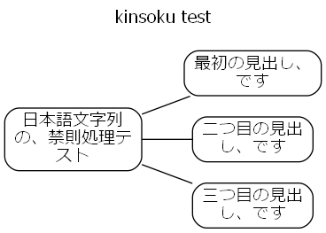

# pwsh-sketches

```markdown
>  ____  __    __  ____  _   _        ____  _  _  ____  _____   ___  _   _  ____  ____ 
> |  _ \\  \/\/  //  __)| |_| | ____ /  __)| |/ )| ___)|_   _| / __)| |_| || ___)/  __)
> |  __/ \      / \__  \|  _  |(____)\__  \|   ( | __)   | |  ( (__ |  _  || __) \__  \
> |_|     \_/\_/  (____/|_| |_|      (____/|_|\_)|____)  |_|   \___)|_| |_||____)(____/
```

A collection of [PowerShell](https://github.com/PowerShell/PowerShell) 7 text-processing functions, designed for pipeline input and output (closer to Bash than typical PowerShell). Inspired by [Parsing Text with PowerShell (3/3), Steve Lee, January 28th, 2019](https://devblogs.microsoft.com/powershell/parsing-text-with-powershell-3-3/).

**Note:** These are experimental scripts for prototyping and exploration. Use with caution; they are not production-ready and may be unstable.

- Interactive text processing via pipelines.
- Designed for Personal work and hobby use.
- Optimized for UTF-8 Japanese on Windows environments.
- Requires `PowerShell 7+` on `Windows`.
    - Some scripts may work with `PowerShell 5`.
    - Some scripts may work with `PowerShell 7+` on `Linux`.
- Caveats:
    - Code is experimental and may be poorly structured.
    - Limited testing and error handling.
    - Performance is **not optimized**.
    - Primarily English documentation, but some code may contain Japanese.

Function list:

```powershell
# one-liner to create function list
# (add internal link to each function's section)
cat README.md `
    | grep '^#### ' `
    | grep -o '\[[^[]+\]' `
    | sed 's;\[([^\]]+)\];[$1][];g' `
    | sort {
        -join ( [int[]] ("$_".ToCharArray()) | ForEach-Object { [System.Convert]::ToString($_, 16)})
    } -Unique `
    | flat -ofs ", " `
    | Set-Clipboard
```

- [Add-Id][], [Add-LineBreakEndOfFile][], [Add-LineBreak][], [Add-Quartile][], [Add-Stats][], [Apply-Function][], [Auto-Clip][], [Calc-CrossTabulation][], [Cast-Date][], [Cast-Decimal][], [Cast-Double][], [Cast-Integer][], [ClipImageFrom-File][], [Compare-Diff2Lcs][], [Compare-Diff2][], [Compare-Diff3][], [Convert-CharCase][], [Convert-DictionaryToPSCustomObject][], [Convert-Image][], [Convert-Pandoc][], [Decode-Uri][], [Decrease-Indent][], [Delete-Field][], [Detect-XrsAnomaly][], [Drop-NA][], [Edit-Function][], [Edit-Property][], [Encode-Uri][], [Execute-Lang][], [Execute-RMarkdown][], [Execute-TinyTeX][], [ForEach-Block][], [ForEach-Label][], [ForEach-Step][], [Format-Path][], [Get-AppShortcut][], [Get-ClipboardAlternative][], [Get-Dataset][], [Get-DateAlternative][], [Get-Histogram][], [Get-OGP][], [Get-Ticket][], [GetValueFrom-Key][], [Grep-Block][], [GroupBy-Object][], [Inkscape-Converter][], [Invoke-GitBash][], [Invoke-Link][], [Join-Until][], [Join-While][], [Join2-Object][], [Map-Object][], [Measure-Quartile][], [Measure-Stats][], [Measure-Summary][], [Override-Yaml][], [Plot-BarChart][], [Process-CsvColumn][], [Process-InQuote][], [PullOut-String][], [Rename-Normalize][], [Replace-ForEach][], [Replace-InQuote][], [Replace-NA][], [Select-Field][], [Set-DotEnv][], [Set-Lang][], [Set-NowTime2Clipboard][], [Shorten-PropertyName][], [Shutdown-ComputerAFM][], [Sleep-ComputerAFM][], [Sort-Block][], [Split-HereString][], [Sponge-Property][], [Sponge-Script][], [Tee-Clip][], [Test-isAsciiLine][], [Transpose-Property][], [Trim-EmptyLine][], [UnMap-Object][], [UnZip-GzFile][], [Unique-Object][], [Unzip-Archive][], [addb][], [addl][], [addr][], [addt][], [cat2][], [catcsv][], [chead][], [clip2file][], [clip2hyperlink][], [clip2img][], [clip2normalize][], [clip2push][], [clip2shortcut][], [combi2][], [combi][], [conv][], [count][], [csv2sqlite][], [csv2txt][], [ctail][], [cycle][], [decil][], [delf][], [dot2gviz][], [dupl][], [filehame][], [fillretu][], [flat][], [flow2pu][], [fval][], [fwatch][], [gantt2pu][], [getfirst][], [getlast][], [grep][], [gyo][], [han][], [head][], [image2md][], [json2txt][], [juni][], [keta][], [kinsoku][], [lastyear][], [lcalc2][], [lcalc][], [linkcheck][], [linkextract][], [list2table][], [logi2dot][], [logi2pu][], [man2][], [map2][], [math2tex][], [mdfocus][], [mdgrep][], [mind2dot][], [mind2pu][], [movw][], [nest][], [nextyear][], [pawk][], [percentile][], [perm2][], [perm][], [pu2java][], [push2loc][], [pwmake][], [pwsync][], [retu][], [rev2][], [rev][], [say][], [sed-i][], [sed][], [self][], [seq2pu][], [sleepy][], [sm2][], [stair][], [subset][], [summary][], [tac][], [tail-f][], [tail][], [tarr][], [tateyoko][], [teatimer][], [tenki][], [tex2pdf][], [thisyear][], [toml2psobject][], [uniq][], [vbStrConv][], [watercss][], [wrap][], [yarr][], [ycalc][], [ysort][], [zen][]

**General:** This repository provides filter commands for pattern matching on unstructured strings. Input and output are `UTF-8`, space-delimited, line-oriented strings (text objects) via the pipeline, similar to Unix/Linux shell tools. Some functions also accept or output PowerShell objects.

**File Structure:** Each function resides in its own `_function.ps1` file, named after the function (excluding the suffix). Most filters are independent and can be used anywhere by dot-sourcing their file. Note that some filters require `PowerShell 7+` on `Windows`.


## Install functions

1. Comment out unnecessary lines (functions) in `operator.ps1`
2. Dot sourcing `operator.ps1` (and optional `operator-extra.ps1`)
    - (However, this only works for the current process. When you close the window (end the process), the dot-sourced functions are forgotten)

```powershell
# install all functions
. path/to/pwsh-sketches/operator.ps1
# optional
. path/to/pwsh-sketches/operator-extra.ps1
```

The functions are designed to be as independent from other functions as possible. You can also load single function using dot-source. In that case, it is recommended to first set the encoding of the current process to `UTF-8` as shown below, because this functions basically assumes `UTF-8` for input and output through the pipeline.


```powershell
# install favorite functions for japanese environment
# set encode
. path/to/pwsh-sketches/operator-minimum.ps1
# sourcing dot files
. path/to/pwsh-sketches/src/hoge_function.ps1
. path/to/pwsh-sketches/src/piyo_function.ps1
```


## Description of each function

The motivation for creating each function and usage.

### Show functions


#### [man2] - Formats filelist as a wide table and gets manual.<a id="man2"></a>

[man2]: src/man2_function.ps1

#### [Edit-Function] (Alias: e) - Edit my function with editor.<a id="Edit-Function"></a>

[Edit-Function]: src/Edit-Function_function.ps1


### Unix-like text filters

#### [Invoke-GitBash] (Alias: gitbash) - Executes Git Bash commands on Windows.<a id="Invoke-GitBash"></a>

[Invoke-GitBash]: src/Invoke-GitBash_function.ps1

#### [Compare-Diff2] (Alias: pwdiff) - GNU diff-like file comparison.<a id="Compare-Diff2"></a>

[Compare-Diff2]: src/Compare-Diff2_function.ps1

#### [Compare-Diff2Lcs] (Alias: pwdiffu) - GNU diff-like file comparison, roughly equivalent to 'diff -u'.<a id="Compare-Diff2Lcs"></a>

[Compare-Diff2Lcs]: src/Compare-Diff2Lcs_function.ps1

#### [Compare-Diff3] (Alias: pwdiff3) - GNU diff3-like file comparison.<a id="Compare-Diff3"></a>

[Compare-Diff3]: src/Compare-Diff3_function.ps1

#### [sed] - Stream EDitor.<a id="sed"></a>

[sed]: src/sed_function.ps1

#### [sed-i] - Edit a file in place.<a id="sed-i"></a>

[sed-i]: src/sed-i_function.ps1

#### [grep] - Single-line oriented searcher for regex patterns.<a id="grep"></a>

[grep]: src/grep_function.ps1

#### [head], [tail] - Output the first/last part of files.<a id="head"></a>.<a id="tail"></a>

[head]: src/head_function.ps1
[tail]: src/tail_function.ps1

#### [tail-f] - Output appended data as the file grows.<a id="tail-f"></a>

[tail-f]: src/tail-f_function.ps1

#### [chead], [ctail] - Cut the first/last part of files.<a id="chead"></a>.<a id="ctail"></a>

[chead]: src/chead_function.ps1
[ctail]: src/ctail_function.ps1

#### [uniq] - Report or omit repeated lines.<a id="uniq"></a>

[uniq]: src/uniq_function.ps1

#### [cat2] - Concatenate files and print on the standard output.<a id="cat2"></a>

[cat2]: src/cat2_function.ps1

#### [tac] - Output strings in reverse.<a id="tac"></a>

[tac]: src/tac_function.ps1

#### [rev] - Reverse strings.<a id="rev"></a>

[rev]: src/rev_function.ps1


#### [rev2] - Reverse columns.<a id="rev2"></a>

[rev2]: src/rev2_function.ps1

### Text filters for space-separated input

#### [tateyoko] - Transpose columns and rows.<a id="tateyoko"></a>

[tateyoko]: src/tateyoko_function.ps1

#### [fillretu] - Align records to the maximum number of columns.<a id="fillretu"></a>

[fillretu]: src/fillretu_function.ps1

#### [juni] - Enumerate the number of rows in each line.<a id="juni"></a>

[juni]: src/juni_function.ps1

#### [self] - Select fields.<a id="self"></a>

[self]: src/self_function.ps1

#### [delf] - Delete fields.<a id="delf"></a>

[delf]: src/delf_function.ps1

#### [sm2] - Sum up.<a id="sm2"></a>

[sm2]: src/sm2_function.ps1

#### [map2] - Cross tabulation of long-type data.<a id="map2"></a>

[map2]: src/map2_function.ps1


#### [lcalc] - Column-to-column calculator.<a id="lcalc"></a>

[lcalc]: src/lcalc_function.ps1

#### [lcalc2] - Column-to-column calculator.<a id="lcalc2"></a>

[lcalc2]: src/lcalc2_function.ps1

#### [pawk] - Pattern-Action processor like GNU AWK.<a id="pawk"></a>

[pawk]: src/pawk_function.ps1

#### [retu] - Output column number.<a id="retu"></a>

[retu]: src/retu_function.ps1

#### [count] - Count up keys.<a id="count"></a>

[count]: src/count_function.ps1

#### [getfirst] - Get the first row of the same key.<a id="getfirst"></a>

[getfirst]: src/getfirst_function.ps1

#### [getlast] - Get the last row of the same key.<a id="getlast"></a>

[getlast]: src/getlast_function.ps1

#### [yarr] - Expand long data to wide.<a id="yarr"></a>

[yarr]: src/yarr_function.ps1

#### [tarr] - Expand wide data to long.<a id="tarr"></a>

[tarr]: src/tarr_function.ps1


#### [Add-LineBreak] , [Add-LineBreakEndOfFile] - Add LineFeed.<a id="Add-LineBreak"></a>.<a id="Add-LineBreakEndOfFile"></a>

[Add-LineBreak]: src/Add-LineBreak_function.ps1
[Add-LineBreakEndOfFile]: src/Add-LineBreakEndOfFile_function.ps1

#### [Trim-EmptyLine] (alias: etrim) - Remove empty lines from the beginning and end of line..<a id="Trim-EmptyLine"></a></a>

[Trim-EmptyLine]: src/Trim-EmptyLine_function.ps1

#### [addb], [addl], [addr], [addt] - Insert text strings at the top, bottom, left, and right of the input.<a id="addb"></a>.<a id="addl"></a>.<a id="addr"></a>.<a id="addt"></a>

[addb]: src/addb_function.ps1
[addl]: src/addl_function.ps1
[addr]: src/addr_function.ps1
[addt]: src/addt_function.ps1

#### [conv] - Convolution operation or find N-gram of text.<a id="conv"></a>

[conv]: src/conv_function.ps1

#### [flat] - Flat columns.<a id="flat"></a>

[flat]: src/flat_function.ps1

#### [wrap] - Wrap each fields in specified format.<a id="wrap"></a>

[wrap]: src/wrap_function.ps1

#### [combi] - Generates combinations.<a od="combi"></a>

[combi]: src/combi_function.ps1

#### [combi2] - Generates combinations.<a od="combi2"></a>

[combi2]: src/combi2_function.ps1

#### [cycle] - Rotates elements in a pattern.<a od="cycle"></a>

[cycle]: src/cycle_function.ps1

#### [dupl] - Duplicates input objects by a specified count.<a od="dupl"></a>

[dupl]: src/dupl_function.ps1

#### [perm] - Permutation of "r" from "n".<a od="perm"></a>

[perm]: src/perm_function.ps1

#### [perm2] - Permutation of 2 from "n".<a od="perm2"></a>

[perm2]: src/perm2_function.ps1

#### [nest] - Nests fields from an input string using a specified pattern.<a od="nest"></a>

[nest]: src/nest_function.ps1

#### [stair] - Stair columns separated by spaces.<a od="stair"></a>

[stair]: src/stair_function.ps1

#### [subset] - Generates all field subsets.<a od="subset"></a>

[subset]: src/subset_function.ps1


#### [keta] - Padding per columns.<a id="keta"></a>

[keta]: src/keta_function.ps1

#### [gyo] - Row counter.<a id="gyo"></a>

[gyo]: src/gyo_function.ps1

#### [han] - Convert full-width kana to half-width kana using Microsoft.VisualBasic.VbStrConv.<a id="han"></a>

[han]: src/han_function.ps1

#### [zen] - Convert half-width kana to full-width kana using Microsoft.VisualBasic.VbStrConv.<a id="zen"></a>

[zen]: src/zen_function.ps1

#### [vbStrConv] - Convert strings using Microsoft.VisualBasic.VbStrConv.<a id="vbStrConv"></a>

[vbStrConv]: src/vbStrConv_function.ps1

#### [Convert-CharCase] (Alias: convChar) - Capitalize the first letter of each word.<a id="Convert-CharCase"></a>

[Convert-CharCase]: src/Convert-CharCase_function.ps1

#### [thisyear], [nextyear], [lastyear], [Get-DateAlternative] - Add this/next/last year to month/day input. To prevent mistyping the number of year..<a id="thisyear"></a>.<a id="nextyear"></a>.<a id="lastyear"></a>.<a id="Get-DateAlternative"></a>

[thisyear]: src/Get-DateAlternative_function.ps1
[lastyear]: src/Get-DateAlternative_function.ps1
[nextyear]: src/Get-DateAlternative_function.ps1
[Get-DateAlternative]: src/Get-DateAlternative_function.ps1

#### [fval] - Format values of specified column.<a id="fval"></a>

[fval]: src/fval_function.ps1

#### [GetValueFrom-Key] (Alias: getvalkey) - Get the value only from the key-value text data.<a id="GetValueFrom-Key"></a>

[GetValueFrom-Key]: src/GetValueFrom-Key_function.ps1

#### [PullOut-String] (Alias: pullstr) - - Pull out strings from a line.<a id="PullOut-String"></a>

[PullOut-String]: src/PullOut-String_function.ps1

#### [Replace-InQuote] (Alias: qsed) - Replace substrings enclosed in double quotes.<a id="Replace-InQuote"></a>

[Replace-InQuote]: src/Replace-InQuote_function.ps1

#### [Process-InQuote] (Alias: qproc) - Runs a custom script only to strings enclosed in quotes.<a id="Process-InQuote"></a>

[Process-InQuote]: src/Process-InQuote_function.ps1

### Statistics

#### [Get-Dataset] (Alias:dataset) - Retrieves the 'iris' dataset from R using Rscript.<a id="Get-Dataset"></a>

[Get-Dataset]: src/Get-Dataset_function.ps1

#### [percentile] - Ranking with percentile and quartile.<a id="percentile"></a>

[percentile]: src/percentile_function.ps1

#### [decil] - Decile analysis (Divide records about 10 equal parts).<a id="decil"></a>

[decil]: src/decil_function.ps1

#### [summary] - Calculate the basic statistics of a specified field.<a id="summary"></a>

[summary]: src/summary_function.ps1

#### [movw] - Moving window approach.<a id="movw"></a>

[movw]: src/movw_function.ps1

#### [ysort] - Sort horizontally ignoring key fields.<a id="ysort"></a>

[ysort]: src/ysort_function.ps1

#### [ycalc] - Calculates the numeric properties horizontally ignoring key fields.<a id="ycalc"></a>

[ycalc]: src/ycalc_function.ps1


### Statistical analysis toolset for categorical time series dataset

This toolset provides categorical analysis and anomaly detection for time series data.

The core concept, performing data analysis directly in the console, was inspired by the following resources:

- thanks to
    - Nicholas Dille, [Data Analysis using #PowerShell](https://dille.name/blog/2017/03/21/data-analysis-using-powershell/), Published on 21 Mar 2017
    - [GitHub - nicholasdille/PowerShell-Statistics: Statistical analysis of data on the command line](https://github.com/nicholasdille/PowerShell-Statistics)
        - License: [Apache License 2.0](http://www.apache.org/licenses/)
        - See CREDIT section

The anomaly detection uses the X-control chart method, which determines process variation from the average of successive observation differences.

- [JISZ9020-2:2016 Control charts - Part 2: Shewhart control charts](https://kikakurui.com/z9/Z9020-2-2016-01.html)

The anomaly detection functions here are equivalent to those of an X-control chart.

Most functions are also compatible with other data exploration types.


> Several precautions are advisable when using X-control charts:
>
> - a) X-control charts are less sensitive to process changes than control charts based on subgroups.
> - b) If the process distribution is not normal, careful interpretation of X-control charts is necessary.
> - c) X-control charts determine process variation from the average of the differences between successive observations. Therefore, the data must be time-sequenced, and there must be no significant changes within the process between the collection of two consecutive individual measurements. For example, it is not advisable to collect data from two discontinuous batches of chemical production activities after stopping the production line midway and calculate the moving range between the final batch of the first activity and the first batch of the next activity.

<cite>The above is my English translation based on [JISZ9020-2:2016 Control charts - Part 2: Shewhart control charts](https://kikakurui.com/z9/Z9020-2-2016-01.html)</cite>

Example script to calculate basic statistics by category:

```powershell
# Code example 1
# Categorical analysis with this section's toolset
Import-Csv -Path iris.csv `
    | Sort-Object -Property "species" -Stable `
    | Apply-Function -Key "species" {
        Measure-Stats -Value "sepal_length" -Key "species" -Sum -Average } `
    | Format-Table
```

```markdown
species    Property        Sum Average
-------    --------        --- -------
setosa     sepal_length 250.30    5.01
versicolor sepal_length 296.80    5.94
virginica  sepal_length 329.40    6.59
```

The anomaly detection procedure implemented in this section is as follows:

```powershell
# Code example 2
# Anomaly detection with this section's toolset
Import-Csv -Path penguins.csv `
    | Drop-NA -Property "bill_length_mm" `
    | Shorten-PropertyName `
    | Sort-Object -Property "species" -Stable `
    | Apply-Function -Key "species" {
        Detect-XrsAnomaly -Value "b_l_m" -Detect } `
    | Plot-BarChart -Value "b_l_m" -Key "count", "species", "xrs", "detect" -Width 20 -Mark "|" `
    | Format-Table `
    | Out-String -Stream `
    | Select-String -Pattern "deviated" -Context 3
```

```markdown
count species xrs detect   b_l_m BarChart
----- ------- --- ------   ----- --------
  183 Gentoo    0           47.3 |||||||||||||||
  184 Gentoo    0           42.8 ||||||||||||||
  185 Gentoo    0           45.1 |||||||||||||||
> 186 Gentoo    3 deviated  59.6 ||||||||||||||||||||
  187 Gentoo    0           49.1 ||||||||||||||||
  188 Gentoo    0           48.4 ||||||||||||||||
  189 Gentoo    0           42.6 ||||||||||||||
```

- Dataset `penguins.csv` from:
    - allisonhorst / palmerpenguins
        - [palmerpenguins R data package](https://allisonhorst.github.io/palmerpenguins/)
        - [GitHub - allisonhorst/palmerpenguins: A great intro dataset for data exploration &amp; visualization (alternative to iris).](https://github.com/allisonhorst/palmerpenguins)
        - License: Creative Commons Zero v1.0 Universal


Statistical analysis procedures using this toolset:

1. **Convert** dataset to PSObject with:
    - `ConvertFrom-Csv` (built-in Cmdlet)
    - `Import-Csv` (built-in Cmdlet)
    - `Import-Excel` (external module)
2. **Shorten** long column names to make data exploration easier (Optional):
    - `Shorten-PropertyName`
3. **Replace** record with (Optional):
    - `Replace-ForEach`
4. **Join** datasets with:
    - `Join-Object` (external module)
    - `Join2-Object`
5. **Select** the required columns with:
    - `Select-Object` (built-in Cmdlet)
    - `Select-Field`
    - `Delete-Field`
6. **Filter** the required records with:
    - `Where-Object` (built-in Cmdlet)
7. **Drop** NA, NaN, Null record from data with:
    - `Drop-NA`
    - `Replace-NA`
8. **Sort** data stably by category with:
    - `Sort-Object <property> -Stable`
9. **Arrange** data
    - `Unique-Object`
    - `Transpose-Property`
10. **GroupBy** category and add to each record with:
    - `Apply-Function`
    - `GroupBy-Object`
11. **Calculate** and add basic statistics and add to each record with:
    - `Measure-Object` (built-in Cmdlet)
    - `Measure-Summary`
    - `Add-Stats`
    - `Add-Quartile`
    - `Measure-Stats`
    - `Measure-Quartile`
12. **Detect** anomaly record (using X-Rs control method) with:
    - `Detect-XrsAnomaly`
13. **Visualize** the results in charts with:
    - `Get-Histogram`
    - `Plot-BarChart`


#### [Shorten-PropertyName] - Shorten long property names.<a id="Shorten-PropertyName"></a>

[Shorten-PropertyName]: src/Shorten-PropertyName_function.ps1

#### [Select-Field], [Delete-Field] - Select/Delete properties by number of columns.<a id="Select-Field"></a>.<a id="Delete-Field"></a>

[Delete-Field]: src/Select-Field_function.ps1
[Select-Field]: src/Delete-Field_function.ps1

#### [Drop-NA], [Replace-NA] - Drop/Replace NA, NaN, Null Value of specified property.<a id="Drop-NA"></a>.<a id="Replace-NA"></a>

[Drop-NA]: src/Drop-NA_function.ps1
[Replace-NA]: src/Replace-NA_function.ps1

#### [Apply-Function] (Alias: apply) - Apply function for each category.<a id="Apply-Function"></a>

[Apply-Function]: src/Apply-Function_function.ps1

#### [GroupBy-Object] (Alias: groupBy) - Apply function to each group.<a id="GroupBy-Object"></a>

[GroupBy-Object]: src/GroupBy-Object_function.ps1

#### [Add-Stats] - Add statistics columns to each record.<a id="Add-Stats"></a>

[Add-Stats]: src/Add-Stats_function.ps1

#### [Measure-Stats] (Alias: mstats) - Apply first record's key to each output.<a id="Measure-Stats"></a>

[Measure-Stats]: src/Measure-Stats_function.ps1

#### [Add-Quartile] (Alias: aquart) - Add quartile columns to each record.<a id="Add-Quartile"></a>

[Add-Quartile]: src/Add-Quartile_function.ps1

#### [Measure-Quartile] (Alias: mquart) - Calc quartile.<a id="Measure-Quartile"></a>

[Measure-Quartile]: src/Measure-Quartile_function.ps1

#### [Measure-Summary] (Alias: msummary) - Generate summary statistics for dataset.<a id="Measure-Summary"></a>

[Measure-Summary]: src/Measure-Summary_function.ps1

#### [Transpose-Property] - Transpose Property name and value.<a id="Transpose-Property"></a>

[Transpose-Property]: src/Transpose-Property_function.ps1

#### [Detect-XrsAnomaly] - Detect anomaly values with X-Rs control.<a id="Detect-XrsAnomaly"></a>

[Detect-XrsAnomaly]: src/Detect-XrsAnomaly_function.ps1

#### [Plot-BarChart] - Plot Barchart on the console.<a id="Plot-BarChart"></a>

[Plot-BarChart]: src/Plot-BarChart_function.ps1

#### [Get-Histogram] - Get histogram data.<a id="Get-Histogram"></a>

[Get-Histogram]: src/Get-Histogram_function.ps1

#### [Unique-Object] - Get unique category.<a id="Unique-Object"></a>

[Unique-Object]: src/Unique-Object_function.ps1

#### [Replace-ForEach] - Replace specified property string.<a id="Replace-ForEach"></a>

[Replace-ForEach]: src/Replace-ForEach_function.ps1

#### [Join2-Object] (Alias: join2o) - INNER/OUTER Join records.<a id="Join2-Object"></a>

[Join2-Object]: src/Join2-Object_function.ps1

#### [Cast-Date] - Cast all castable columns to datetime type.<a id="Cast-Date"></a>

[Cast-Date]: src/Cast-Date_function.ps1

#### [Cast-Decimal] - Cast all castable columns to decimal type.<a id="Cast-Decimal"></a>

[Cast-Decimal]: src/Cast-Decimal_function.ps1

#### [Cast-Double] - Cast all castable columns to double type.<a id="Cast-Double"></a>

[Cast-Double]: src/Cast-Double_function.ps1

#### [Cast-Integer] - Cast all castable columns to integer type.<a id="Cast-Integer"></a>

[Cast-Integer]: src/Cast-Integer_function.ps1


#### [Edit-Property] (Alias: Add-Property) - Edit values in a specific column.<a id="Edit-Property"></a>

[Edit-Property]: src/Edit-Property_function.ps1

#### [Add-Id] - Add unique key property.<a id="Add-Id"></a>

[Add-Id]: src/Add-Id_function.ps1

#### [ForEach-Step] (Alias: fstep) - Apply a function to each line.<a id="ForEach-Step"></a>

[ForEach-Step]: src/ForEach-Step_function.ps1

#### [ForEach-Block] (Alias: fblock) - Apply a function to each line-oriented block.<a id="ForEach-Block"></a>

[ForEach-Block]: src/ForEach-Block_function.ps1

#### [ForEach-Label] (Alias: flabel) - Insert label for each input repeatedly.<a id="ForEach-Label"></a>

[ForEach-Label]: src/ForEach-Label_function.ps1

#### [Calc-CrossTabulation] Cross-tabulate Data.<a id="Calc-CrossTabulation"></a>

[Calc-CrossTabulation]: src/Calc-CrossTabulation_function.ps1

#### [Map-Object] Converts long-format data into wide-format data.<a id="Map-Object"></a>

[Map-Object]: src/Map-Object_function.ps1

#### [UnMap-Object] Converts wide-format data into long-format data.<a id="UnMap-Object"></a>

[UnMap-Object]: src/UnMap-Object_function.ps1

### Plot chart and graph

#### [dot2gviz] - Wrapper for Graphviz:dot command.<a id="dot2gviz"></a>

[dot2gviz]: src/dot2gviz_function.ps1
[Graphviz]: https://graphviz.org/

#### [pu2java] - Wrapper for plantuml.jar command.<a id="pu2java"></a>

[pu2java]: src/pu2java_function.ps1

#### [gantt2pu] - Visualizatoin tool of DANDORI-chart (setup-chart) for PlantUML..<a id="gantt2pu"></a>

[gantt2pu]: src/gantt2pu_function.ps1


#### [mind2dot] - Generate graphviz script to draw a mind map from list data in markdown format.<a id="mind2dot"></a>

[mind2dot]: src/mind2dot_function.ps1





#### [mind2pu] - Generate plantuml script to draw a mind map from list data in markdown format.<a id="mind2pu"></a>

[mind2pu]: src/mind2pu_function.ps1


#### [logi2dot] - Generate data for graphviz with simple format.<a id="logi2dot"></a>

[logi2dot]: src/logi2dot_function.ps1


#### [logi2pu] - Generate data for PlantUML (usecase diagram) with simple format.<a id="logi2pu"></a>

[logi2pu]: src/logi2pu_function.ps1


#### [seq2pu] - Generate sequence-diagram from markdown-like list format.<a id="seq2pu"></a>

[seq2pu]: src/seq2pu_function.ps1


#### [flow2pu] - Generate activity-diagram (flowchart) from markdown-like list format.<a id="flow2pu"></a>

[flow2pu]: src/flow2pu_function.ps1


### Image processing

#### [Convert-Image] (Alias: ConvImage) - Image rotation, flipping, scaling, convert format.<a id="Convert-Image"></a>

[Convert-Image]: src/Convert-Image_function.ps1

### Writing

#### [mdgrep] - Multi-line oriented searcher for markdown-heading style.<a id="mdgrep"></a>

[mdgrep]: src/mdgrep_function.ps1

#### [mdfocus] - Multi-line oriented searcher for markdown-list style.<a id="mdfocus"></a>

[mdfocus]: src/mdfocus_function.ps1


#### [Convert-Pandoc] (Alias: convpandoc) - Converts text from one format to another using Pandoc.<a id="Convert-Pandoc"></a>

[Convert-Pandoc]: src/Convert-Pandoc_function.ps1


#### [Execute-TinyTeX] (Alias: tinytex) - Execute `Rscript -e "tinytex::lualatex('a.tex')"` on cli.<a id="Execute-TinyTeX"></a>

[Execute-TinyTeX]: src/Execute-TinyTeX_function.ps1


#### [Execute-RMarkdown] (Alias: rmarkdown) - Execute `Rscript -e "rmarkdown::render(input='a.Rmd')"` on cli.<a id="Execute-RMarkdown"></a>

[Execute-RMarkdown]: src/Execute-RMarkdown_function.ps1

#### [math2tex] (Alias: chem2tex) - Add LaTeX preables to the mathematical and chemical formula in LaTex format..<a id="math2tex"></a>

[math2tex]: src/math2tex_function.ps1

#### [Inkscape-Converter] (Alias: inkconv) - Convert pdf, svg, png using inkscape..<a id="Inkscape-Converter"></a>

[Inkscape-Converter]: src/Inkscape-Converter_function.ps1

#### [tex2pdf] - Compile tex to pdf.<a id="tex2pdf"></a>

[tex2pdf]: src/tex2pdf_function.ps1

#### [kinsoku] - Japanese text wrapper.<a id="kinsoku"></a>

[kinsoku]: src/kinsoku_function.ps1


#### [filehame] - Insert contents into template.<a id="filehame"></a>

[filehame]: src/filehame_function.ps1

#### [Test-isAsciiLine] (Alias: isAsciiLine) - Test if a line of text contains only ASCII characters.<a id="Test-isAsciiLine"></a>

[Test-isAsciiLine]: src/Test-isAsciiLine_function.ps1
[isAsciiLine]: src/Test-isAsciiLine_function.ps1


#### [Get-OGP] (Alias: ml) - Make Link with markdown format.<a id="Get-OGP"></a>

[Get-OGP]: src/Get-OGP_function.ps1

#### [Decode-Uri] (Alias: decuri) -Decode utf-8 encoded uri.<a id="Decode-Uri"></a>

[Decode-Uri]: src/Decode-Uri_function.ps1

#### [Encode-Uri] (Alias: encuri) - Encode utf-8 decoded uri.<a id="Encode-Uri"></a>

[Encode-Uri]: src/Encode-Uri_function.ps1

#### [Format-Path] (Alias: fpath) - Remove double-quotes and replace backslashes to slashes from windows path.<a id="Format-Path"></a>

[Format-Path]: src/Format-Path_function.ps1

#### [watercss] - Get Water.css rel link.<a id="watercss"></a>

[watercss]: src/watercss_function.ps1

A small tool to always quickly install [Water.css](https://watercss.kognise.dev/),
a simple and beautiful CSS framework.

#### [image2md] - Convert image filename and alt text to markdown format.<a id="image2md"></a>

[image2md]: src/image2md_function.ps1

#### [list2table] - Convert markdown list format to long type data (make it greppable!).<a id="list2table"></a>

[list2table]: src/list2table_function.ps1

#### [linkextract] - Extract links from html.<a id="linkextract"></a>

[linkextract]: src/linkextract_function.ps1

#### [linkcheck] - Broken link checker.<a id="linkcheck"></a>

[linkcheck]: src/linkcheck_function.ps1

#### [Join-While] (Alias:joinw) - Join lines while a specified regex is found.<a id="Join-While"></a>

[Join-While]: src/Join-While_function.ps1

#### [Join-Until] (Alias: joinu) - Join lines until a specified regex is found.<a id="Join-Until"></a>

[Join-Until]: src/Join-Until_function.ps1

#### [Convert-DictionaryToPSCustomObject] (Alias:dict2psobject) - Convert a dictionary into a PSCustomObject.<a id="Convert-DictionaryToPSCustomObject"></a>

[Convert-DictionaryToPSCustomObject]: src/Convert-DictionaryToPSCustomObject_function.ps1

#### [Override-Yaml] - Override external yaml in markdown yaml.<a id="Override-Yaml"></a>

[Override-Yaml]: src/Override-Yaml_function.ps1

### csv / toml / json handling

#### [toml2psobject] - Parser for toml-like configuration files.<a id="toml2psobject"></a>

[toml2psobject]: src/toml2psobject_function.ps1

#### [json2txt] - Transform json into key-value format with one record per line..<a id="json2txt"></a>

[json2txt]: src/json2txt_function.ps1

#### [csv2txt] - Convert CSV to SSV.<a id="csv2txt"></a>

[csv2txt]: src/csv2txt_function.ps1

#### [catcsv] - Concatenate csv files.<a id="catcsv"></a>

[catcsv]: src/catcsv_function.ps1

#### [csv2sqlite] - Apply sqlite-sql to csv files.<a id="csv2sqlite"></a>

[csv2sqlite]: src/csv2sqlite_function.ps1

#### [Process-CsvColumn] (Alias: csv2proc) - Runs a custom script on selected CSV columns.<a id="Process-CsvColumn"></a>

[Process-CsvColumn]: src/Process-CsvColumn_function.ps1

### File and directory manipuration

#### [fwatch] - A filewatcher using LastWriteTime and FileHash.<a id="fwatch"></a>

[fwatch]: src/fwatch_function.ps1

#### [Rename-Normalize] (Alias: ren2norm) - File name normalizer for Japanese on windows.<a id="Rename-Normalize"></a>

[Rename-Normalize]: src/Rename-Normalize_function.ps1

#### [push2loc] - Push-Location and execute commands to clipped files.<a id="push2loc"></a>

[push2loc]: src/push2loc_function.ps1

#### [UnZip-GzFile] (Alias: unzipgz) - Decompress .gz text files to standard output.<a id="UnZip-GzFile"></a>

[UnZip-GzFile]: src/UnZip-GzFile_function.ps1

#### [Unzip-Archive] (Alias: clip2unzip) - Get files copied to the clipboard as an objects.<a id="Unzip-Archive"></a>

[Unzip-Archive]: src/Unzip-Archive_function.ps1
[clip2unzip]: src/Unzip-Archive_function.ps1

### Clipboard operation

#### [clip2file] - Get files copied to the clipboard as an objects.<a id="clip2file"></a>

[clip2file]: src/clip2file_function.ps1

#### [clip2push] - Push-Location and execute commands to clipped files.<a id="clip2push"></a>

[clip2push]: src/clip2push_function.ps1

#### [clip2hyperlink] - Create hyperlink formula for excel from clipped files..<a id="clip2hyperlink"></a>

[clip2hyperlink]: src/clip2hyperlink_function.ps1

#### [clip2img] - Save clip board image as an image file.<a id="clip2img"></a>

[clip2img]: src/clip2img_function.ps1

#### [ClipImageFrom-File] (Alias: clipimage) - Clips an image from the specified image file.<a id="clipimage"></a>

[ClipImageFrom-File]: src/ClipImageFrom-File_function.ps1

#### [clip2normalize] - Text normalizer for japanese on windows.<a id="clip2normalize"></a>

[clip2normalize]: src/clip2normalize_function.ps1

#### [clip2shortcut] - Create relative-path shortcuts from clipped files..<a id="clip2shortcut"></a>

[clip2shortcut]: src/clip2shortcut_function.ps1

#### [Get-ClipboardAlternative] (Alias: gclipa)  - Get file/image/uri objects from clipboard.<a id="Get-ClipboardAlternative"></a>

[Get-ClipboardAlternative]: src/Get-ClipboardAlternative_function.ps1
[gclipa]: src/Get-ClipboardAlternative_function.ps1

#### [Decrease-Indent] (Alias: dind) - Decrease the total indent.<a id="Decrease-Indent"></a>

[Decrease-Indent]: src/Decrease-Indent_function.ps1

#### [Tee-Clip] (Alias: tclip) - Saves command output in a clipboard and also sends it down the pipeline.<a id="Tee-Clip"></a>

[Tee-Clip]: src/Tee-Clip_function.ps1

#### [Auto-Clip] (Alias: aclip) - Get from clipboard and Set to clipboard from pipeline.<a id="Auto-Clip"></a>

[Auto-Clip]: src/Auto-Clip_function.ps1


### Miscellaneous

#### [Set-Lang] - Set the language for the current thread.<a id="Set-Lang"></a>

[Set-Lang]: src/Set-Lang_function.ps1

#### [Execute-Lang] (alias: lang) - Execute a command with a temporary language environment.<a id="Execute-Lang"></a>

[Execute-Lang]: src/Execute-Lang_function.ps1

#### [Sponge-Property] (Alias: sponge/unbox) - Buffer all input before outputting and Expand a Property.<a id="Sponge-Property"></a>

[Sponge-Property]: src/Sponge-Property_function.ps1

#### [Sponge-Script] (Alias: sponges) - .<a id="Sponge-Script"></a>

[Sponge-Script]: src/Sponge-Script_function.ps1

#### [Split-HereString] - Split a herestring into an array for line-by-line processing.<a id="Split-HereString"></a>

[Split-HereString]: src/Split-HereString_function.ps1

#### [Set-DotEnv] (Alias: pwenv) - Set the contents of the .myenv file for the current process.<a id="Set-DotEnv"></a>

[Set-DotEnv]: src/Set-DotEnv_function.ps1

#### [pwmake] - Pwsh implementation of GNU Make command.<a id="pwmake"></a>

[pwmake]: src/pwmake_function.ps1

#### [Invoke-Link] (Alias: i) - Read and execute links written in a text file.<a id="Invoke-Link"></a>

[Invoke-Link]: src/Invoke-Link_function.ps1

#### [Get-Ticket] (Alias: t) - A parser for tickets written in one-liner text.<a id="Get-Ticket"></a>

[Get-Ticket]: src/Get-Ticket_function.ps1

#### [Sort-Block] (Alias: blsort) - Sort based on the title line without destroying the body of the list.<a id="Sort-Block"></a>

[Sort-Block]: src/Sort-Block_function.ps1

#### [Grep-Block] (Alias: blgrep) - Grep the list while preserving parent-child relationship.<a id="Grep-Block"></a>

[Grep-Block]: src/Grep-Block_function.ps1

#### [pwsync] - Invoke `Robocopy.exe`.<a id="pwsync"></a>

[pwsync]: src/pwsync_function.ps1

#### [tenki] - Open tenki.jp or jma.go.jp in browser.<a id="tenki"></a>

[tenki]: src/tenki_function.ps1

#### [say] - Speech Synthesizer.<a id="say"></a>

[say]: src/say_function.ps1

#### [Sleep-ComputerAFM] - Sleep computer After a Few Minutes.<a id="Sleep-ComputerAFM"></a>

[Sleep-ComputerAFM]: src/Sleep-ComputerAFM_function.ps1

#### [Shutdown-ComputerAFM] - Shutdown computer After a Few Minutes.<a id="Shutdown-ComputerAFM"></a>

[Shutdown-ComputerAFM]: src/Shutdown-ComputerAFM_function.ps1

#### [Set-NowTime2Clipboard] (Alias: now) - Set current datetime to the clipboard.<a id="Set-NowTime2Clipboard"></a>

[Set-NowTime2Clipboard]: src/Set-NowTime2Clipboard_function.ps1

#### [sleepy] - A pomodoro timer using progress bar.<a id="sleepy"></a>

[sleepy]: src/sleepy_function.ps1

#### [teatimer] - Time-up notification.<a id="teatimer"></a>

[teatimer]: src/teatimer_function.ps1

#### [Get-AppShortcut] - List up app-shortcuts.<a id="Get-AppShortcut"></a>

[Get-AppShortcut]: src/Get-AppShortcut_function.ps1

## CREDITS

### [Plot-BarChart]

- Original code:
    - GitHub - nicholasdille/PowerShell-Statistics/Add-Bar.ps1
        - <https://github.com/nicholasdille/PowerShell-Statistics>
- License:
    - Apache License 2.0 (c) 2017 Nicholas Dille
        - <http://www.apache.org/licenses/LICENSE-2.0>
        - A copy of the Apache license 2.0 is written in the script file

### [Get-Histogram]

- Original code:
    - GitHub - nicholasdille/PowerShell-Statistics/Get-Histogram.ps1
        - <https://github.com/nicholasdille/PowerShell-Statistics>
- License:
    - Apache License 2.0 (c) 2017 Nicholas Dille
        - <http://www.apache.org/licenses/LICENSE-2.0>
        - A copy of the Apache license 2.0 is written in the script file

### [Measure-Quartile]

- Original code:
    - GitHub - nicholasdille/PowerShell-Statistics/Measure-Object.ps1
        - <https://github.com/nicholasdille/PowerShell-Statistics>
- License:
    - Apache License 2.0 (c) 2017 Nicholas Dille
        - <http://www.apache.org/licenses/LICENSE-2.0>
        - A copy of the Apache license 2.0 is written in the script file

### [Measure-Summary]

- Original code:
    - GitHub - nicholasdille/PowerShell-Statistics/Measure-Object.ps1
        - <https://github.com/nicholasdille/PowerShell-Statistics>
- License:
    - Apache License 2.0 (c) 2017 Nicholas Dille
        - <http://www.apache.org/licenses/LICENSE-2.0>
        - A copy of the Apache license 2.0 is written in the script file

## Inspired by

- Article
    - [Parsing Text with PowerShell (3/3), Steve Lee, January 28th, 2019](https://devblogs.microsoft.com/powershell/parsing-text-with-powershell-3-3/).
- Unix/Linux commands
    - Commands: `grep`, `sed`, `head`, `tail`, `awk`, `make`, `uniq`, and more...
- [Open-usp-Tukubai - GitHub](https://github.com/usp-engineers-community/Open-usp-Tukubai)
    - License: The MIT License (MIT): Copyright (C) 2011-2022 Universal Shell Programming Laboratory
    - Commands: `man2`, `keta`, `tateyoko`, `gyo`, `fillretu`, `yarr`, `count`, `han`, `zen`, `filehame`, `self`, `delf`, `count`, `getfirst`, `getlast`, and more...
- [greymd/egzact: Generate flexible patterns on the shell - GitHub](https://github.com/greymd/egzact)
    - License: The MIT License (MIT): Copyright (c) 2016 Yasuhiro, Yamada
    - Commands: `flat`, `addt`, `addb`, `addr`, `addl`, `mirror`,`wrap`, and more...
- [mattn/sleepy - GitHub](https://github.com/mattn/sleepy)
    - License: The MIT License (MIT): Copyright (c) 2022 Yasuhiro Matsumoto
    - Commands: `sleepy`
- [tomnomnom/gron: Make JSON greppable! - GitHub](https://github.com/tomnomnom/gron)
    - License: The MIT License (MIT): Copyright (c) 2016 Tom Hudson
    - Commands: `gron`
- [禁則処理 - PyJaPDF](http://pyjapdf.linxs.org/home/kinsoku)
    - Commands: `kinsoku.py`
- [miyamiya/mypss: My PowerShell scripts - GitHub](https://github.com/miyamiya/mypss)
    - Commands: `Get-Draw.ps1`
- [ImageMagick](https://imagemagick.org/index.php)
    - Commands: `convert`, `magick convert`(on windows)
- [Water.css](https://watercss.kognise.dev/)
    - GitHub: <https://github.com/kognise/water.css>
    - License: The MIT License (MIT) Copyright © 2019 Kognise
- [nicholasdille/PowerShell-Statistics - GitHub](https://github.com/nicholasdille/PowerShell-Statistics/tree/master)
    - License: [The Apache License 2.0](https://www.apache.org/licenses/LICENSE-2.0.html)
- [todo.txt format](https://github.com/todotxt/todo.txt)
    - License: GNU General Public License v3.0 (GPL-3.0 license)
- Dataset
    - allisonhorst / palmerpenguins
        - [palmerpenguins R data package](https://allisonhorst.github.io/palmerpenguins/)
        - [GitHub - allisonhorst/palmerpenguins: A great intro dataset for data exploration &amp; visualization (alternative to iris).](https://github.com/allisonhorst/palmerpenguins)
        - License: Creative Commons Zero v1.0 Universal

